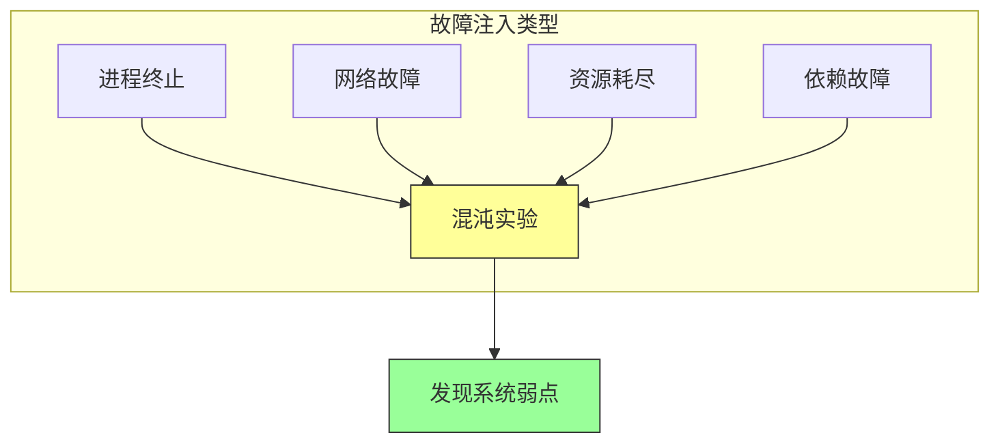

# 第十九章：混沌工程

## 一、混沌工程的定义

### 1.1 什么是混沌工程

混沌工程是一门在分布式系统中进行实验的学科，目的是建立对系统承受混乱能力的信心。混沌工程通过主动引入故障来测试系统的韧性。

混沌工程的核心思想是：**假设故障会发生，主动测试系统的响应**。这与传统的被动等待故障发生形成对比。

### 1.2 混沌工程的原则

混沌工程遵循几个核心原则：

**建立稳态**：定义系统的正常行为。**做出假设**：关于系统在故障下的行为。**设计实验**：引入真实世界的故障。**验证假设**：观察系统是否按预期响应。

### 1.3 混沌工程的价值

混沌工程带来的价值：

**发现弱点**：在故障发生前发现系统的弱点。**建立信心**：对系统的韧性有信心。**改进响应**：改进故障响应能力。**减少平均恢复时间**：更快从故障中恢复。

## 二、混沌工程的实践

### 2.1 实验设计

设计有效的混沌实验：

**选择实验范围**：从低风险实验开始。**定义稳态指标**：定义什么是正常行为。**设计故障注入**：设计要引入的故障。**观察和测量**：记录实验中的系统行为。

### 2.2 故障注入

常见的故障注入类型：

**终止进程**：终止服务进程。**网络故障**：模拟延迟、丢包、DNS 故障。**资源耗尽**：模拟 CPU、内存、磁盘耗尽。**依赖故障**：模拟依赖服务不可用。

**图解说明**：混沌工程通过多种故障注入类型来测试系统韧性。

### 2.3 实验执行

执行混沌实验的最佳实践：

**从生产环境开始**：在接近生产的環境实验。**自动化实验**：使实验可重复和自动化。**小步推进**：每次实验改变一个变量。**快速终止**：发现问题立即停止实验。

## 三、Google 的混沌工程

### 3.1 混沌猴

Google 开发了混沌猴（Chaos Monkey）来随机终止生产环境中的服务实例。这迫使服务能够容忍实例故障。

混沌猴的工作方式：

**随机选择**：随机选择要终止的实例。**提前通知**：提前通知要终止的实例。**自动恢复**：验证服务能够自动恢复。**收集数据**：收集故障响应的数据。

### 3.2 故障测试框架

Google 开发了故障测试框架来支持混沌实验：

**故障注入**：支持多种故障注入类型。**实验编排**：编排复杂的实验场景。**结果收集**：收集和分析实验结果。**集成 CI/CD**：与持续集成流程集成。

### 3.3 实验文化

混沌工程需要特定的文化：

**接受失败**：接受故障会发生。**学习导向**：从实验结果中学习。**全员参与**：不仅是 SRE，也包括开发团队。**持续实验**：持续进行混沌实验。

## 四、混沌工程工具

### 4.1 开源工具

常用的混沌工程开源工具：

**Chaos Monkey**：随机终止实例。**Chaos Mesh**：Kubernetes 环境中的混沌实验。**LitmusChaos**：云原生的混沌工程平台。**Pumba**：Docker 容器的混沌测试。

### 4.2 商业工具

商业混沌工程平台：

**Gremlin**：商业混沌工程平台。**ChaosIQ**：混沌工程分析和优化。**故障测试即服务**：云提供商的故障测试服务。

### 4.3 自研工具

一些组织选择自研混沌工具：

**定制需求**：满足特定的故障场景。**深度集成**：与内部系统深度集成。**安全控制**：满足安全合规要求。

## 五、混沌工程的挑战

### 5.1 平衡风险

混沌工程的挑战在于平衡测试和风险：

**避免破坏**：在实验中避免真正破坏。**范围控制**：控制实验的影响范围。**伦理考虑**：考虑对用户的影响。**法律合规**：满足法规要求。

### 5.2 测量稳态

定义和测量稳态的挑战：

**指标选择**：选择正确的稳态指标。**阈值设定**：设定稳态的边界。**噪声处理**：区分噪声和真正的异常。**长期趋势**：考虑长期的变化。

### 5.3 组织文化

混沌工程需要组织的支持：

**获得支持**：获得管理层和团队的认可。**建立信任**：对故障实验建立信任。**持续投入**：持续投入混沌工程。**成果沟通**：有效沟通实验成果。

## 六、总结与启示

### 6.1 核心要点回顾

混沌工程是一门通过主动实验测试系统韧性的学科。混沌工程遵循建立稳态、做出假设、设计实验、验证假设的原则。混沌工程需要文化支持和谨慎执行。

### 6.2 对个人的建议

了解混沌工程的原则和方法。从小规模的实验开始。从实验结果中学习。

### 6.3 对团队的建议

从低风险的混沌实验开始。逐步增加实验的复杂度和范围。建立支持混沌工程的文化。

---

## 课后思考

1. 你的系统是否进行混沌工程实验？有哪些可以尝试的实验？

2. 如何设计一个混沌实验来测试系统的某个方面？

3. 如何在团队中推广混沌工程文化？

---

*本章精读笔记完成*
