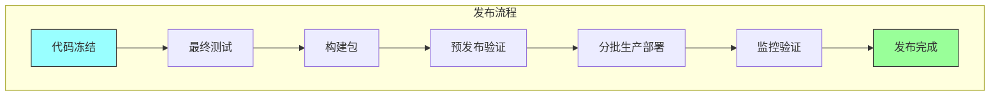

# 第二十章：发布工程

## 一、发布工程的定义

### 1.1 什么是发布工程

发布工程是将软件从开发状态转移到生产状态的实践。它包括构建、打包、部署、配置管理等环节。良好的发布工程确保软件能够可靠、高效地交付给用户。

发布工程的核心目标是：**快速、可靠、可重复地将软件部署到生产环境**。

### 1.2 发布工程的目标

发布工程追求几个关键目标：

**速度**：快速完成发布。**可靠性**：发布成功率高。**可重复**：同样的代码产生同样的结果。**可回滚**：能够快速回滚问题版本。**最小化风险**：降低发布的风险。

### 1.3 发布工程的影响

发布工程的质量直接影响业务：

**交付速度**：影响新功能的上市时间。**用户满意度**：发布问题影响用户体验。**运维成本**：发布问题增加运维负担。**团队士气**：频繁的发布问题影响团队士气。

## 二、发布流程

### 2.1 发布准备

发布前的准备工作：

**代码冻结**：在发布分支冻结新代码。**最终测试**：进行最终的用户验收测试。**发布说明**：编写发布说明。**回滚计划**：准备回滚计划。**通知相关方**：通知运维、支持等相关方。

### 2.2 发布执行

发布的执行步骤：

**构建包**：构建发布包。**部署到预发布**：部署到预发布环境验证。**部署到生产**：分批次部署到生产环境。**监控验证**：监控发布后的系统状态。**完成确认**：确认发布成功。

**图解说明**：发布流程的各个步骤，从代码冻结到发布完成。

### 2.3 发布后工作

发布完成后的工作：

**监控观察**：持续监控系统状态。**问题处理**：处理发布后的问题。**文档更新**：更新相关文档。**复盘总结**：复盘发布过程。

## 三、发布策略

### 3.1 蓝绿部署

蓝绿部署维护两套相同的生产环境：

**蓝环境**：当前运行版本。**绿环境**：新版本准备中。**切换流量**：切换流量从蓝到绿。**快速回滚**：问题时可快速回切。

### 3.2 金丝雀发布

金丝雀发布逐步扩大新版本的覆盖：

**初始发布**：新版本发布 1% 流量。**观察阶段**：观察新版本的指标。**扩大范围**：如果没有问题，扩大到 10%、50%。**全量发布**：最终全量发布。

### 3.3 功能开关

功能开关控制功能的启用和禁用：

**代码部署**：功能代码可以提前部署。**配置控制**：通过配置控制功能开关。**A/B 测试**：支持 A/B 测试。**快速关闭**：问题时可快速关闭功能。

## 四、发布自动化

### 4.1 发布流水线

自动化的发布流水线：

**触发机制**：代码变更自动触发。**自动构建**：自动构建发布包。**自动测试**：自动运行测试。**自动部署**：自动部署到各环境。**自动验证**：自动验证部署结果。

### 4.2 基础设施即代码

使用代码管理发布基础设施：

**环境配置**：环境配置版本控制。**一键部署**：一键部署完整环境。**环境一致**：确保环境一致性。**审计追踪**：配置变更可追踪。

### 4.3 发布工具

常用的发布工具：

**Jenkins**：通用的 CI/CD 工具。**Spinnaker**：Netflix 开发的发布平台。**Argo CD**：GitOps 的 CD 工具。**内部工具**：组织自研的发布工具。

## 五、发布风险

### 5.1 发布风险类型

发布面临的风险：

**技术风险**：代码缺陷、配置错误。**操作风险**：操作失误、流程问题。**环境风险**：环境差异、资源不足。**业务风险**：功能问题、用户体验。

### 5.2 风险缓解

降低发布风险的策略：

**充分测试**：在发布前进行充分测试。**渐进发布**：使用渐进式发布策略。**回滚准备**：准备好回滚方案。**快速响应**：建立快速响应机制。

### 5.3 紧急发布

处理紧急发布的策略：

**简化流程**：简化紧急发布的流程。**快速决策**：快速做出发布决策。**后续复盘**：事后复盘紧急发布。**流程改进**：根据经验改进流程。

## 六、总结与启示

### 6.1 核心要点回顾

发布工程是将软件交付到生产环境的实践。发布流程包括准备、执行、验证。渐进式发布策略降低发布风险。发布自动化是高效发布的基础。

### 6.2 对个人的建议

理解发布流程和最佳实践。掌握发布的工具和操作。培养发布风险意识。

### 6.3 对团队的建议

建立清晰的发布流程和责任。投资发布自动化。持续改进发布实践。

---

## 课后思考

1. 你的团队的发布频率是多少？发布流程是什么？

2. 你的团队使用什么发布策略？如何控制发布风险？

3. 有哪些发布问题可以改进？

---

*本章精读笔记完成*
