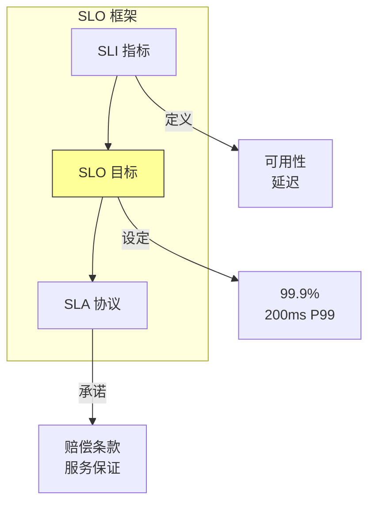

# 第二十一章：站点可靠性工程（SRE）

## 一、SRE 的定义

### 1.1 什么是 SRE

站点可靠性工程（Site Reliability Engineering，SRE）是将软件工程原则应用于运维的实践。SRE 的目标是构建和运行大规模、可靠的分布式系统。

SRE 的核心职责包括：**可用性改进**、**延迟优化**、**性能调优**、**变更管理**、**应急响应**、**容量规划**。

### 1.2 SRE 与传统运维的区别

SRE 与传统运维有几个关键区别：

| 方面 | 传统运维 | SRE |
|-----|---------|-----|
| 角色定义 | 操作员 | 软件工程师 |
| 问题解决 | 手工操作 | 自动化解决 |
| 工作方式 | 被动响应 | 主动预防 |
| 技能要求 | 系统管理 | 软件开发 |
| 目标 | 稳定运行 | 效率与可靠 |

### 1.3 SRE 的目标

SRE 追求的目标：

**可用性**：达到服务级别目标（SLO）。**延迟**：保持低延迟。**吞吐量**：处理足够的负载。**变更管理**：安全地进行变更。**资源效率**：高效使用资源。

## 二、SRE 的核心实践

### 2.1 服务级别目标

服务级别目标（SLO）定义服务的可靠性目标：

**SLI**：服务级别指标，如可用性、延迟。**SLO**：服务级别目标，如 99.9% 可用。**SLA**：服务级别协议，与用户的承诺。

**图解说明**：SLO 框架从 SLI 指标到 SLO 目标再到 SLA 协议的层层递进。

### 2.2 错误预算

错误预算是 SRE 的核心概念：

**定义**：允许的故障量。**来源**：SLO 允许的不可用时间。**使用**：推动快速迭代。**再填充**：定期重新填充。

错误预算的作用是平衡新功能开发和可靠性。服务越可靠，错误预算越少，创新速度可能受限。

### 2.3 事后复盘

事后复盘（Postmortem）是学习故障经验的重要实践：

**无责文化**：关注系统而非个人。**根因分析**：找出根本原因。**改进措施**：制定改进措施。**跟踪落实**：跟踪改进的执行。

## 三、SRE 的日常工作

### 3.1 监控与告警

监控是 SRE 的基础工作：

**指标收集**：收集系统和服务指标。**告警设置**：设置合理的告警。**趋势分析**：分析指标的长期趋势。**异常检测**：检测异常情况。

### 3.2 事件响应

当事件发生时，SRE 需要响应：

**快速检测**：尽快发现事件。**快速响应**：快速启动响应。**协调处理**：协调各方处理事件。**恢复服务**：尽快恢复服务。

### 3.3 变更管理

变更管理是减少故障的关键：

**变更审批**：审批重要变更。**变更窗口**：控制变更的时间窗口。**回滚准备**：准备好回滚方案。**变更验证**：验证变更的效果。

## 四、SRE 与开发团队

### 4.1 合作模式

SRE 与开发团队紧密合作：

**共享责任**：可靠性是共同的责任。**知识传递**：SRE 向开发传递可靠性知识。**评审参与**：参与设计和代码评审。**工具共建**：共建可靠性工具。

### 4.2 SLO 与开发

SLO 影响开发决策：

**功能权衡**：可靠性与功能的速度权衡。**技术选择**：选择支持可靠性的技术。**测试重点**：测试覆盖 SLO 相关的方面。**发布策略**：根据 SLO 制定发布策略。

### 4.3 可靠性是可运维的特性

可靠性应该作为系统设计的目标：

**可观测性**：系统行为应该可观测。**可恢复性**：系统应该易于恢复。**可测试性**：可靠性应该可测试。**可配置性**：可靠性参数应该可配置。

## 五、SRE 成熟度

### 5.1 成熟度模型

SRE 实践的成熟度可以分为多个级别：

**初始级**：被动响应，缺乏监控。**基本级**：有监控和告警。**定义级**：有 SLO 和错误预算。**管理级**：主动改进，可预测。**优化级**：持续优化，业界领先。

### 5.2 提升路径

提升 SRE 成熟度的路径：

**建立基础**：建立监控和告警。**定义 SLO**：定义服务的 SLO。**实施实践**：实施 SRE 的核心实践。**持续改进**：持续评估和改进。

### 5.3 评估指标

评估 SRE 成熟度的指标：

**可用性**：服务的可用性水平。**延迟**：服务的延迟水平。**故障响应**：故障的平均恢复时间。**变更成功率**：变更的成功率。

## 六、总结与启示

### 6.1 核心要点回顾

SRE 是将软件工程应用于运维的实践。SLO 和错误预算是 SRE 的核心概念。SRE 与开发团队共享可靠性责任。事后复盘是学习故障经验的重要实践。

### 6.2 对个人的建议

了解 SRE 的原则和实践。培养软件工程和运维的双重技能。参与 SRE 相关的工作。

### 6.3 对团队的建议

为服务定义 SLO。建立监控和告警体系。实施事后复盘文化。与 SRE 紧密合作。

---

## 课后思考

1. 你的服务是否有定义的 SLO？如何衡量可靠性？

2. 你的团队是否有 SRE 实践？有哪些可以改进？

3. 如何在团队中推广 SRE 理念？

---

*本章精读笔记完成*
