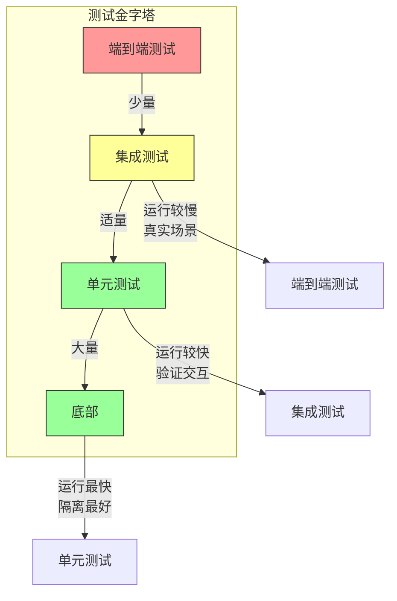

# 第二十二章：测试策略与实践

## 一、测试策略的重要性

### 1.1 为什么需要测试策略

测试策略定义了如何系统性地验证软件的质量。没有策略的测试是零散的、低效的。好的测试策略确保测试覆盖关键方面，以合理的成本提供足够的信心。

测试策略需要回答：

**测试什么**：哪些需要测试。**如何测试**：使用什么测试方法。**何时测试**：在什么阶段测试。**谁负责**：谁编写和执行测试。

### 1.2 测试策略的层次

测试策略可以分为多个层次：

**组织层**：组织的测试政策和标准。**产品层**：产品的整体测试策略。**项目层**：项目的具体测试计划。**迭代层**：每个迭代的测试任务。

### 1.3 测试策略的组成

完整的测试策略包括：

**测试目标**：要达成的测试目标。**测试范围**：测试覆盖和不覆盖的方面。**测试类型**：使用的测试类型。**测试环境**：测试使用的环境。**测试数据**：测试使用的数据。**通过标准**：测试通过的标准。

## 二、测试类型

### 2.1 单元测试

单元测试验证最小的可测试单元：

**范围**：函数、类或方法。**特点**：快速、独立、可重复。**数量**：数量最多，覆盖大部分代码。**执行者**：通常由开发者编写和执行。

### 2.2 集成测试

集成测试验证组件间的交互：

**范围**：多个组件或服务。**特点**：验证接口和交互。**数量**：适量，覆盖关键路径。**执行者**：开发者和测试工程师。

### 2.3 端到端测试

端到端测试验证完整的用户流程：

**范围**：完整的系统功能。**特点**：接近真实使用场景。**数量**：少量，覆盖关键流程。**执行者**：测试工程师或自动化。

**图解说明**：测试金字塔展示不同类型测试的数量和特性。

## 三、测试设计

### 3.1 测试用例设计

好的测试用例应该：

**有目的**：每个测试有明确的目的。**可读性好**：测试意图清晰。**独立**：测试之间不依赖。**可维护**：测试容易理解和修改。

### 3.2 测试覆盖

测试覆盖的不同维度：

**代码覆盖**：代码执行的路径覆盖。**功能覆盖**：功能点的覆盖。**需求覆盖**：需求的覆盖。**风险覆盖**：高风险区域的覆盖。

### 3.3 测试数据

测试数据的策略：

**真实数据**：使用脱敏的真实数据。**合成数据**：生成合成的测试数据。**边界数据**：测试边界条件。**异常数据**：测试异常和错误情况。

## 四、测试自动化

### 4.1 自动化的价值

测试自动化的价值：

**速度**：快速执行大量测试。**一致性**：每次执行结果一致。**可重复**：可以重复执行。**效率**：释放人力资源。

### 4.2 自动化的选择

什么应该自动化：

**频繁执行的测试**：每次提交都执行。**回归测试**：防止回归的测试。**复杂计算**：需要精确验证的计算。**数据驱动**：需要大量数据组合的测试。

什么不应该自动化：

**一次性测试**：只执行一次的测试。**探索性测试**：需要人工探索的测试。**易变的测试**：频繁变化的测试。

### 4.3 自动化框架

常用的测试自动化框架：

**单元测试**：JUnit、pytest、Go testing。**集成测试**：TestNG、pytest。**端到端测试**：Selenium、Cypress、Playwright。**API 测试**：Postman、RestAssured。

## 五、测试环境

### 5.1 环境类型

不同类型的测试环境：

**开发环境**：开发者使用的本地环境。**测试环境**：测试人员使用的环境。**预发布环境**：接近生产的环境。**生产环境**：真实用户使用的环境。

### 5.2 环境管理

环境管理的最佳实践：

**环境一致性**：各环境保持一致。**环境配置**：配置代码管理。**数据管理**：测试数据的准备和清理。**环境隔离**：环境之间相互隔离。

### 5.3 容器化测试

使用容器技术进行测试：

**隔离性**：测试之间相互隔离。**一致性**：本地和 CI 环境一致。**快速启动**：容器快速启动。**资源管理**：有效地管理资源。

## 六、总结与启示

### 6.1 核心要点回顾

测试策略定义如何系统性地验证质量。测试金字塔指导不同类型测试的投入。测试自动化提高测试效率。测试环境的管理是测试成功的基础。

### 6.2 对个人的建议

学习测试设计的方法和技巧。掌握测试自动化的工具。理解不同测试类型的特点和适用场景。

### 6.3 对团队的建议

建立测试策略和标准。投资测试自动化。持续改进测试实践。

---

## 课后思考

1. 你的团队是否有清晰的测试策略？

2. 你的测试金字塔是否平衡？是否存在测试层次失调？

3. 什么测试应该自动化？什么不应该自动化？

---

*本章精读笔记完成*
