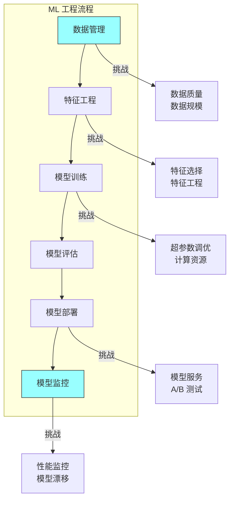

# 第二十三章：机器学习与软件工程

## 一、机器学习工程

### 1.1 机器学习的特殊性

机器学习（ML）与传统软件开发有显著不同：

**不确定性**：ML 模型的输出有不确定性。**数据驱动**：模型由数据训练，而非显式编程。**持续学习**：模型可能需要持续更新。**评估困难**：模型质量难以精确评估。**实验密集**：需要大量实验来优化模型。

### 1.2 ML 工程的挑战

ML 工程面临的独特挑战：

**数据管理**：收集、清洗、标注大量数据。**特征工程**：设计和实现特征。**模型训练**：训练和调优模型。**模型部署**：将模型部署到生产环境。**模型监控**：监控模型的性能和效果。

**图解说明**：ML 工程流程的各个阶段及其对应的挑战。

### 1.3 软件工程实践在 ML 中的应用

传统软件工程实践可以应用于 ML：

**版本控制**：对数据和模型进行版本控制。**测试**：测试数据管道和模型行为。**持续集成**：自动化 ML 工作流。**代码审查**：审查 ML 代码和笔记本。**文档**：记录数据、特征和模型。

## 二、ML 系统的可靠性

### 2.1 ML 系统的故障模式

ML 系统有独特的故障模式：

**数据漂移**：输入数据分布变化。**模型退化**：模型性能随时间下降。**对抗攻击**：恶意输入欺骗模型。**偏差放大**：模型放大数据中的偏差。**黑盒问题**：难以解释模型决策。

### 2.2 可靠性实践

提高 ML 系统可靠性的实践：

**数据验证**：验证输入数据的质量。**模型验证**：在部署前验证模型。**性能监控**：监控模型的预测性能。**回滚机制**：支持回滚到旧模型。**A/B 测试**：新模型与旧模型对比测试。

### 2.3 测试 ML 模型

测试 ML 模型的特殊性：

**功能测试**：测试模型的基本功能。**性能测试**：测试模型的准确性和延迟。**公平性测试**：测试模型的公平性。**鲁棒性测试**：测试模型对扰动的鲁棒性。**回归测试**：确保模型更新不降低性能。

## 三、ML 系统的持续集成

### 3.1 ML CI/CD

ML 的 CI/CD 有特殊考虑：

**数据 CI/CD**：对数据集进行版本控制和测试。**特征 CI/CD**：对特征管道进行测试。**模型 CI/CD**：自动化模型训练和评估。**实验跟踪**：跟踪实验的配置和结果。

### 3.2 实验管理

管理 ML 实验的实践：

**实验跟踪**：记录每次实验的配置和结果。**参数管理**：管理模型的超参数。**指标追踪**：追踪训练和验证指标。**结果比较**：方便地比较实验结果。

### 3.3 流水线自动化

自动化的 ML 流水线：

**数据管道**：自动化的数据处理。**训练流水线**：自动化的模型训练。**评估流水线**：自动化的模型评估。**部署流水线**：自动化的模型部署。

## 四、ML 的最佳实践

### 4.1 数据管理最佳实践

数据管理的最佳实践：

**数据版本**：对数据集进行版本控制。**数据验证**：验证数据的质量和格式。**数据血缘**：追踪数据的来源和转换。**数据共享**：安全地共享数据。

### 4.2 模型开发最佳实践

模型开发的最佳实践：

**可复现性**：确保实验可复现。**模块化设计**：模块化的模型架构。**实验跟踪**：记录实验的细节。**代码审查**：审查模型代码。

### 4.3 部署最佳实践

模型部署的最佳实践：

**影子模式**：新模型在影子模式下运行。**金丝雀发布**：逐步扩大新模型的流量。**回滚机制**：支持快速回滚。**监控告警**：监控模型的性能和行为。

## 五、总结与启示

### 5.1 核心要点回顾

ML 工程与传统软件工程有显著不同。ML 系统有独特的故障模式。软件工程实践可以应用于 ML，但需要适应 ML 的特殊性。

### 5.2 对个人的建议

了解 ML 工程与传统软件工程的区别。学习 ML 系统的可靠性和测试方法。掌握 ML 实验管理和流水线。

### 5.3 对团队的建议

建立 ML 工程的规范和流程。投资 ML 工具和基础设施。培养 ML 工程的最佳实践。

---

## 课后思考

1. 你的 ML 系统面临哪些工程挑战？

2. 如何测试和监控 ML 模型的性能？

3. 如何建立 ML 实验的管理流程？

---

*本章精读笔记完成*
