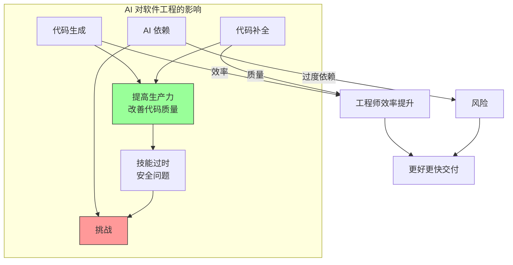

# 第二十四章：人工智能时代的软件工程

## 一、AI 对软件工程的影响

### 1.1 AI 辅助编程

AI 正在改变编程的方式：

**代码生成**：AI 根据描述生成代码。**代码补全**：AI 提供智能代码补全。**代码解释**：AI 解释代码的功能。**Bug 修复**：AI 帮助定位和修复 Bug。**代码审查**：AI 辅助代码审查。

### 1.2 AI 对工程师角色的影响

AI 改变工程师的工作：

**从编码到设计**：更多关注系统设计。**从实现到验证**：更多关注测试和验证。**人机协作**：与 AI 工具协作工作。**技能转变**：需要学习新技能。

### 1.3 机遇与挑战

AI 带来的机遇和挑战：

**机遇**：提高生产力、改善代码质量、加速开发。**挑战**：依赖风险、技能过时、安全问题。

**图解说明**：AI 对软件工程带来机遇和挑战，需要平衡利用。

## 二、AI 辅助软件工程工具

### 2.1 代码生成工具

代码生成工具的演进：

**模板生成**：基于模板生成代码。**智能补全**：基于上下文补全代码。**自然语言生成**：根据自然语言描述生成代码。**跨语言翻译**：将代码翻译成其他语言。

### 2.2 测试工具

AI 增强的测试工具：

**测试生成**：自动生成测试用例。**测试维护**：自动更新测试。**缺陷检测**：检测代码中的缺陷。**测试优化**：优化测试用例的选择。

### 2.3 文档工具

AI 辅助的文档工具：

**代码注释**：自动生成代码注释。**文档生成**：从代码生成文档。**文档更新**：自动更新相关文档。**问答系统**：基于文档的问答。

## 三、使用 AI 工具的最佳实践

### 3.1 审核 AI 生成的代码

AI 生成的代码需要审核：

**正确性验证**：验证代码是否正确。**安全检查**：检查安全漏洞。**性能评估**：评估代码性能。**可读性确认**：确认代码可读。

### 3.2 保持批判性思维

使用 AI 工具需要批判性思维：

**不要盲目信任**：AI 也会犯错。**理解代码**：理解 AI 生成的代码。**评估适用性**：评估代码是否适合场景。**持续学习**：学习新的最佳实践。

### 3.3 有效利用 AI

有效利用 AI 工具的策略：

**明确需求**：清楚地表达需求。**分步进行**：从小任务开始。**迭代改进**：根据反馈改进。**人机协作**：结合人类智慧和 AI 能力。

## 四、AI 时代的新技能

### 4.1 提示工程

提示工程是与 AI 交互的技能：

**清晰表达**：如何清晰地表达需求。**上下文提供**：如何提供足够的上下文。**迭代优化**：如何根据输出优化提示。**约束设定**：如何设定约束和限制。

### 4.2 AI 素养

理解 AI 的能力和局限：

**能力边界**：了解 AI 能做什么。**局限性**：了解 AI 的局限性。**适用场景**：了解 AI 适用的场景。**风险识别**：识别 AI 带来的风险。

### 4.3 持续学习

在 AI 时代需要持续学习：

**跟进发展**：跟上 AI 技术的进步。**学习新工具**：学习新的 AI 工具。**适应变化**：适应工作方式的变化。**批判性思考**：保持批判性思考能力。

## 五、未来展望

### 5.1 软件工程的演变

软件工程将继续演变：

**更高层次抽象**：在更高层次设计系统。**更多自动化**：更多工作由 AI 完成。**新角色出现**：出现新的工程角色。**技能重塑**：核心技能发生变化。

### 5.2 人类与 AI 协作

未来是人与 AI 协作的模式：

**AI 增强人类**：AI 增强人类的能力。**人类监督 AI**：人类监督 AI 的工作。**共同创造**：人与 AI 共同创造价值。**持续适应**：持续适应新的协作模式。

### 5.3 保持核心竞争力

在 AI 时代保持竞争力：

**深度理解**：对系统有深度理解。**批判性思维**：保持批判性思维。**创造性思维**：发展创造性思维。**人际技能**：强化人际协作技能。

## 六、总结与启示

### 6.1 核心要点回顾

AI 正在改变软件工程的方式。AI 工具可以提高效率和代码质量。AI 生成的内容需要审核和验证。新技能如提示工程变得更加重要。

### 6.2 对个人的建议

学习使用 AI 工具。保持批判性思维。持续发展新技能。

### 6.3 对团队的建议

探索 AI 工具的应用。建立使用 AI 工具的规范。培养团队使用 AI 工具的能力。

---

## 课后思考

1. 你使用过哪些 AI 辅助编程工具？效果如何？

2. 如何在团队中推广 AI 工具的使用？

3. 在 AI 时代，哪些技能变得更加重要？

---

*本章精读笔记完成*
