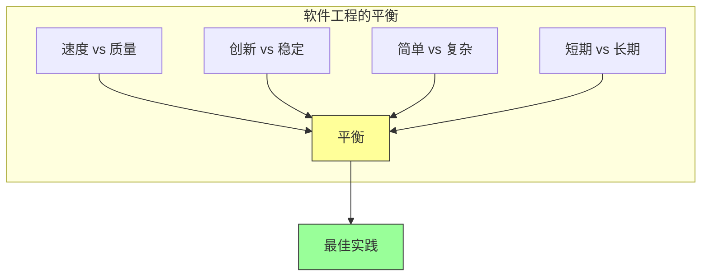

# 第二十五章：总结与未来

## 一、软件工程的核心原则回顾

### 1.1 持续演进的实践

软件工程实践是持续演进的：

**技术进步**：新技术带来新的实践。**规模增长**：规模变化需要新的方法。**工具改进**：工具改进支持更好的实践。**经验积累**：经验积累指导实践改进。

### 1.2 不变的原则

尽管实践在变，一些原则是稳定的：

**质量优先**：软件质量始终是核心。**用户为中心**：用户需求是出发点。**持续改进**：持续改进是永恒的主题。**团队协作**：团队协作是成功的基础。

### 1.3 平衡的艺术

软件工程是平衡的艺术：

**速度与质量**：在速度和和质量之间平衡。**创新与稳定**：在创新和稳定之间平衡。**简单与复杂**：在简单和复杂之间平衡。**短期与长期**：在短期和长期之间平衡。

**图解说明**：软件工程需要在多个维度之间找到平衡。

## 二、Google 软件工程的关键要素

### 2.1 文化

Google 软件工程的文化：

**开放沟通**：鼓励开放和透明的沟通。**持续学习**：鼓励持续学习和成长。**所有权**：每个工程师对代码负责。**追求卓越**：追求技术卓越。

### 2.2 流程

Google 软件工程的流程：

**代码审查**：每次变更经过审查。**测试文化**：测试是开发的一部分。**持续集成**：频繁集成，持续验证。**文档文化**：重视文档编写。

### 2.3 工具

Google 软件工程的工具：

**版本控制**：强大的版本控制系统。**构建系统**：高效的构建系统。**测试框架**：完善的测试框架。**监控系统**：全面的监控系统。

## 三、软件工程的未来趋势

### 3.1 AI 驱动的开发

AI 将在软件工程中发挥更大作用：

**代码生成**：AI 生成更多代码。**智能测试**：AI 帮助测试。**自动化运维**：AI 帮助运维。**个性化开发**：开发体验更加个性化。

### 3.2 平台化

软件工程平台化趋势：

**开发平台**：统一的开发平台。**部署平台**：一键部署到云。**观测平台**：统一的观测平台。**协作平台**：团队协作平台。

### 3.3 专业化

软件工程越来越专业化：

**领域专业化**：特定领域的专业知识。**角色专业化**：专业化的工程角色。**工具专业化**：专业化的工具链。**流程专业化**：专业化的流程。

## 四、对软件工程师的建议

### 4.1 技术技能

持续提升技术技能：

**基础扎实**：打好计算机科学基础。**持续学习**：学习新技术和工具。**实践应用**：将知识应用于实践。**深入专精**：在某个领域深入。

### 4.2 软技能

培养重要的软技能：

**沟通能力**：有效的沟通能力。**协作能力**：团队协作能力。**问题解决**：解决问题的能力。**批判思维**：批判性思维能力。

### 4.3 职业发展

规划职业发展：

**设定目标**：设定清晰的职业目标。**持续成长**：持续学习和成长。**拓展视野**：拓展技术和业务视野。**贡献社区**：为技术社区做贡献。

## 五、对团队和组织的建议

### 5.1 建立好文化

建立支持好软件工程的文化：

**鼓励创新**：鼓励尝试新方法。**接受失败**：从失败中学习。**知识分享**：鼓励知识分享。**认可贡献**：认可好的贡献。

### 5.2 投资基础设施

投资软件工程基础设施：

**工具投资**：投资好的开发工具。**自动化投资**：投资自动化。**培训投资**：投资团队培训。**流程改进**：持续改进流程。

### 5.3 度量与改进

建立度量和改进的机制：

**度量指标**：定义关键的度量指标。**定期回顾**：定期回顾和改进。**经验总结**：总结和分享经验。**持续优化**：持续优化实践。

## 六、总结

### 6.1 核心要点

软件工程是在长期时间尺度上管理代码的实践。它涉及人、流程、工具多个维度。好的软件工程实践带来高质量、高效率、可持续的成果。

### 6.2 持续学习

软件工程是一个持续学习的领域：

**保持好奇**：对新技术保持好奇。**持续学习**：不断学习新知识。**实践应用**：将学习应用于实践。**分享交流**：与他人分享交流。

### 6.3 追求卓越

追求软件工程的卓越：

**质量为本**：以质量为根本。**用户为中心**：以用户为中心。**持续改进**：持续改进实践。**团队成功**：追求团队的成功。

---

## 全书总结

本书「Software Engineering at Google」分享了 Google 在软件工程领域的最佳实践。从代码质量、测试、文档到发布、可靠性、安全，涵盖软件工程的各个方面。

这些实践不是一成不变的，而是在持续演进。最重要的是理解实践背后的原则，根据自己的情况进行适应和应用。

软件工程是团队的努力，需要每个人的参与。好的文化、流程、工具支持团队的成功。最终目标是交付高质量的软件，服务用户，创造价值。

---

## 思考与行动

1. **反思**：回顾你的团队实践，哪些符合书中的建议？哪些需要改进？

2. **选择**：选择一到两个实践，尝试在团队中推广。

3. **分享**：与团队分享这本书的关键收获。

4. **行动**：制定行动计划，改进团队的软件工程实践。

---

*全书精读笔记完成*

---

## 附录：全书章节索引

| 章节 | 标题 |
|-----|------|
| 第一章 | 什么是软件工程 |
| 第二章 | 如何在团队中出色工作 |
| 第三章 | 版本控制与分支管理 |
| 第四章 | 测试工程 |
| 第五章 | 代码审查 |
| 第六章 | 构建系统与构建哲学 |
| 第七章 | 文档工程 |
| 第八章 | 持续集成与持续交付 |
| 第九章 | 代码搜索与导航 |
| 第十章 | 编程语言与生产力 |
| 第十一章 | 代码质量与健康度 |
| 第十二章 | 代码评审深入实践 |
| 第十三章 | 规模化的挑战与应对 |
| 第十四章 | 性能工程 |
| 第十五章 | 安全工程 |
| 第十六章 | 可靠性工程 |
| 第十七章 | 国际化与本地化 |
| 第十八章 | 隐私工程 |
| 第十九章 | 混沌工程 |
| 第二十章 | 发布工程 |
| 第二十一章 | 站点可靠性工程（SRE） |
| 第二十二章 | 测试策略与实践 |
| 第二十三章 | 机器学习与软件工程 |
| 第二十四章 | 人工智能时代的软件工程 |
| 第二十五章 | 总结与未来 |
