# 《The Staff Engineer's Path》- 第1章：成为Staff Engineer（深度版）

## 一、本章概述

本章是全书的开篇，深入探讨了**Staff Engineer**这一角色的定义、职责以及从高级工程师晋升到Staff Engineer的转变过程。本章旨在帮助读者理解Staff Engineer角色的本质，并为自己的职业发展做好规划。

> **本章核心问题**：Staff Engineer与高级工程师有何不同？如何判断自己是否准备好迈向Staff Engineer的角色？成为Staff Engineer需要什么样的思维转变？

### 1.1 核心主题
- Staff Engineer角色的定义与职责范围
- 从高级工程师到Staff Engineer的转变
- Staff Engineer的四种典型类型
- 评估你是否准备好成为Staff Engineer
- 职业发展路径与里程碑

### 1.2 重要程度
⭐⭐⭐⭐⭐（极高）

### 1.3 预计学习时间
60-80分钟

### 1.4 本章与其他章节的关联

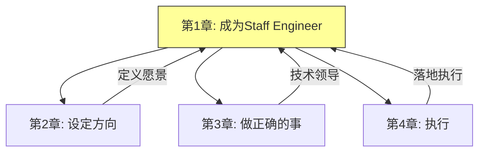
```mermaid
%%{init: {"graph": {"defaultLayout": "td", "rankdir": "TB"}, "subGraph": {"ranksep": 80}}}%%
graph TD
    A[第1章: 成为Staff Engineer] --> B[第2章: 设定方向]
    A --> C[第3章: 做正确的事]
    A --> D[第4章: 执行]

    B -->|"定义愿景"| A
    C -->|"技术领导"| A
    D -->|"落地执行"| A

    style A fill:#ff9,stroke:#333
```

---

## 二、Staff Engineer角色定义

### 2.1 Staff Engineer的定位

**Staff Engineer**是技术职业发展中的一个重要里程碑，代表着从"个人贡献者"向"技术领导者"的转变。


```mermaid
%%{init: {"graph": {"defaultLayout": "td", "rankdir": "TB"}, "subGraph": {"ranksep": 80}}}%%
graph TD
    subgraph 技术职业发展["技术职业发展路径"]
        IC1[工程师 Engineer]
        IC2[高级工程师 Senior Engineer]
        IC3[Staff Engineer]
        IC4[Principal Engineer]
        IC5[Distinguished Engineer]

        IC1 --> IC2 --> IC3 --> IC4 --> IC5
    end

    subgraph 角色转变["角色定位的变化"]
        P1["个人贡献：完成分配的任务"]
        P2["团队影响：指导他人"]
        P3["组织影响：设定方向"]
        P4["更大范围影响：跨团队协作"]

        P1 --> P2
        P2 --> P3
        P3 --> P4
    end
```

### 2.2 Staff Engineer的核心职责

| 职责领域 | 具体内容 | 影响范围 |
|---------|---------|---------|
| **技术领导** | 制定技术方向、做出关键架构决策 | 单个团队到多个团队 |
| **技术深度** | 解决复杂技术问题、提供技术指导 | 整个工程组织 |
| **组织影响** | 建立工程文化、推动最佳实践 | 全公司范围 |
| **人才培养** | 指导高级以下工程师成长 | 团队和组织 |

### 2.3 Staff Engineer vs 高级工程师

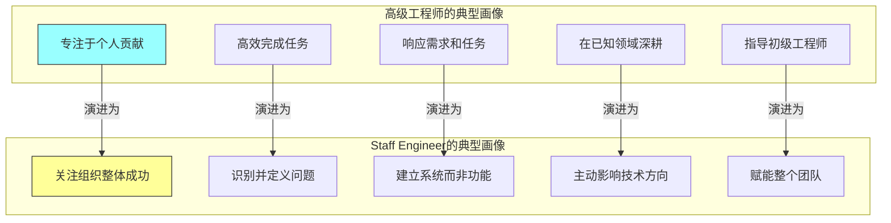
```mermaid
%%{init: {"graph": {"defaultLayout": "td", "rankdir": "TB"}, "subGraph": {"ranksep": 80}}}%%
graph TD
    subgraph 高级工程师["高级工程师的典型画像"]
        S1["专注于个人贡献"]
        S2["高效完成任务"]
        S3["指导初级工程师"]
        S4["在已知领域深耕"]
        S5["响应需求和任务"]
    end

    subgraph StaffEngineer["Staff Engineer的典型画像"]
        T1["关注组织整体成功"]
        T2["识别并定义问题"]
        T3["建立系统而非功能"]
        T4["主动影响技术方向"]
        T5["赋能整个团队"]
    end

    S1 -->|"演进为"| T1
    S2 -->|"演进为"| T2
    S3 -->|"演进为"| T5
    S4 -->|"演进为"| T4
    S5 -->|"演进为"| T3

    style S1 fill:#9ff,stroke:#333
    style T1 fill:#ff9,stroke:#333
```

**关键差异对比：**

| 维度 | 高级工程师 | Staff Engineer |
|-----|-----------|---------------|
| **关注范围** | 单个功能/模块 | 系统和团队 |
| **问题识别** | 响应式解决问题 | 主动识别机会 |
| **决策类型** | 技术实现决策 | 技术方向决策 |
| **影响力** | 通过代码 | 通过人际关系和系统 |
| **主动性** | 执行明确的任务 | 定义需要做什么 |

---

## 三、Staff Engineer的四种类型

### 3.1 四种Staff Engineer原型

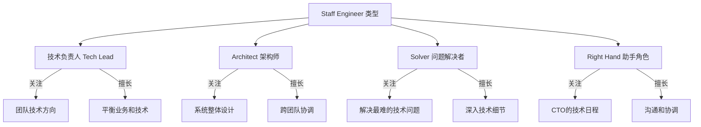
```mermaid
%%{init: {"graph": {"defaultLayout": "td", "rankdir": "TB"}, "subGraph": {"ranksep": 80}}}%%
graph TD
    A[Staff Engineer 类型] --> B[技术负责人 Tech Lead]
    A --> C[Architect 架构师]
    A --> D[Solver 问题解决者]
    A --> E[Right Hand 助手角色]

    B -->|"关注"| B1["团队技术方向"]
    B -->|"擅长"| B2["平衡业务和技术"]

    C -->|"关注"| C1["系统整体设计"]
    C -->|"擅长"| C2["跨团队协调"]

    D -->|"关注"| D1["解决最难的技术问题"]
    D -->|"擅长"| D2["深入技术细节"]

    E -->|"关注"| E1["CTO的技术日程"]
    E -->|"擅长"| E2["沟通和协调"]
```

### 3.2 各类型详解

#### 3.2.1 技术负责人（Tech Lead）

**技术负责人**是最常见的Staff Engineer类型，他们通常是团队的首席技术决策者。

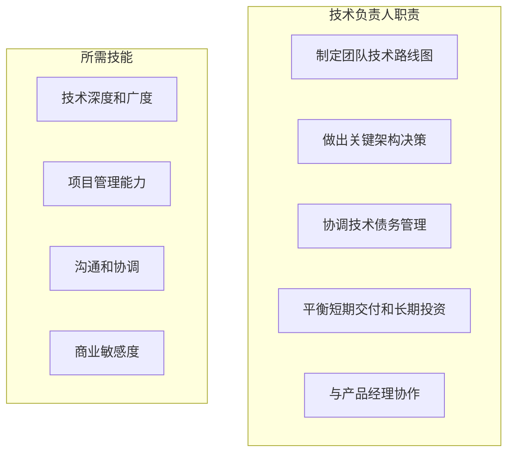
```mermaid
%%{init: {"graph": {"defaultLayout": "td", "rankdir": "TB"}, "subGraph": {"ranksep": 80}}}%%
graph TD
    subgraph 技术负责人职责["技术负责人职责"]
        R1[制定团队技术路线图]
        R2[做出关键架构决策]
        R3[协调技术债务管理]
        R4[平衡短期交付和长期投资]
        R5[与产品经理协作]
    end

    subgraph 所需技能["所需技能"]
        S1[技术深度和广度]
        S2[项目管理能力]
        S3[沟通和协调]
        S4[商业敏感度]
    end
```

**典型工作场景：**

```
┌─────────────────────────────────────────────────────────┐
│              技术负责人典型工作日                         │
├─────────────────────────────────────────────────────────┤
│  上午:                                                   │
│    - 代码评审（关注架构决策）                            │
│    - 与产品讨论下一个季度的技术目标                      │
│    - 技术债务优先级会议                                  │
│                                                         │
│  下午:                                                   │
│    - 设计评审（新功能的技术方案）                        │
│    - 指导高级工程师                                      │
│    - 跨团队技术协调会议                                  │
│                                                         │
│  晚上:                                                   │
│    - 深度技术工作（关键实现）                            │
│    - 技术规划文档                                        │
└─────────────────────────────────────────────────────────┘
```

#### 3.2.2 架构师（Architect）

**架构师**专注于系统设计和跨团队的技术协调，确保整个组织的技术一致性。

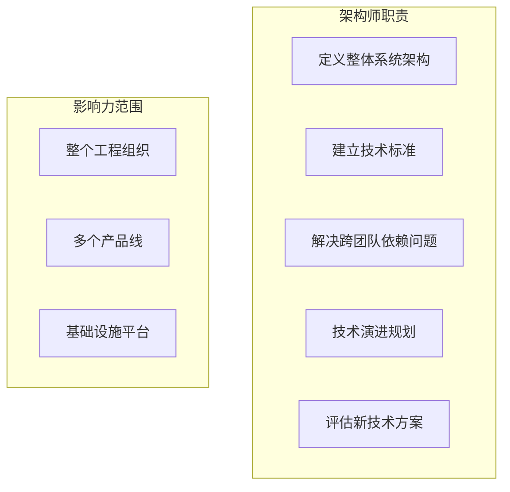
```mermaid
%%{init: {"graph": {"defaultLayout": "td", "rankdir": "TB"}, "subGraph": {"ranksep": 80}}}%%
graph TD
    subgraph 架构师职责["架构师职责"]
        A1[定义整体系统架构]
        A2[建立技术标准]
        A3[解决跨团队依赖问题]
        A4[技术演进规划]
        A5[评估新技术方案]
    end

    subgraph 影响力范围["影响力范围"]
        I1[整个工程组织]
        I2[多个产品线]
        I3[基础设施平台]
    end
```

**架构师的工作模式：**

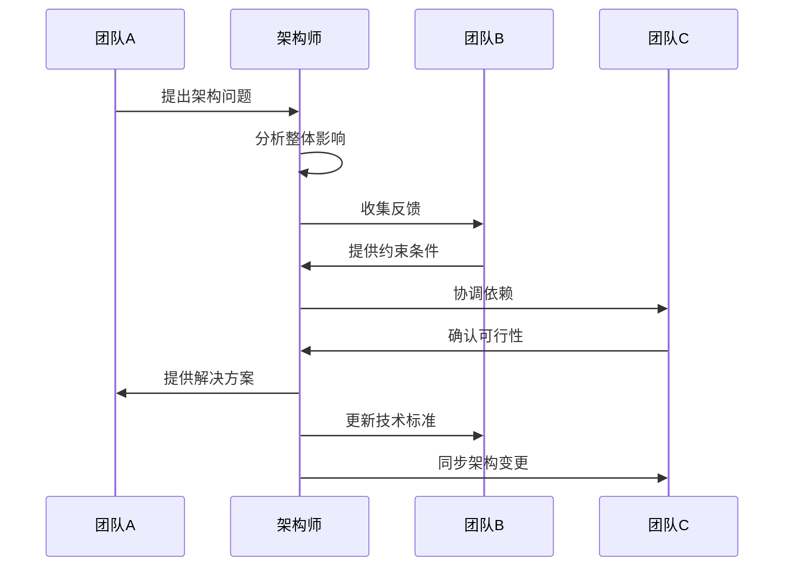
```mermaid
%%{init: {"graph": {"defaultLayout": "td", "rankdir": "TB"}, "subGraph": {"ranksep": 80}}}%%
sequenceDiagram
    participant T as 团队A
    participant A as 架构师
    participant B as 团队B
    participant C as 团队C

    T->>A: 提出架构问题
    A->>A: 分析整体影响
    A->>B: 收集反馈
    B->>A: 提供约束条件
    A->>C: 协调依赖
    C->>A: 确认可行性
    A->>T: 提供解决方案
    A->>B: 更新技术标准
    A->>C: 同步架构变更
```

#### 3.2.3 问题解决者（Solver）

**问题解决者**是技术深度最强的Staff Engineer，他们专注于解决最困难的技术问题。

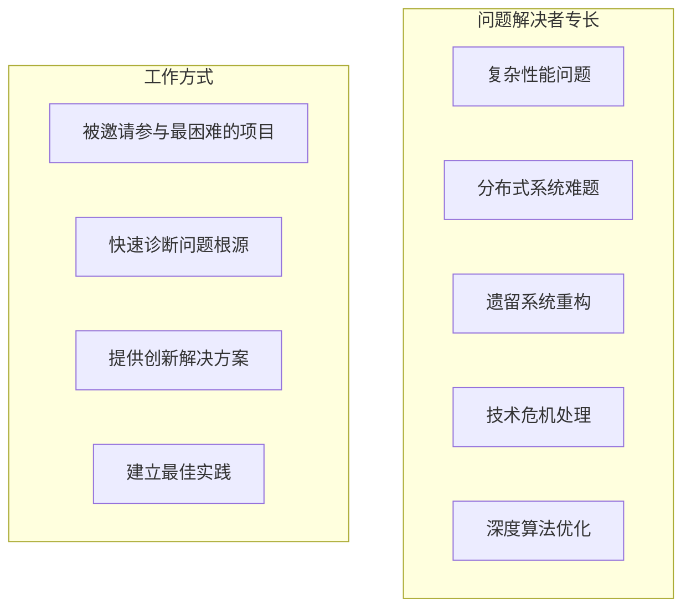
```mermaid
%%{init: {"graph": {"defaultLayout": "td", "rankdir": "TB"}, "subGraph": {"ranksep": 80}}}%%
graph TD
    subgraph 问题解决者专长["问题解决者专长"]
        S1[复杂性能问题]
        S2[分布式系统难题]
        S3[遗留系统重构]
        S4[技术危机处理]
        S5[深度算法优化]
    end

    subgraph 工作方式["工作方式"]
        W1["被邀请参与最困难的项目"]
        W2["快速诊断问题根源"]
        W3["提供创新解决方案"]
        W4["建立最佳实践"]
    end
```

#### 3.2.4 助手角色（Right Hand）

**助手角色**是CTO或VP Engineering的右臂，帮助处理技术组织的管理工作。

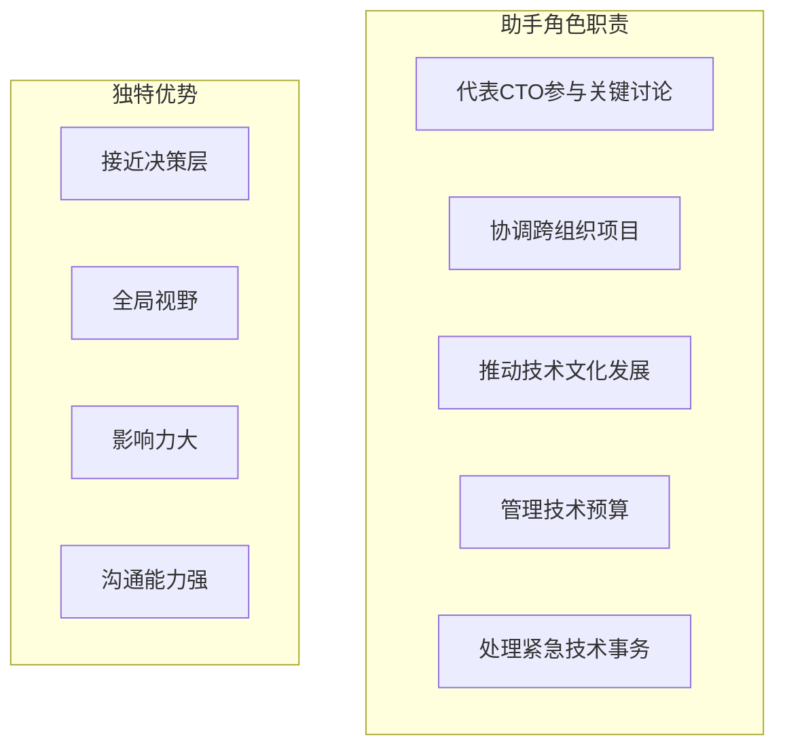
```mermaid
%%{init: {"graph": {"defaultLayout": "td", "rankdir": "TB"}, "subGraph": {"ranksep": 80}}}%%
graph TD
    subgraph 助手角色职责["助手角色职责"]
        R1[代表CTO参与关键讨论]
        R2[协调跨组织项目]
        R3[推动技术文化发展]
        R4[管理技术预算]
        R5[处理紧急技术事务]
    end

    subgraph 独特优势["独特优势"]
        U1[接近决策层]
        U2[全局视野]
        U3[影响力大]
        U4[沟通能力强]
    end
```

### 3.3 如何选择你的类型

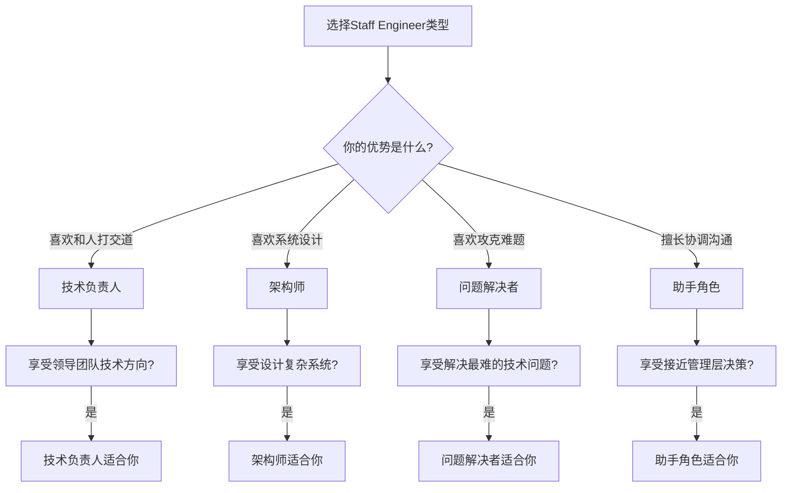
```mermaid
%%{init: {"graph": {"defaultLayout": "td", "rankdir": "TB"}, "subGraph": {"ranksep": 80}}}%%
graph TD
    A[选择Staff Engineer类型] --> B{你的优势是什么?}

    B -->|喜欢和人打交道| C[技术负责人]
    B -->|喜欢系统设计| D[架构师]
    B -->|喜欢攻克难题| E[问题解决者]
    B -->|擅长协调沟通| F[助手角色]

    C --> G["享受领导团队技术方向?"]
    D --> H["享受设计复杂系统?"]
    E --> I["享受解决最难的技术问题?"]
    F --> J["享受接近管理层决策?"]

    G -->|是| C1["技术负责人适合你"]
    H -->|是| D1["架构师适合你"]
    I -->|是| E1["问题解决者适合你"]
    J -->|是| F1["助手角色适合你"]
```

---

## 四、评估你是否准备好

### 4.1 评估框架

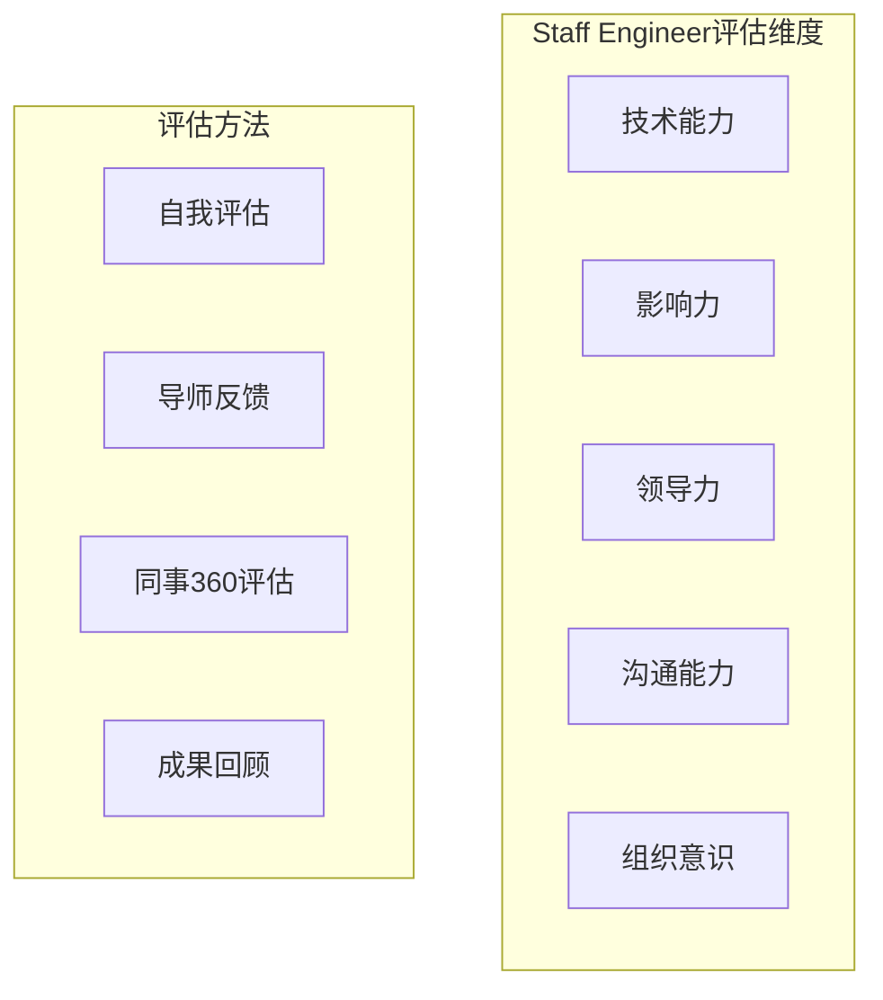
```mermaid
%%{init: {"graph": {"defaultLayout": "td", "rankdir": "TB"}, "subGraph": {"ranksep": 80}}}%%
graph TD
    subgraph 评估维度["Staff Engineer评估维度"]
        D1[技术能力]
        D2[影响力]
        D3[领导力]
        D4[沟通能力]
        D5[组织意识]
    end

    subgraph 评估方法["评估方法"]
        M1[自我评估]
        M2[导师反馈]
        M3[同事360评估]
        M4[成果回顾]
    end
```

### 4.2 关键指标

#### 4.2.1 技术能力指标

| 指标 | 高级工程师水平 | Staff Engineer水平 |
|-----|--------------|-------------------|
| **代码质量** | 写出高质量代码 | 建立代码质量标准 |
| **系统设计** | 设计单个模块 | 设计整个系统 |
| **技术深度** | 在某个领域深耕 | 跨多个领域有深度 |
| **问题解决** | 解决已知问题 | 定义新问题并解决 |

#### 4.2.2 影响力指标

| 指标 | 高级工程师水平 | Staff Engineer水平 |
|-----|--------------|-------------------|
| **影响范围** | 团队内部 | 多个团队/整个组织 |
| **项目领导** | 领导小型项目 | 领导大型复杂项目 |
| **技术债务** | 还清团队技术债务 | 系统性处理技术债务 |
| **最佳实践** | 采纳现有最佳实践 | 建立新的最佳实践 |

#### 4.2.3 领导力指标

| 指标 | 高级工程师水平 | Staff Engineer水平 |
|-----|--------------|-------------------|
| **人才培养** | 指导1-2个初级工程师 | 培养多个高级工程师 |
| **团队协作** | 与团队良好协作 | 协调多个团队 |
| **冲突解决** | 解决团队内冲突 | 解决跨团队冲突 |
| **技术愿景** | 执行既定方向 | 定义技术方向 |

### 4.3 常见误区

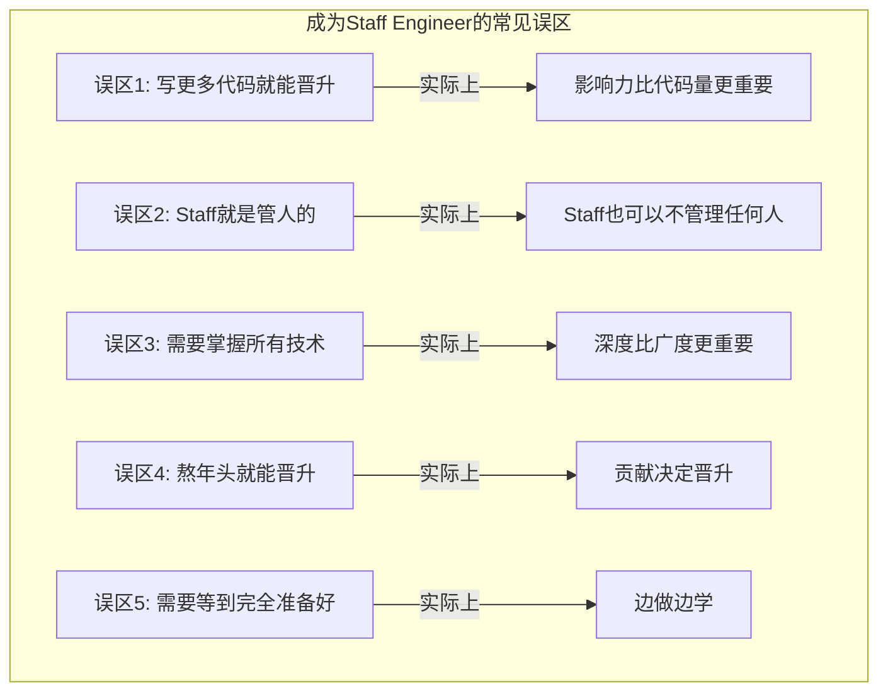
```mermaid
%%{init: {"graph": {"defaultLayout": "td", "rankdir": "TB"}, "subGraph": {"ranksep": 80}}}%%
graph TD
    subgraph 误区["成为Staff Engineer的常见误区"]
        M1["误区1: 写更多代码就能晋升"]
        M2["误区2: Staff就是管人的"]
        M3["误区3: 需要掌握所有技术"]
        M4["误区4: 熬年头就能晋升"]
        M5["误区5: 需要等到完全准备好"]

        M1 -->|"实际上"| R1["影响力比代码量更重要"]
        M2 -->|"实际上"| R2["Staff也可以不管理任何人"]
        M3 -->|"实际上"| R3["深度比广度更重要"]
        M4 -->|"实际上"| R4["贡献决定晋升"]
        M5 -->|"实际上"| R5["边做边学"]
    end
```

---

## 五、从高级工程师到Staff Engineer的转变

### 5.1 思维转变

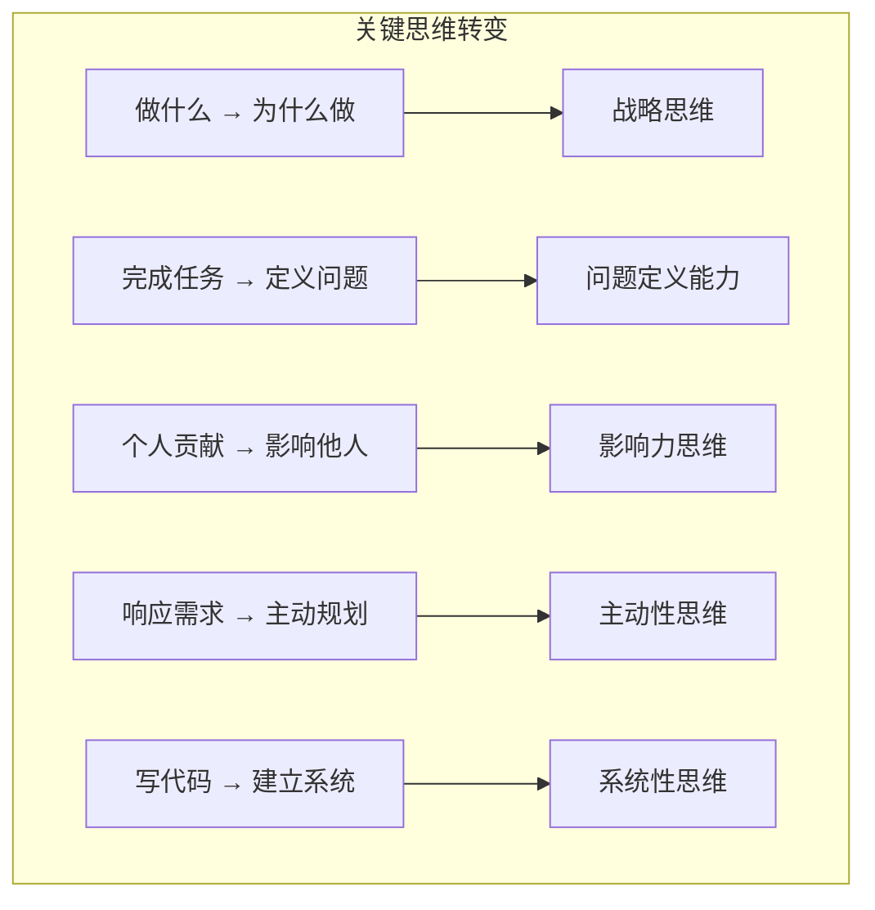
```mermaid
%%{init: {"graph": {"defaultLayout": "td", "rankdir": "TB"}, "subGraph": {"ranksep": 80}}}%%
graph TD
    subgraph 思维转变["关键思维转变"]
        T1["做什么 → 为什么做"]
        T2["完成任务 → 定义问题"]
        T3["个人贡献 → 影响他人"]
        T4["响应需求 → 主动规划"]
        T5["写代码 → 建立系统"]

        T1 --> C1[战略思维]
        T2 --> C2[问题定义能力]
        T3 --> C3[影响力思维]
        T4 --> C4[主动性思维]
        T5 --> C5[系统性思维]
    end
```

### 5.2 行动转变

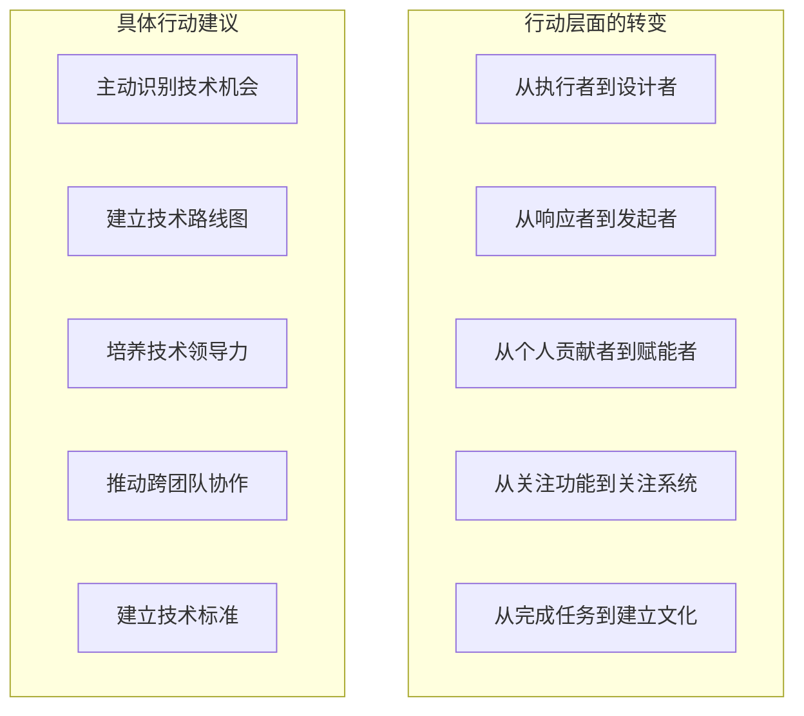
```mermaid
%%{init: {"graph": {"defaultLayout": "td", "rankdir": "TB"}, "subGraph": {"ranksep": 80}}}%%
graph TD
    subgraph 行动转变["行动层面的转变"]
        A1[从执行者到设计者]
        A2[从响应者到发起者]
        A3[从个人贡献者到赋能者]
        A4[从关注功能到关注系统]
        A5[从完成任务到建立文化]
    end

    subgraph 具体行动["具体行动建议"]
        P1[主动识别技术机会]
        P2[建立技术路线图]
        P3[培养技术领导力]
        P4[推动跨团队协作]
        P5[建立技术标准]
    end
```

### 5.3 常见挑战

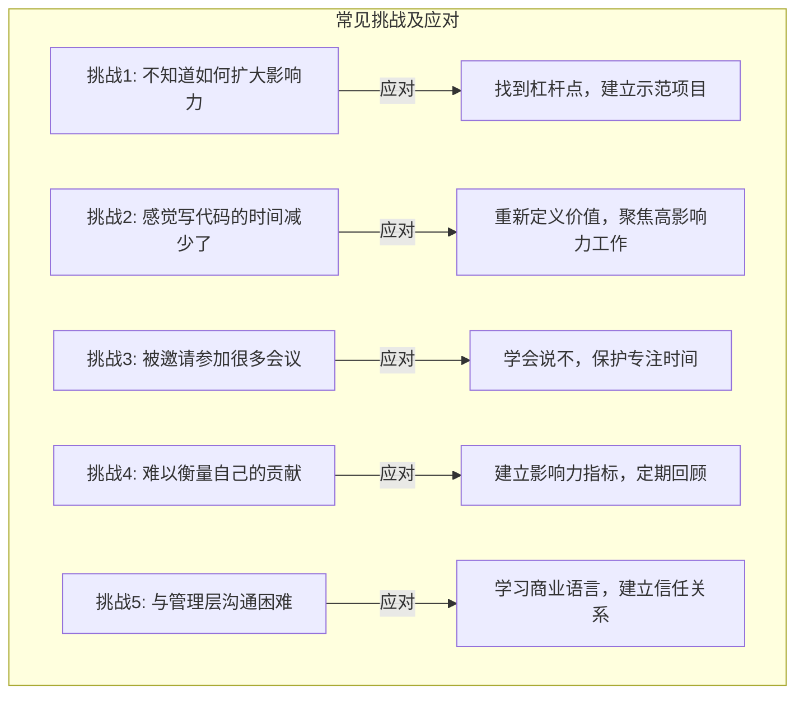
```mermaid
%%{init: {"graph": {"defaultLayout": "td", "rankdir": "TB"}, "subGraph": {"ranksep": 80}}}%%
graph TD
    subgraph 挑战["常见挑战及应对"]
        C1["挑战1: 不知道如何扩大影响力"]
        C2["挑战2: 感觉写代码的时间减少了"]
        C3["挑战3: 被邀请参加很多会议"]
        C4["挑战4: 难以衡量自己的贡献"]
        C5["挑战5: 与管理层沟通困难"]

        C1 -->|"应对"| S1["找到杠杆点，建立示范项目"]
        C2 -->|"应对"| S2["重新定义价值，聚焦高影响力工作"]
        C3 -->|"应对"| S3["学会说不，保护专注时间"]
        C4 -->|"应对"| S4["建立影响力指标，定期回顾"]
        C5 -->|"应对"| S5["学习商业语言，建立信任关系"]
    end
```

---

## 六、职业发展路径

### 6.1 里程碑时间线

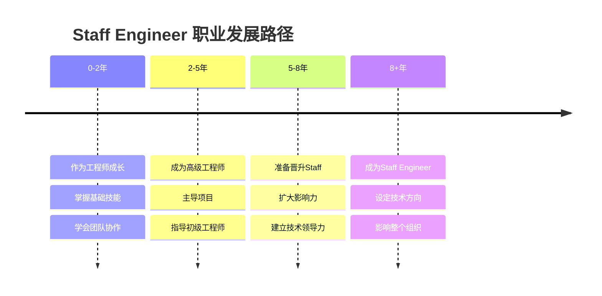
```mermaid
%%{init: {"graph": {"defaultLayout": "td", "rankdir": "TB"}, "subGraph": {"ranksep": 80}}}%%
timeline
    title Staff Engineer 职业发展路径

    0-2年 : 作为工程师成长
         : 掌握基础技能
         : 学会团队协作

    2-5年 : 成为高级工程师
         : 主导项目
         : 指导初级工程师

    5-8年 : 准备晋升Staff
         : 扩大影响力
         : 建立技术领导力

    8+年 : 成为Staff Engineer
         : 设定技术方向
         : 影响整个组织
```

### 6.2 准备阶段行动清单

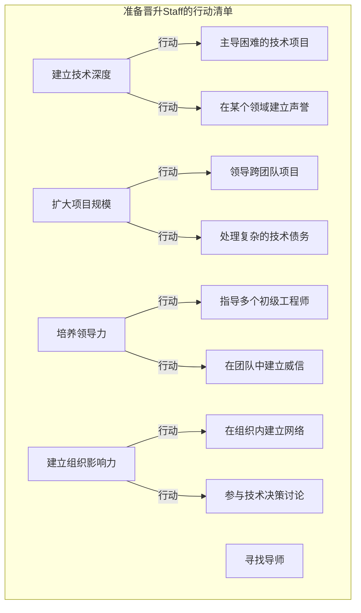
```mermaid
%%{init: {"graph": {"defaultLayout": "td", "rankdir": "TB"}, "subGraph": {"ranksep": 80}}}%%
graph TD
    subgraph 准备阶段["准备晋升Staff的行动清单"]
        P1[建立技术深度]
        P2[扩大项目规模]
        P3[培养领导力]
        P4[建立组织影响力]
        P5[寻找导师]

        P1 -->|"行动"| A1["主导困难的技术项目"]
        P1 -->|"行动"| A2["在某个领域建立声誉"]

        P2 -->|"行动"| A3["领导跨团队项目"]
        P2 -->|"行动"| A4["处理复杂的技术债务"]

        P3 -->|"行动"| A5["指导多个初级工程师"]
        P3 -->|"行动"| A6["在团队中建立威信"]

        P4 -->|"行动"| A7["在组织内建立网络"]
        P4 -->|"行动"| A8["参与技术决策讨论"]
    end
```

### 6.3 晋升评估要点

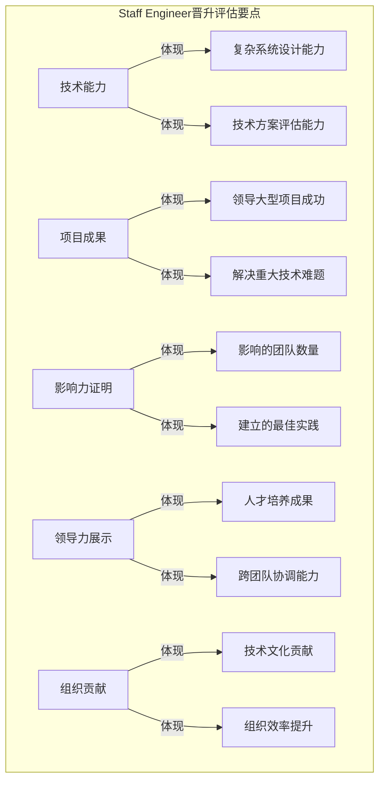
```mermaid
%%{init: {"graph": {"defaultLayout": "td", "rankdir": "TB"}, "subGraph": {"ranksep": 80}}}%%
graph TD
    subgraph 评估要点["Staff Engineer晋升评估要点"]
        E1[技术能力]
        E2[项目成果]
        E3[影响力证明]
        E4[领导力展示]
        E5[组织贡献]

        E1 -->|"体现"| Q1["复杂系统设计能力"]
        E1 -->|"体现"| Q2["技术方案评估能力"]

        E2 -->|"体现"| Q3["领导大型项目成功"]
        E2 -->|"体现"| Q4["解决重大技术难题"]

        E3 -->|"体现"| Q5["影响的团队数量"]
        E3 -->|"体现"| Q6["建立的最佳实践"]

        E4 -->|"体现"| Q7["人才培养成果"]
        E4 -->|"体现"| Q8["跨团队协调能力"]

        E5 -->|"体现"| Q9["技术文化贡献"]
        E5 -->|"体现"| Q10["组织效率提升"]
    end
```

---

## 七、面试题整理

### 7.1 概念理解类 🌱

**Q1：Staff Engineer和Engineering Manager有什么区别？**

**答案：**

**核心区别：**

| 维度 | Staff Engineer | Engineering Manager |
|-----|---------------|---------------------|
| **角色定位** | 技术领导者 | 人员管理者 |
| **主要职责** | 技术方向和架构 | 团队管理和人员发展 |
| **成功标准** | 技术成果和影响力 | 团队绩效和人员成长 |
| **日常工作** | 设计、评审、指导 | 1:1、会议、资源分配 |
| **晋升路径** | Principal/Distinguished | VP/Director |

**实际工作中的关系：**
- 相互协作而非上下级
- EM关注"人"，Staff关注"技术"
- 共同为团队成功负责

**Q2：Staff Engineer需要具备哪些软技能？**

**答案：**

**软技能清单：**

| 技能 | 具体表现 | 重要性 |
|-----|---------|-------|
| **沟通能力** | 清晰表达技术方案 | ⭐⭐⭐⭐⭐ |
| **影响力** | 无权力情况下的领导 | ⭐⭐⭐⭐⭐ |
| **协调能力** | 跨团队协作推动 | ⭐⭐⭐⭐ |
| **商业敏感度** | 理解业务需求 | ⭐⭐⭐⭐ |
| **反馈能力** | 给予和接收建设性反馈 | ⭐⭐⭐⭐ |

---

### 7.2 自我评估类 🌿

**Q3：如何评估自己是否准备好成为Staff Engineer？**

**答案：**

**评估框架：**

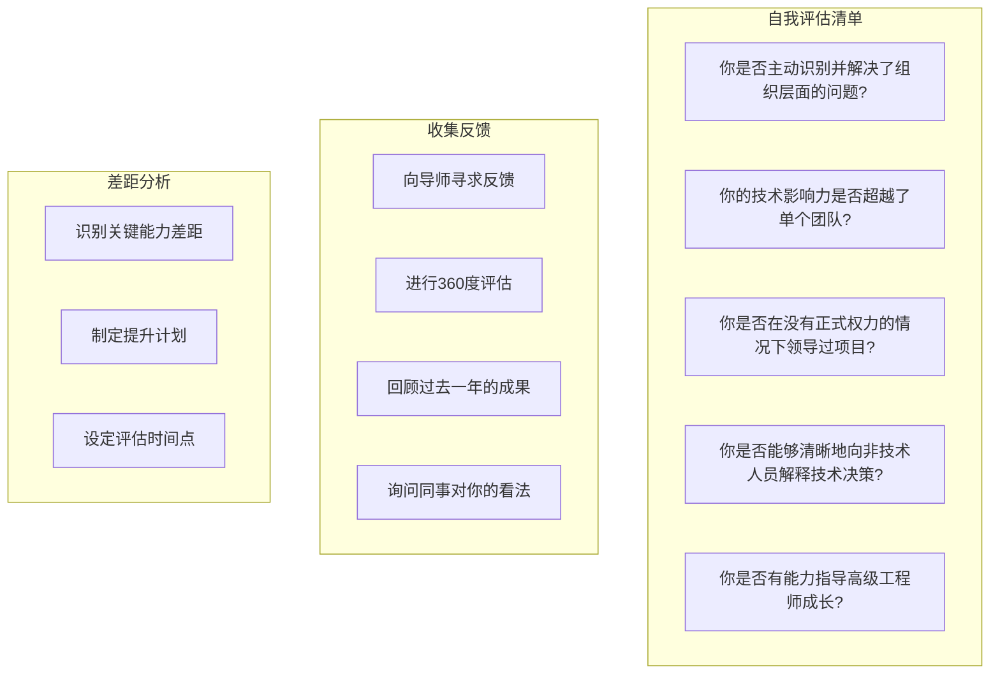
```mermaid
%%{init: {"graph": {"defaultLayout": "td", "rankdir": "TB"}, "subGraph": {"ranksep": 80}}}%%
graph TD
    subgraph 自我评估["自我评估清单"]
        A1["你是否主动识别并解决了组织层面的问题?"]
        A2["你的技术影响力是否超越了单个团队?"]
        A3["你是否在没有正式权力的情况下领导过项目?"]
        A4["你是否能够清晰地向非技术人员解释技术决策?"]
        A5["你是否有能力指导高级工程师成长?"]
    end

    subgraph 反馈收集["收集反馈"]
        F1["向导师寻求反馈"]
        F2["进行360度评估"]
        F3["回顾过去一年的成果"]
        F4["询问同事对你的看法"]
    end

    subgraph 差距分析["差距分析"]
        G1["识别关键能力差距"]
        G2["制定提升计划"]
        G3["设定评估时间点"]
    end
```

**如果以下大多数答案是"是"，你可能已经准备好了：**
- 你被邀请参与超出你职责范围的技术讨论
- 你的技术建议经常被采纳
- 你能够指导团队中所有级别的工程师
- 你有成功领导跨团队项目的经验
- 你的工作对整个组织有可衡量的影响

---

### 7.3 实践应用类 🔧

**Q4：如果想成为Staff Engineer，现在应该开始做什么？**

**答案：**

**行动路线图：**

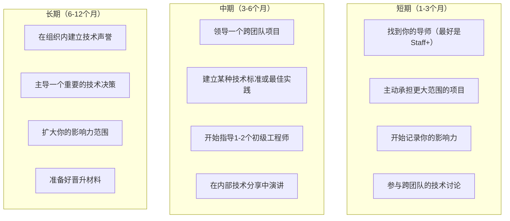
```mermaid
%%{init: {"graph": {"defaultLayout": "td", "rankdir": "TB"}, "subGraph": {"ranksep": 80}}}%%
graph TD
    subgraph 短期行动["短期（1-3个月）"]
        S1["找到你的导师（最好是Staff+）"]
        S2["主动承担更大范围的项目"]
        S3["开始记录你的影响力"]
        S4["参与跨团队的技术讨论"]
    end

    subgraph 中期行动["中期（3-6个月）"]
        M1["领导一个跨团队项目"]
        M2["建立某种技术标准或最佳实践"]
        M3["开始指导1-2个初级工程师"]
        M4["在内部技术分享中演讲"]
    end

    subgraph 长期行动["长期（6-12个月）"]
        L1["在组织内建立技术声誉"]
        L2["主导一个重要的技术决策"]
        L3["扩大你的影响力范围"]
        L4["准备好晋升材料"]
    end
```

**关键建议：**
1. **找到导师** - Staff Engineer导师能提供宝贵指导
2. **扩大影响范围** - 主动参与超出当前职责的工作
3. **记录成果** - 保留你影响的证据
4. **建立网络** - 与其他团队的Leader建立关系
5. **持续学习** - 阅读技术领导力相关书籍和文章

---

## 八、实践要点

### 8.1 建立技术领导力的步骤

```mermaid
%%{init: {"graph": {"defaultLayout": "td", "rankdir": "TB"}, "subGraph": {"ranksep": 80}}}%%
graph TD
    subgraph 领导力发展["技术领导力发展路径"]
        L1[阶段1: 贡献者]
        L2[阶段2: 导师]
        L3[阶段3: 领导者]
        L4[阶段4: 架构师]

        L1 --> L2 --> L3 --> L4
    end

    subgraph 各阶段技能["各阶段核心技能"]
        S1["编码和技术执行"]
        S2["知识分享和指导"]
        S3["项目领导和协调"]
        S4["技术方向设定"]
    end
```

### 8.2 常见问题与解决方案

| 问题 | 原因 | 解决方案 |
|-----|-----|---------|
| **感觉没有影响力** | 局限于当前角色 | 主动寻找更大范围的机会 |
| **被会议淹没** | 不会说"不" | 保护专注时间，聚焦高价值会议 |
| **难以衡量贡献** | 没有建立指标 | 记录影响力，定期回顾 |
| **与管理层脱节** | 沟通不足 | 主动同步，建立信任 |
| **技术深度下降** | 会议太多 | 保护深度工作时间 |

### 8.3 每日/每周实践

```mermaid
%%{init: {"graph": {"defaultLayout": "td", "rankdir": "TB"}, "subGraph": {"ranksep": 80}}}%%
graph TD
    subgraph 每日实践["每日实践"]
        D1["花时间在深度技术上"]
        D2["进行一次代码评审"]
        D3["与团队成员交流"]

        D1 -->|"30%时间"| T1["深度技术工作"]
        D2 -->|"20%时间"| T2["代码评审和指导"]
        D3 -->|"10%时间"| T3["沟通协调"]
    end

    subgraph 每周实践["每周实践"]
        W1["参与1-2个跨团队会议"]
        W2["指导1-2个工程师"]
        W3["推进1个长期项目"]
        W4["阅读和学习新技术"]

        W1 -->|"2-3小时"| X1["跨团队协调"]
        W2 -->|"1-2小时"| X2["人才培养"]
        W3 -->|"4-6小时"| X3["长期项目"]
    end
```

---

## 九、扩展阅读

### 9.1 推荐资源

| 资源 | 类型 | 说明 |
|-----|-----|-----|
| 《The Manager's Path》 | 书籍 | 技术管理者成长路径 |
| 《Staff Engineer's Path》 | 原文 | 本书英文原版 |
| 《Engineering Management for the Rest of Us》 | 书籍 | 工程管理指南 |
| Tech Lead 博客 | 博客 | 技术领导力分享 |

### 9.2 社区资源

- Staff Engineer Summit
- Level Up: Engineering Leadership
- 技术领导力Slack/Discord社区

### 9.3 实践项目

- 组织内部技术分享
- 推动一个跨团队改进项目
- 建立团队技术标准文档

---

## 十、本章小结

### 核心收获

1. **Staff Engineer是技术领导角色**
   - 关注组织整体成功
   - 通过影响而非权力领导
   - 需要技术深度和组织影响力

2. **有四种主要类型**
   - 技术负责人、架构师、问题解决者、助手角色
   - 根据个人优势选择发展方向

3. **从高级到Staff需要转变**
   - 从做什么到为什么做
   - 从个人贡献到影响他人
   - 从响应需求到主动规划

4. **准备好是关键**
   - 评估技术能力、影响力、领导力
   - 找到导师，扩大影响范围
   - 持续记录和反思

### 关键概念地图

```mermaid
%%{init: {"graph": {"defaultLayout": "td", "rankdir": "TB"}, "subGraph": {"ranksep": 80}}}%%
mindmap
  root((成为Staff Engineer))
    角色定义
      技术领导者
      组织影响者
      问题解决者
    四种类型
      技术负责人
      架构师
      问题解决者
      助手角色
    评估维度
      技术能力
      影响力
      领导力
    转变要点
      思维转变
      行动转变
      技能提升
```

### 下一章预告

第2章将探讨**设定方向**，了解如何为团队和组织设定技术方向：
- 技术愿景的制定
- 路线图规划
- 决策框架
- 协调利益相关者

---

## 附录 A：Staff Engineer自检清单

| 检查项 | 现状 | 目标 | 差距 |
|-------|-----|-----|-----|
| 技术深度 | ___ | 在某一领域被公认为专家 | |
| 系统设计 | ___ | 能设计复杂分布式系统 | |
| 项目领导 | ___ | 领导过跨团队大型项目 | |
| 影响力 | ___ | 影响超出当前团队范围 | |
| 人才培养 | ___ | 成功指导多名工程师成长 | |
| 沟通能力 | ___ | 能清晰表达复杂技术概念 | |
| 商业理解 | ___ | 理解业务需求和技术权衡 | |

---

*文档生成时间：2024-01-08*
*基于《The Staff Engineer's Path》第1章*
