# 《The Staff Engineer's Path》- 第2章：设定方向（深度版）

## 一、本章概述

本章深入探讨了Staff Engineer的核心职责之一：**设定技术方向**。作为技术领导者，Staff Engineer需要具备制定技术愿景、规划路线图、做出关键决策并协调各方利益相关者的能力。

> **本章核心问题**：如何为团队和组织设定清晰的技术方向？如何平衡短期交付压力与长期技术投资？如何在不确定的情况下做出关键决策？

### 1.1 核心主题
- 技术愿景的制定与沟通
- 技术路线图规划
- 决策框架与方法论
- 利益相关者协调
- 技术债务管理

### 1.2 重要程度
⭐⭐⭐⭐⭐（极高）

### 1.3 预计学习时间
60-80分钟

### 1.4 本章与其他章节的关联

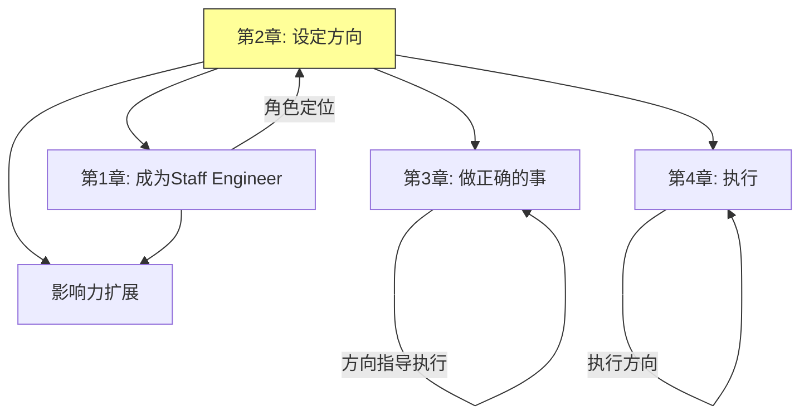
```mermaid
%%{init: {"graph": {"defaultLayout": "td", "rankdir": "TB"}, "subGraph": {"ranksep": 80}}}%%
graph TD
    A[第2章: 设定方向] --> B[第1章: 成为Staff Engineer]
    A --> C[第3章: 做正确的事]
    A --> D[第4章: 执行]

    B -->|"角色定位"| A
    C -->|"方向指导执行"| C
    D -->|"执行方向"| D

    A --> E[影响力扩展]
    B --> E

    style A fill:#ff9,stroke:#333
```

---

## 二、技术愿景

### 2.1 技术愿景的定义

**技术愿景**是对团队或组织技术未来的清晰描述，它回答了"我们要去哪里"和"我们如何到达那里"的问题。

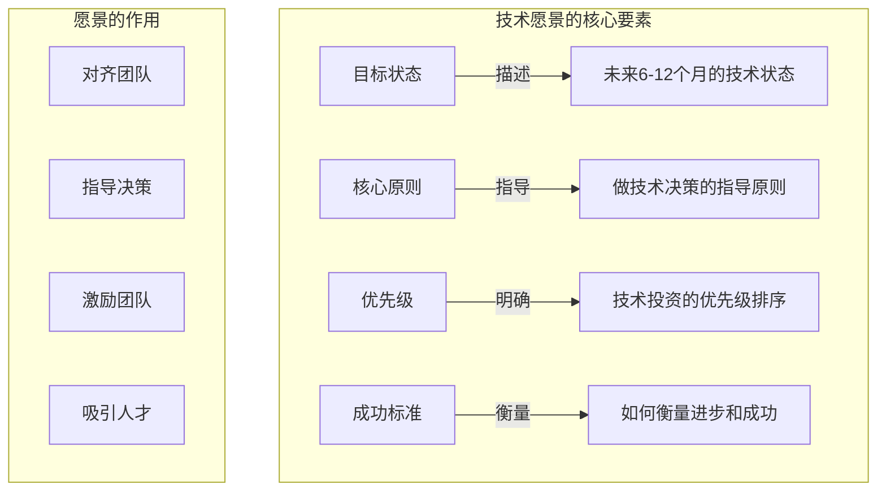
```mermaid
%%{init: {"graph": {"defaultLayout": "td", "rankdir": "TB"}, "subGraph": {"ranksep": 80}}}%%
graph TD
    subgraph 技术愿景["技术愿景的核心要素"]
        V1[目标状态] -->|"描述"| V2["未来6-12个月的技术状态"]
        V3[核心原则] -->|"指导"| V4["做技术决策的指导原则"]
        V5[优先级] -->|"明确"| V6["技术投资的优先级排序"]
        V7[成功标准] -->|"衡量"| V8["如何衡量进步和成功"]
    end

    subgraph 愿景作用["愿景的作用"]
        I1[对齐团队]
        I2[指导决策]
        I3[激励团队]
        I4[吸引人才]
    end
```

### 2.2 优秀技术愿景的特征

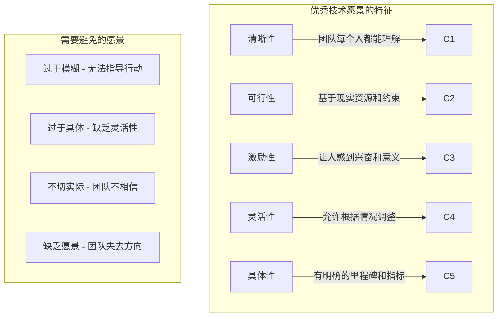
```mermaid
%%{init: {"graph": {"defaultLayout": "td", "rankdir": "TB"}, "subGraph": {"ranksep": 80}}}%%
graph TD
    subgraph 愿景特征["优秀技术愿景的特征"]
        F1[清晰性] -->|"团队每个人都能理解"| C1
        F2[可行性] -->|"基于现实资源和约束"| C2
        F3[激励性] -->|"让人感到兴奋和意义"| C3
        F4[灵活性] -->|"允许根据情况调整"| C4
        F5[具体性] -->|"有明确的里程碑和指标"| C5
    end

    subgraph 反面特征["需要避免的愿景"]
        B1["过于模糊 - 无法指导行动"]
        B2["过于具体 - 缺乏灵活性"]
        B3["不切实际 - 团队不相信"]
        B4["缺乏愿景 - 团队失去方向"]
    end
```

### 2.3 制定技术愿景的步骤

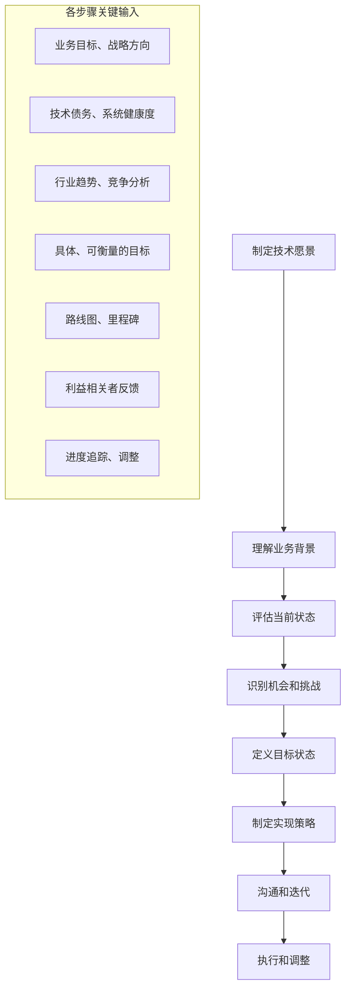
```mermaid
%%{init: {"graph": {"defaultLayout": "td", "rankdir": "TB"}, "subGraph": {"ranksep": 80}}}%%
flowchart TD
    A[制定技术愿景] --> B[理解业务背景]
    B --> C[评估当前状态]
    C --> D[识别机会和挑战]
    D --> E[定义目标状态]
    E --> F[制定实现策略]
    F --> G[沟通和迭代]
    G --> H[执行和调整]

    subgraph 各步骤输入["各步骤关键输入"]
        B1["业务目标、战略方向"]
        C1["技术债务、系统健康度"]
        D1["行业趋势、竞争分析"]
        E1["具体、可衡量的目标"]
        F1["路线图、里程碑"]
        G1["利益相关者反馈"]
        H1["进度追踪、调整"]
    end
```

### 2.4 技术愿景示例模板

```markdown
# 技术愿景模板

## 背景
[描述业务背景和为什么需要这个愿景]

## 当前状态
- 现有系统的主要特点和限制
- 技术债务和痛点
- 团队的技术能力

## 目标状态（未来12个月）
- 主要技术目标（3-5个）
- 系统架构期望状态
- 技术能力提升

## 核心原则
1. [原则1 - 例如：优先考虑可维护性]
2. [原则2 - 例如：拥抱自动化]
3. [原则3 - 例如：数据驱动决策]

## 优先级
1. 最高优先级：[目标1]
2. 次优先级：[目标2]
3. 第三优先级：[目标3]

## 成功指标
- 指标1：[如何衡量]
- 指标2：[如何衡量]

## 关键里程碑
- M1：[时间点] - [成就]
- M2：[时间点] - [成就]
- M3：[时间点] - [成就]
```

---

## 三、技术路线图

### 3.1 路线图的作用

**技术路线图**是将技术愿景转化为可执行计划的工具，它连接了战略意图与日常执行。

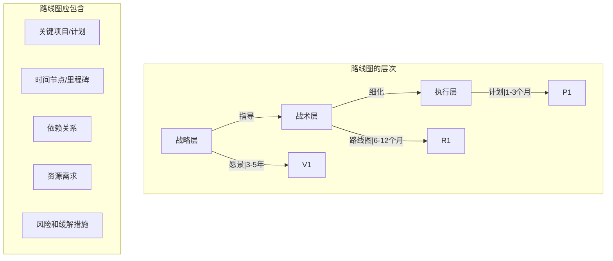
```mermaid
%%{init: {"graph": {"defaultLayout": "td", "rankdir": "TB"}, "subGraph": {"ranksep": 80}}}%%
graph TD
    subgraph 路线图层次["路线图的层次"]
        S1[战略层] -->|"指导"| S2[战术层]
        S2 -->|"细化"| S3[执行层]

        S1 -->|"愿景|3-5年"| V1
        S2 -->|"路线图|6-12个月"| R1
        S3 -->|"计划|1-3个月"| P1
    end

    subgraph 路线图内容["路线图应包含"]
        C1[关键项目/计划]
        C2[时间节点/里程碑]
        C3[依赖关系]
        C4[资源需求]
        C5[风险和缓解措施]
    end
```

### 3.2 路线图规划框架

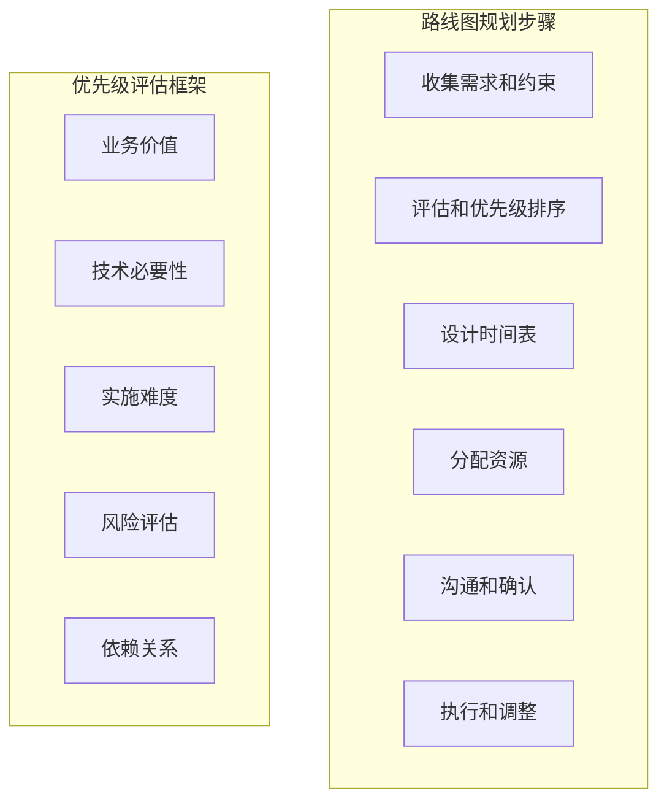
```mermaid
%%{init: {"graph": {"defaultLayout": "td", "rankdir": "TB"}, "subGraph": {"ranksep": 80}}}%%
graph TD
    subgraph 规划步骤["路线图规划步骤"]
        P1[收集需求和约束]
        P2[评估和优先级排序]
        P3[设计时间表]
        P4[分配资源]
        P5[沟通和确认]
        P6[执行和调整]
    end

    subgraph 优先级框架["优先级评估框架"]
        F1[业务价值]
        F2[技术必要性]
        F3[实施难度]
        F4[风险评估]
        F5[依赖关系]
    end
```

### 3.3 OKR与路线图

```mermaid
%%{init: {"graph": {"defaultLayout": "td", "rankdir": "TB"}, "subGraph": {"ranksep": 80}}}%%
graph TD
    subgraph OKR关联["OKR与路线图的关联"]
        O1[Objective 目标] --> K1[Key Result 关键结果]
        K1 --> I1[Initiative 计划]

        O1 -->|"来自"| R1["路线图主题"]
        K1 -->|"对应"| R2["路线图里程碑"]
        I1 -->|"细化为"| R3["具体项目"]
    end

    subgraph OKR示例["OKR示例"]
        Objective --> "提升平台可靠性"
        KR1 --> "将SLA从99.9%提升到99.95%"
        KR2 --> "将平均恢复时间从30分钟降低到5分钟"
        Initiative --> "实施混沌工程"
        Initiative --> "改进监控告警"
    end
```

### 3.4 路线图可视化

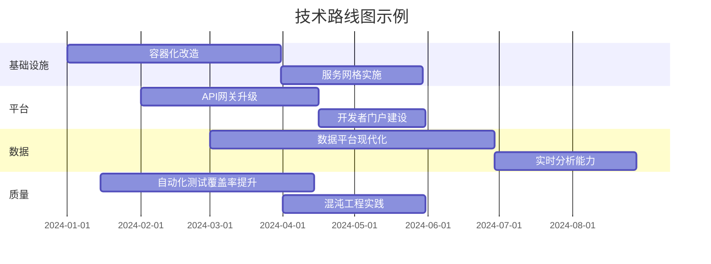
```mermaid
%%{init: {"graph": {"defaultLayout": "td", "rankdir": "TB"}, "subGraph": {"ranksep": 80}}}%%
gantt
    title 技术路线图示例
    dateFormat  YYYY-MM-DD
    section 基础设施
    容器化改造          :a1, 2024-01-01, 90d
    服务网格实施        :a2, after a1, 60d
    section 平台
    API网关升级         :b1, 2024-02-01, 75d
    开发者门户建设      :b2, after b1, 45d
    section 数据
    数据平台现代化      :c1, 2024-03-01, 120d
    实时分析能力        :c2, after c1, 60d
    section 质量
    自动化测试覆盖率提升 :d1, 2024-01-15, 90d
    混沌工程实践        :d2, 2024-04-01, 60d
```

---

## 四、决策框架

### 4.1 技术决策的类型

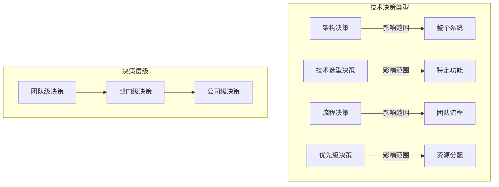
```mermaid
%%{init: {"graph": {"defaultLayout": "td", "rankdir": "TB"}, "subGraph": {"ranksep": 80}}}%%
graph TD
    subgraph 决策类型["技术决策类型"]
        D1[架构决策]
        D2[技术选型决策]
        D3[流程决策]
        D4[优先级决策]

        D1 -->|"影响范围"| A1["整个系统"]
        D2 -->|"影响范围"| A2["特定功能"]
        D3 -->|"影响范围"| A3["团队流程"]
        D4 -->|"影响范围"| A4["资源分配"]
    end

    subgraph 决策层级["决策层级"]
        L1[团队级决策] --> L2[部门级决策]
        L2 --> L3[公司级决策]
    end
```

### 4.2 决策框架：RAPID

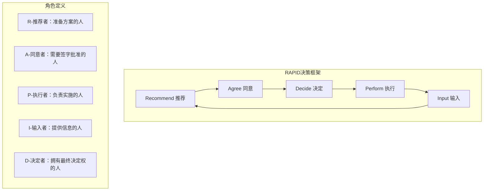
```mermaid
%%{init: {"graph": {"defaultLayout": "td", "rankdir": "TB"}, "subGraph": {"ranksep": 80}}}%%
graph TD
    subgraph RAPID框架["RAPID决策框架"]
        R[Recommend 推荐]
        A[Agree 同意]
        P[Perform 执行]
        I[Input 输入]
        D[Decide 决定]

        R --> A
        A --> D
        D --> P
        P --> I
        I --> R
    end

    subgraph 角色定义["角色定义"]
        Role1["R-推荐者：准备方案的人"]
        Role2["A-同意者：需要签字批准的人"]
        Role3["P-执行者：负责实施的人"]
        Role4["I-输入者：提供信息的人"]
        Role5["D-决定者：拥有最终决定权的人"]
    end
```

### 4.3 决策评估矩阵

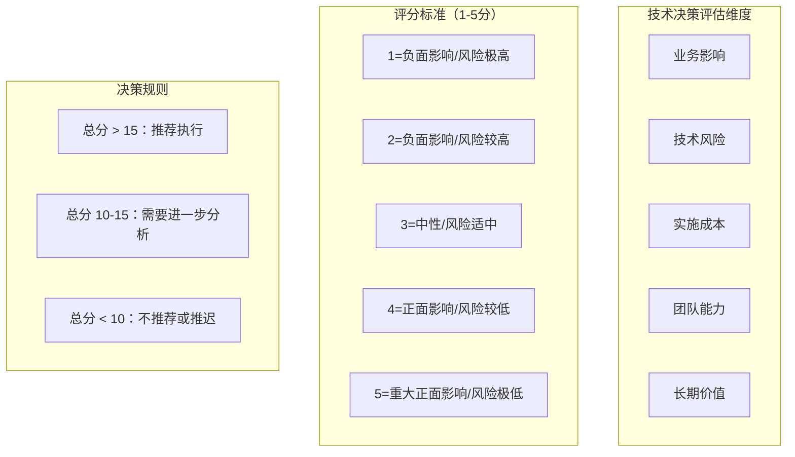
```mermaid
%%{init: {"graph": {"defaultLayout": "td", "rankdir": "TB"}, "subGraph": {"ranksep": 80}}}%%
graph TD
    subgraph 评估维度["技术决策评估维度"]
        E1[业务影响]
        E2[技术风险]
        E3[实施成本]
        E4[团队能力]
        E5[长期价值]
    end

    subgraph 评分标准["评分标准（1-5分）"]
        S1["1=负面影响/风险极高"]
        S2["2=负面影响/风险较高"]
        S3["3=中性/风险适中"]
        S4["4=正面影响/风险较低"]
        S5["5=重大正面影响/风险极低"]
    end

    subgraph 决策规则["决策规则"]
        R1["总分 > 15：推荐执行"]
        R2["总分 10-15：需要进一步分析"]
        R3["总分 < 10：不推荐或推迟"]
    end
```

### 4.4 处理分歧

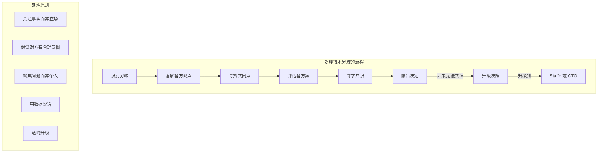
```mermaid
%%{init: {"graph": {"defaultLayout": "td", "rankdir": "TB"}, "subGraph": {"ranksep": 80}}}%%
graph TD
    subgraph 分歧处理["处理技术分歧的流程"]
        A[识别分歧] --> B[理解各方观点]
        B --> C[寻找共同点]
        C --> D[评估各方案]
        D --> E[寻求共识]
        E --> F[做出决定]

        F -->|"如果无法共识"| G[升级决策]
        G -->|"升级到"| G1["Staff+ 或 CTO"]
    end

    subgraph 分歧处理原则["处理原则"]
        P1["关注事实而非立场"]
        P2["假设对方有合理意图"]
        P3["聚焦问题而非个人"]
        P4["用数据说话"]
        P5["适时升级"]
    end
```

---

## 五、利益相关者协调

### 5.1 识别利益相关者

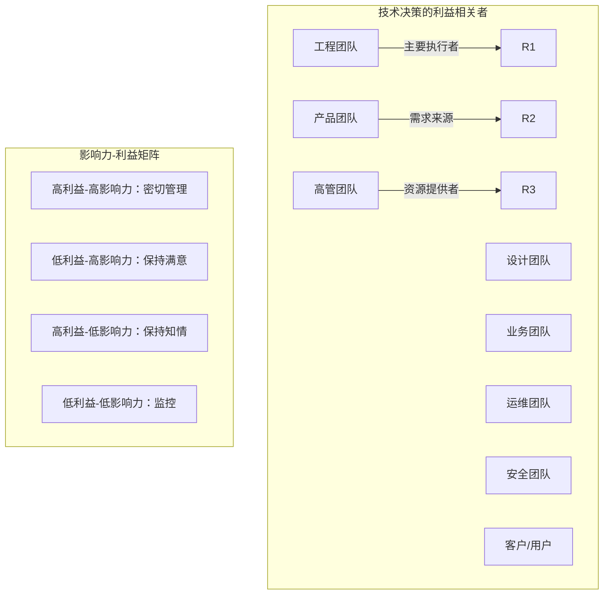
```mermaid
%%{init: {"graph": {"defaultLayout": "td", "rankdir": "TB"}, "subGraph": {"ranksep": 80}}}%%
graph TD
    subgraph 利益相关者["技术决策的利益相关者"]
        I1[工程团队]
        I2[产品团队]
        I3[设计团队]
        I4[业务团队]
        I5[高管团队]
        I6[运维团队]
        I7[安全团队]
        I8[客户/用户]

        I1 -->|"主要执行者"| R1
        I2 -->|"需求来源"| R2
        I5 -->|"资源提供者"| R3
    end

    subgraph 影响力-利益矩阵["影响力-利益矩阵"]
        M1[高利益-高影响力：密切管理]
        M2[低利益-高影响力：保持满意]
        M3[高利益-低影响力：保持知情]
        M4[低利益-低影响力：监控]
    end
```

### 5.2 沟通策略

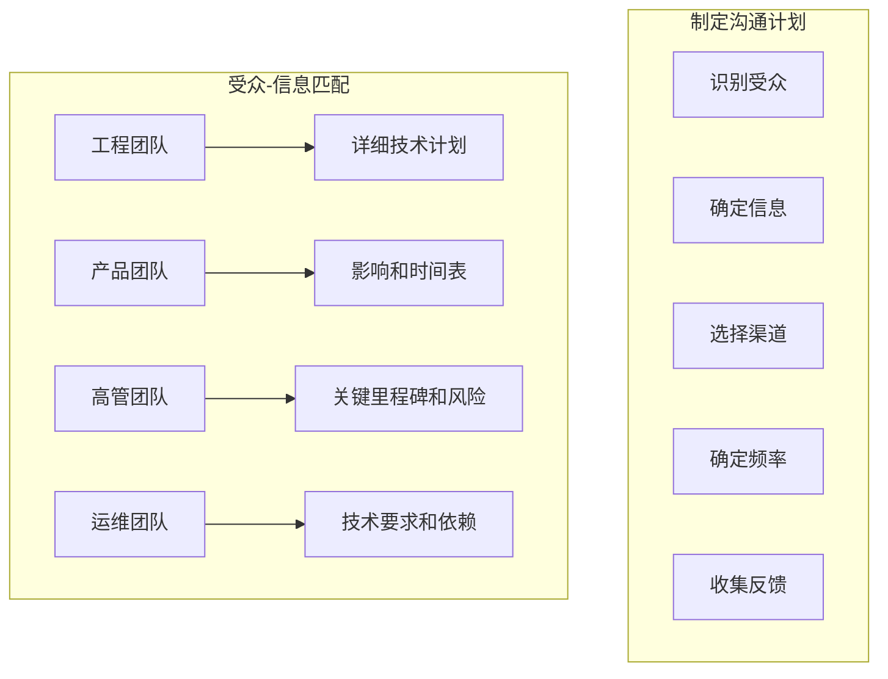
```mermaid
%%{init: {"graph": {"defaultLayout": "td", "rankdir": "TB"}, "subGraph": {"ranksep": 80}}}%%
graph TD
    subgraph 沟通计划["制定沟通计划"]
        C1[识别受众]
        C2[确定信息]
        C3[选择渠道]
        C4[确定频率]
        C5[收集反馈]
    end

    subgraph 受众-信息矩阵["受众-信息匹配"]
        受众1[工程团队] --> 信息1["详细技术计划"]
        受众2[产品团队] --> 信息2["影响和时间表"]
        受众3[高管团队] --> 信息3["关键里程碑和风险"]
        受众4[运维团队] --> 信息4["技术要求和依赖"]
    end
```

### 5.3 争取支持

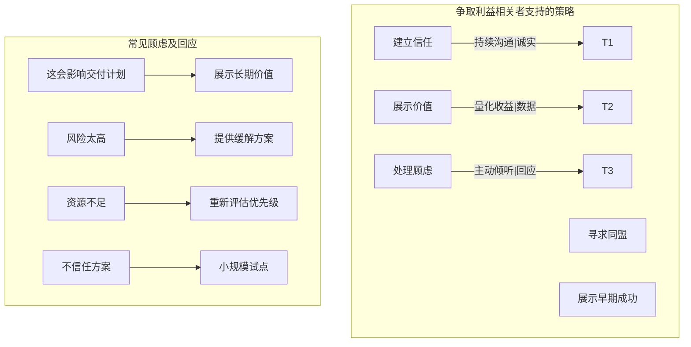
```mermaid
%%{init: {"graph": {"defaultLayout": "td", "rankdir": "TB"}, "subGraph": {"ranksep": 80}}}%%
graph TD
    subgraph 争取支持["争取利益相关者支持的策略"]
        S1[建立信任]
        S2[展示价值]
        S3[处理顾虑]
        S4[寻求同盟]
        S5[展示早期成功]

        S1 -->|"持续沟通|诚实"| T1
        S2 -->|"量化收益|数据"| T2
        S3 -->|"主动倾听|回应"| T3
    end

    subgraph 常见顾虑["常见顾虑及回应"]
        Concern1["这会影响交付计划"] --> Response1["展示长期价值"]
        Concern2["风险太高"] --> Response2["提供缓解方案"]
        Concern3["资源不足"] --> Response3["重新评估优先级"]
        Concern4["不信任方案"] --> Response4["小规模试点"]
    end
```

### 5.4 冲突解决

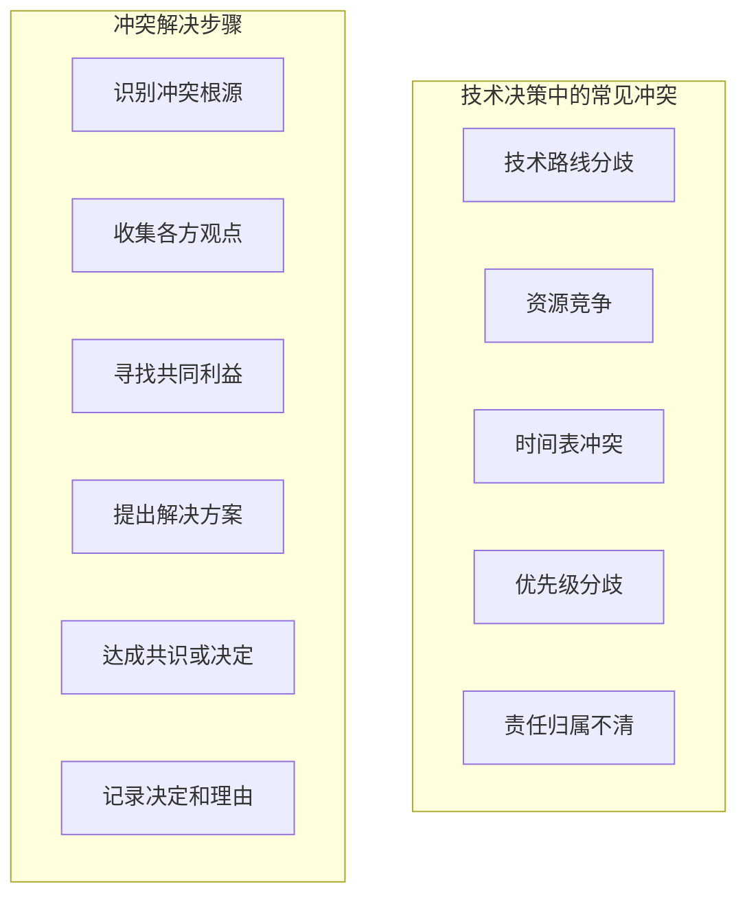
```mermaid
%%{init: {"graph": {"defaultLayout": "td", "rankdir": "TB"}, "subGraph": {"ranksep": 80}}}%%
graph TD
    subgraph 冲突来源["技术决策中的常见冲突"]
        C1["技术路线分歧"]
        C2["资源竞争"]
        C3["时间表冲突"]
        C4["优先级分歧"]
        C5["责任归属不清"]
    end

    subgraph 解决步骤["冲突解决步骤"]
        S1[识别冲突根源]
        S2[收集各方观点]
        S3[寻找共同利益]
        S4[提出解决方案]
        S5[达成共识或决定]
        S6[记录决定和理由]
    end
```

---

## 六、技术债务管理

### 6.1 技术债务的定义

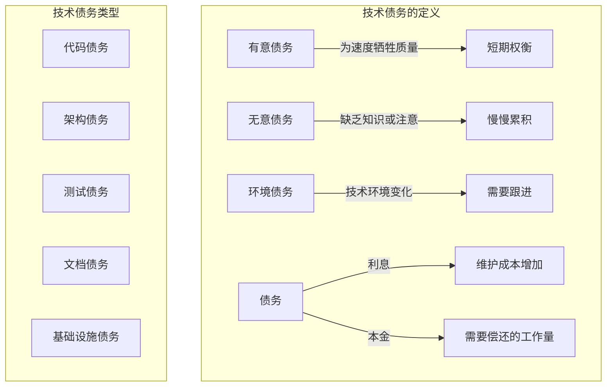
```mermaid
%%{init: {"graph": {"defaultLayout": "td", "rankdir": "TB"}, "subGraph": {"ranksep": 80}}}%%
graph TD
    subgraph 技术债务["技术债务的定义"]
        T1[有意债务] -->|"为速度牺牲质量"| S1["短期权衡"]
        T2[无意债务] -->|"缺乏知识或注意"| S2["慢慢累积"]
        T3[环境债务] -->|"技术环境变化"| S3["需要跟进"]

        债务 -->|"利息"| C["维护成本增加"]
        债务 -->|"本金"| D["需要偿还的工作量"]
    end

    subgraph 债务类型["技术债务类型"]
        D1[代码债务]
        D2[架构债务]
        D3[测试债务]
        D4[文档债务]
        D5[基础设施债务]
    end
```

### 6.2 技术债务评估

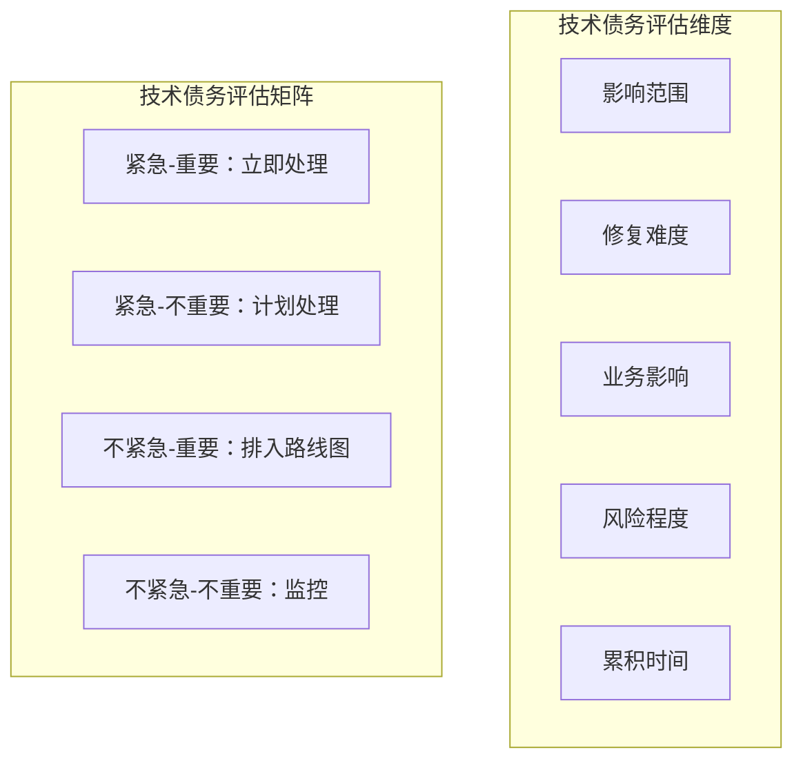
```mermaid
%%{init: {"graph": {"defaultLayout": "td", "rankdir": "TB"}, "subGraph": {"ranksep": 80}}}%%
graph TD
    subgraph 评估维度["技术债务评估维度"]
        E1[影响范围]
        E2[修复难度]
        E3[业务影响]
        E4[风险程度]
        E5[累积时间]
    end

    subgraph 评估矩阵["技术债务评估矩阵"]
        M1["紧急-重要：立即处理"]
        M2["紧急-不重要：计划处理"]
        M3["不紧急-重要：排入路线图"]
        M4["不紧急-不重要：监控"]
    end
```

### 6.3 技术债务管理策略

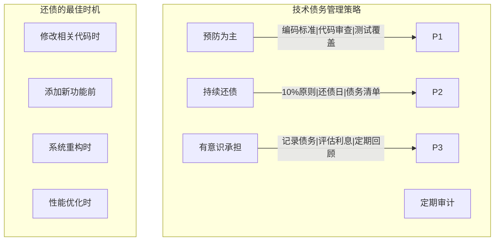
```mermaid
%%{init: {"graph": {"defaultLayout": "td", "rankdir": "TB"}, "subGraph": {"ranksep": 80}}}%%
graph TD
    subgraph 管理策略["技术债务管理策略"]
        S1[预防为主]
        S2[持续还债]
        S3[有意识承担]
        S4[定期审计]

        S1 -->|"编码标准|代码审查|测试覆盖"| P1
        S2 -->|"10%原则|还债日|债务清单"| P2
        S3 -->|"记录债务|评估利息|定期回顾"| P3
    end

    subgraph 还债时机["还债的最佳时机"]
        T1[修改相关代码时]
        T2[添加新功能前]
        T3[系统重构时]
        T4[性能优化时]
    end
```

### 6.4 向管理层推销技术债务清理

```mermaid
%%{init: {"graph": {"defaultLayout": "td", "rankdir": "TB"}, "subGraph": {"ranksep": 80}}}%%
graph TD
    subgraph 说服框架["向管理层推销技术债务清理的框架"]
        P1[量化影响]
        P2[关联业务价值]
        P3[提供选项]
        P4[展示风险]

        P1 -->|"代码复杂度增加 X%"|
        P2 -->|"影响新功能交付速度 Y%"|
        P3 -->|"方案A/B/C的成本对比"|
        P4 -->|"系统故障风险增加 Z%"|
    end

    subgraph 商业案例["技术债务清理商业案例模板"]
        B1[现状描述]
        B2[业务影响]
        B3[解决方案]
        B4[投资回报]
        B5[时间表]
    end
```

---

## 七、面试题整理

### 7.1 概念理解类 🌱

**Q1：技术愿景和技术路线图有什么区别？**

**答案：**

| 维度 | 技术愿景 | 技术路线图 |
|-----|---------|-----------|
| **定义** | 对技术未来的描述性愿景 | 实现愿景的具体计划 |
| **时间范围** | 1-3年 | 6-12个月 |
| **详细程度** | 高层次、战略性 | 具体、可执行 |
| **灵活性** | 相对稳定 | 可根据情况调整 |
| **关注点** | 我们要去哪里 | 我们如何到达那里 |

**关系：**
- 愿景是路线图的方向指引
- 路线图是愿景的具体化
- 两者需要保持一致

**Q2：如何平衡短期交付压力和长期技术投资？**

**答案：**

**平衡策略：**

```mermaid
%%{init: {"graph": {"defaultLayout": "td", "rankdir": "TB"}, "subGraph": {"ranksep": 80}}}%%
graph TD
    subgraph 平衡框架["平衡短期和长期的框架"]
        B1[明确时间窗口]
        B2[设定投资比例]
        B3[建立可视化指标]
        B4[定期回顾调整]

        B1 -->|"短期|3个月"| S1
        B1 -->|"长期|12个月"| L1

        B2 -->|"80-20原则"| R1["80%短期，20%长期"]

        B3 -->|"速度|质量|可维护性"| M1
    end

    subgraph 具体实践["具体实践"]
        P1[在每个迭代中预留10-20%技术债务还债时间]
        P2[建立技术债务可视化看板]
        P3[为长期项目设定专门的OKR]
        P4[定期与管理层对齐技术投资优先级]
    end
```

---

### 7.2 实践应用类 🌿

**Q3：如果团队成员对技术方向有分歧，你会怎么处理？**

**答案：**

**处理流程：**

```mermaid
%%{init: {"graph": {"defaultLayout": "td", "rankdir": "TB"}, "subGraph": {"ranksep": 80}}}%%
flowchart TD
    A[识别分歧] --> B[召开专门讨论会]
    B --> C[让各方充分表达观点]
    C --> D[聚焦事实和数据]
    D --> E[寻找共同目标]
    E --> F[评估各方案利弊]
    F --> G[寻求共识]
    G --> H{达成共识?}
    H -->|是| I[做出决定并记录]
    H -->|否| J[升级到更高决策者]

    I --> K[沟通决定和理由]
    J --> K
```

**关键原则：**
1. **关注事实** - 让数据说话，减少情绪化
2. **假设善意** - 每个人都有合理的考虑
3. **聚焦问题** - 回到原始问题，不要人身攻击
4. **适时升级** - 无法达成共识时及时升级

**Q4：如何向不技术背景的高管汇报技术路线图？**

**答案：**

**汇报策略：**

```mermaid
%%{init: {"graph": {"defaultLayout": "td", "rankdir": "TB"}, "subGraph": {"ranksep": 80}}}%%
graph TD
    subgraph 汇报结构["向高管汇报的结构"]
        H1[业务背景（1分钟）]
        H2[为什么需要这个投资（2分钟）]
        H3[主要目标和里程碑（3分钟）]
        H4[需要的资源和时间（2分钟）
        H5[风险和缓解措施（1分钟）]
        H6[决策需求（1分钟）]
    end

    subgraph 沟通技巧["沟通技巧"]
        T1[用业务语言而非技术术语]
        T2[量化价值和风险]
        T3[使用可视化图表]
        T4[提供明确的选项和推荐]
        T5[聚焦决策点而非细节]
    end
```

**示例：**
- ❌ "我们需要重构微服务架构"
- ✅ "我们需要更新系统架构，以支持明年的3倍用户增长，减少50%的运维成本"

---

### 7.3 场景分析类 🔧

**Q5：你发现一个重要的技术债务，但它会影响当前的交付计划，你会怎么处理？**

**答案：**

**处理方案：**

```mermaid
%%{init: {"graph": {"defaultLayout": "td", "rankdir": "TB"}, "subGraph": {"ranksep": 80}}}%%
graph TD
    subgraph 评估步骤["第一步：评估"]
        E1[技术债务的严重程度]
        E2[对当前项目的影响]
        E3[延迟偿还的成本]
        E4["团队能力（能否快速偿还）"]
    end

    subgraph 方案选项["第二步：分析选项"]
        O1[方案A：立即处理] -->|"优点"| A1["风险最低"]
        O1 -->|"缺点"| A2["延迟交付"]

        O2[方案B：记录并计划] -->|"优点"| B1["不延迟交付"]
        O2 -->|"缺点"| B2["后续成本增加"]

        O3[方案C：部分处理] -->|"优点"| C1["平衡"]
        O3 -->|"缺点"| C2["仍有残余风险"]
    end

    subgraph 决策建议["第三步：建议"]
        R1["如果风险高：建议方案A"]
        R2["如果风险可控：建议方案C"]
        R3["如果风险低：建议方案B"]
    end
```

**沟通要点：**
1. 清晰说明技术债务的影响
2. 提供选项和推荐
3. 强调长期成本
4. 寻求管理层的理解和资源支持

---

## 八、实践要点

### 8.1 制定技术愿景的清单

```mermaid
%%{init: {"graph": {"defaultLayout": "td", "rankdir": "TB"}, "subGraph": {"ranksep": 80}}}%%
graph TD
    subgraph 愿景制定清单["制定技术愿景的检查清单"]
        C1[业务理解] -->|"理解"| B1["公司的战略目标"]
        C1 -->|"理解"| B2["客户的需求和痛点"]

        C2[现状分析] -->|"评估"| S1["当前技术栈的优势"]
        C2 -->|"评估"| S2["当前技术栈的劣势"]

        C3[未来定义] -->|"设定"| F1["6-12个月后的目标状态"]
        C3 -->|"设定"| F2["成功衡量的标准"]

        C4[路径规划] -->|"识别"| P1["关键里程碑"]
        C4 -->|"识别"| P2["主要依赖和风险"]

        C5[沟通验证] -->|"获取"| V1["利益相关者反馈"]
        V1 -->|"迭代"| I1["持续改进愿景"]
    end
```

### 8.2 路线图沟通模板

```markdown
# 技术路线图沟通模板

## 背景（1段话）
[简要描述业务背景和为什么需要这个路线图]

## 战略目标（3-5项）
1. [目标1 - 与公司战略对齐]
2. [目标2 - 与公司战略对齐]
3. [目标3 - 与公司战略对齐]

## 关键项目（按优先级）
| 项目 | 目标 | 时间 | 资源 | 风险 |
|-----|-----|-----|-----|-----|
| 项目1 | ... | Q1 | 3人 | 低 |
| 项目2 | ... | Q2 | 5人 | 中 |

## 依赖关系
- [项目A] 依赖 [项目B]
- [项目C] 依赖 [外部团队]

## 成功指标
- 指标1：...
- 指标2：...

## 需要支持
- [资源需求]
- [决策需求]
```

### 8.3 常见问题与解决方案

| 问题 | 原因 | 解决方案 |
|-----|-----|---------|
| **愿景过于宏大** | 缺乏具体性 | 分解为可衡量的里程碑 |
| **路线图频繁变化** | 缺乏稳定性 | 建立变更管理流程 |
| **利益相关者不支持** | 沟通不足 | 早期介入，持续沟通 |
| **技术债务被忽视** | 短期压力 | 建立还债机制，争取支持 |
| **决策拖延** | 缺乏决策者 | 明确决策权限，适时升级 |

---

## 九、扩展阅读

### 9.1 推荐资源

| 资源 | 类型 | 说明 |
|-----|-----|-----|
| 《Strategic Thinking for Leaders》 | 书籍 | 战略思维 |
| 《The Art of Strategy》 | 书籍 | 博弈论与策略 |
| 《Influence: The Psychology of Persuasion》 | 书籍 | 影响力心理学 |
| RACI 矩阵 | 工具 | 决策角色分配 |

### 9.2 工具推荐

- **路线图工具**: Productboard, Aha!, Roadmunk
- **决策工具**: RAPID框架, DACI框架
- **可视化工具**: Mermaid, Lucidchart

### 9.3 实践项目

- 为你的团队制定年度技术愿景
- 组织一次技术路线图评审会议
- 建立技术债务追踪系统

---

## 十、本章小结

### 核心收获

1. **技术愿景是方向指引**
   - 清晰、可行、激励人心
   - 需要定期更新和沟通

2. **技术路线图是执行计划**
   - 连接战略与执行
   - 需要灵活调整

3. **决策需要框架**
   - RAPID等框架帮助明确角色
   - 评估矩阵帮助量化选择

4. **利益相关者管理至关重要**
   - 早期介入，持续沟通
   - 关注共同利益

5. **技术债务需要系统管理**
   - 预防为主，持续还债
   - 向管理层推销需要量化价值

### 关键概念地图

```mermaid
%%{init: {"graph": {"defaultLayout": "td", "rankdir": "TB"}, "subGraph": {"ranksep": 80}}}%%
mindmap
  root((设定方向))
    技术愿景
      制定步骤
      沟通策略
      验证迭代
    技术路线图
      规划框架
      OKR关联
      可视化
    决策框架
      RAPID
      评估矩阵
      分歧处理
    利益相关者
      识别
      沟通
      争取支持
    技术债务
      评估
      管理策略
      推销清理
```

### 下一章预告

第3章将探讨**做正确的事**，了解如何识别和选择正确的工作：
- 优先级框架
- 说"不"的艺术
- 委派与授权
- 保护高价值工作

---

## 附录 A：决策框架对比

| 框架 | 适用场景 | 优点 | 缺点 |
|-----|---------|-----|-----|
| RAPID | 复杂多方决策 | 角色清晰 | 流程较长 |
| DACI | 快速决策 | 决策者明确 | 需要强势决策者 |
| RASI | 责任分配 | 责任明确 | 不处理分歧 |
| 共识 | 需要团队buy-in | 参与度高 | 耗时 |

## 附录 B：技术债务评估模板

| 债务项 | 影响范围 | 修复难度 | 业务影响 | 优先级 | 计划日期 |
|-------|---------|---------|---------|-------|---------|
| ... | ... | ... | ... | ... | ... |

---

*文档生成时间：2024-01-08*
*基于《The Staff Engineer's Path》第2章*
