# 《The Staff Engineer's Path》- 第3章：做正确的事（深度版）

## 一、本章概述

本章深入探讨了Staff Engineer的核心职责之一：**选择正确的事情来做**。在资源有限、时间紧迫的情况下，如何识别和优先处理最重要的工作，是区分优秀技术领导者的关键能力。

> **本章核心问题**：如何从众多工作中识别最重要的事情？如何对不重要的事情说"不"？如何委派和授权以释放自己的时间？

### 1.1 核心主题
- 优先级框架与方法论
- 说"不"的艺术
- 委派与授权
- 保护高价值工作
- 精力管理

### 1.2 重要程度
⭐⭐⭐⭐⭐（极高）

### 1.3 预计学习时间
60-80分钟

### 1.4 本章与其他章节的关联

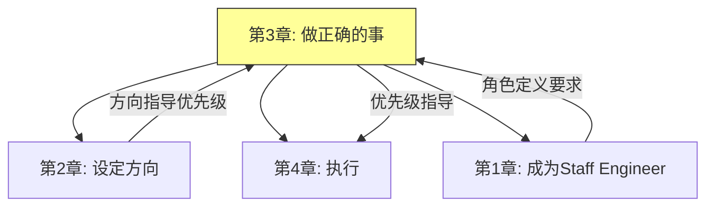

---

## 二、优先级框架

### 2.1 优先级的本质

**优先级**是在资源有限的情况下，决定先做什么后做什么的决策过程。

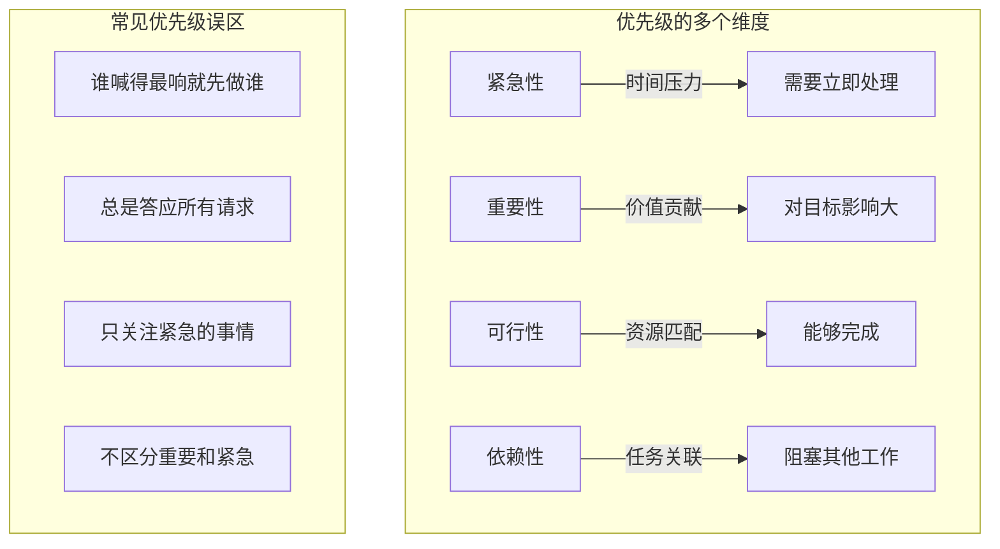

### 2.2 优先级评估框架

```mermaid
%%{init: {"graph": {"defaultLayout": "td", "rankdir": "TB"}, "subGraph": {"ranksep": 80}}}%%
graph TD
    subgraph 评估框架["优先级评估框架"]
        I1[影响评估]
        I2[成本评估]
        I3[风险评估]
        I4[时机评估]

        I1 -->|"影响力 × 覆盖面"| Score1
        I2 -->|"时间 × 资源成本"| Score2
        I3 -->|"失败概率 × 影响程度"| Score3
        I4 -->|"最佳时机窗口"| Score4
    end

    subgraph 综合评分["综合优先级评分"]
        S1 = (Impact + Cost Efficiency + Risk Mitigation + Timing) / 4
    end
```

### 2.3 艾森豪威尔矩阵

```mermaid
%%{init: {"graph": {"defaultLayout": "td", "rankdir": "TB"}, "subGraph": {"ranksep": 80}}}%%
graph TD
    subgraph 艾森豪威尔矩阵["艾森豪威尔矩阵"]
        Q1[紧急-重要] -->|"立即处理"| A1["亲自做，现在做"]
        Q2[不紧急-重要] -->|"计划处理"| A2["排入日程"]
        Q3[紧急-不重要] -->|"委托处理"| A3["委派给别人"]
        Q4[不紧急-不重要] -->|"消除处理"| A4["删除或推迟"]

        subgraph 象限说明["各象限说明"]
            Q1 -->|"危机、截止日期、重要项目"| Desc1
            Q2 -->|"规划、能力建设、关系建立"| Desc2
            Q3 -->|"某些会议、某些邮件"| Desc3
            Q4 -->["琐事、浪费时间的活动"]
        end
    end
```

### 2.4 RICE 评分法

```mermaid
%%{init: {"graph": {"defaultLayout": "td", "rankdir": "TB"}, "subGraph": {"ranksep": 80}}}%%
graph TD
    subgraph RICE公式["RICE评分公式"]
        RICE = (Reach × Impact × Confidence) / Effort
    end

    subgraph 各维度定义["各维度定义"]
        R["Reach - 影响人数"]
        I["Impact - 影响程度 (0.25-3)"]
        C["Confidence - 信心度 (50-100%)"]
        E["Effort - 所需工作量 (人月)"]
    end

    subgraph 评分示例["评分示例"]
        Example1["项目A: Reach=10000, Impact=3, Confidence=80%, Effort=2"]
        Example1 -->|"RICE=|" Calc1["(10000×3×0.8)/2 = 12000"]

        Example2["项目B: Reach=1000, Impact=2, Confidence=90%, Effort=0.5"]
        Example2 -->|"RICE=|" Calc2["(1000×2×0.9)/0.5 = 3600"]
    end
```

---

## 三、说"不"的艺术

### 3.1 为什么说"不"很重要

```mermaid
%%{init: {"graph": {"defaultLayout": "td", "rankdir": "TB"}, "subGraph": {"ranksep": 80}}}%%
graph TD
    subgraph 说不的原因["说"不"的重要性"]
        N1[保护高价值工作]
        N2[避免过度承诺]
        N3[减少压力和倦怠]
        N4[提高交付质量]
        N5[建立专业边界]

        N1 -->|"专注"| R1["深度工作"]
        N2 -->|"可实现"| R2["承诺可以兑现"]
    end

    subgraph 不说的后果["不说"不"的后果"]
        C1["工作过载"]
        C2["质量下降"]
        C3["倦怠风险]
        C4["信任丧失]
        C5["创新减少]
    end
```

### 3.2 说"不"的策略

```mermaid
%%{init: {"graph": {"defaultLayout": "td", "rankdir": "TB"}, "subGraph": {"ranksep": 80}}}%%
graph TD
    subgraph 说"不"的方法["说"不"的策略"]
        M1[延迟回答]
        M2[提供替代方案]
        M3[解释约束]
        M4[升级讨论]
        M5[直接但礼貌]

        M1 -->|"不要立即回答"| T1["让我考虑一下"]
        M2 -->|"不能满足但可以部分"| T2["我可以做X"]
        M3 -->|"资源约束"| T3["目前没有带宽"]
        M4 -->|"超出权限"| T4["需要与X讨论"]
        M5 -->|"清晰直接"| T5["这不是我优先考虑的事情"]
    end

    subgraph 说不模板["说不的模板"]
        Template1["感谢请求 + 解释原因 + 提供替代"]
        Template2["感谢请求 + 延迟回答 + 后续跟进"]
        Template3["感谢请求 + 升级决策 + 明确下一步"]
    end
```

### 3.3 不同场景的应对

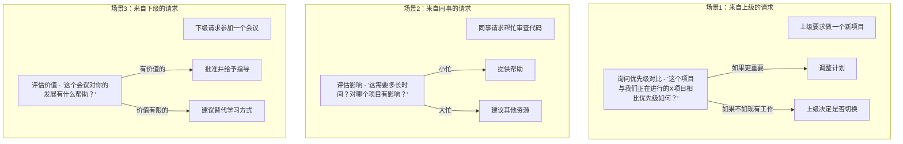

### 3.4 说"不"的具体话术

```markdown
## 说"不"的实用话术

### 场景1：无法满足的请求

"谢谢你的请求。目前我正在专注于[当前项目]，需要确保按时交付。如果我现在接手这个项目，可能会影响[当前项目]的进度。

不过，我可以推荐[替代方案/替代人员]。"

### 场景2：需要推迟的请求

"感谢你想到我。目前我正在处理[项目X]，预计需要[时间]才能完成。我们可以在[时间]之后讨论这个吗？

如果你需要更快的响应，我可以建议[替代资源]。"

### 场景3：资源不足

"这个项目听起来很有价值，但根据我目前的[带宽/资源]，我无法保证能够投入足够的时间来做好它。

为了确保项目成功，建议[调整范围/寻找其他资源/推迟到下个季度]。"

### 场景4：优先级不匹配

"我理解这个项目的重要性。不过，根据我们团队当前的OKR，我们正在专注于[当前优先级]。这个项目可能需要与[相关方]讨论，看是否要调整优先级。"
```

---

## 四、委派与授权

### 4.1 委派的重要性

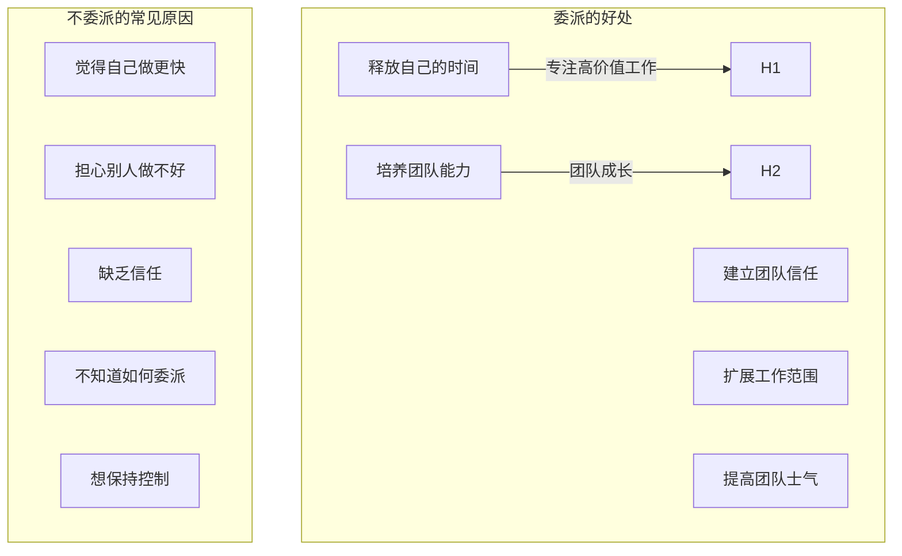

### 4.2 委派的层次

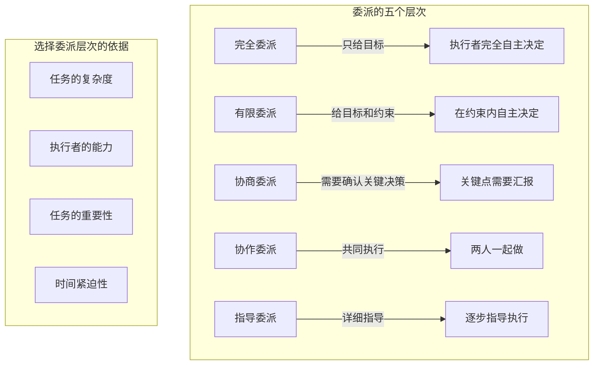

### 4.3 有效委派的流程

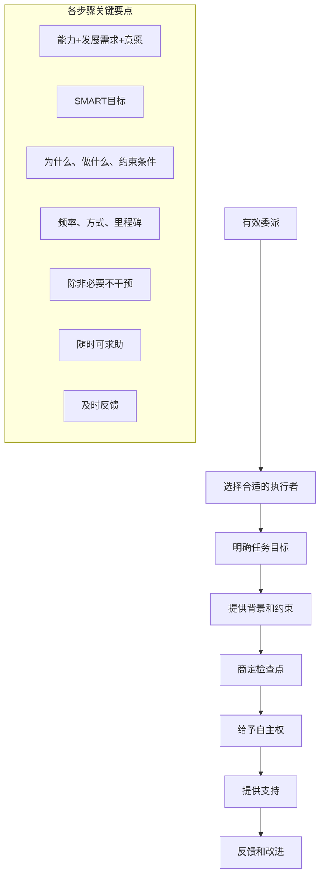

### 4.4 委派的注意事项

```mermaid
%%{init: {"graph": {"defaultLayout": "td", "rankdir": "TB"}, "subGraph": {"ranksep": 80}}}%%
graph TD
    subgraph 常见错误["委派的常见错误"]
        E1[委派任务但不委派权力]
        E2[委派后过度微观管理]
        E3[只委派"脏活累活"]
        E4[不提供必要的支持]
        E5[不给予信任和耐心]
    end

    subgraph 正确做法["正确做法"]
        R1["明确授权范围"]
        R2["设定检查点而非微观管理"]
        R3["委派有挑战性的任务"]
        R4["提供资源和指导"]
        R5["给学习和成长的空间"]
    end
```

---

## 五、保护高价值工作

### 5.1 高价值工作的识别

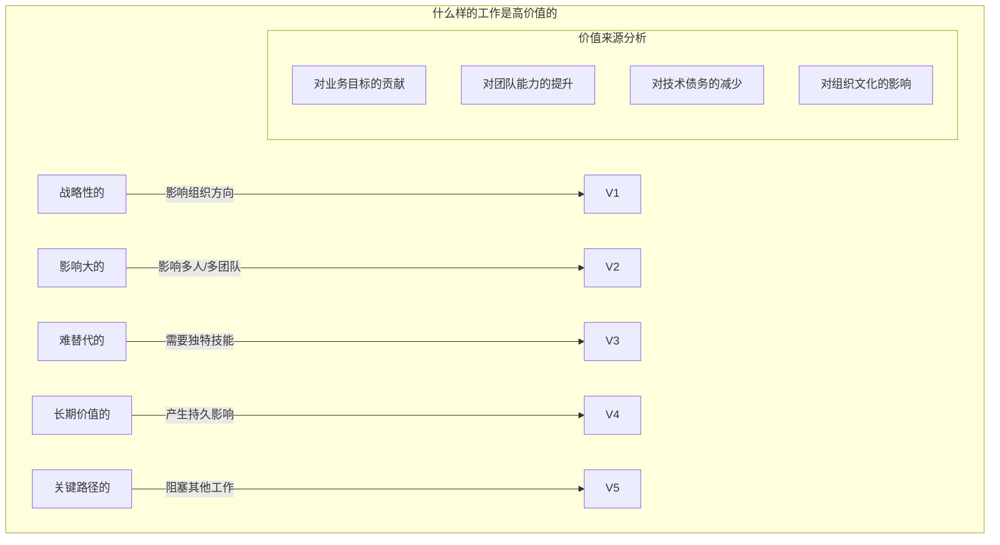

### 5.2 保护专注时间

```mermaid
%%{init: {"graph": {"defaultLayout": "td", "rankdir": "TB"}, "subGraph": {"ranksep": 80}}}%%
graph TD
    subgraph 时间分类["时间分类"]
        T1[深度工作时间] -->|"需要保护"| P1["高价值工作"]
        T2[会议时间] -->|"需要控制"| P2["协作和沟通"]
        T3[响应时间] -->|"需要限制"| P3["日常响应"]
        T4[学习时间] -->|"需要投资"| P4["能力提升"]
    end

    subgraph 保护策略["保护专注时间的策略"]
        S1["设定"不可打扰"时间段"]
        S2["指定响应时间窗口"]
        S3["批处理邮件和消息"]
        S4["减少不必要的会议"]
        S5["学会延迟响应"]
    end
```

### 5.3 能量管理

```mermaid
%%{init: {"graph": {"defaultLayout": "td", "rankdir": "TB"}, "subGraph": {"ranksep": 80}}}%%
graph TD
    subgraph 能量来源["能量的四个维度"]
        E1[身体能量] -->|"睡眠、运动、饮食"| P1
        E2[情绪能量] -->|"关系、情绪管理]| P2
        E3[智力能量] -->|"专注、学习、挑战]| P3
        E4[精神能量] -->|"意义、目的、价值观]| P4

        subgraph 工作匹配["能量与工作匹配"]
            M1["高能量时做深度工作"]
            M2["中等能量时做协作工作"]
            M3["低能量时做日常任务"]
        end
    end

    subgraph 能量恢复["能量恢复策略"]
        R1["番茄工作法"]
        R2["短暂休息"]
        R3["切换任务类型"]
        R4["自然环境"]
    end
```

### 5.4 建立支持系统

```mermaid
%%{init: {"graph": {"defaultLayout": "td", "rankdir": "TB"}, "subGraph": {"ranksep": 80}}}%%
graph TD
    subgraph 支持系统["建立个人支持系统"]
        S1[导师网络] -->|"职业指导"| T1
        S2[同行群体] -->|"经验分享]| T2
        S3[直接下属] -->|"分担工作]| T3
        S4[跨职能伙伴] -->|"协作支持]| T4

        subgraph 支持类型["支持类型"]
            Support1["情感支持"]
            Support2["智力支持"]
            Support3["实际支持"]
            Support4["反馈支持"]
        end
    end
```

---

## 六、面试题整理

### 6.1 概念理解类 🌱

**Q1：如何区分"紧急"和"重要"？**

**答案：**

| 维度 | 紧急 | 重要 |
|-----|-----|-----|
| **定义** | 需要立即关注 | 对目标有重大影响 |
| **时间压力** | 高 | 可能没有 |
| **来源** | 外部压力 | 内部判断 |
| **常见表现** | 危机、截止日期、他人请求 | 战略规划、能力建设、关系维护 |
| **容易混淆** | 容易因紧急而忽视重要 | 容易因重要不紧急而推迟 |

**实用框架：**
- **艾森豪威尔矩阵**：区分四个象限
- **RICE评分**：量化优先级
- **一个问题**：如果不现在做，最坏的结果是什么？

**Q2：作为Staff Engineer，如何处理来自多方的冲突请求？**

**答案：**

**处理策略：**

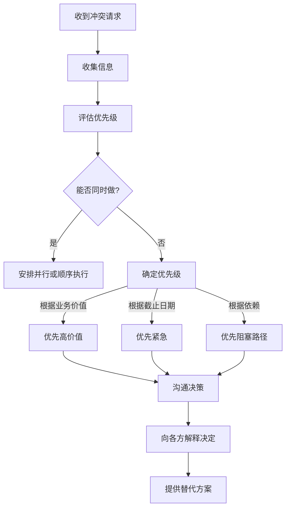

---

### 6.2 实践应用类 🌿

**Q3：如何对上级说"不"？**

**答案：**

**对上级说"不"的策略：**

| 策略 | 说明 | 示例 |
|-----|-----|-----|
| **提供数据** | 用数据支持你的立场 | "数据显示X项目需要Y时间" |
| **询问优先级** | 让上级做优先级决策 | "这个与当前项目A相比优先级如何？" |
| **提供替代** | 建议其他方案 | "我可以做X，但需要推迟Y" |
| **透明沟通** | 坦诚说明约束 | "我的带宽已经满了" |
| **升级讨论** | 如果必要，升级决策 | "这需要与CTO讨论优先级" |

**关键原则：**
1. **尊重** - 保持专业和尊重
2. **数据驱动** - 用事实说话
3. **解决方案导向** - 不仅仅说"不"，还要提供方案
4. **及时** - 不要等到最后一刻才说

**Q4：如何委派工作才能既培养团队又不影响进度？**

**答案：**

**委派策略：**

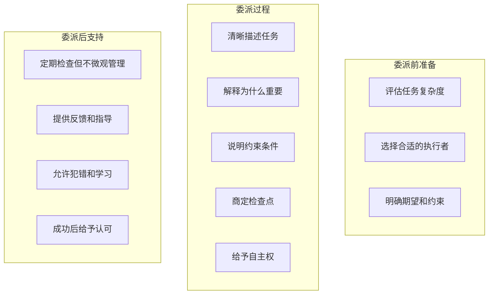

**选择委派对象的考虑因素：**
1. 当前工作负载
2. 能力匹配度
3. 发展需求
4. 意愿和态度

---

### 6.3 场景分析类 🔧

**Q5：你发现自己承担了太多工作，已经影响到核心项目的进度，你会怎么处理？**

**答案：**

**处理步骤：**

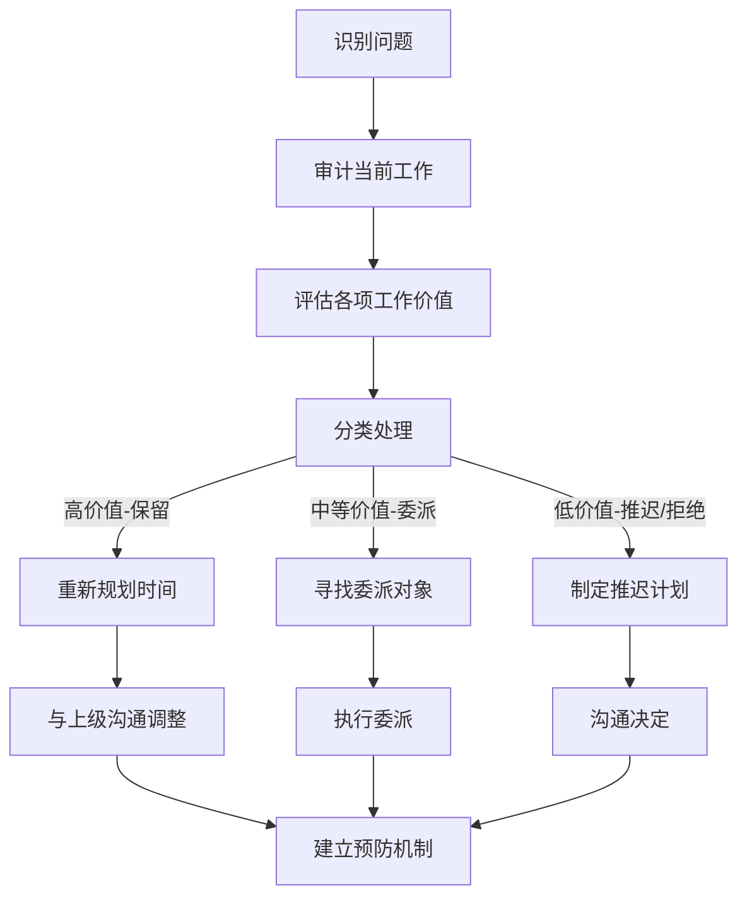

**具体行动：**
1. **审计工作**：列出所有工作，评估实际投入时间
2. **重新评估优先级**：哪些是真正重要的？
3. **沟通调整**：与上级坦诚讨论，重新对齐优先级
4. **学会拒绝**：对低价值工作说"不"或"稍后"
5. **委派**：将可以委派的工作委派出去
6. **建立边界**：设置新的期望和规则

---

## 七、实践要点

### 7.1 每日优先级实践

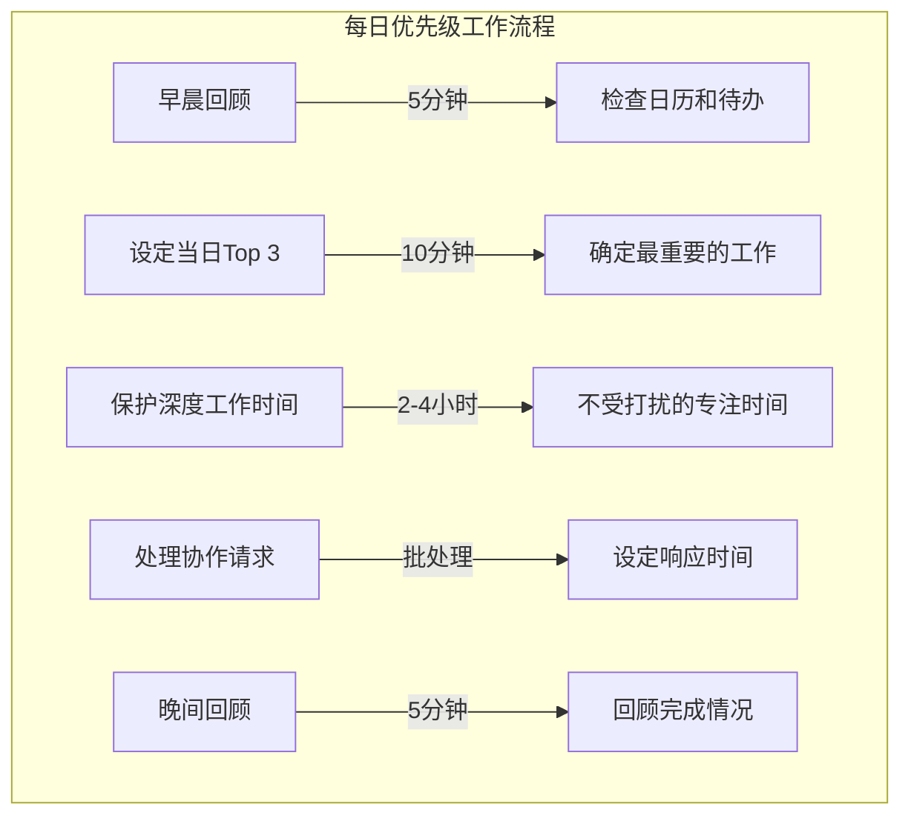

### 7.2 周度回顾实践

```mermaid
%%{init: {"graph": {"defaultLayout": "td", "rankdir": "TB"}, "subGraph": {"ranksep": 80}}}%%
graph TD
    subgraph 周度回顾["每周优先级回顾"]
        W1[回顾上周完成情况]
        W2[评估工作价值]
        W3[识别问题模式]
        W4[调整下周计划]
        W5[与利益相关者同步]

        W1 -->|"完成率|质量|影响"| Q1
        W2 -->|"哪些最有价值"| Q2
        W3 -->|"哪些可以不做"| Q3
        W4 -->|"设定下周目标"| Q4
    end
```

### 7.3 常见问题与解决方案

| 问题 | 原因 | 解决方案 |
|-----|-----|---------|
| **总是说"是"** | 不想让人失望 | 练习说"不"的话术 |
| **不知道委派什么** | 不清楚自己的能力边界 | 审计时间使用 |
| **深度工作时间被挤压** | 会议太多 | 保护专注时间块 |
| **优先级频繁变化** | 缺乏稳定的优先级框架 | 建立优先级决策流程 |
| **过度疲劳** | 工作量超过承受 | 重新评估和调整 |

### 7.4 优先级决策清单

```markdown
# 优先级决策清单

## 收到新请求时

1. 这个请求的紧急程度如何？
   - 必须在今天/本周完成吗？
   - 不做的后果是什么？

2. 这个请求的重要程度如何？
   - 对业务目标的贡献是什么？
   - 影响范围有多大？

3. 我的带宽是否允许？
   - 当前工作负荷
   - 质量保证

4. 最佳处理方式是什么？
   - [ ] 亲自立即做
   - [ ] 委派给他人
   - [ ] 推迟到以后
   - [ ] 拒绝

5. 如何沟通决定？
   - 向谁解释
   - 何时解释
   - 如何措辞
```

---

## 八、扩展阅读

### 8.1 推荐资源

| 资源 | 类型 | 说明 |
|-----|-----|-----|
| 《Essentialism》 | 书籍 | 专注的艺术 |
| 《Deep Work》 | 书籍 | 深度工作 |
| 《The Power of a Positive No》 | 书籍 | 积极说"不" |
| 《Getting Things Done》 | 书籍 | 工作管理方法 |

### 8.2 工具推荐

- **任务管理**: Todoist, Things, Notion
- **时间追踪**: RescueTime, Toggl
- **专注工具**: Freedom, Cold Turkey

### 8.3 实践项目

- 进行一周时间审计，了解时间实际使用情况
- 建立自己的优先级决策框架
- 练习对低优先级请求说"不"

---

## 九、本章小结

### 核心收获

1. **优先级是核心竞争力**
   - 区分紧急和重要
   - 使用框架（RICE、艾森豪威尔）量化评估

2. **说"不"是必要技能**
   - 保护高价值工作
   - 提供替代方案
   - 保持专业和尊重

3. **委派是扩展影响力的关键**
   - 选择合适的执行者
   - 给予自主权和支持
   - 培养团队能力

4. **保护高价值工作需要策略**
   - 设定专注时间
   - 管理能量
   - 建立支持系统

### 关键概念地图

```mermaid
%%{init: {"graph": {"defaultLayout": "td", "rankdir": "TB"}, "subGraph": {"ranksep": 80}}}%%
mindmap
  root((做正确的事))
    优先级框架
      艾森豪威尔矩阵
      RICE评分
      价值评估
    说"不"的艺术
      策略和方法
      话术模板
      场景应对
    委派授权
      委派层次
      委派流程
      常见错误
    保护高价值工作
      识别高价值
      专注时间
      能量管理
```

### 下一章预告

第4章将探讨**执行**，了解如何将技术和项目落地执行：
- 项目规划与跟踪
- 风险管理
- 跨团队协调
- 交付与复盘

---

## 附录 A：RICE评分模板

| 项目 | Reach | Impact | Confidence | Effort | RICE分数 | 优先级 |
|-----|-------|--------|------------|--------|---------|-------|
| ... | ... | ... | ... | ... | ... | ... |

## 附录 B：艾森豪威尔矩阵应用表

| 象限 | 任务示例 | 处理方式 | 时间分配建议 |
|-----|---------|---------|-------------|
| Q1-紧急重要 | 危机处理、截止日期 | 立即处理 | 25-30% |
| Q2-不紧急重要 | 规划、能力建设 | 计划处理 | 40-50% |
| Q3-紧急不重要 | 某些会议、邮件 | 委派处理 | 15-20% |
| Q4-不紧急不重要 | 琐事、浪费时间的活动 | 消除 | <5% |

---

*文档生成时间：2024-01-08*
*基于《The Staff Engineer's Path》第3章*
