# 《The Staff Engineer's Path》- 第4章：执行（深度版）

## 一、本章概述

本章深入探讨了**执行**的艺术——如何将技术决策转化为实际的成果。作为Staff Engineer，不仅需要设定正确的方向，还需要确保工作能够有效落地执行。

> **本章核心问题**：如何有效地规划和执行复杂的技术项目？如何管理项目风险并应对意外情况？如何在跨团队环境中协调执行？

### 1.1 核心主题
- 项目规划与分解
- 执行跟踪与调整
- 风险管理
- 跨团队协调
- 交付与复盘

### 1.2 重要程度
⭐⭐⭐⭐⭐（极高）

### 1.3 预计学习时间
60-80分钟

### 1.4 本章与其他章节的关联

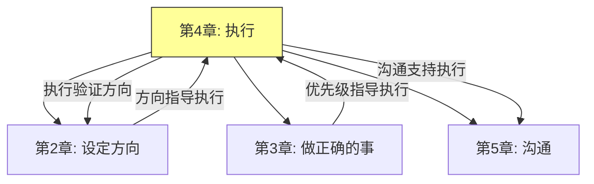
```mermaid
%%{init: {"graph": {"defaultLayout": "td", "rankdir": "TB"}, "subGraph": {"ranksep": 80}}}%%
graph TD
    A[第4章: 执行] --> B[第2章: 设定方向]
    A --> C[第3章: 做正确的事]
    A --> D[第5章: 沟通]

    B -->|"方向指导执行"| A
    C -->|"优先级指导执行"| A
    A -->|"执行验证方向"| B
    A -->|"沟通支持执行"| D

    style A fill:#ff9,stroke:#333
```

---

## 二、项目规划与分解

### 2.1 大型技术项目的特点

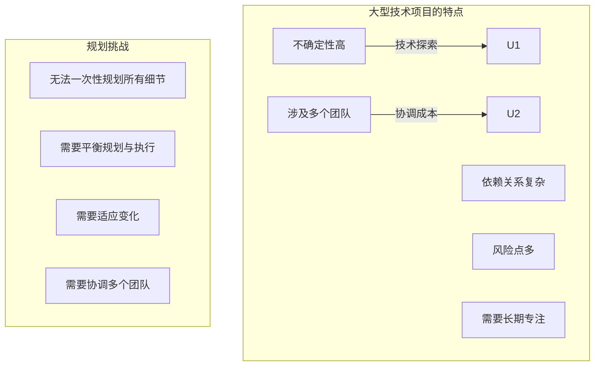
```mermaid
%%{init: {"graph": {"defaultLayout": "td", "rankdir": "TB"}, "subGraph": {"ranksep": 80}}}%%
graph TD
    subgraph 大型项目特点["大型技术项目的特点"]
        C1[不确定性高]
        C2[涉及多个团队]
        C3[依赖关系复杂]
        C4[风险点多]
        C5[需要长期专注]

        C1 -->|"技术探索"| U1
        C2 -->|"协调成本"| U2
    end

    subgraph 规划挑战["规划挑战"]
        P1[无法一次性规划所有细节]
        P2[需要平衡规划与执行]
        P3[需要适应变化]
        P4[需要协调多个团队]
    end
```

### 2.2 工作分解结构（WBS）

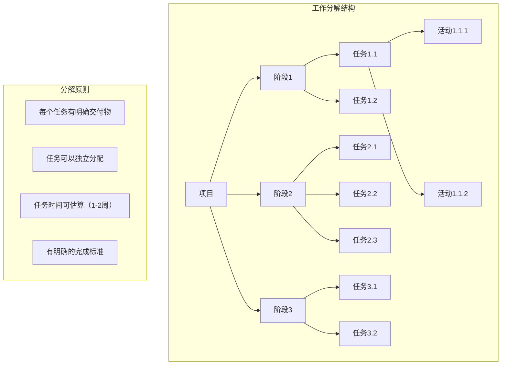
```mermaid
%%{init: {"graph": {"defaultLayout": "td", "rankdir": "TB"}, "subGraph": {"ranksep": 80}}}%%
graph TD
    subgraph WBS分解["工作分解结构"]
        P[项目] --> M1[阶段1]
        P --> M2[阶段2]
        P --> M3[阶段3]

        M1 --> T1[任务1.1]
        M1 --> T2[任务1.2]
        M2 --> T3[任务2.1]
        M2 --> T4[任务2.2]
        M2 --> T5[任务2.3]
        M3 --> T6[任务3.1]
        M3 --> T7[任务3.2]

        T1 --> A1[活动1.1.1]
        T1 --> A2[活动1.1.2]
    end

    subgraph 分解原则["分解原则"]
        Principle1["每个任务有明确交付物"]
        Principle2["任务可以独立分配"]
        Principle3["任务时间可估算（1-2周）"]
        Principle4["有明确的完成标准"]
    end
```

### 2.3 任务估算

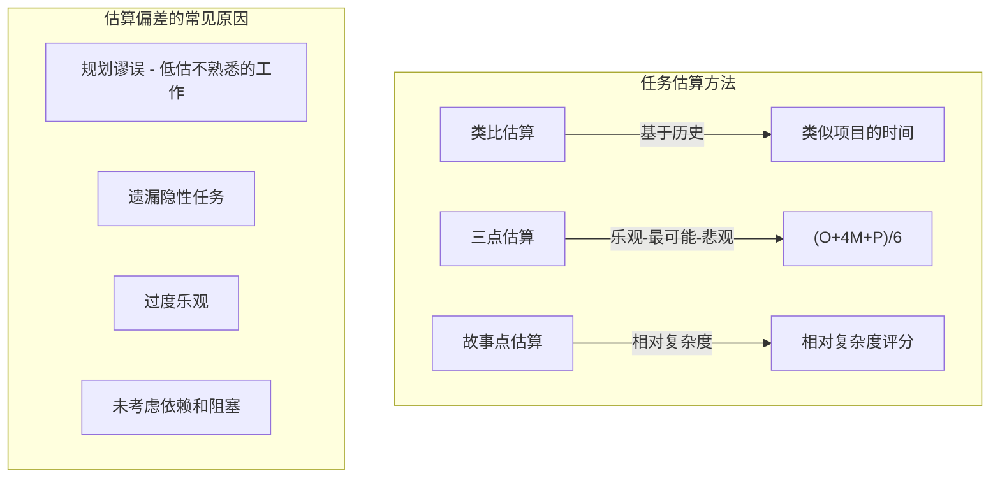
```mermaid
%%{init: {"graph": {"defaultLayout": "td", "rankdir": "TB"}, "subGraph": {"ranksep": 80}}}%%
graph TD
    subgraph 估算方法["任务估算方法"]
        M1[类比估算]
        M2[三点估算]
        M3[故事点估算]

        M1 -->|"基于历史"| H1["类似项目的时间"]
        M2 -->|"乐观-最可能-悲观"| T1["(O+4M+P)/6"]
        M3 -->|"相对复杂度"| S1["相对复杂度评分"]
    end

    subgraph 估算偏差["估算偏差的常见原因"]
        B1[规划谬误 - 低估不熟悉的工作]
        B2[遗漏隐性任务]
        B3[过度乐观]
        B4[未考虑依赖和阻塞]
    end
```

### 2.4 制定项目计划

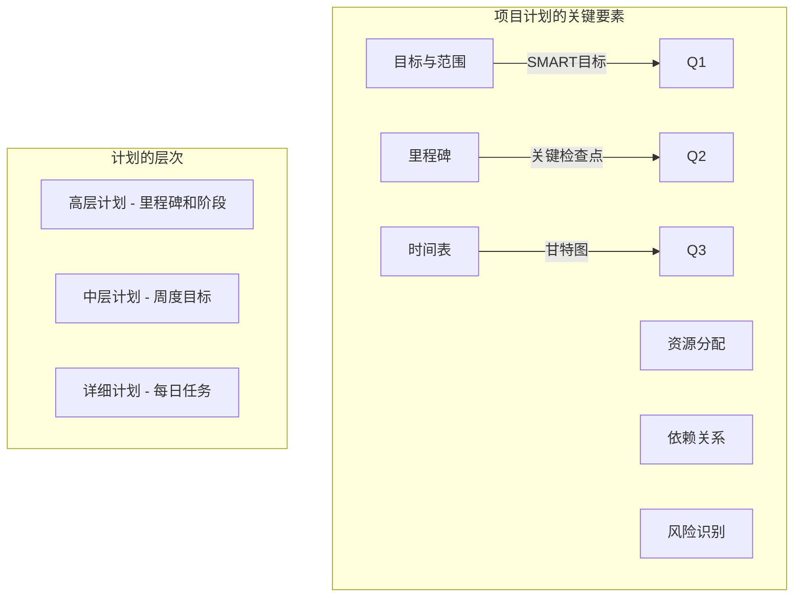
```mermaid
%%{init: {"graph": {"defaultLayout": "td", "rankdir": "TB"}, "subGraph": {"ranksep": 80}}}%%
graph TD
    subgraph 项目计划要素["项目计划的关键要素"]
        E1[目标与范围]
        E2[里程碑]
        E3[时间表]
        E4[资源分配]
        E5[依赖关系]
        E6[风险识别]

        E1 -->|"SMART目标"| Q1
        E2 -->|"关键检查点"| Q2
        E3 -->|"甘特图"| Q3
    end

    subgraph 计划层次["计划的层次"]
        Level1[高层计划 - 里程碑和阶段]
        Level2[中层计划 - 周度目标]
        Level3[详细计划 - 每日任务]
    end
```

---

## 三、执行跟踪与调整

### 3.1 进度跟踪

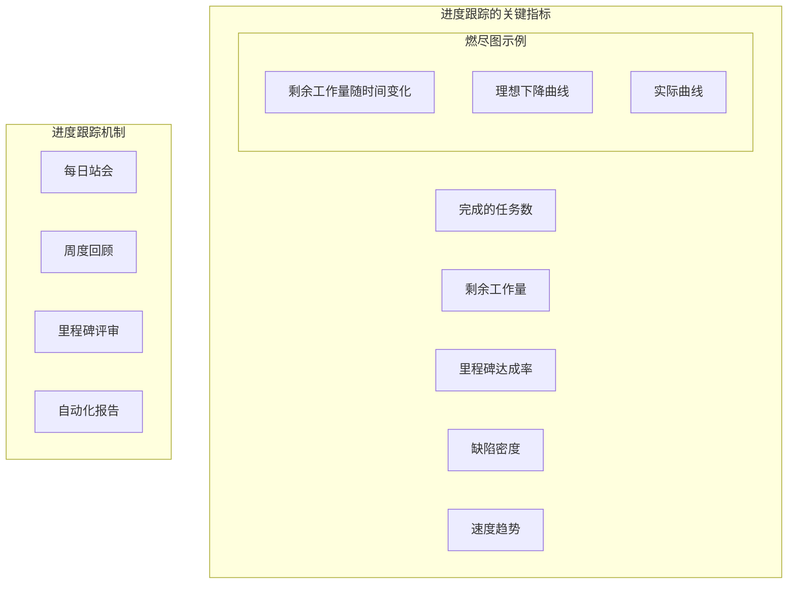
```mermaid
%%{init: {"graph": {"defaultLayout": "td", "rankdir": "TB"}, "subGraph": {"ranksep": 80}}}%%
graph TD
    subgraph 跟踪指标["进度跟踪的关键指标"]
        K1[完成的任务数]
        K2[剩余工作量]
        K3[里程碑达成率]
        K4[缺陷密度]
        K5[速度趋势]

        subgraph 燃尽图["燃尽图示例"]
            Burndown["剩余工作量随时间变化"]
            Ideal["理想下降曲线"]
            Actual["实际曲线"]
        end
    end

    subgraph 跟踪机制["进度跟踪机制"]
        M1[每日站会]
        M2[周度回顾]
        M3[里程碑评审]
        M4[自动化报告]
    end
```

### 3.2 偏差检测与调整

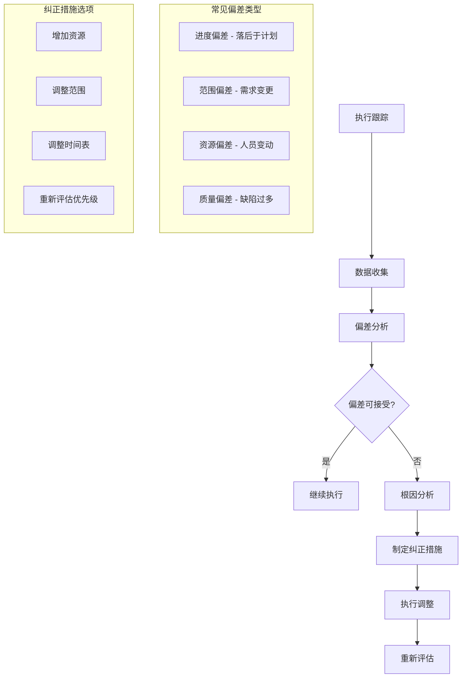
```mermaid
%%{init: {"graph": {"defaultLayout": "td", "rankdir": "TB"}, "subGraph": {"ranksep": 80}}}%%
flowchart TD
    A[执行跟踪] --> B[数据收集]
    B --> C[偏差分析]
    C --> D{偏差可接受?}
    D -->|是| E[继续执行]
    D -->|否| F[根因分析]
    F --> G[制定纠正措施]
    G --> H[执行调整]
    H --> I[重新评估]

    subgraph 常见偏差["常见偏差类型"]
        V1["进度偏差 - 落后于计划"]
        V2["范围偏差 - 需求变更"]
        V3["资源偏差 - 人员变动"]
        V4["质量偏差 - 缺陷过多"]
    end

    subgraph 纠正措施["纠正措施选项"]
        C1["增加资源"]
        C2["调整范围"]
        C3["调整时间表"]
        C4["重新评估优先级"]
    end
```

### 3.3 敏捷与迭代

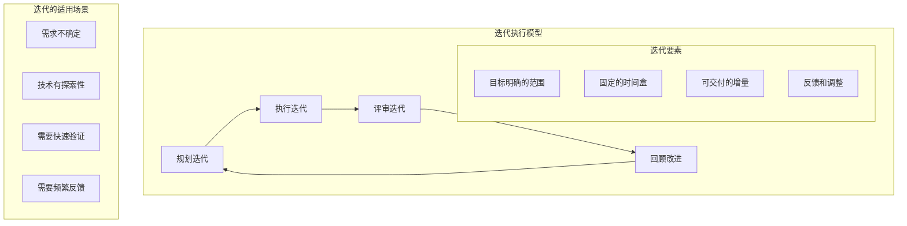
```mermaid
%%{init: {"graph": {"defaultLayout": "td", "rankdir": "TB"}, "subGraph": {"ranksep": 80}}}%%
graph TD
    subgraph 迭代执行["迭代执行模型"]
        I1[规划迭代] --> I2[执行迭代]
        I2 --> I3[评审迭代]
        I3 --> I4[回顾改进]
        I4 --> I1

        subgraph 迭代要素["迭代要素"]
            E1[目标明确的范围]
            E2[固定的时间盒]
            E3[可交付的增量]
            E4[反馈和调整]
        end
    end

    subgraph 适用场景["迭代的适用场景"]
        A1[需求不确定]
        A2[技术有探索性]
        A3[需要快速验证]
        A4[需要频繁反馈]
    end
```

### 3.4 自动化报告

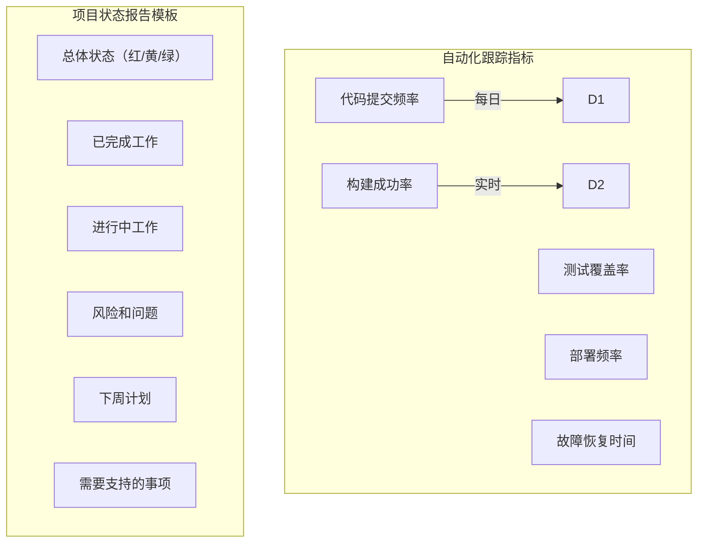
```mermaid
%%{init: {"graph": {"defaultLayout": "td", "rankdir": "TB"}, "subGraph": {"ranksep": 80}}}%%
graph TD
    subgraph 自动化指标["自动化跟踪指标"]
        A1[代码提交频率]
        A2[构建成功率]
        A3[测试覆盖率]
        A4[部署频率]
        A5[故障恢复时间]

        A1 -->|"每日"| D1
        A2 -->|"实时"| D2
    end

    subgraph 报告模板["项目状态报告模板"]
        R1[总体状态（红/黄/绿）]
        R2[已完成工作]
        R3[进行中工作]
        R4[风险和问题]
        R5[下周计划]
        R6[需要支持的事项]
    end
```

---

## 四、风险管理

### 4.1 风险识别

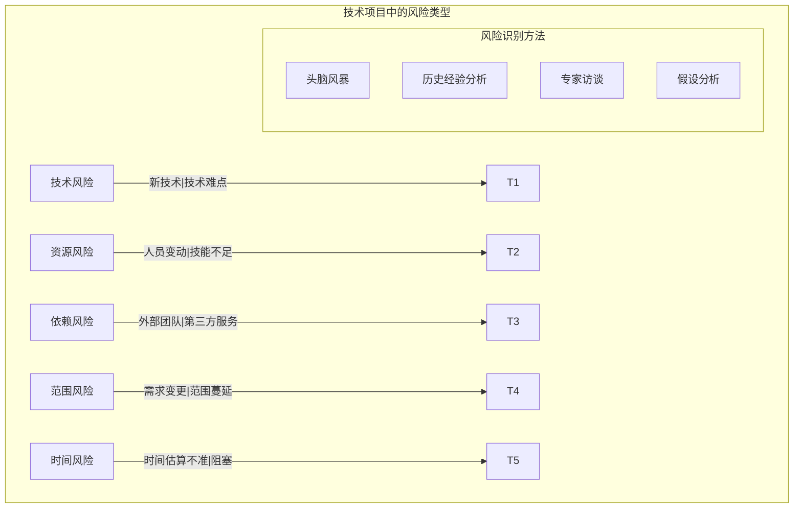
```mermaid
%%{init: {"graph": {"defaultLayout": "td", "rankdir": "TB"}, "subGraph": {"ranksep": 80}}}%%
graph TD
    subgraph 风险类型["技术项目中的风险类型"]
        R1[技术风险] -->|"新技术|技术难点"| T1
        R2[资源风险] -->|"人员变动|技能不足"| T2
        R3[依赖风险] -->|"外部团队|第三方服务"| T3
        R4[范围风险] -->|"需求变更|范围蔓延"| T4
        R5[时间风险] -->|"时间估算不准|阻塞"| T5

        subgraph 风险识别方法["风险识别方法"]
            M1[头脑风暴]
            M2[历史经验分析]
            M3[专家访谈]
            M4[假设分析]
        end
    end
```

### 4.2 风险评估

```mermaid
%%{init: {"graph": {"defaultLayout": "td", "rankdir": "TB"}, "subGraph": {"ranksep": 80}}}%%
graph TD
    subgraph 风险评估矩阵["风险评估矩阵"]
        Impact["影响程度"]
        Likelihood["发生概率"]

        HighImpact_HighLikelihood -->|"立即处理"| P1["高风险"]
        HighImpact_LowLikelihood -->|"计划缓解"| P2["中高风险"]
        LowImpact_HighLikelihood -->|"接受或监控"| P3["中低风险"]
        LowImpact_LowLikelihood -->|"接受"| P4["低风险"]
    end

    subgraph 评估维度["风险评估维度"]
        D1[发生概率 (1-5)]
        D2[影响程度 (1-5)]
        D3[可检测性 (1-5)]
        D4[紧迫性 (1-5)]

        RiskScore = Probability × Impact × (1/Ddetectability)
    end
```

### 4.3 风险应对策略

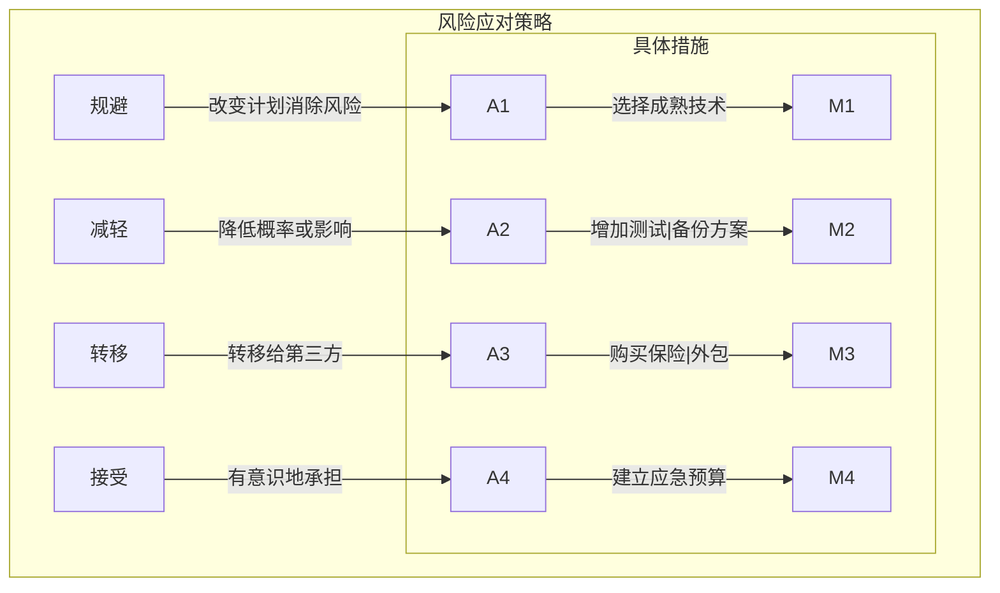
```mermaid
%%{init: {"graph": {"defaultLayout": "td", "rankdir": "TB"}, "subGraph": {"ranksep": 80}}}%%
graph TD
    subgraph 应对策略["风险应对策略"]
        S1[规避] -->|"改变计划消除风险"| A1
        S2[减轻] -->|"降低概率或影响"| A2
        S3[转移] -->|"转移给第三方"| A3
        S4[接受] -->|"有意识地承担"| A4

        subgraph 具体措施["具体措施"]
            A1 -->|"选择成熟技术"| M1
            A2 -->|"增加测试|备份方案"| M2
            A3 -->|"购买保险|外包"| M3
            A4 -->|"建立应急预算"| M4
        end
    end
```

### 4.4 风险监控

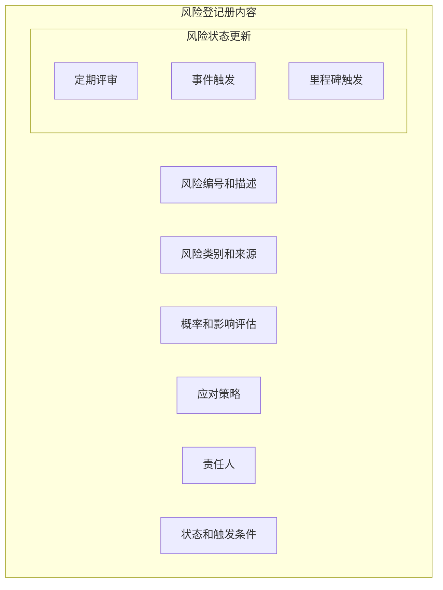
```mermaid
%%{init: {"graph": {"defaultLayout": "td", "rankdir": "TB"}, "subGraph": {"ranksep": 80}}}%%
graph TD
    subgraph 风险登记册["风险登记册内容"]
        R1[风险编号和描述]
        R2[风险类别和来源]
        R3[概率和影响评估]
        R4[应对策略]
        R5[责任人]
        R6[状态和触发条件]

        subgraph 更新机制["风险状态更新"]
            U1[定期评审]
            U2[事件触发]
            U3[里程碑触发]
        end
    end
```

---

## 五、跨团队协调

### 5.1 跨团队协作的挑战

```mermaid
%%{init: {"graph": {"defaultLayout": "td", "rankdir": "TB"}, "subGraph": {"ranksep": 80}}}%%
graph TD
    subgraph 协作挑战["跨团队协作的挑战"]
        C1[目标不一致]
        C2[优先级冲突]
        C3[沟通成本高]
        C4[依赖管理复杂]
        C5[责任边界不清]

        C1 -->|"每个团队有不同KPI"| P1
        C2 -->|"资源竞争"| P2
        C3 -->|"信息不对称]| P3
    end

    subgraph 协作模式["协作模式"]
        M1[瀑布式协调]
        M2[敏捷协调]
        M3[平台式协调]
        M4[嵌入式协调]
    end
```

### 5.2 协调机制

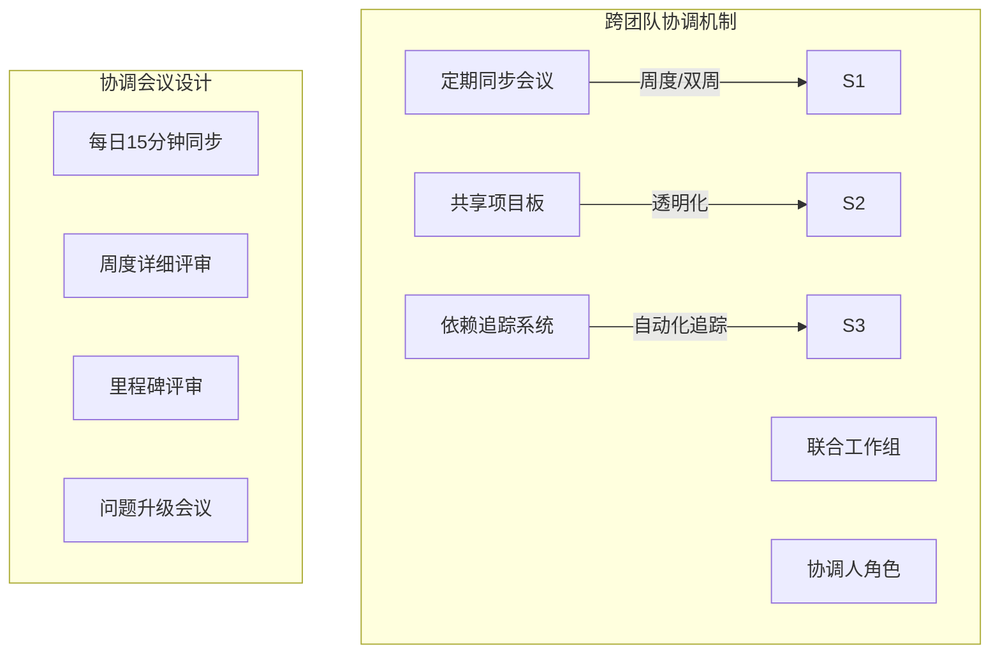
```mermaid
%%{init: {"graph": {"defaultLayout": "td", "rankdir": "TB"}, "subGraph": {"ranksep": 80}}}%%
graph TD
    subgraph 协调机制["跨团队协调机制"]
        M1[定期同步会议]
        M2[共享项目板]
        M3[依赖追踪系统]
        M4[联合工作组]
        M5[协调人角色]

        M1 -->|"周度/双周"| S1
        M2 -->|"透明化"| S2
        M3 -->|"自动化追踪"| S3
    end

    subgraph 会议设计["协调会议设计"]
        Meeting1["每日15分钟同步"]
        Meeting2["周度详细评审"]
        Meeting3["里程碑评审"]
        Meeting4["问题升级会议"]
    end
```

### 5.3 依赖管理

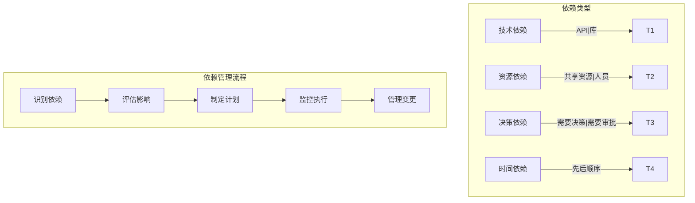
```mermaid
%%{init: {"graph": {"defaultLayout": "td", "rankdir": "TB"}, "subGraph": {"ranksep": 80}}}%%
graph TD
    subgraph 依赖类型["依赖类型"]
        D1[技术依赖] -->|"API|库"| T1
        D2[资源依赖] -->|"共享资源|人员"| T2
        D3[决策依赖] -->|"需要决策|需要审批"| T3
        D4[时间依赖] -->|"先后顺序"| T4
    end

    subgraph 依赖管理流程["依赖管理流程"]
        P1[识别依赖] --> P2[评估影响]
        P2 --> P3[制定计划]
        P3 --> P4[监控执行]
        P4 --> P5[管理变更]
    end
```

### 5.4 处理冲突

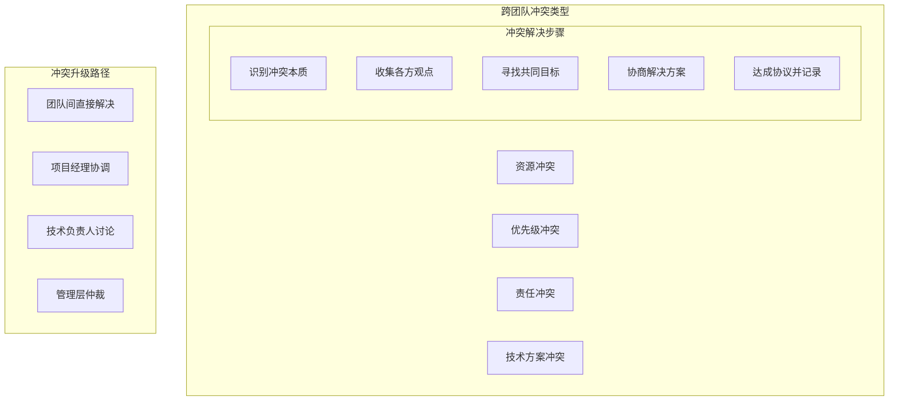
```mermaid
%%{init: {"graph": {"defaultLayout": "td", "rankdir": "TB"}, "subGraph": {"ranksep": 80}}}%%
graph TD
    subgraph 冲突类型["跨团队冲突类型"]
        C1[资源冲突]
        C2[优先级冲突]
        C3[责任冲突]
        C4[技术方案冲突]

        subgraph 解决步骤["冲突解决步骤"]
            S1[识别冲突本质]
            S2[收集各方观点]
            S3[寻找共同目标]
            S4[协商解决方案]
            S5[达成协议并记录]
        end
    end

    subgraph 升级路径["冲突升级路径"]
        L1[团队间直接解决]
        L2[项目经理协调]
        L3[技术负责人讨论]
        L4[管理层仲裁]
    end
```

---

## 六、交付与复盘

### 6.1 交付准备

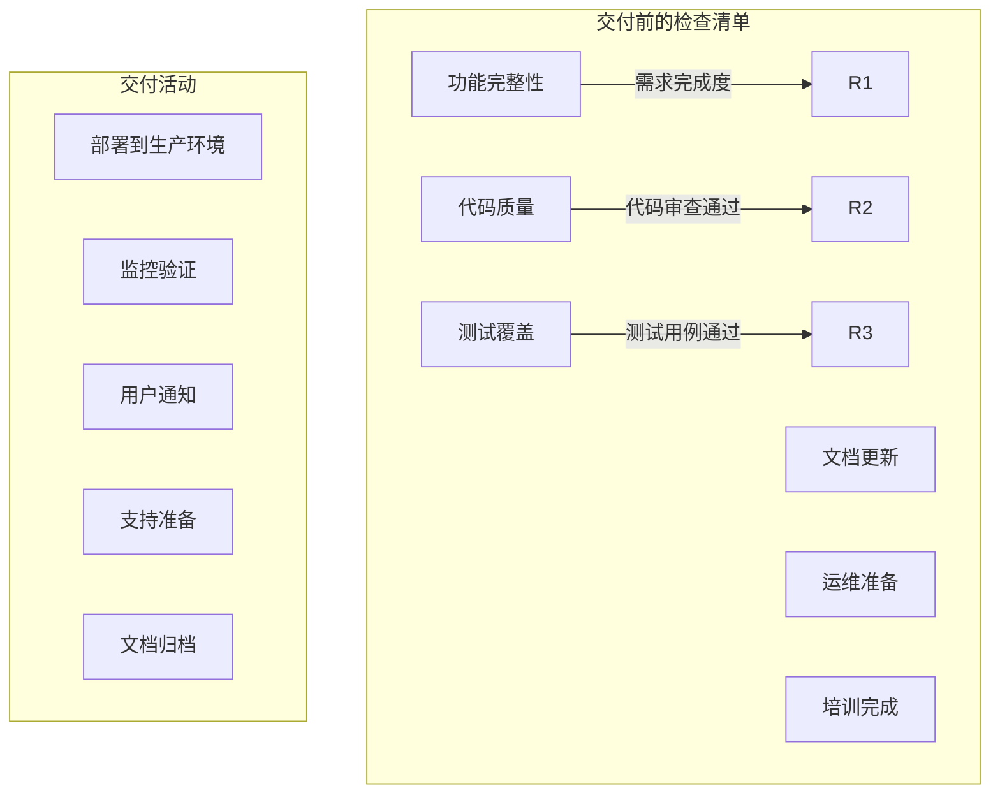
```mermaid
%%{init: {"graph": {"defaultLayout": "td", "rankdir": "TB"}, "subGraph": {"ranksep": 80}}}%%
graph TD
    subgraph 交付检查["交付前的检查清单"]
        C1[功能完整性]
        C2[代码质量]
        C3[测试覆盖]
        C4[文档更新]
        C5[运维准备]
        C6[培训完成]

        C1 -->|"需求完成度"| R1
        C2 -->|"代码审查通过"| R2
        C3 -->|"测试用例通过"| R3
    end

    subgraph 交付活动["交付活动"]
        D1[部署到生产环境]
        D2[监控验证]
        D3[用户通知]
        D4[支持准备]
        D5[文档归档]
    end
```

### 6.2 成功交付的标准

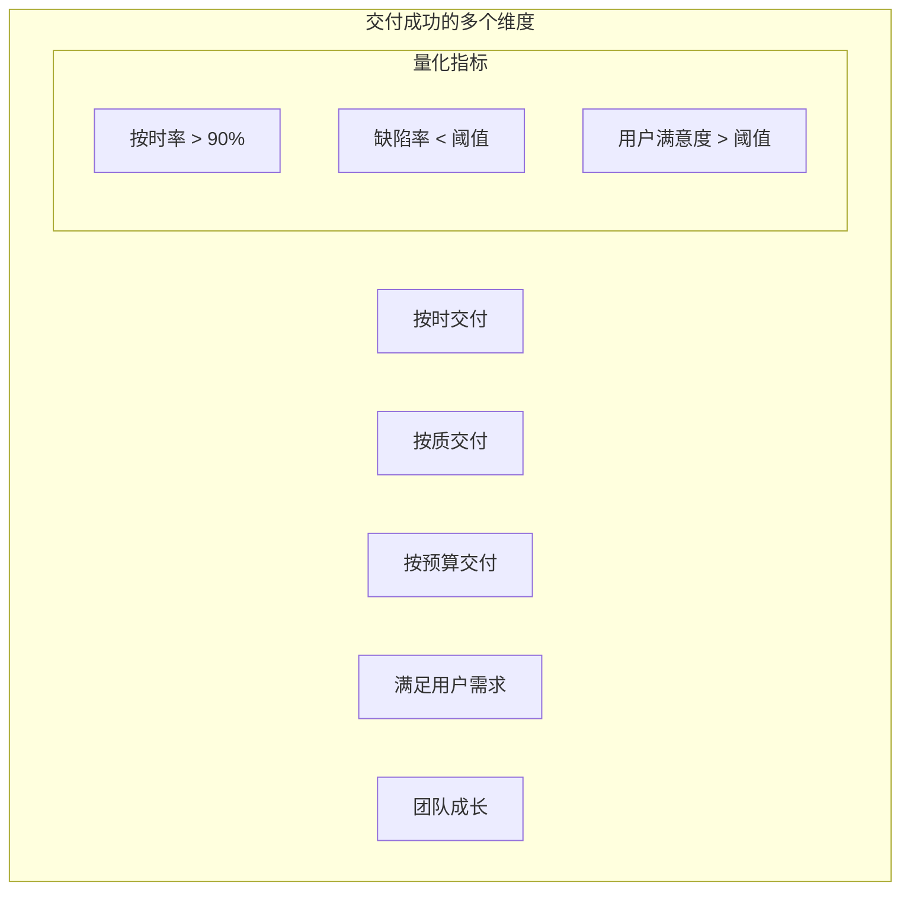
```mermaid
%%{init: {"graph": {"defaultLayout": "td", "rankdir": "TB"}, "subGraph": {"ranksep": 80}}}%%
graph TD
    subgraph 交付成功标准["交付成功的多个维度"]
        S1[按时交付]
        S2[按质交付]
        S3[按预算交付]
        S4[满足用户需求]
        S5[团队成长]

        subgraph 量化指标["量化指标"]
            Q1["按时率 > 90%"]
            Q2["缺陷率 < 阈值"]
            Q3["用户满意度 > 阈值"]
        end
    end
```

### 6.3 复盘框架

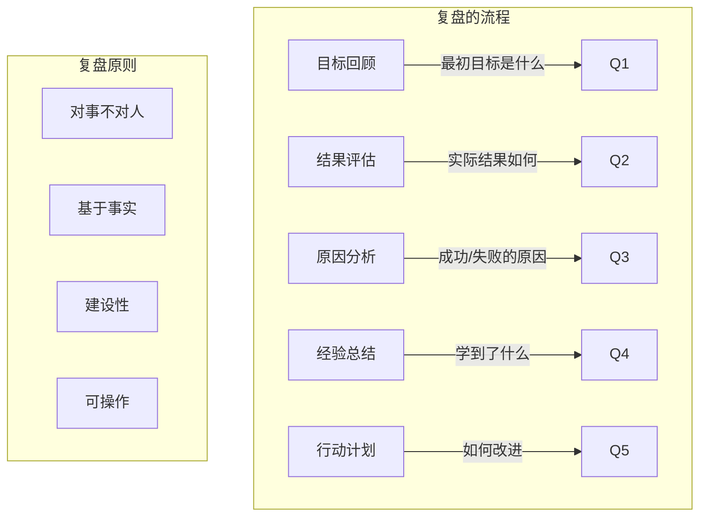
```mermaid
%%{init: {"graph": {"defaultLayout": "td", "rankdir": "TB"}, "subGraph": {"ranksep": 80}}}%%
graph TD
    subgraph 复盘流程["复盘的流程"]
        P1[目标回顾]
        P2[结果评估]
        P3[原因分析]
        P4[经验总结]
        P5[行动计划]

        P1 -->|"最初目标是什么"| Q1
        P2 -->|"实际结果如何"| Q2
        P3 -->|"成功/失败的原因"| Q3
        P4 -->|"学到了什么"| Q4
        P5 -->|"如何改进"| Q5
    end

    subgraph 复盘原则["复盘原则"]
        Principle1["对事不对人"]
        Principle2["基于事实"]
        Principle3["建设性"]
        Principle4["可操作"]
    end
```

### 6.4 持续改进

```mermaid
%%{init: {"graph": {"defaultLayout": "td", "rankdir": "TB"}, "subGraph": {"ranksep": 80}}}%%
graph TD
    subgraph 改进领域["从复盘中识别的改进领域"]
        I1[流程改进]
        I2[工具改进]
        I3[技能提升]
        I4[沟通改进]
        I5[协作改进]

        I1 -->|"流程效率提升"| R1
        I2 -->|"工具自动化"| R2
        I3 -->|"培训计划"| R3
    end

    subgraph 改进跟踪["改进措施跟踪"]
        T1[记录改进项]
        T2[分配责任人]
        T3[设定完成时间]
        T4[验证效果]
    end
```

---

## 七、面试题整理

### 7.1 概念理解类 🌱

**Q1：如何估算大型技术项目的时间和资源？**

**答案：**

**估算方法：**

```mermaid
%%{init: {"graph": {"defaultLayout": "td", "rankdir": "TB"}, "subGraph": {"ranksep": 80}}}%%
graph TD
    subgraph 估算方法["大型项目估算方法"]
        M1[自顶向下] -->|"基于历史数据"| T1["类似项目时间"]
        M2[自底向上] -->|"分解后累加"| T2["各任务估算之和"]
        M3[三点估算] -->|"考虑不确定性"| T3["(O+4M+P)/6"]

        M1 -->|"优点"| A1["快速"]
        M1 -->|"缺点"| A2["准确性低"]

        M2 -->|"优点"| A3["详细准确"]
        M2 -->|"缺点"| A4["耗时"]
    end

    subgraph 估算调整["估算调整"]
        C1["增加缓冲（20-30%）"]
        C2["考虑学习曲线"]
        C3["考虑依赖和阻塞"]
        C4["考虑不确定性"]
    end
```

**实用技巧：**
1. 参考类似项目的历史数据
2. 将大项目分解到可估算的粒度
3. 使用三点估算考虑不确定性
4. 增加适当的缓冲
5. 定期重新评估和调整

**Q2：项目进度落后时，应该如何处理？**

**答案：**

**处理步骤：**

```mermaid
%%{init: {"graph": {"defaultLayout": "td", "rankdir": "TB"}, "subGraph": {"ranksep": 80}}}%%
flowchart TD
    A[进度落后] --> B[分析偏差]
    B --> C{偏差原因?}
    C -->|"任务低估"| D["重新评估任务"]
    C -->|"范围蔓延"| E["控制范围"]
    C -->|"资源不足"| F["增加资源或调整"]
    C -->|"依赖阻塞"| G["协调解决依赖"]
    C -->|"质量问题"| H["加强质量控制"]

    D --> I[更新计划]
    E --> I
    F --> I
    G --> I
    H --> I

    I --> J[沟通变更]
    J --> K[执行调整后的计划]
```

**沟通要点：**
- 尽早暴露问题，不要等到无法挽回
- 提供数据和分析
- 给出选项和建议
- 寻求管理层的支持和资源

---

### 7.2 实践应用类 🌿

**Q3：如何处理跨团队项目中的依赖问题？**

**答案：**

**依赖管理策略：**

```mermaid
%%{init: {"graph": {"defaultLayout": "td", "rankdir": "TB"}, "subGraph": {"ranksep": 80}}}%%
graph TD
    subgraph 依赖管理["依赖管理最佳实践"]
        P1[早期识别] -->|"在规划阶段识别"| D1
        P2[明确责任] -->|"谁是负责人"| D2
        P3[建立沟通] -->|"定期同步"| D3
        P4[建立缓冲] -->|"时间缓冲"| D4
        P5[监控执行] -->|"每日跟踪"| D5

        D1 -->|"依赖矩阵"| M1
        D3 -->|"联合会议"| M2
        D5 -->|"仪表板"| M3
    end

    subgraph 问题处理["依赖问题处理"]
        Issue1["依赖方延迟"] -->|"方案"| Solution1["调整计划/增加资源"]
        Issue2["需求变更"] -->|"方案"| Solution2["变更控制流程"]
        Issue3["沟通不畅"] -->|"方案"| Solution3["建立沟通机制"]
    end
```

**具体做法：**
1. **依赖矩阵**：明确列出所有依赖和负责人
2. **联合规划**：与依赖团队一起制定计划
3. **定期同步**：建立依赖状态同步机制
4. **提前预警**：有问题尽早通知相关方
5. **应急计划**：为关键依赖准备备选方案

**Q4：如何组织有效的项目复盘？**

**答案：**

**复盘组织流程：**

```mermaid
%%{init: {"graph": {"defaultLayout": "td", "rankdir": "TB"}, "subGraph": {"ranksep": 80}}}%%
graph TD
    subgraph 复盘前["复盘前准备"]
        B1[收集数据]
        B2[邀请关键参与者]
        B3[设定议程]
        B4[提前发送资料]
    end

    subgraph 复盘中["复盘会议流程"]
        M1[目标回顾 - 10分钟]
        M2[结果评估 - 15分钟]
        M3[原因分析 - 30分钟]
        M4[经验总结 - 20分钟]
        M5[行动计划 - 15分钟]
    end

    subgraph 复盘后["复盘后跟进"]
        A1[记录会议纪要]
        A2[分配改进行动]
        A3[设定检查点]
        A4[跟踪执行]
    end
```

**关键原则：**
1. **对事不对人** - 关注系统性问题
2. **基于事实** - 用数据说话
3. **建设性** - 聚焦改进而非指责
4. **可操作** - 每项发现要有行动

---

### 7.3 场景分析类 🔧

**Q5：项目进行到一半时发现了重大技术风险，你会如何处理？**

**答案：**

**处理流程：**

```mermaid
%%{init: {"graph": {"defaultLayout": "td", "rankdir": "TB"}, "subGraph": {"ranksep": 80}}}%%
flowchart TD
    A[发现重大技术风险] --> B[评估风险]
    B --> C{风险等级?}

    C -->|"高风险-可能失败"| D[立即升级]
    C -->|"中风险-可管理"| E[制定缓解计划]
    C -->|"低风险-可接受"| F[记录并监控]

    D --> G[召开紧急会议]
    E --> H[更新风险登记册]
    F --> I[继续执行]

    G --> J[决策：继续/暂停/调整]
    H --> K[执行缓解措施]
    J --> L[沟通变更]
    K --> L
    I --> L
```

**关键行动：**
1. **快速评估** - 风险的影响和概率
2. **收集信息** - 了解风险的具体细节
3. **制定方案** - 可能的缓解措施
4. **及时沟通** - 通知相关方
5. **做出决策** - 继续/调整/暂停

**沟通要点：**
- 尽早向上级报告
- 提供风险分析和建议方案
- 评估对时间、成本、范围的影响
- 寻求决策支持

---

## 八、实践要点

### 8.1 项目启动清单

```mermaid
%%{init: {"graph": {"defaultLayout": "td", "rankdir": "TB"}, "subGraph": {"ranksep": 80}}}%%
graph TD
    subgraph 项目启动["项目启动检查清单"]
        S1[明确项目目标]
        S2[定义范围和边界]
        S3[识别关键利益相关者]
        S4[建立项目团队]
        S5[制定初步计划]
        S6[识别主要风险]
        S7[建立沟通机制]

        S1 -->|"SMART目标"| C1
        S2 -->|"包含和不包含"| C2
        S3 -->|"角色和职责"| C3
    end
```

### 8.2 项目跟踪模板

```markdown
# 项目状态周报模板

## 总体状态
- 状态: 🟢 正常 / 🟡 警告 / 🔴 危险
- 完成百分比: XX%
- 剩余时间: X周

## 本周完成
1. [完成的里程碑1]
2. [完成的里程碑2]

## 进行中
1. [进行中的工作1] - XX%完成
2. [进行中的工作2] - XX%完成

## 风险和问题
| 风险/问题 | 影响 | 状态 | 负责人 |
|----------|-----|-----|-------|
| ... | ... | ... | ... |

## 下周计划
1. [计划1]
2. [计划2]

## 需要支持
- [需要支持的事项]
```

### 8.3 常见问题与解决方案

| 问题 | 原因 | 解决方案 |
|-----|-----|---------|
| **范围蔓延** | 需求变更缺乏控制 | 建立变更控制流程 |
| **进度落后** | 估算不准或阻塞 | 重新评估，增加资源或调整范围 |
| **质量下降** | 赶工或测试不足 | 加强质量控制 |
| **团队协作差** | 沟通不畅 | 建立沟通机制 |
| **风险未识别** | 规划不充分 | 加强风险识别 |

### 8.4 风险管理清单

```markdown
# 风险管理清单

## 风险识别
- [ ] 技术风险：新技术、技术难点
- [ ] 资源风险：人员、技能、资源
- [ ] 依赖风险：外部团队、第三方
- [ ] 范围风险：需求变更、范围蔓延
- [ ] 时间风险：估算不准、阻塞

## 风险评估
- [ ] 为每个风险评估概率和影响
- [ ] 确定风险优先级
- [ ] 指定风险责任人

## 风险应对
- [ ] 为高优先级风险制定应对计划
- [ ] 确定监控指标
- [ ] 建立预警机制
```

---

## 九、扩展阅读

### 9.1 推荐资源

| 资源 | 类型 | 说明 |
|-----|-----|-----|
| 《Project Management Body of Knowledge》 | 指南 | PMBOK项目管理知识体系 |
| 《Accelerate》 | 书籍 | 精益和敏捷实践 |
| 《The Phoenix Project》 | 书籍 | DevOps和敏捷转型故事 |
| 《Risk Management》 | 书籍 | 风险管理实践 |

### 9.2 工具推荐

- **项目管理**: Jira, Asana, Monday.com
- **协作工具**: Confluence, Notion
- **风险管理**: 风险登记册模板

### 9.3 实践项目

- 主导一个跨团队技术项目
- 建立项目风险管理流程
- 组织项目复盘会议

---

## 十、本章小结

### 核心收获

1. **项目规划需要系统方法**
   - 分解任务，估算时间
   - 设定里程碑和检查点
   - 平衡规划与执行

2. **执行跟踪确保进度**
   - 及时发现偏差
   - 快速调整
   - 保持透明沟通

3. **风险管理是成功的关键**
   - 早期识别风险
   - 制定应对计划
   - 持续监控

4. **跨团队协调需要机制**
   - 明确依赖和责任
   - 建立沟通渠道
   - 及时处理冲突

5. **复盘推动持续改进**
   - 系统性回顾
   - 提取经验教训
   - 转化为行动

### 关键概念地图

```mermaid
%%{init: {"graph": {"defaultLayout": "td", "rankdir": "TB"}, "subGraph": {"ranksep": 80}}}%%
mindmap
  root((执行))
    项目规划
      工作分解
      任务估算
      计划制定
    执行跟踪
      进度监控
      偏差调整
      敏捷迭代
    风险管理
      风险识别
      风险评估
      风险应对
    跨团队协调
      依赖管理
      沟通机制
      冲突处理
    交付复盘
      交付检查
      复盘框架
      持续改进
```

### 下一章预告

第5章将探讨**沟通**，了解如何有效与技术团队和利益相关者沟通：
- 技术写作
- 演示技巧
- 跨层级沟通
- 冲突沟通

---

## 附录 A：项目估算模板

| 阶段 | 任务 | 估算(人天) | 实际(人天) | 偏差 | 原因 |
|-----|-----|-----------|-----------|-----|-----|
| ... | ... | ... | ... | ... | ... |

## 附录 B：风险评估矩阵

| 风险 | 概率 | 影响 | 风险分 | 应对策略 | 责任人 |
|-----|-----|-----|-------|---------|-------|
| ... | ... | ... | ... | ... | ... |

---

*文档生成时间：2024-01-08*
*基于《The Staff Engineer's Path》第4章*
