# 《The Staff Engineer's Path》- 第5章：沟通（深度版）

## 一、本章概述

本章深入探讨了**沟通**这一Staff Engineer必备的核心技能。技术领导者需要能够与不同背景、不同层级的人有效沟通，将复杂的技术概念转化为易于理解的洞见。

> **本章核心问题**：如何将复杂的技术概念清晰传达给非技术人员？如何写出有影响力的技术文档？如何在会议和演示中有效表达观点？

### 1.1 核心主题
- 技术写作
- 演示与演讲
- 跨层级沟通
- 反馈与接收反馈
- 冲突沟通

### 1.2 重要程度
⭐⭐⭐⭐⭐（极高）

### 1.3 预计学习时间
60-80分钟

### 1.4 本章与其他章节的关联

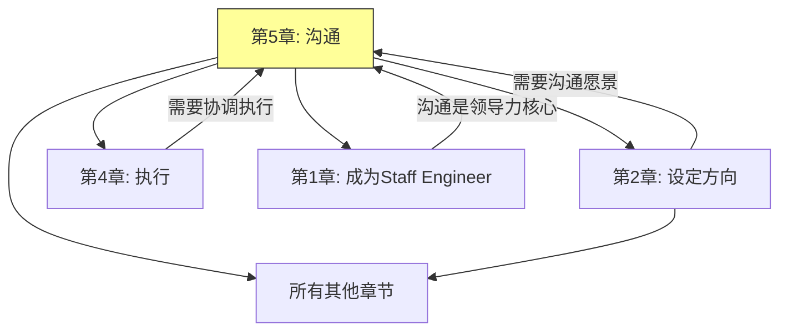

---

## 二、技术写作

### 2.1 技术写作的重要性

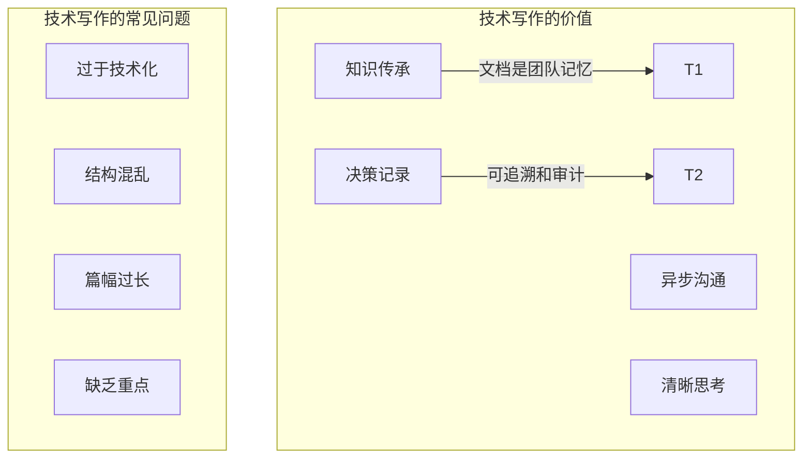

### 2.2 写作原则

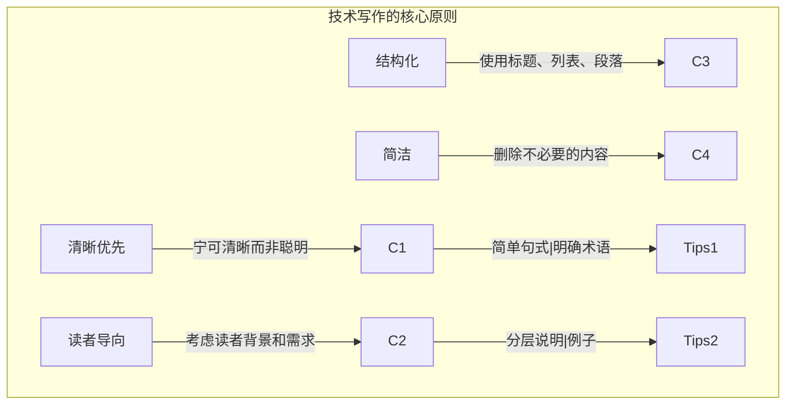

### 2.3 文档类型与结构

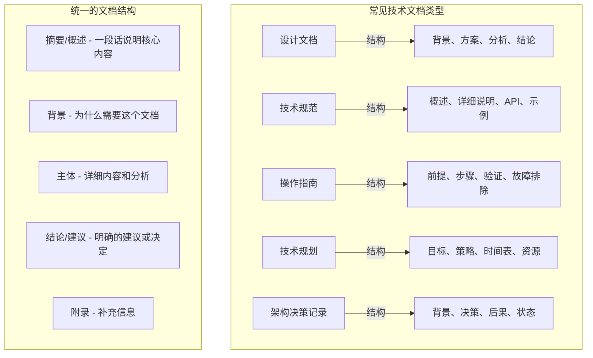

### 2.4 设计文档模板

```markdown
# 设计文档模板

## 概述
[用2-3句话描述这个设计文档的目的和主要内容]

## 背景
- [上下文和背景信息]
- [要解决的问题或要满足的需求]
- [相关链接：相关文档、任务、决策]

## 目标
- [设计目标1 - 具体可衡量]
- [设计目标2]

## 非目标
- [明确说明这个设计不涵盖的内容]
- [解释为什么这些不在范围内]

## 方案对比
### 方案A: [方案名称]
- 优点: [列出优点]
- 缺点: [列出缺点]
- 适用场景: [何时选择这个方案]

### 方案B: [方案名称]
- ...

### 推荐方案
- [为什么推荐这个方案]
- [关键决策点]

## 详细设计

### 架构图
[插入架构图]

### 组件设计
#### 组件1: [名称]
- 职责: [职责描述]
- 接口: [关键接口]
- 数据流: [数据流转]

#### 组件2: [名称]
- ...

### 数据模型
- [数据表/对象设计]
- [关键字段说明]

### API设计
- [关键API定义]
- [请求/响应示例]

### 安全性考虑
- [安全相关设计]
- [潜在风险和缓解]

## 实施计划

### 阶段1: [阶段名称]
- 时间: [时间范围]
- 交付物: [交付物列表]
- 风险: [可能的风险]

### 阶段2: [阶段名称]
- ...

## 监控和可观测性
- [需要监控的指标]
- [告警策略]
- [日志需求]

## 依赖
- [外部依赖]
- [需要协调的团队]

## 开放问题
- [未解决的问题]
- [需要讨论的事项]

## 附录
- [补充参考资料]
- [术语表]
```

---

## 三、演示与演讲

### 3.1 有效演示的原则

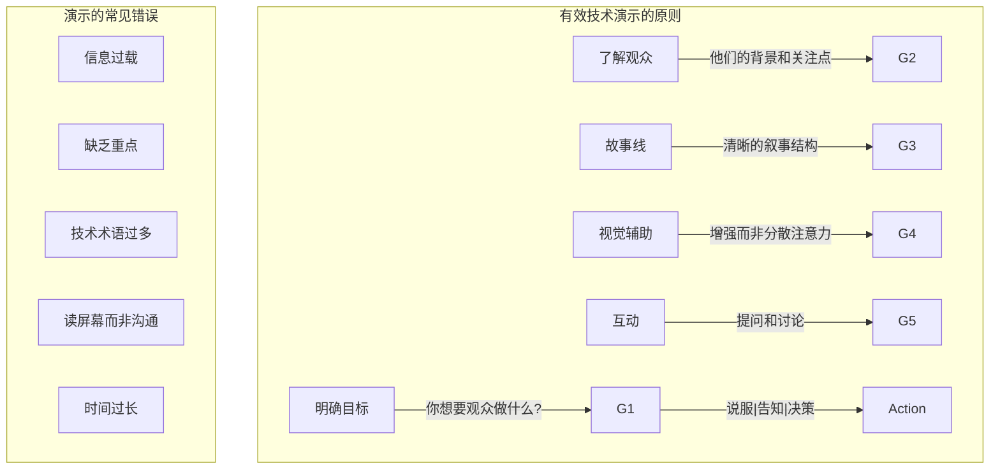

### 3.2 演示结构

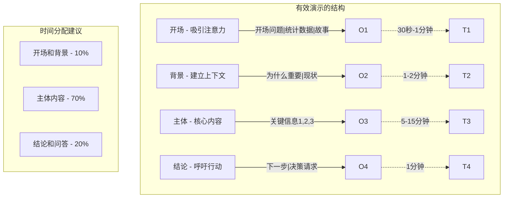

### 3.3 技术演示技巧

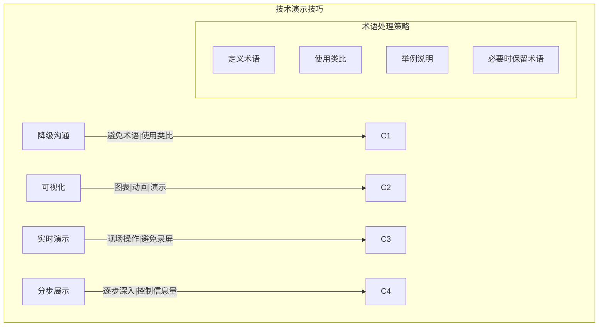

### 3.4 应对问答

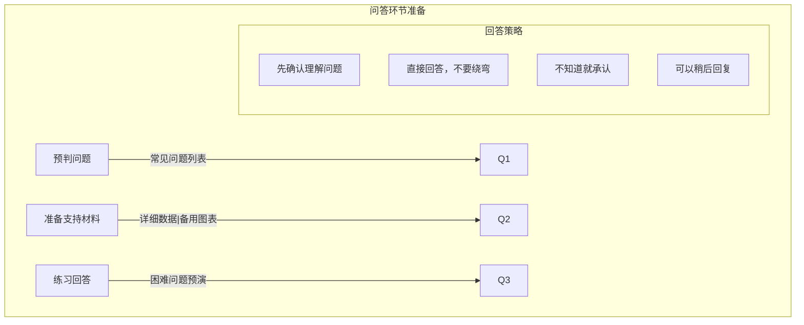

---

## 四、跨层级沟通

### 4.1 不同层级的沟通需求

```mermaid
%%{init: {"graph": {"defaultLayout": "td", "rankdir": "TB"}, "subGraph": {"ranksep": 80}}}%%
graph TD
    subgraph 层级沟通["不同层级的沟通特点"]
        L1[向上沟通] -->|"对象:管理层"| N1["关注结果、风险、决策"]
        L2[平级沟通] -->|"对象:其他团队"| N2["关注协作、资源、依赖"]
        L3[向下沟通] -->|"对象:团队成员]| N3["关注任务、方向、支持"]

        subgraph 沟通重点["各层级沟通重点"]
            Up["战略对齐、决策支持、资源请求"]
            Across["协调合作、信息共享、问题解决"]
            Down["任务分配、方向传达、团队支持"]
        end
    end
```

### 4.2 向上沟通

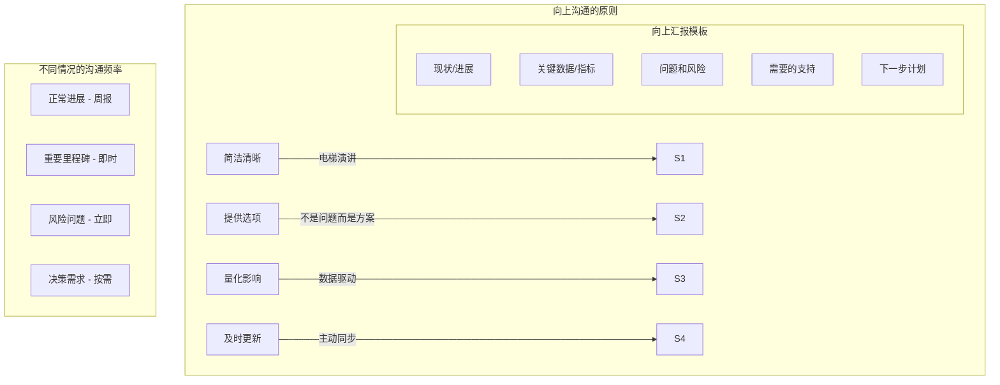

### 4.3 跨团队沟通

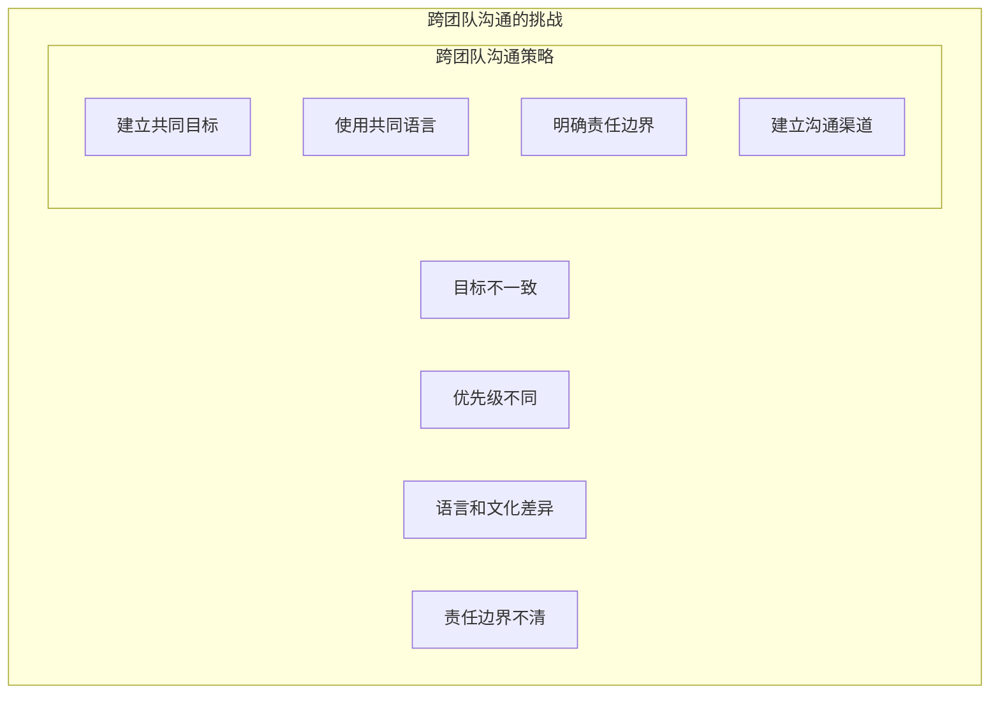

### 4.4 向下沟通

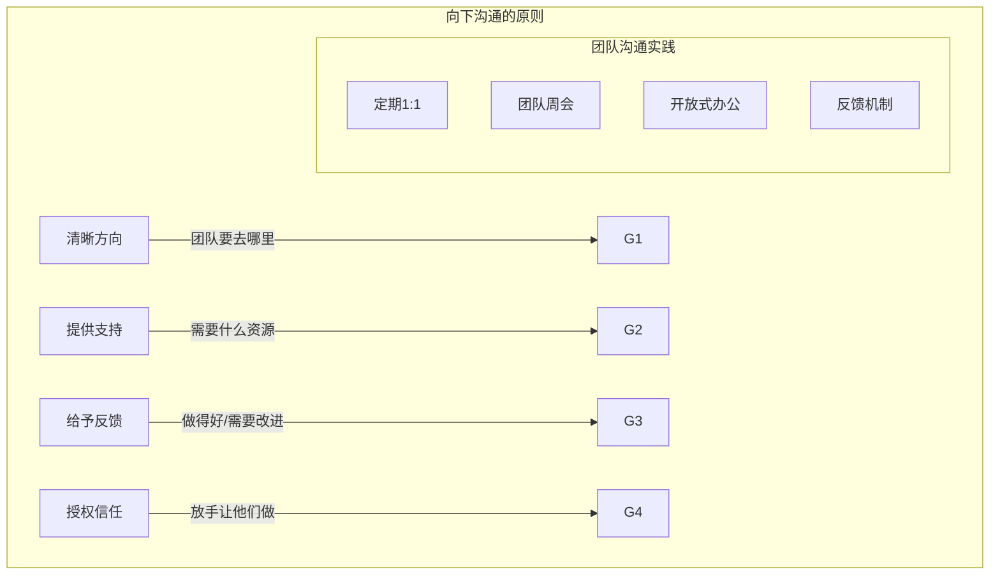

---

## 五、反馈与接收反馈

### 5.1 给予反馈

```mermaid
%%{init: {"graph": {"defaultLayout": "td", "rankdir": "TB"}, "subGraph": {"ranksep": 80}}}%%
graph TD
    subgraph 反馈原则["给予反馈的原则"]
        F1[及时] -->|"尽快而非积累"| T1
        F2[具体] -->|"避免泛泛而谈"| T2
        F3[平衡] -->|"肯定优点+指出改进]| T3
        F4[建设性] -->|"关注成长而非批评]| T4
        F5[私下] -->|"批评公开表扬"| T5

        subgraph SBI模型["SBI反馈模型"]
            S[Situation] -->|"情境"| "具体发生了什么"
            B[Behavior] -->|"行为"| "具体行为描述"
            I[Impact] -->|"影响"| "行为产生的影响"
        end
    end
```

### 5.2 接收反馈

```mermaid
%%{init: {"graph": {"defaultLayout": "td", "rankdir": "TB"}, "subGraph": {"ranksep": 80}}}%%
graph TD
    subgraph 接收反馈["接收反馈的态度"]
        A1[开放] -->|"愿意倾听"| O1
        A2[好奇] -->|"想了解更多"| O2
        A3[感激] -->|"感谢反馈]| O3
        A4[行动] -->|"转化为改进]| O4

        subgraph 接收流程["接收反馈的流程"]
            P1[倾听，不打断]
            P2[确认理解]
            P3[提问澄清]
            P4[感谢反馈]
            P5[制定行动计划]
        end
    end
```

### 5.3 困难对话

```mermaid
%%{init: {"graph": {"defaultLayout": "td", "rankdir": "TB"}, "subGraph": {"ranksep": 80}}}%%
graph TD
    subgraph 困难对话["处理困难对话"]
        D1[负面反馈]
        D2[冲突调解]
        D3[绩效讨论]
        D4[解雇或降级]

        subgraph 准备步骤["困难对话准备"]
            P1[明确目的]
            P2[收集事实]
            P3[规划开场]
            P4[准备应对]
            P5[选择时机和地点]
        end

        subgraph 对话结构["对话结构"]
            S1[开场 - 说明目的]
            S2[陈述事实 - 具体客观]
            S3[表达感受 - 我的视角]
            S4[邀请回应 - 听取对方]
            S5[达成共识 - 下一步]
        end
```

---

## 六、面试题整理

### 6.1 概念理解类 🌱

**Q1：如何向非技术人员解释复杂的技术概念？**

**答案：**

**解释策略：**

```mermaid
%%{init: {"graph": {"defaultLayout": "td", "rankdir": "TB"}, "subGraph": {"ranksep": 80}}}%%
graph TD
    subgraph 解释框架["向非技术人员解释的框架"]
        F1[类比法] -->|"使用熟悉的事物"| A1["像寄快递一样"]
        F2[类比法] -->|"建立联系]| A2["像图书馆找书"]
        F3[简化法] -->|"去除细节]| B1["关注核心概念"]
        F4[示例法] -->|"具体例子]| C1["用一个实际场景"]
        F5[分层法] -->|"从简单到复杂]| D1["先总览再深入"]
    end

    subgraph 避免事项["应该避免的"]
        B1[技术术语]
        B2[不必要的细节]
        B3[假设先验知识]
        B4[过度简化导致错误]
    end
```

**实用技巧：**
1. **先问后答** - 了解对方的背景和疑问
2. **使用类比** - 用日常生活中的例子
3. **分步解释** - 从宏观到微观
4. **确认理解** - 问"这样解释清楚吗？"
5. **准备可视化** - 图示往往比文字更有效

**Q2：如何给予建设性的负面反馈？**

**答案：**

**SBI反馈模型示例：**

```
情境（Situation）：
"在今天下午的代码评审会议上"

行为（Behavior）：
"你提交的三处代码变更都没有包含对应的单元测试"

影响（Impact）：
"这导致测试覆盖率下降了2%，而且其他团队成员在合并代码时需要额外时间来验证功能正确性"

建议（Suggestion）：
"建议以后在提交代码时，同时附上相应的测试用例。这样可以确保代码质量，也减少后续的沟通成本。"
```

---

### 6.2 实践应用类 🌿

**Q3：如何向上级汇报一个坏消息（如项目延期）？**

**答案：**

**汇报策略：**

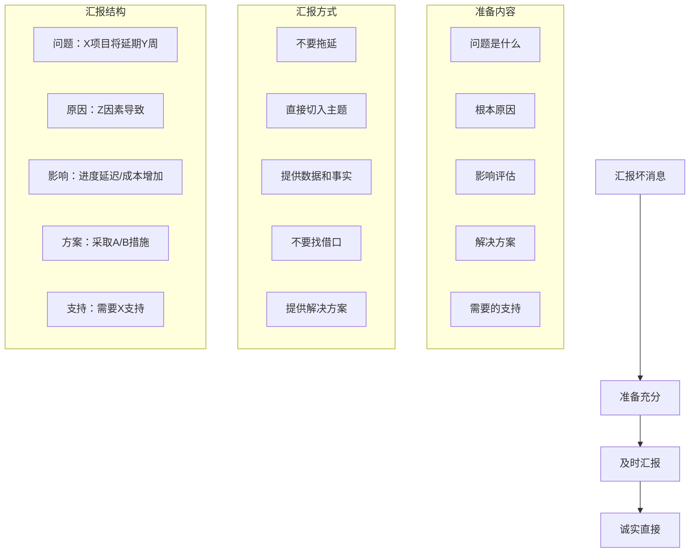

**关键原则：**
1. **及时** - 不要等到无法挽回才说
2. **诚实** - 不要隐瞒或轻描淡写
3. **准备充分** - 带着分析和方案
4. **负责** - 承认自己的责任

**Q4：如何处理团队成员之间的沟通冲突？**

**答案：**

**冲突处理流程：**

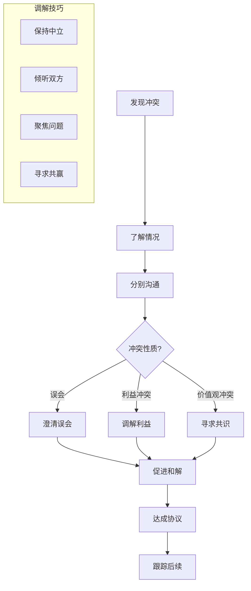

---

### 6.3 场景分析类 🔧

**Q5：在一次重要会议中，你被问到一个问题，但你不知道答案，你会怎么处理？**

**答案：**

**处理策略：**

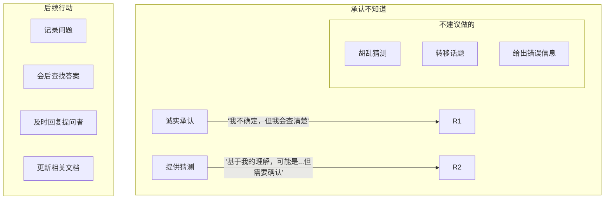

**话术示例：**
- ❌ "这个问题不太重要..."
- ❌ "可能是因为...（猜测）"
- ✅ "这是一个很好的问题。我目前没有完整的信息来回答。我会在[时间]前查清楚并回复你。"
- ✅ "我对此不确定，但我可以帮你联系[专家]来回答这个问题。"

---

## 七、实践要点

### 7.1 写作改进清单

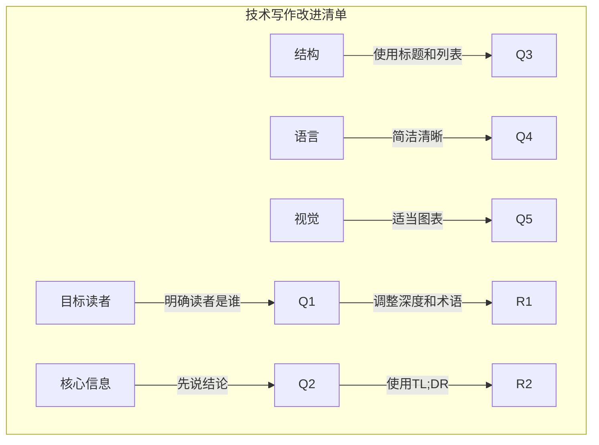

### 7.2 演示改进清单

```mermaid
%%{init: {"graph": {"defaultLayout": "td", "rankdir": "TB"}, "subGraph": {"ranksep": 80}}}%%
graph TD
    subgraph 演示检查["演示前检查"]
        Check1["演示目标明确吗？"]
        Check2["观众了解背景吗？"]
        Check3["时间控制合理吗？"]
        Check4["技术设备测试了吗？"]
        Check5["备用方案准备好了吗？"]
    end
```

### 7.3 沟通常见问题与解决方案

| 问题 | 原因 | 解决方案 |
|-----|-----|---------|
| **信息过载** | 想传达太多 | 聚焦核心信息 |
| **术语过多** | 假设先验知识 | 定义术语，使用类比 |
| **缺乏重点** | 结构不清晰 | 使用明确标题和过渡 |
| **单向灌输** | 缺乏互动 | 提问和讨论 |
| **情绪化** | 过于投入 | 保持专业和冷静 |

### 7.4 沟通模板

```markdown
# 向上汇报模板

## 标题：[项目/事项] 状态汇报

## 总体状态
[红/黄/绿] - 一句话总结

## 关键进展
1. [进展1]
2. [进展2]

## 关键数据/指标
- [指标1]: [数值]（[变化趋势]）
- [指标2]: [数值]（[变化趋势]）

## 问题和风险
- [问题1]: [影响] - [应对措施]
- [问题2]: [影响] - [应对措施]

## 下周计划
1. [计划1]
2. [计划2]

## 需要支持
- [需要支持的事项]

---
```

---

## 八、扩展阅读

### 8.1 推荐资源

| 资源 | 类型 | 说明 |
|-----|-----|-----|
| 《On Writing Well》 | 书籍 | 非虚构写作指南 |
| 《Made to Stick》 | 书籍 | 如何让想法传播 |
| 《Crucial Conversations》 | 书籍 | 关键对话技巧 |
| 《The Pyramid Principle》 | 书籍 | 麦肯锡写作方法 |

### 8.2 工具推荐

- **写作**: Grammarly, Hemingway Editor
- **演示**: Figma, Mermaid, Reveal.js
- **协作**: Notion, Confluence

### 8.3 实践项目

- 每周写一篇技术博客
- 练习5分钟电梯演讲
- 组织团队技术分享

---

## 九、本章小结

### 核心收获

1. **技术写作是影响力的放大器**
   - 清晰、简洁、结构化
   - 读者导向，考虑背景
   - 文档是知识传承的载体

2. **有效演示需要设计和练习**
   - 明确目标，了解观众
   - 故事线清晰，视觉辅助
   - 准备应对问答

3. **跨层级沟通需要不同策略**
   - 向上：简洁、选项、数据
   - 平级：协作、共同目标
   - 向下：方向、支持、反馈

4. **反馈是成长的催化剂**
   - 及时、具体、建设性
   - 开放接收，积极行动

5. **困难对话需要准备和技巧**
   - 明确目的，聚焦问题
   - 保持专业，寻求共识

### 关键概念地图

```mermaid
%%{init: {"graph": {"defaultLayout": "td", "rankdir": "TB"}, "subGraph": {"ranksep": 80}}}%%
mindmap
  root((沟通))
    技术写作
      写作原则
      文档类型
      设计文档模板
    演示演讲
      演示原则
      结构设计
      问答应对
    跨层级沟通
      向上沟通
      平级沟通
      向下沟通
    反馈技巧
      给予反馈
      接收反馈
      困难对话
```

### 下一章预告

第6章将探讨**成为榜样**，了解如何通过个人行为影响和引导团队：
- 行为示范
- 建立信任
- 职业操守
- 持续学习

---

## 附录 A：技术文档清单

| 检查项 | 说明 | 状态 |
|-------|-----|-----|
| 目标读者明确 | 文档写给谁看 | |
| 核心信息突出 | 关键信息在前面 | |
| 结构清晰 | 标题、段落、列表 | |
| 术语定义 | 必要时定义术语 | |
| 例子充分 | 有实际示例 | |
| 可操作 | 有明确的行动建议 | |
| 无错别字 | 校对完成 | |

## 附录 B：演示检查清单

| 检查项 | 说明 | 状态 |
|-------|-----|-----|
| 目标明确 | 想要达成的结果 | |
| 观众了解 | 背景和关注点 | |
| 结构清晰 | 开场-主体-结论 | |
| 时间合理 | 适合分配的时间 | |
| 视觉辅助 | 图表/演示增强效果 | |
| 设备测试 | 技术设备正常 | |
| 备用方案 | 技术故障时的计划 | |

---

*文档生成时间：2024-01-08*
*基于《The Staff Engineer's Path》第5章*
