# 《The Staff Engineer's Path》- 第6章：成为榜样（深度版）

## 一、本章概述

本章深入探讨了Staff Engineer作为**榜样**的角色。作为技术领导者，你的行为、态度和价值观会深刻影响团队和组织文化。本章讨论如何通过个人行为来建立信任、影响他人并塑造积极的团队文化。

> **本章核心问题**：Staff Engineer应该如何通过行为示范来影响团队？如何建立和维护信任？如何在压力下保持职业操守？

### 1.1 核心主题
- 行为示范的力量
- 建立和维护信任
- 职业操守与伦理
- 处理压力和挑战
- 持续学习与发展

### 1.2 重要程度
⭐⭐⭐⭐（高）

### 1.3 预计学习时间
50-70分钟

### 1.4 本章与其他章节的关联

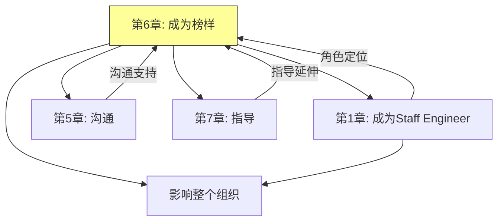

---

## 二、行为示范的力量

### 2.1 影响力的来源

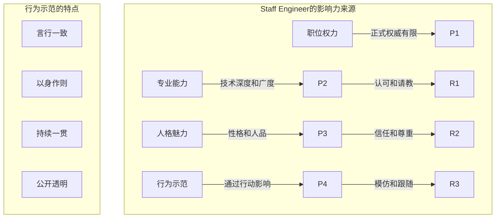

### 2.2 关键行为领域

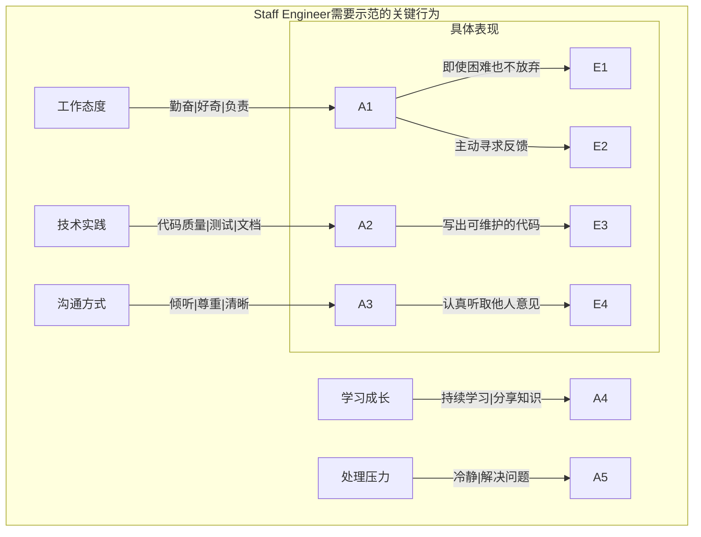

### 2.3 示范的涟漪效应

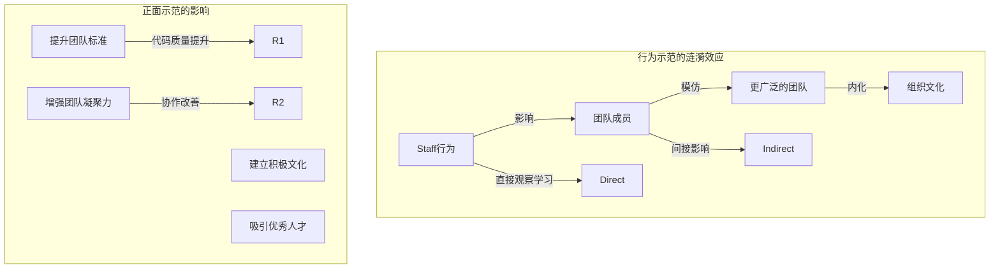

---

## 三、建立和维护信任

### 3.1 信任的要素

```mermaid
%%{init: {"graph": {"defaultLayout": "td", "rankdir": "TB"}, "subGraph": {"ranksep": 80}}}%%
graph TD
    subgraph 信任模型["信任的三个维度"]
        T1[能力信任] -->|"相信你能做好"| C1
        T2[诚信信任] -->|"相信你会诚实"| I1
        T3[善意信任] -->|"相信你善意待人"| B1

        C1 -->|"技术能力 专业判断"| Proof1
        I1 -->|"言行一致 承诺兑现"| Proof2
        B1 -->|"关心他人 公平对待"| Proof3
    end

    subgraph 信任公式["信任的建立"]
        Trust = (Consistency + Communication + Competence) / Expectations
    end
```

### 3.2 建立信任的行为

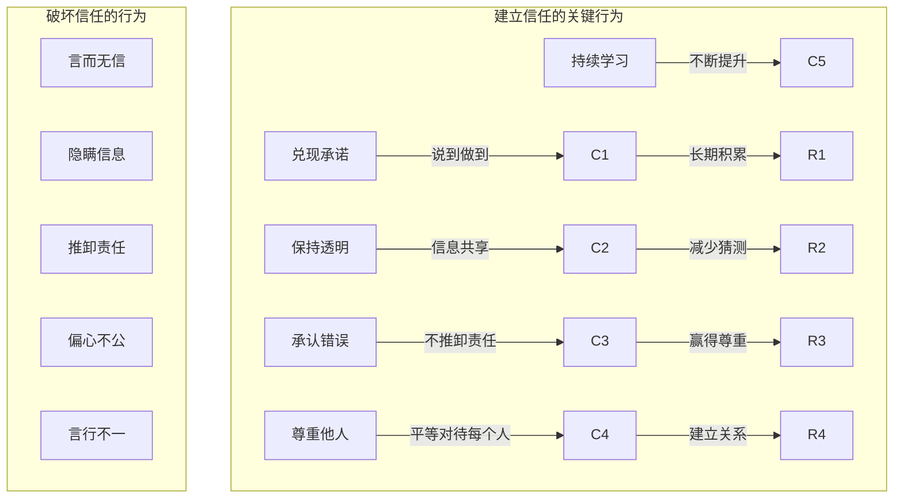

### 3.3 修复信任

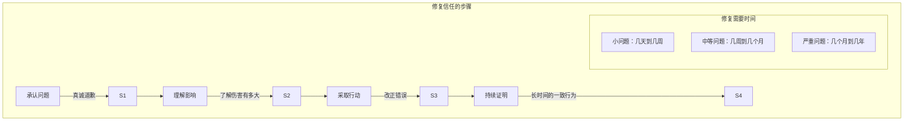

---

## 四、职业操守与伦理

### 4.1 职业操守的核心原则

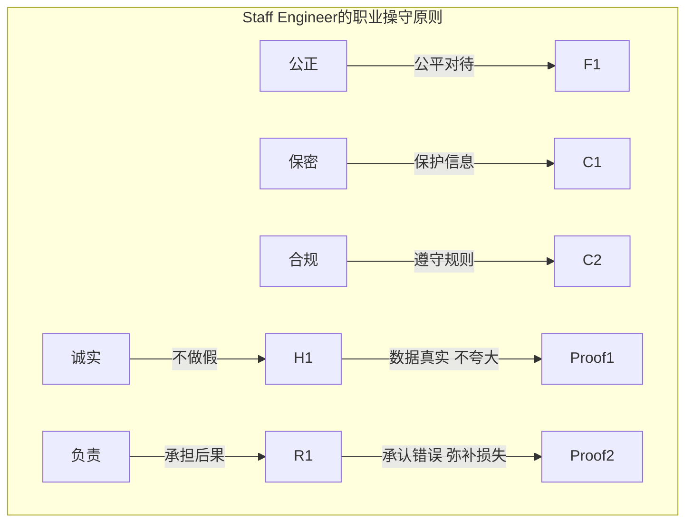

### 4.2 伦理困境

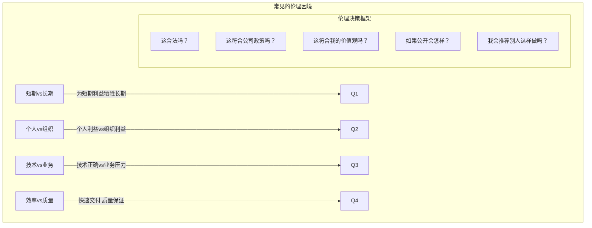

### 4.3 处理压力下的操守

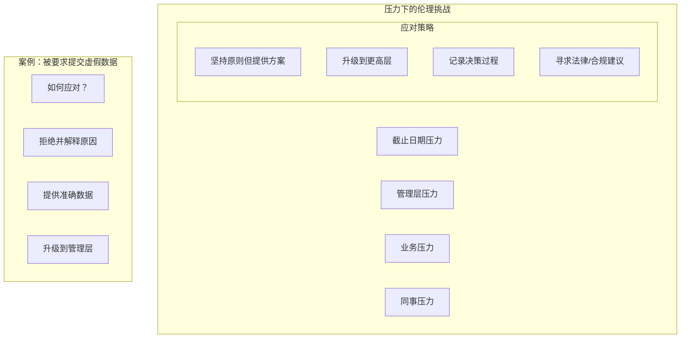

---

## 五、处理压力和挑战

### 5.1 Staff Engineer的压力来源

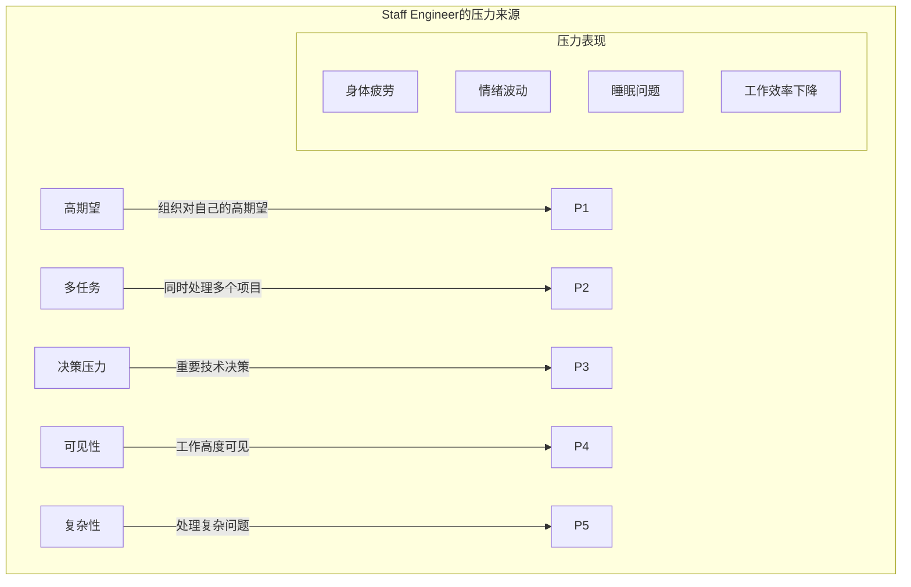

### 5.2 保持韧性的策略

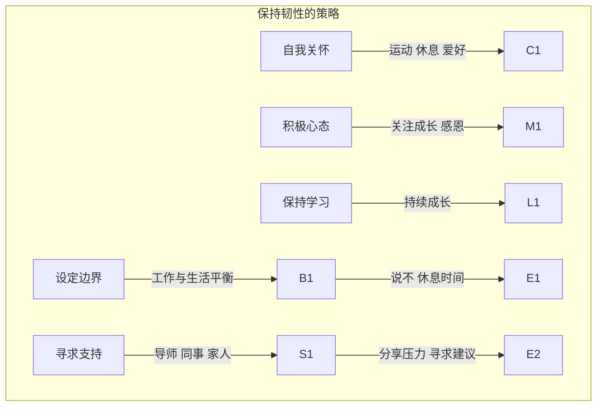

### 5.3 在压力下保持冷静

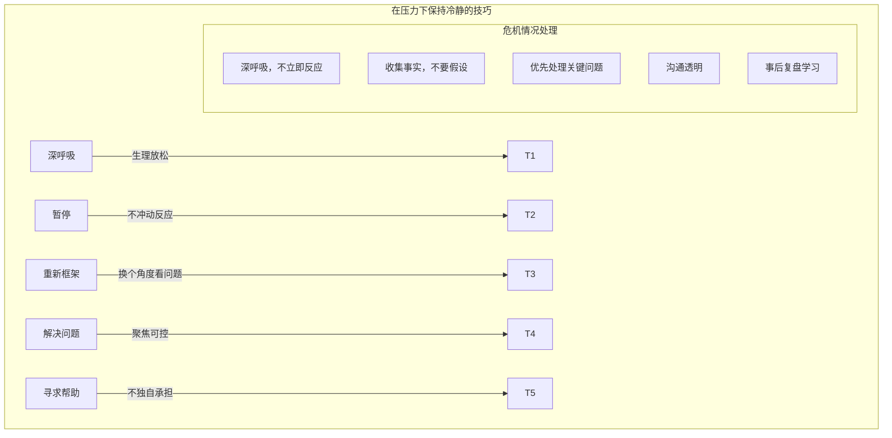

---

## 六、持续学习与发展

### 6.1 学习作为榜样

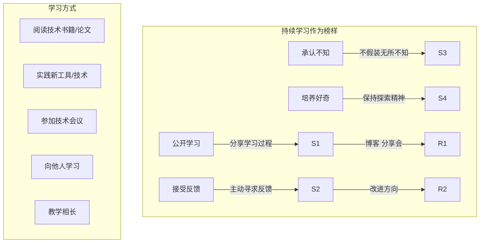

### 6.2 知识分享

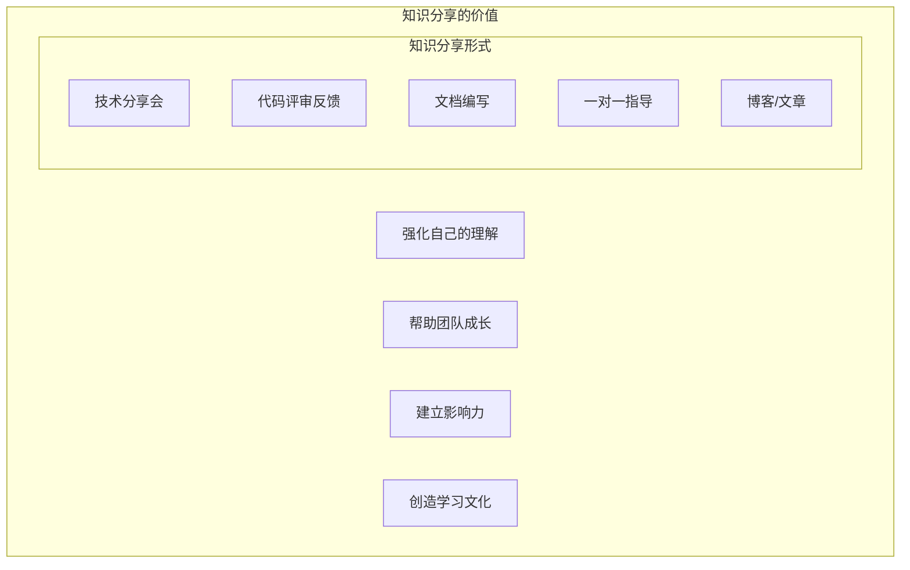

### 6.3 个人发展计划

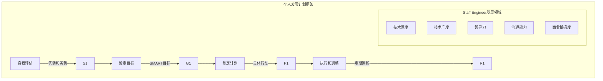

---

## 七、面试题整理

### 7.1 概念理解类 🌱

**Q1：为什么行为示范对Staff Engineer特别重要？**

**答案：**

**原因分析：**

| 原因 | 说明 |
|-----|-----|
| **影响力来源** | Staff Engineer的正式权力有限，主要靠影响力 |
| **文化塑造** | 团队会模仿领导者的行为 |
| **信任建立** | 言行一致是信任的基础 |
| **标准设定** | 领导者设定团队的行为标准 |
| **代际传承** | 新人通过观察学习 |

**关键点：**
- 你做什么比你说什么更重要
- 团队会观察你如何处理困难情况
- 你的行为会影响整个团队的价值观

**Q2：如何在团队中建立信任？**

**答案：**

**建立信任的方法：**

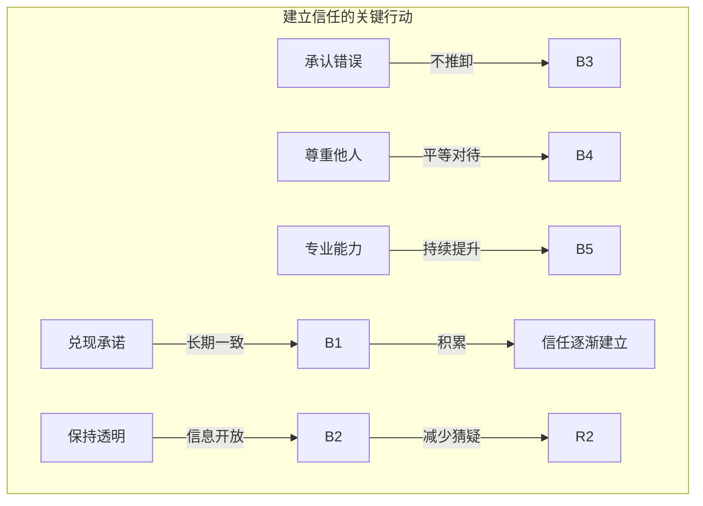

**具体做法：**
1. **说到做到** - 即使小承诺也要兑现
2. **信息透明** - 主动分享相关信息
3. **承认不知** - 不假装无所不知
4. **承担责任** - 出了问题首先反思自己
5. **持续一致** - 长期保持相同标准

---

### 7.2 实践应用类 🌿

**Q3：你发现团队中有不道德的行为（如数据造假），你会怎么处理？**

**答案：**

**处理步骤：**

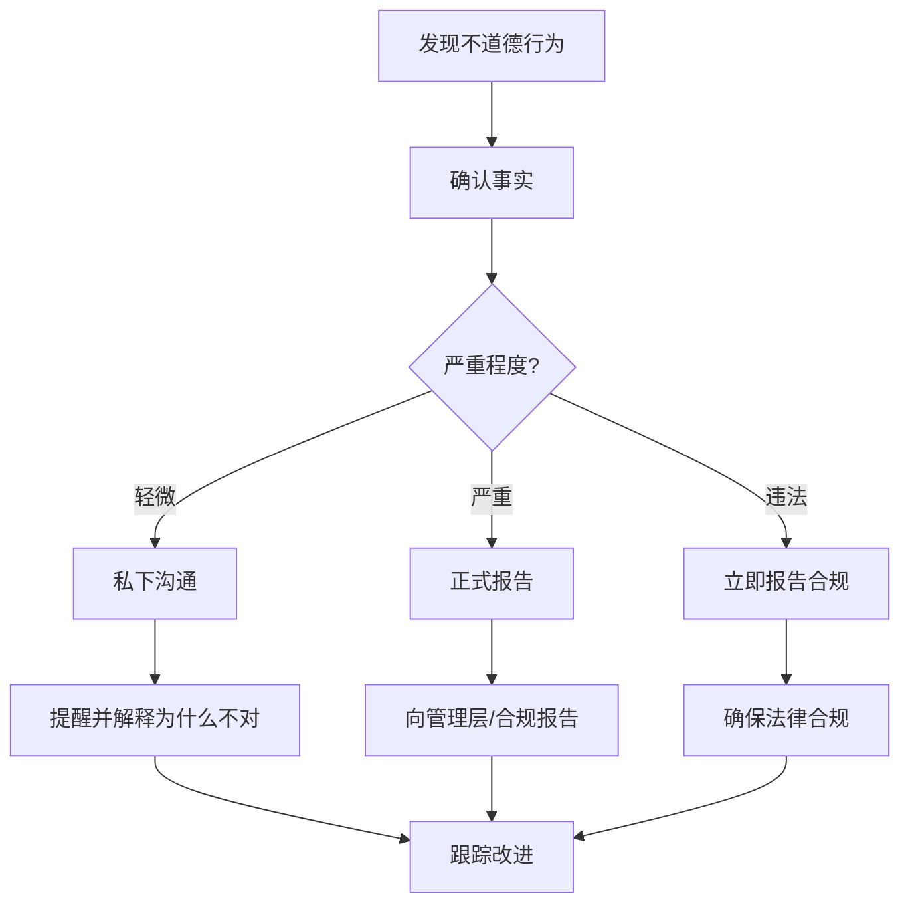

**处理原则：**
1. **确认事实** - 不要基于传言行动
2. **选择合适的方式** - 私下vs公开
3. **保护举报人** - 如果有人举报
4. **遵守流程** - 遵循公司政策
5. **坚持原则** - 不因压力妥协

**Q4：如何在高期望下保持心理健康？**

**答案：**

**保持心理健康的策略：**

| 策略 | 具体做法 |
|-----|---------|
| **设定边界** | 明确工作时间和休息时间 |
| **寻求支持** | 与导师、同事、家人交流 |
| **自我关怀** | 保持运动、睡眠、爱好 |
| **分解压力** | 将大压力分解为小问题 |
| **保持视角** | 长远看，当前的困难是暂时的 |
| **专业帮助** | 必要时寻求心理咨询 |

---

### 7.3 场景分析类 🔧

**Q5：当你发现自己的判断错误时，你会怎么处理？**

**答案：**

**处理方法：**

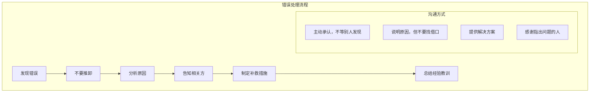

**为什么承认错误很重要：**
- 建立信任（诚信）
- 展示成熟度
- 避免更大损失
- 给团队树立榜样
- 促进学习和改进

**话术示例：**
- ❌ "这是因为XX部门提供的数据有问题..."
- ✅ "我之前的判断有误，主要原因是...我会采取以下措施来纠正..."

---

## 八、实践要点

### 8.1 行为自检清单

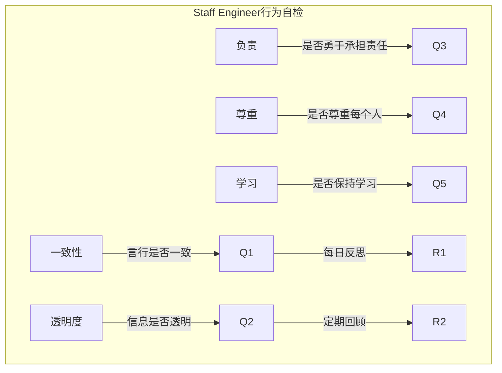

### 8.2 信任维护清单

```markdown
# 信任维护清单

## 每周检查
- [ ] 我兑现了本周的所有承诺吗？
- [ ] 我是否对团队保持透明？
- [ ] 我是否主动寻求了反馈？
- [ ] 我是否帮助了团队成员？

## 每月检查
- [ ] 我的行为是否与我的价值观一致？
- [ ] 是否有人对我的行为表示不满？
- [ ] 我是否在持续学习和成长？
- [ ] 我是否公平对待每个人？

## 信任修复
如果发现信任受损：
1. [ ] 确认问题所在
2. [ ] 真诚道歉
3. [ ] 采取纠正行动
4. [ ] 持续证明改变
```

### 8.3 常见问题与解决方案

| 问题 | 原因 | 解决方案 |
|-----|-----|---------|
| **言行不一** | 压力大或疏忽 | 建立检查机制 |
| **过度承诺** | 不会拒绝 | 学会说不 |
| **隐瞒问题** | 害怕负面反馈 | 建立安全文化 |
| **偏心** | 无意识偏见 | 自我觉察和反思 |
| **不持续学习** | 时间不足 | 保护学习时间 |

---

## 九、扩展阅读

### 9.1 推荐资源

| 资源 | 类型 | 说明 |
|-----|-----|-----|
| 《Radical Candor》 | 书籍 | 真诚反馈的艺术 |
| 《The Courage to Be Disliked》 | 书籍 | 勇气与自由 |
| 《Atomic Habits》 | 书籍 | 习惯养成 |
| 《Good to Great》 | 书籍 | 从优秀到卓越 |

### 9.2 实践项目

- 每周进行自我反思
- 寻求360度反馈
- 建立个人价值观文档
- 制定个人发展计划

---

## 十、本章小结

### 核心收获

1. **行为示范是最有力的影响力**
   - 团队会观察并模仿领导者
   - 言行一致建立信任
   - 涟漪效应影响整个组织

2. **信任需要持续建立**
   - 能力信任、诚信信任、善意信任
   - 兑现承诺、保持透明、承认错误
   - 信任破坏后需要时间和行动修复

3. **职业操守是底线**
   - 诚实、负责、公正、保密
   - 在压力下坚持原则
   - 建立伦理决策框架

4. **压力管理是持续挑战**
   - 识别压力来源
   - 建立支持系统
   - 保持身心健康

5. **持续学习是榜样责任**
   - 公开学习过程
   - 积极分享知识
   - 制定发展计划

### 关键概念地图

```mermaid
%%{init: {"graph": {"defaultLayout": "td", "rankdir": "TB"}, "subGraph": {"ranksep": 80}}}%%
mindmap
  root((成为榜样))
    行为示范
      影响力来源
      关键行为领域
      涟漪效应
    建立信任
      信任要素
      建立行为
      修复方法
    职业操守
      核心原则
      伦理困境
      压力下坚持
    持续发展
      压力管理
      持续学习
      知识分享
```

### 下一章预告

第7章将探讨**指导**，了解如何培养和发展团队中的其他工程师：
- 指导的艺术
- 反馈与辅导
- 职业发展规划
- 建立学习文化

---

## 附录 A：Staff Engineer行为准则

| 行为准则 | 具体表现 | 检查频率 |
|---------|---------|---------|
| 诚实守信 | 数据真实、承诺兑现 | 每日 |
| 以身作则 | 高标准要求自己 | 每周 |
| 尊重他人 | 平等对待每个人 | 持续 |
| 透明沟通 | 主动分享信息 | 每周 |
| 承担责任 | 承认错误并改正 | 需要时 |
| 持续学习 | 保持成长 | 每月 |

---

*文档生成时间：2024-01-08*
*基于《The Staff Engineer's Path》第6章*
