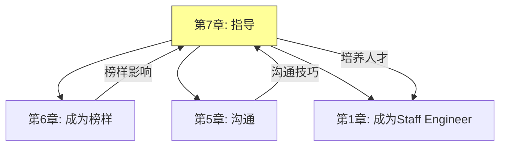
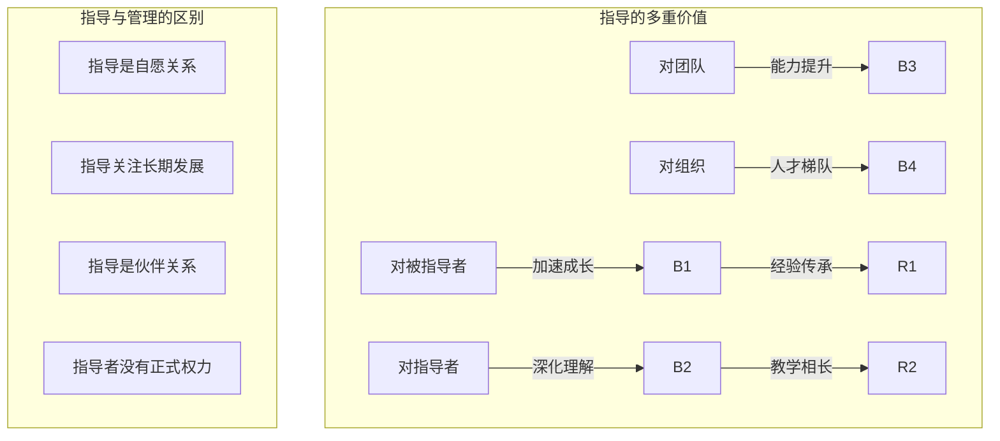
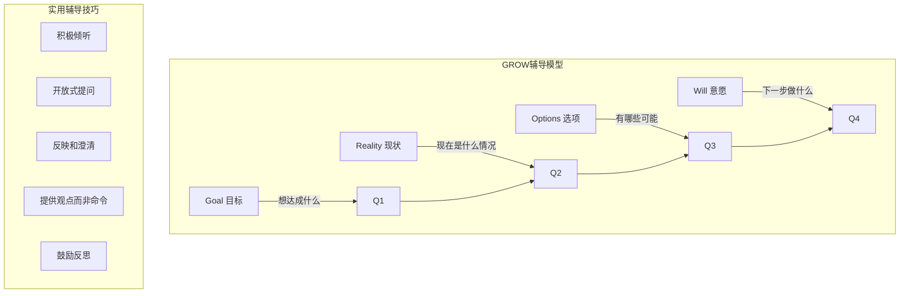
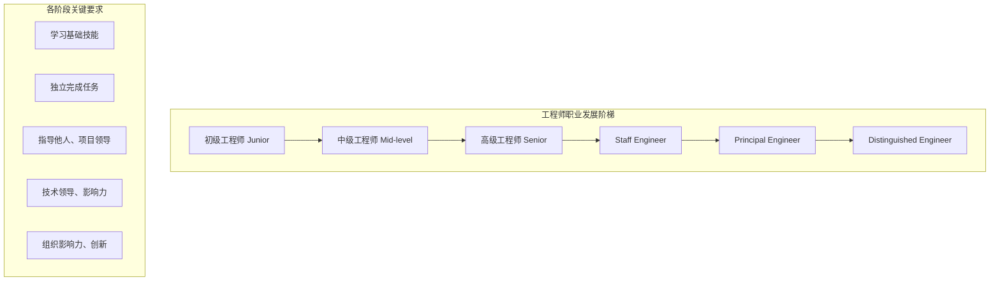
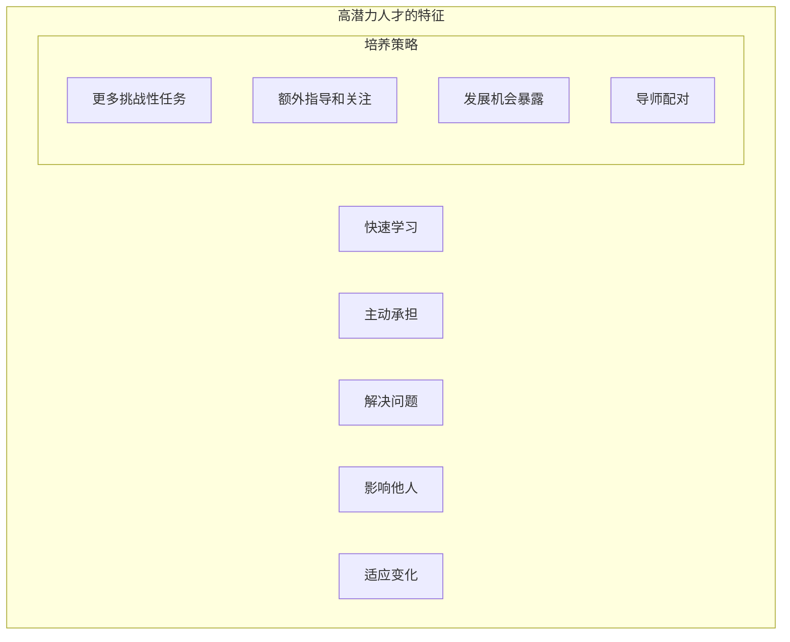
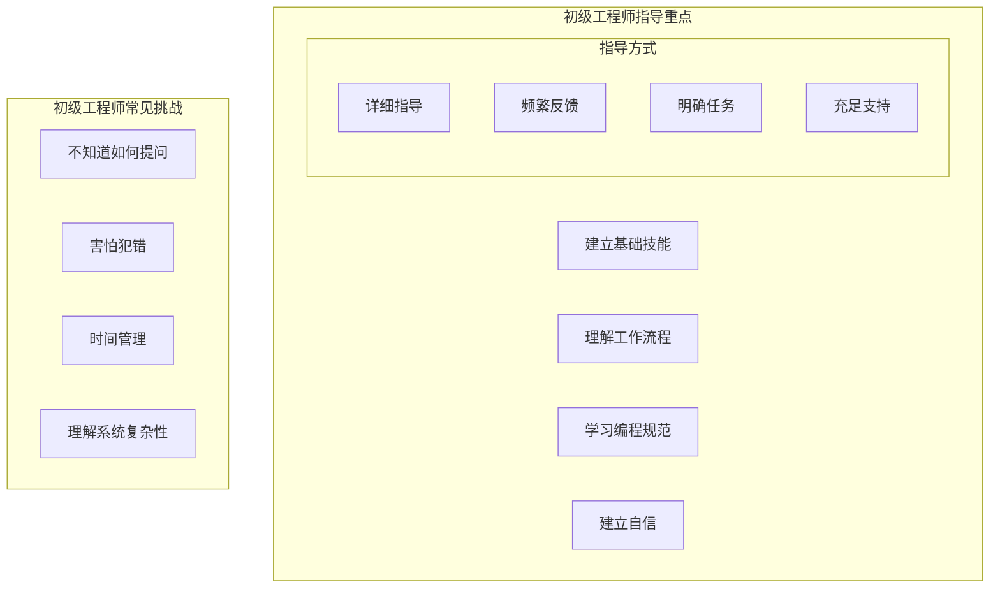
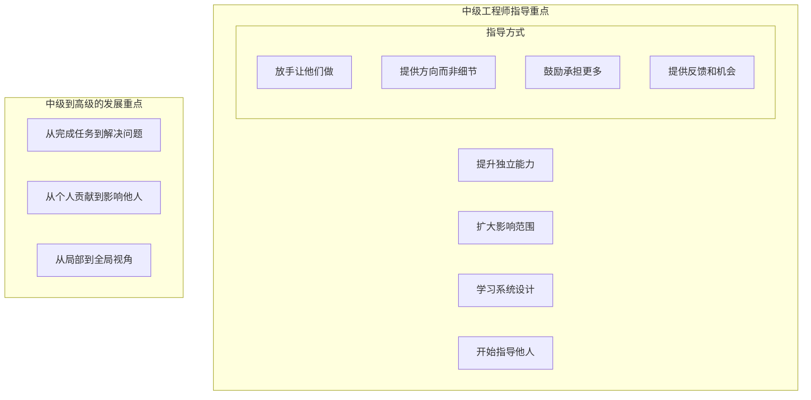
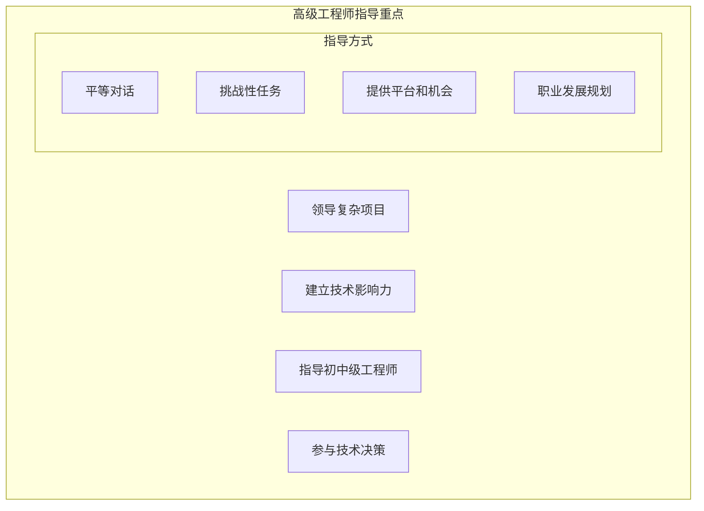
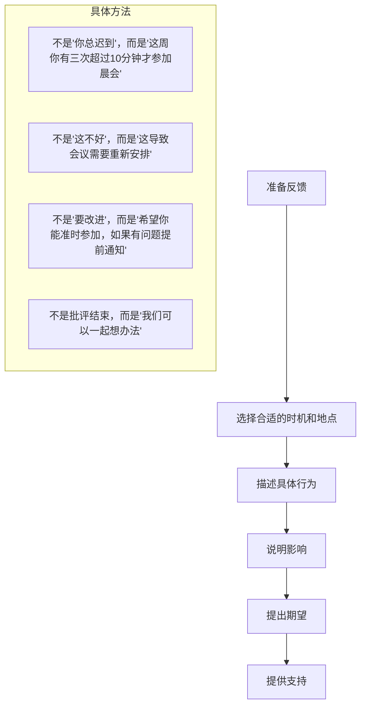
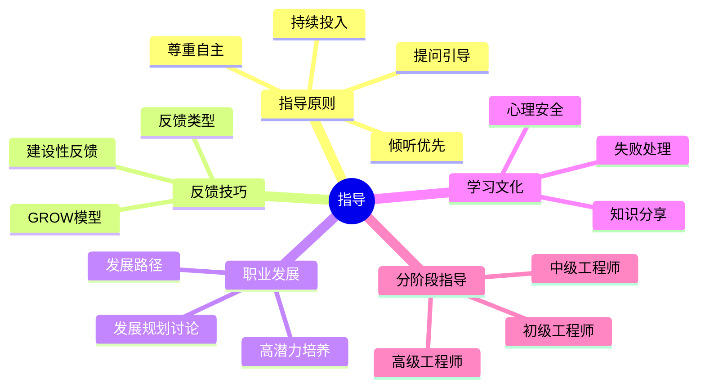

# 《The Staff Engineer's Path》- 第7章：指导（深度版）

## 一、本章概述

本章深入探讨了**指导（Mentoring）**这一Staff Engineer的核心职责。培养和发展下一代工程师不仅对团队和组织有长期价值，也是Staff Engineer影响力的重要体现。

> **本章核心问题**：如何有效地指导工程师成长？如何提供有价值的反馈？如何在团队中建立学习文化？

### 1.1 核心主题
- 指导的艺术与原则
- 反馈与辅导技巧
- 职业发展规划
- 建立学习文化
- 不同阶段工程师的指导策略

### 1.2 重要程度
⭐⭐⭐⭐（高）

### 1.3 预计学习时间
50-70分钟

### 1.4 本章与其他章节的关联



---

## 二、指导的艺术与原则

### 2.1 指导的意义



### 2.2 有效指导的原则

```mermaid
%%{init: {"graph": {"defaultLayout": "td", "rankdir": "TB"}, "subGraph": {"ranksep": 80}}}%%
graph TD
    subgraph 指导原则["有效指导的原则"]
        P1[倾听优先] -->|"先理解再建议"| L1
        P2[提问引导] -->|"启发思考"| Q1
        P3[尊重自主] -->|"不替对方做决定]| A1
        P4[持续投入] -->|"长期关系维护]| C1
        P5[以身作则] -->|"行为示范]| E1

        L1 -->|"建立信任"| T1
        Q1 -->|"培养能力"| T2
    end
```

### 2.3 指导关系模式

```mermaid
%%{init: {"graph": {"defaultLayout": "td", "rankdir": "TB"}, "subGraph": {"ranksep": 80}}}%%
graph TD
    subgraph 指导模式["不同的指导模式"]
        M1[一对一指导] -->|"深度关系"| S1
        M2[小组指导] -->|"群体影响"| S2
        M3[反向指导] -->|"向年轻人学习]| S3
        M4[同伴指导] -->|"互相学习]| S4

        subgraph 适用场景["各模式适用场景"]
            S1 -->|"高潜力人才"| C1
            S2 -->|"团队技能提升"| C2
            S3 -->|"领导力发展"| C3
        end
    end
```

---

## 三、反馈与辅导技巧

### 3.1 反馈的类型

```mermaid
%%{init: {"graph": {"defaultLayout": "td", "rankdir": "TB"}, "subGraph": {"ranksep": 80}}}%%
graph TD
    subgraph 反馈类型["反馈的不同类型"]
        F1[发展性反馈] -->|"关注成长"| D1
        F2[认可性反馈] -->|"肯定优点]| R1
        F3[纠正性反馈] -->|"改进行为]| C1

        D1 -->|"未来导向"| T1
        R1 -->|"增强动力"| T2
        C1 -->|"行为改变"| T3

        subgraph 反馈频率["反馈频率"]
            Freq1["发展性：定期"]
            Freq2["认可性：及时"]
            Freq3["纠正性：及时但私下"]
        end
    end
```

### 3.2 辅导技巧



### 3.3 提供建设性反馈

```mermaid
%%{init: {"graph": {"defaultLayout": "td", "rankdir": "TB"}, "subGraph": {"ranksep": 80}}}%%
graph TD
    subgraph 反馈公式["建设性反馈公式"]
        F1[观察] -->|"具体行为描述"| O1
        F2[影响] -->|"行为的影响"| I1
        F3[期望] -->|"期望的行为]| E1

        O1 -->|"我注意到你..."| S1
        I1 -->|"这导致..."| S2
        E1 -->|"我期望..."| S3
    end

    subgraph 反馈示例["反馈示例"]
        Negative["'你代码质量太差了'"] -->|"❌ 模糊、指责"| X1
        Constructive["'我注意到这个PR有三个高优先级的测试用例没有覆盖（观察），这会导致线上问题难以及时发现（影响），我建议每次提交前检查测试覆盖（期望）'"] -->|"✅ 具体、建设性"| Check
    end
```

---

## 四、职业发展规划

### 4.1 工程师职业发展路径



### 4.2 职业发展规划讨论

```mermaid
%%{init: {"graph": {"defaultLayout": "td", "rankdir": "TB"}, "subGraph": {"ranksep": 80}}}%%
graph TD
    subgraph 讨论框架["职业发展讨论框架"]
        D1[当前位置] -->|"当前技能、角色"| C1
        D2[目标位置] -->|"未来想成为什么]| G1
        D3[差距分析] -->|"需要什么能力"| Gap1
        D4[行动计划] -->|"如何缩小差距"| Plan1
        D5[支持资源] -->|"需要什么帮助"| Resource1

        C1 --> G1 --> Gap1 --> Plan1 --> Resource1
    end

    subgraph 讨论技巧["讨论技巧"]
        T1["询问而不是告知"]
        T2["倾听对方的想法"]
        T3["提供真实反馈"]
        T4["帮助设定现实目标"]
        T5["提供具体建议"]
    end
```

### 4.3 识别和培养高潜力人才



---

## 五、建立学习文化

### 5.1 学习文化的要素

```mermaid
%%{init: {"graph": {"defaultLayout": "td", "rankdir": "TB"}, "subGraph": {"ranksep": 80}}}%%
graph TD
    subgraph 学习文化["健康学习文化的要素"]
        C1[心理安全] -->|"敢于尝试、不怕犯错"| S1
        C2[知识分享] -->|"乐于分享、互相学习"| S2
        C3[持续学习] -->|"投资个人成长]| S3
        C4[反馈文化] -->|"建设性反馈]| S4

        S1 -->|"创新氛围"| R1
        S2 -->|"团队能力提升"| R2
    end
```

### 5.2 学习活动

```mermaid
%%{init: {"graph": {"defaultLayout": "td", "rankdir": "TB"}, "subGraph": {"ranksep": 80}}}%%
graph TD
    subgraph 学习活动["促进学习的活动"]
        A1[技术分享会] -->|"定期分享"| S1
        A2[读书会] -->|"共同阅读讨论]| S2
        A3[代码评审] -->|"互相学习]| S3
        A4[结对编程] -->|"实时协作学习]| S4
        A5[黑板会话] -->|"讨论复杂问题]| S5

        subgraph 分享内容["技术分享内容"]
            Share1["项目经验"]
            Share2["新技术探索"]
            Share3["最佳实践"]
            Share4["失败教训"]
        end
    end
```

### 5.3 处理失败

```mermaid
%%{init: {"graph": {"defaultLayout": "td", "rankdir": "TB"}, "subGraph": {"ranksep": 80}}}%%
graph TD
    subgraph 失败处理["如何处理团队中的失败"]
        F1[区分] -->|"错误vs失败vs实验"| D1
        D1 --> F2[分析] -->|"根因分析"| A1
        A1 --> F3[学习] -->|"提取教训"| L1
        L1 --> F4[分享] -->|"公开分享]| S1

        subgraph 失败时的指导["指导失败的情况"]
            M1["不要指责"]
            M2["关注系统而非个人"]
            M3["鼓励尝试"]
            M4["庆祝从失败中学习"]
        end
    end
```

---

## 六、不同阶段工程师的指导策略

### 6.1 初级工程师



### 6.2 中级工程师



### 6.3 高级工程师



---

## 七、面试题整理

### 7.1 概念理解类 🌱

**Q1：指导和管理有什么区别？**

**答案：**

| 维度 | 指导 | 管理 |
|-----|-----|-----|
| **关系性质** | 自愿、非正式 | 正式、上下级 |
| **关注重点** | 长期发展 | 短期绩效 |
| **权力** | 无正式权力 | 有正式权力 |
| **时间框架** | 长期（数月到数年） | 短期（季度/年度） |
| **目标** | 个人成长 | 任务完成 |
| **方式** | 建议、提问 | 指令、分配 |

**两者的关系：**
- 好管理者同时也是好指导者
- 指导可以超越管理边界
- 两者互补，共同促进员工发展

**Q2：如何给出建设性的负面反馈？**

**答案：**

**步骤：**



---

### 7.2 实践应用类 🌿

**Q3：如何处理不愿意接受反馈的工程师？**

**答案：**

**处理策略：**

```mermaid
%%{init: {"graph": {"defaultLayout": "td", "rankdir": "TB"}, "subGraph": {"ranksep": 80}}}%%
graph TD
    subgraph 原因分析["先了解不愿意接受反馈的原因"]
        R1["不信任指导者"]
        R2["防御心理"]
        R3["对反馈方式不满意"]
        R4["确实需要改进但不知道]
    end

    subgraph 处理方法["处理方法"]
        M1["建立信任关系"]
        M2["调整反馈方式"]
        M3["从正面反馈开始"]
        M4["给予时间和空间"]
        M5["寻求第三方帮助"]

        M1 -->|"先建立关系"| T1
        M3 -->|"先认可优点"| T2
    end
```

**具体做法：**
1. **建立信任** - 先花时间了解对方
2. **选择时机** - 对方平静时讨论
3. **调整方式** - 书面vs口头、私下vs公开
4. **从正面开始** - 先肯定做得好的地方
5. **耐心** - 改变需要时间

**Q4：如何在繁忙的工作中保持指导工作？**

**答案：**

**时间管理策略：**

| 策略 | 具体做法 |
|-----|---------|
| **固定时间** | 每周预留固定的指导时间 |
| **融入日常** | 在代码评审、1:1中自然指导 |
| **委托** | 指导高级工程师成为指导者 |
| **自动化** | 建立知识库、分享会减少重复 |
| **优先级** | 认识到指导是核心职责 |

**关键点：**
- 指导不是额外负担，而是工作的一部分
- 短期投入，长期回报
- 从一对一开始，逐步扩展影响

---

### 7.3 场景分析类 🔧

**Q5：你指导的工程师发展停滞不前，你认为他/她的潜力已经发挥完了，你会怎么处理？**

**答案：**

**处理步骤：**

```mermaid
%%{init: {"graph": {"defaultLayout": "td", "rankdir": "TB"}, "subGraph": {"ranksep": 80}}}%%
flowchart TD
    A[评估"发展停滞"] --> B[确认是否真的停滞]
    B --> C{结论?}
    C -->|"判断失误"| D[调整期望和方法]
    C -->|"确实接近极限"| E[坦诚讨论]

    D --> F[寻找新的发展点]
    E --> F
    F --> G[调整角色或寻找其他机会]

    subgraph 讨论要点["讨论要点"]
        D1["过去取得的成就"]
        D2["当前的角色匹配度"]
        D3["未来的可能性"]
        D4["双方的真实想法"]
    end
```

**重要原则：**
1. **诚实但尊重** - 直接但有同理心
2. **关注人的价值** - 不仅仅是绩效
3. **提供选择** - 调整角色或寻找其他机会
4. **持续支持** - 即使调整也要保持支持

---

## 八、实践要点

### 8.1 指导检查清单

```markdown
# 有效指导检查清单

## 指导前
- [ ] 了解被指导者的背景和目标
- [ ] 准备讨论话题
- [ ] 选择合适的时间和地点

## 指导中
- [ ] 倾听多于说话
- [ ] 提问引导而非告知
- [ ] 提供具体反馈
- [ ] 共同制定行动计划

## 指导后
- [ ] 记录讨论要点
- [ ] 跟踪行动计划执行
- [ ] 定期回顾进展
- [ ] 调整指导策略
```

### 8.2 常见问题与解决方案

| 问题 | 原因 | 解决方案 |
|-----|-----|---------|
| **没有时间指导** | 优先级不对 | 保护指导时间 |
| **被指导者不主动** | 动力不足 | 激发内在动机 |
| **反馈没有效果** | 方式不对 | 调整反馈方式 |
| **关系变味** | 边界不清 | 保持专业关系 |
| **指导者倦怠** | 投入过多 | 寻求支持 |

### 8.3 不同阶段指导要点

| 阶段 | 指导重点 | 指导方式 |
|-----|---------|---------|
| 初级 | 基础技能、信心建立 | 详细指导、频繁反馈 |
| 中级 | 独立能力、影响范围 | 放手、给机会 |
| 高级 | 领导力、技术影响力 | 挑战性任务、平台 |

---

## 九、扩展阅读

### 9.1 推荐资源

| 资源 | 类型 | 说明 |
|-----|-----|-----|
| 《The Coaching Habit》 | 书籍 | 七个教练问题 |
| 《Feedback (and Other Dirty Words)》 | 书籍 | 反馈的艺术 |
| 《The Mentoring Manifesto》 | 文章 | 指导原则 |
| Lara Hogan's Coaching | 博客 | 技术教练资源 |

### 9.2 实践项目

- 主动成为他人的导师
- 组织团队技术分享会
- 建立新人入职指导计划

---

## 十、本章小结

### 核心收获

1. **指导是Staff Engineer的核心职责**
   - 培养下一代人才
   - 建立技术领导力
   - 产生持久影响

2. **有效指导需要技巧和原则**
   - 倾听优先、提问引导
   - 尊重自主、持续投入
   - GROW模型等框架

3. **反馈是指导的核心工具**
   - 发展性、认可性、纠正性
   - 具体、建设性、及时
   - SBI反馈模型

4. **职业发展规划需要持续关注**
   - 了解各阶段要求
   - 帮助设定目标
   - 提供发展机会

5. **建立学习文化惠及整个团队**
   - 心理安全是基础
   - 知识分享促进成长
   - 正确处理失败

### 关键概念地图



### 下一章预告

第8章将探讨**组织变革**，了解如何推动技术组织中的变革：
- 变革的阻力
- 变革策略
- 推动创新
- 影响组织文化

---

## 附录 A：GROW辅导对话模板

| 阶段 | 问题 | 目的 |
|-----|-----|-----|
| Goal | 你想讨论什么话题？你想达成什么目标？ | 明确方向 |
| Reality | 目前的现状是什么？已经做了什么？ | 了解情况 |
| Options | 有哪些可能的方案？如果没有限制，你会怎么做？ | 探索可能 |
| Will | 你接下来会做什么？什么时候完成？ | 制定行动计划 |

---

*文档生成时间：2024-01-08*
*基于《The Staff Engineer's Path》第7章*
