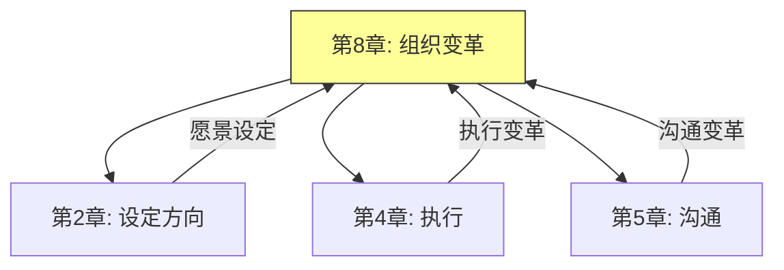
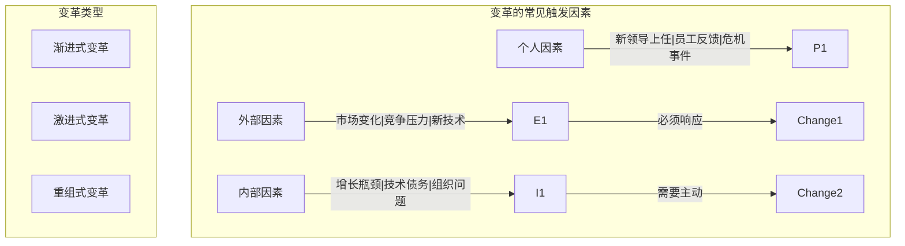
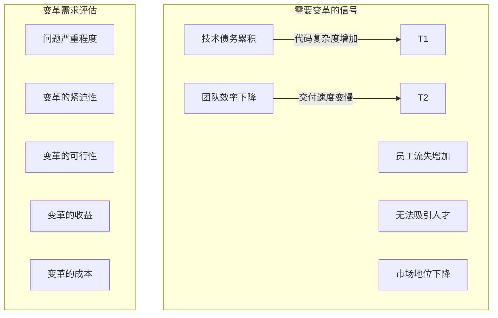
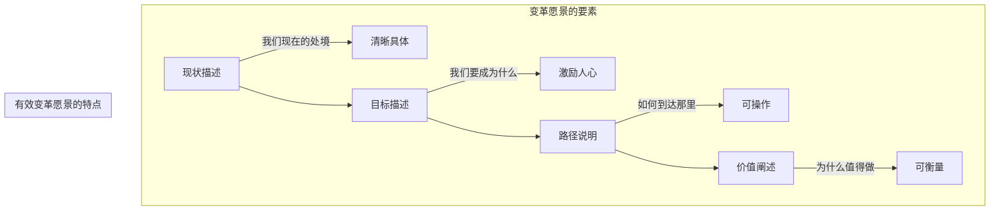
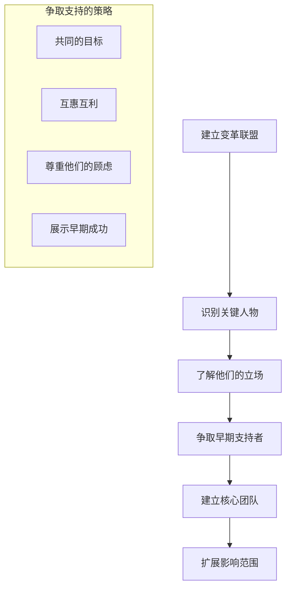
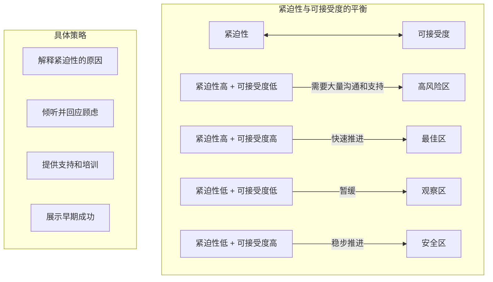
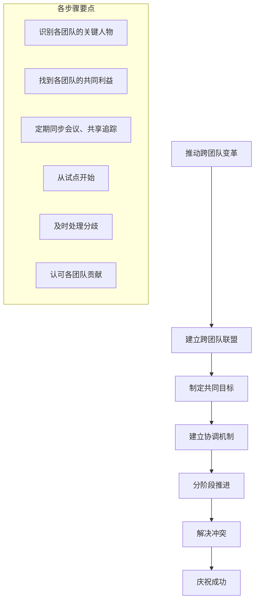

# 《The Staff Engineer's Path》- 第8章：组织变革（深度版）

## 一、本章概述

本章深入探讨了**组织变革**——作为Staff Engineer如何推动技术组织中的变革。推动变革是技术领导者最重要的职责之一，但也是最具挑战性的工作。

> **本章核心问题**：如何识别变革的时机？如何克服变革阻力？如何建立联盟并推动创新？如何让变革持续？

### 1.1 核心主题
- 变革的时机识别
- 变革阻力的克服
- 建立变革联盟
- 推动技术创新
- 变革的持续性

### 1.2 重要程度
⭐⭐⭐⭐（高）

### 1.3 预计学习时间
50-70分钟

### 1.4 本章与其他章节的关联



---

## 二、变革的时机识别

### 2.1 变革的触发因素



### 2.2 识别变革需求



### 2.3 制定变革愿景



---

## 三、变革阻力的克服

### 3.1 阻力的来源

```mermaid
%%{init: {"graph": {"defaultLayout": "td", "rankdir": "TB"}, "subGraph": {"ranksep": 80}}}%%
graph TD
    subgraph 阻力来源["变革阻力的来源"]
        R1[认知阻力] -->|"不理解为什么需要变革"| C1
        R2[情感阻力] -->|"害怕未知、不安全感"| C2
        R3[利益阻力] -->|"变革影响个人利益"| C3
        R4[能力阻力] -->|"缺乏新技能]| C4
        R5[文化阻力] -->|"现有文化抵制]| C5

        C1 -->|"信息不足"| S1
        C2 -->|"恐惧"| S2
        C3 -->|"担忧"| S3
    end

    subgraph 阻力表现["阻力的常见表现"]
        P1[消极抵制]
        P2[公开反对]
        P3[拖延执行]
        P4[寻找替罪羊]
    end
```

### 3.2 克服阻力的策略

```mermaid
%%{init: {"graph": {"defaultLayout": "td", "rankdir": "TB"}, "subGraph": {"ranksep": 80}}}%%
graph TD
    subgraph 克服策略["克服变革阻力的策略"]
        S1[教育与沟通] -->|"解释为什么需要变革"| E1
        S2[参与和投入] -->|"让人们参与决策"| E2
        S3[支持与资源] -->|"提供培训和支持"| E3
        S4[协商与协议] -->|"寻找共赢方案"| E4
        S5[渐进推进] -->|"小步快跑]| E5
        S6[榜样示范] -->|"领导以身作则]| E6

        E1 -->|"消除误解"| R1
        E2 -->|"增加认同]| R2
    end
```

### 3.3 处理反对者

```mermaid
%%{init: {"graph": {"defaultLayout": "td", "rankdir": "TB"}, "subGraph": {"ranksep": 80}}}%%
graph TD
    subgraph 反对者类型["不同类型的反对者"]
        Type1["怀疑者"] -->|"需要更多信息"| Approach1["提供数据和证据"]
        Type2["恐惧者"] -->|"害怕变化"| Approach2["提供支持和保证"]
        Type3["利益受损者"] -->|"利益受损]| Approach3["协商补偿方案"]
        Type4["蓄意破坏者"] -->|"故意反对]| Approach4["坚定立场、必要时处理"]

        subgraph 处理原则["处理原则"]
            P1["先理解后回应"]
            P2["区分观点和人"]
            P3["尽可能争取"]
            P4["必要时果断"]
        end
    end
```

---

## 四、建立变革联盟

### 4.1 识别关键角色

```mermaid
%%{init: {"graph": {"defaultLayout": "td", "rankdir": "TB"}, "subGraph": {"ranksep": 80}}}%%
graph TD
    subgraph 变革联盟["变革联盟的关键角色"]
        R1[发起人 Sponsor] -->|"高层支持"| S1
        R2[倡导者 Champion] -->|"内部推动]| S2
        R3[执行者 Executor] -->|"具体执行]| S3
        R4[影响者 Influencer] -->|"影响舆论]| S4

        S1 -->|"提供资源和权威"| T1
        S2 -->|"日常推动"| T2
    end

    subgraph 角色职责["各角色职责"]
        Sponsor["高层发起人：支持、授权、资源"]
        Champion["倡导者：说服、推动、协调"]
        Executor["执行团队：实施、监控、调整"]
        Influencer["影响者：传播、示范、影响"]
    end
```

### 4.2 建立联盟的步骤



### 4.3 高层支持的重要性

```mermaid
%%{init: {"graph": {"defaultLayout": "td", "rankdir": "TB"}, "subGraph": {"ranksep": 80}}}%%
graph TD
    subgraph 高层支持["高层支持的重要性"]
        I1[合法性] -->|"变革获得授权"| L1
        I2[资源] -->|"获得所需资源"| R1
        I3[障碍清除] -->|"帮助克服阻力]| O1
        I4[信号传递] -->|"表明变革重要性]| S1

        L1 -->|"员工相信变革是认真的"| Impact1
        R1 -->|"有足够资源执行"| Impact2
    end

    subgraph 获取支持["获取高层支持的策略"]
        Strategy1["清晰阐述业务价值"]
        Strategy2["展示成功案例"]
        Strategy3["解决他们的顾虑"]
        Strategy4["持续沟通进展"]
    end
```

---

## 五、推动技术创新

### 5.1 技术创新的类型

```mermaid
%%{init: {"graph": {"defaultLayout": "td", "rankdir": "TB"}, "subGraph": {"ranksep": 80}}}%%
graph TD
    subgraph 创新类型["技术创新的类型"]
        I1[流程创新] -->|"如何做事的改进"| P1
        I2[产品创新] -->|"做什么的改进"| P2
        I3[技术栈创新] -->|"使用什么工具]| P3
        I4[架构创新] -->|"系统设计改进]| P4

        P1 -->|"CI/CD、自动化"| Example1
        P2 -->|"新功能、新产品"| Example2
        P3 -->|"采用新技术]| Example3
    end
```

### 5.2 创新文化的要素

```mermaid
%%{init: {"graph": {"defaultLayout": "td", "rankdir": "TB"}, "subGraph": {"ranksep": 80}}}%%
graph TD
    subgraph 创新文化["支持创新的文化要素"]
        C1[心理安全] -->|"敢于尝试、不怕失败"| S1
        C2[实验文化] -->|"鼓励小实验]| S2
        C3[容忍失败] -->|"从失败中学习]| S3
        C4[时间投资] -->|"为创新预留时间]| S4
        C5[认可创新] -->|"奖励创新行为]| S5

        S1 -->|"员工敢于提出新想法"| R1
        S2 -->|"通过实验验证想法"| R2
    end
```

### 5.3 创新实施策略

```mermaid
%%{init: {"graph": {"defaultLayout": "td", "rankdir": "TB"}, "subGraph": {"ranksep": 80}}}%%
graph TD
    subgraph 创新策略["推动技术创新的策略"]
        S1[小规模实验] -->|"先小范围验证"| P1
        S2[快速失败] -->|"快速学习"| P2
        S3[证据驱动] -->|"用数据说话]| P3
        S4[逐步推广] -->|"成功后再扩大"| P4

        P1 -->|"降低风险"| Benefit1
        P2 -->|"减少浪费"| Benefit2
    end

    subgraph 创新流程["创新实施流程"]
        F1[想法产生]
        F2[实验验证]
        F3[评估决策]
        F4[逐步推广]
        F5[持续优化]
    end
```

---

## 六、变革的持续性

### 6.1 变革疲劳

```mermaid
%%{init: {"graph": {"defaultLayout": "td", "rankdir": "TB"}, "subGraph": {"ranksep": 80}}}%%
graph TD
    subgraph 变革疲劳["变革疲劳的表现和原因"]
        Symptom1["参与度下降"]
        Symptom2["抵触情绪增加]
        Symptom3["执行质量下降"]

        Cause1["变革过多"]
        Cause2["变革太快"]
        Cause3["缺乏休息"]
        Cause4["看不到尽头"]

        Symptom -->|"恶性循环"| Cause
        Cause -->|"恶性循环"| Symptom
    end

    subgraph 预防策略["预防变革疲劳的策略"]
        P1["控制变革节奏"]
        P2["提供恢复时间"]
        P3["庆祝小胜利"]
        P4["保持透明沟通"]
    end
```

### 6.2 变革制度化

```mermaid
%%{init: {"graph": {"defaultLayout": "td", "rankdir": "TB"}, "subGraph": {"ranksep": 80}}}%%
graph TD
    subgraph 制度化["将变革制度化的步骤"]
        S1[嵌入流程] -->|"成为日常工作的一部分"| P1
        S2[更新政策] -->|"反映新的做事方式]| P2
        S3[培训新人] -->|"确保新人学习新方式]| P3
        S4[持续改进] -->|"根据反馈调整]| P4

        P1 -->|"从变革到常规"| R1
    end

    subgraph 关键要素["确保变革持续的关键"]
        K1[领导持续支持]
        K2[指标持续追踪]
        K3[文化持续塑造]
        K4[奖励持续对齐]
    end
```

### 6.3 变革评估与调整

```mermaid
%%{init: {"graph": {"defaultLayout": "td", "rankdir": "TB"}, "subGraph": {"ranksep": 80}}}%%
graph TD
    subgraph 变革评估["评估变革成功的指标"]
        M1[结果指标] -->|"目标达成情况"| I1
        M2[过程指标] -->|"变革执行情况"| I2
        M3[文化指标] -->|"行为改变情况]| I3
        M4[满意度指标] -->|"员工反馈]| I4

        I1 -->|"按时交付|质量达标"| R1
        I2 -->|"采用率|参与度"| R2
    end

    subgraph 调整机制["根据评估调整"]
        A1[收集反馈]
        A2[分析问题]
        A3[调整策略]
        A4[重新沟通]
    end
```

---

## 七、面试题整理

### 7.1 概念理解类 🌱

**Q1：变革为什么会失败？最常见的原因是什么？**

**答案：**

**变革失败的常见原因：**

| 原因 | 说明 | 比例 |
|-----|-----|-----|
| **缺乏高层支持** | 没有足够的资源和授权 | 高 |
| **沟通不足** | 员工不理解变革的意义 | 高 |
| **抵制变革** | 员工不愿意改变 | 高 |
| **执行不力** | 好的计划没有有效执行 | 中 |
| **变革疲劳** | 变革太多导致倦怠 | 中 |
| **目标不清** | 不清楚要达成什么 | 中 |

**最重要的失败原因通常是缺乏有效的沟通和利益相关者的支持。**

**Q2：如何平衡变革的紧迫性和员工的可接受度？**

**答案：**

**平衡策略：**



---

### 7.2 实践应用类 🌿

**Q3：如何推动一个需要跨团队协作的大型技术变革？**

**答案：**

**推动步骤：**



**关键成功因素：**
1. **共同目标** - 让各团队看到合作的收益
2. **明确责任** - 谁做什么要清晰
3. **协调机制** - 定期沟通、同步进度
4. **高层支持** - 解决跨团队争议

**Q4：如何处理变革中消极抵制的员工？**

**答案：**

**处理方法：**

```mermaid
%%{init: {"graph": {"defaultLayout": "td", "rankdir": "TB"}, "subGraph": {"ranksep": 80}}}%%
graph TD
    subgraph 处理流程["处理消极抵制员工的流程"]
        Step1["了解原因"] -->|"为什么抵制"| Q1
        Q1 --> Step2["分类处理"] -->|"能否争取"| Q2
        Q2 -->|"可以争取"| Step3["尝试说服"]
        Q2 -->|"无法争取"| Step4["设定界限"]
        Step3 --> Step5["观察行为"]
        Step4 --> Step5
        Step5 --> Step6{"行为改变?"}
        Step6 -->|"是"| Step7["继续观察"]
        Step6 -->|"否"| Step8["正式处理"]
    end

    subgraph 处理策略["针对不同原因的策略"]
        Reason1["不了解变革"] -->|"更多沟通"| Strategy1
        Reason2["担心利益受损"] -->|"回应顾虑]| Strategy2
        Reason3["习惯旧方式"] -->|"培训支持]| Strategy3
        Reason4["就是不想变"] -->|"设定最后期限]| Strategy4
    end
```

---

### 7.3 场景分析类 🔧

**Q5：你推动的一个重要技术变革在执行中遇到了严重阻力，进展停滞。你会怎么处理？**

**答案：**

**处理策略：**

```mermaid
%%{init: {"graph": {"defaultLayout": "td", "rankdir": "TB"}, "subGraph": {"ranksep": 80}}}%%
flowchart TD
    A[变革停滞] --> B[诊断原因]
    B --> C{原因?}
    C -->|"阻力太大"| D[重新评估阻力]
    C -->|"资源不足"| E[寻求更多资源]
    C -->|"计划问题"| F[调整计划]
    C -->|"领导支持不足]| G[升级问题]

    D --> D1["尝试新的沟通方式"]
    D --> D2["寻找支持者"]
    D --> D3["小规模试点成功后再推广"]

    E --> E1["向高层说明影响"]
    E --> E2["重新分配优先级"]

    F --> F1["简化变革范围"]
    F --> F2["调整时间表"]

    G --> G1["寻求高层的公开支持"]
    G --> G2["了解高层顾虑"]

    所有路径 --> H[重新启动变革]
```

**关键行动：**
1. **暂停并诊断** - 不要盲目继续
2. **坦诚沟通** - 承认问题，寻求反馈
3. **调整策略** - 根据反馈调整方法
4. **寻求支持** - 需要时升级
5. **重新出发** - 带着新的方法

---

## 八、实践要点

### 8.1 变革规划模板

```markdown
# 变革规划模板

## 变革概述
- 变革名称：[名称]
- 变革目标：[具体目标]
- 变革范围：[影响范围]

## 背景和原因
- 为什么要变革？
- 不变革的后果是什么？
- 变革的收益是什么？

## 变革策略
- 主要方法：[核心策略]
- 变革节奏：[渐进/激进]
- 关键里程碑：[里程碑列表]

## 利益相关者分析
- 支持者：[名单和支持方式]
- 反对者：[名单和应对策略]
- 中立者：[争取策略]

## 沟通计划
- 沟通对象和内容
- 沟通方式和频率
- 关键信息

## 风险和应对
- 风险1：[描述] - [应对措施]
- 风险2：[描述] - [应对措施]

## 成功指标
- 指标1：[如何衡量]
- 指标2：[如何衡量]

## 时间表
- 阶段1：[时间和任务]
- 阶段2：[时间和任务]
- 阶段3：[时间和任务]
```

### 8.2 常见问题与解决方案

| 问题 | 原因 | 解决方案 |
|-----|-----|---------|
| **变革阻力大** | 沟通不足、参与不够 | 更多沟通和参与 |
| **变革疲劳** | 变革太多太快 | 控制节奏 |
| **高层支持不足** | 价值不清 | 重新阐述价值 |
| **执行不力** | 计划问题 | 调整计划 |
| **变革无法持续** | 没有制度化 | 嵌入流程和政策 |

### 8.3 变革领导者自检清单

```markdown
# 变革领导者自检清单

## 准备阶段
- [ ] 变革愿景清晰吗？
- [ ] 高层支持确认了吗？
- [ ] 关键利益相关者了解了吗？
- [ ] 变革计划制定了吗？

## 执行阶段
- [ ] 沟通充分吗？
- [ ] 阻力在掌控中吗？
- [ ] 进度符合预期吗？
- [ ] 资源充足吗？

## 收尾阶段
- [ ] 变革目标达成了吗？
- [ ] 变革制度化了吗？
- [ ] 经验教训总结了吗？
- [ ] 团队认可了吗？
```

---

## 九、扩展阅读

### 9.1 推荐资源

| 资源 | 类型 | 说明 |
|-----|-----|-----|
| 《Leading Change》 | 书籍 | 约翰·科特变革管理 |
| 《The Paradox of Change》 | 文章 | 变革的两难 |
| 《Diffusions of Innovations》 | 书籍 | 创新扩散理论 |
| 《Switch》 | 书籍 | 改变行为的框架 |

### 9.2 实践项目

- 主导一个小规模流程改进项目
- 组织跨团队协作改进
- 建立新的技术标准并推广

---

## 十、本章小结

### 核心收获

1. **变革需要时机和准备**
   - 识别变革触发因素
   - 评估变革需求
   - 制定清晰愿景

2. **阻力是变革的必然部分**
   - 理解阻力的来源
   - 使用多种策略克服
   - 灵活处理不同类型反对者

3. **联盟是变革成功的关键**
   - 识别关键角色
   - 建立支持网络
   - 获取和维持高层支持

4. **创新需要文化支持**
   - 建立心理安全
   - 鼓励小实验
   - 容忍失败

5. **变革需要持续性**
   - 防止变革疲劳
   - 将变革制度化
   - 持续评估和调整

### 关键概念地图

```mermaid
%%{init: {"graph": {"defaultLayout": "td", "rankdir": "TB"}, "subGraph": {"ranksep": 80}}}%%
mindmap
  root((组织变革))
    变革时机
      触发因素
      需求识别
      愿景制定
    阻力克服
      阻力来源
      克服策略
      处理反对者
    变革联盟
      关键角色
      建立步骤
      高层支持
    技术创新
      创新类型
      创新文化
      实施策略
    持续性
      防止疲劳
      制度化
      评估调整
```

### 下一章预告

第9章将探讨**总结与展望**，回顾Staff Engineer的角色和能力，并为未来发展指明方向：
- Staff Engineer角色总结
- 核心能力回顾
- 持续发展路径
- 给后来者的建议

---

## 附录 A：变革管理模型对比

| 模型 | 核心思想 | 步骤 | 适用场景 |
|-----|---------|-----|---------|
| Kotter 8步 | 紧迫感→持续 | 8个步骤 | 大型组织变革 |
| ADKAR | 个人变革 | 5个阶段 | 变革沟通 |
| Lewin | 解冻→变革→冻结 | 3个阶段 | 简单变革 |
|双环学习 | 变革思维模式 | 2个循环 | 深层变革 |

---

*文档生成时间：2024-01-08*
*基于《The Staff Engineer's Path》第8章*
