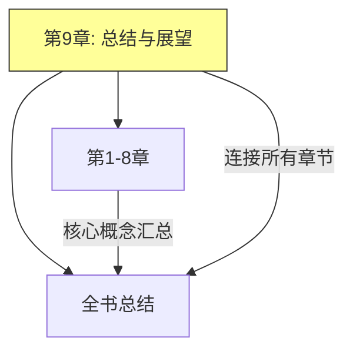
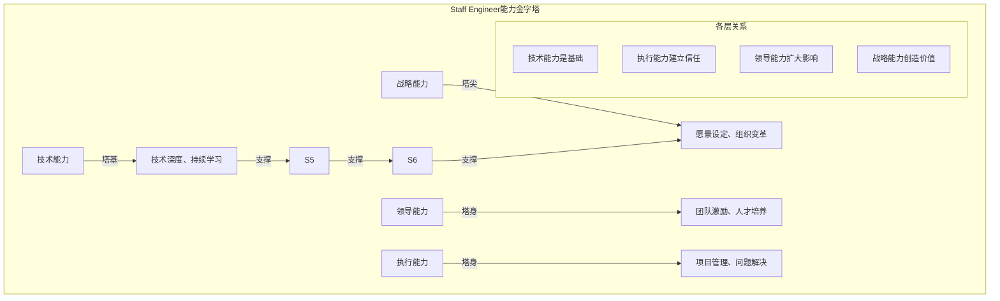
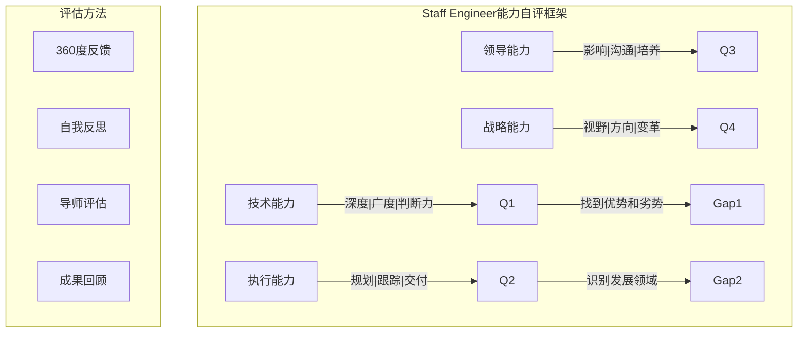
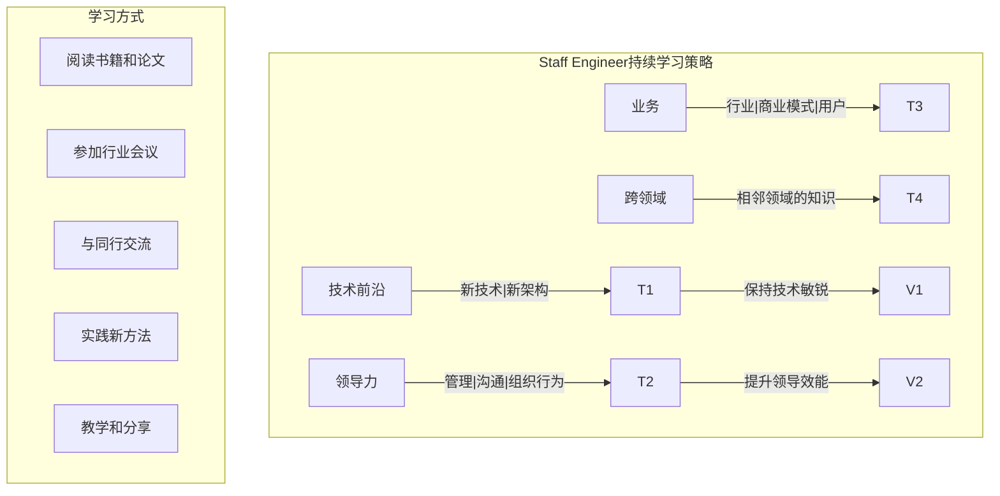
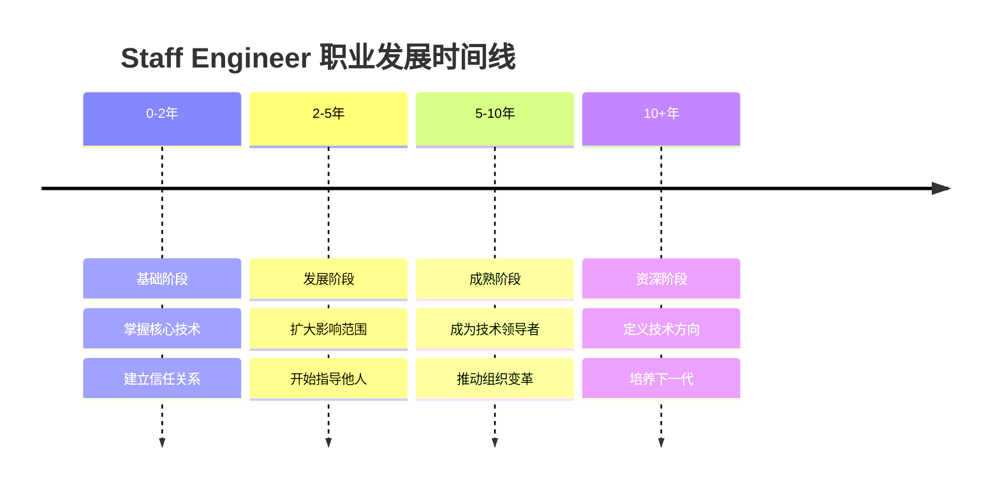
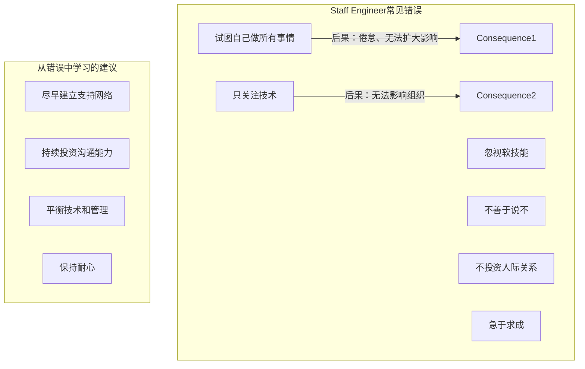
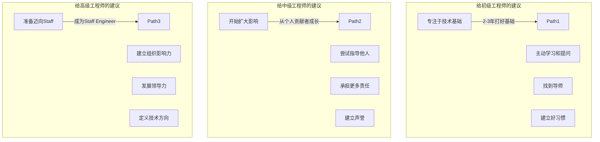
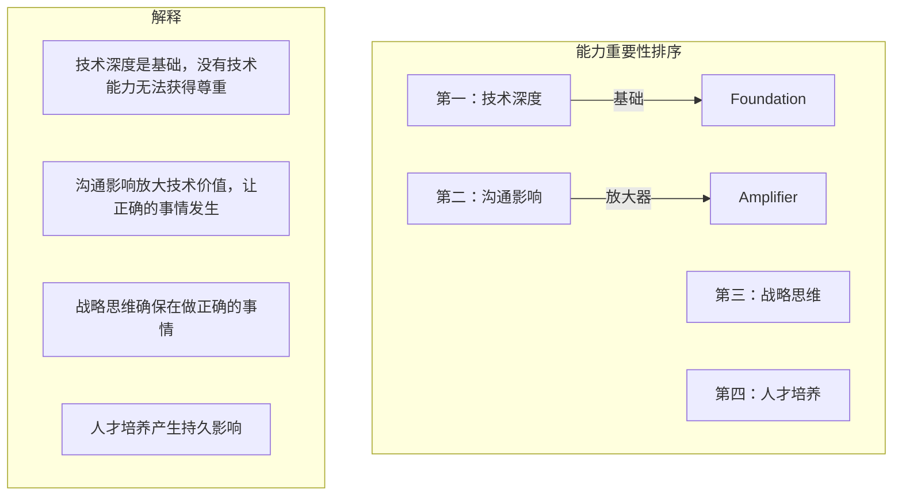
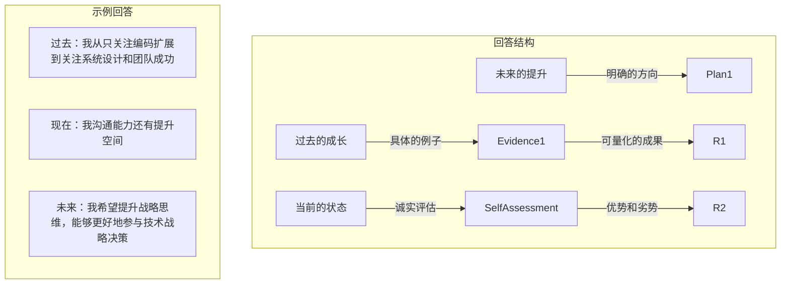
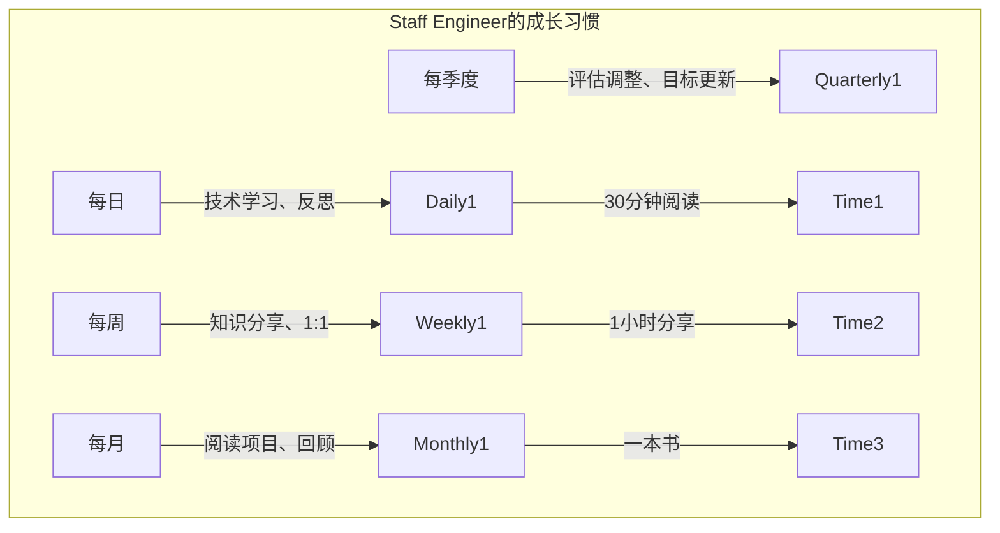

# 《The Staff Engineer's Path》- 第9章：总结与展望（深度版）

## 一、本章概述

本章作为全书的收尾，对**Staff Engineer**的角色进行了全面总结，回顾了前8章的核心内容，并展望了技术领导者的未来发展方向。本章旨在帮助读者整合所学知识，形成系统的认知框架。

> **本章核心问题**：Staff Engineer的核心价值是什么？需要持续培养的关键能力有哪些？如何在职业道路上持续成长？

### 1.1 核心主题
- Staff Engineer角色总结
- 核心能力框架
- 持续发展路径
- 给后来者的建议
- 技术领导力的未来

### 1.2 重要程度
⭐⭐⭐⭐（高）

### 1.3 预计学习时间
40-60分钟

### 1.4 本章与其他章节的关联



---

## 二、Staff Engineer角色总结

### 2.1 角色核心价值

```mermaid
%%{init: {"graph": {"defaultLayout": "td", "rankdir": "TB"}, "subGraph": {"ranksep": 80}}}%%
graph TD
    subgraph 价值创造["Staff Engineer的核心价值"]
        V1[技术方向] -->|"设定正确的技术方向"| E1
        V2[技术执行] -->|"解决最困难的技术问题"| E2
        V3[人才培养] -->|"培养和发展团队能力"| E3
        V4[组织影响] -->|"提升整个组织的技术水平]| E4

        E1 -->|"避免技术债务积累"| R1
        E2 -->|"突破技术瓶颈"| R2
        E3 -->|"团队能力持续提升"| R3
    end

    subgraph 角色特点["Staff Engineer的独特之处"]
        U1[既是技术专家又是领导者]
        U2[通过影响力而非权力工作]
        U3[连接技术与业务]
        U4[培养下一代领导者]
    end
```

### 2.2 角色演变

```mermaid
%%{init: {"graph": {"defaultLayout": "td", "rankdir": "TB"}, "subGraph": {"ranksep": 80}}}%%
graph TD
    subgraph 角色演变["Staff Engineer角色的演变"]
        Phase1[技术专家] -->|"专注于技术深度"| S1
        Phase2[技术领导者] -->|"开始影响团队"| S2
        Phase3[组织影响者] -->|"影响整个组织]| S3
        Phase4[战略伙伴] -->|"参与技术战略]| S4

        S1 -->|"2-3年"| Timeline1
        S2 -->|"3-5年"| Timeline2
        S3 -->|"5-8年"| Timeline3
    end

    subgraph 能力提升["各阶段能力提升"]
        P1["编码→架构设计"]
        P2["完成任务→设定方向"]
        P3["团队影响→组织影响"]
    end
```

### 2.3 四种Staff Engineer类型回顾

```mermaid
%%{init: {"graph": {"defaultLayout": "td", "rankdir": "TB"}, "subGraph": {"ranksep": 80}}}%%
graph TD
    subgraph 四种类型["四种Staff Engineer类型"]
        Type1[技术负责人] -->|"团队技术方向"| C1
        Type2[架构师] -->|"系统设计和标准"| C2
        Type3[问题解决者] -->|"攻克最难问题]| C3
        Type4[助手角色] -->|"支持CTO工作]| C4

        C1 -->|"适合喜欢领导团队的人"| Fit1
        C2 -->|"适合喜欢系统设计的人"| Fit2
    end

    subgraph 类型发展["类型不是固定的"]
        D1["可以同时具备多种特质"]
        D2["可以根据需要调整"]
        D3["随职业发展演变"]
    end
```

---

## 三、核心能力框架

### 3.1 能力金字塔



### 3.2 关键能力详解

| 能力领域 | 核心技能 | 表现形式 |
|---------|---------|---------|
| **技术能力** | 系统设计、技术深度 | 能解决最困难的技术问题 |
| **执行能力** | 项目管理、问题解决 | 能将想法转化为成果 |
| **领导能力** | 沟通影响、人才培养 | 能激励和培养他人 |
| **战略能力** | 方向设定、组织变革 | 能定义正确的技术方向 |

### 3.3 能力评估



---

## 四、持续发展路径

### 4.1 Staff Engineer的下一步

```mermaid
%%{init: {"graph": {"defaultLayout": "td", "rankdir": "TB"}, "subGraph": {"ranksep": 80}}}%%
graph TD
    subgraph 发展方向["Staff Engineer的发展方向"]
        D1[Principal Engineer] -->|"更大的组织影响"| E1
        D2[Distinguished Engineer] -->|"技术远见和创新"| E2
        D3[Engineering Manager] -->|"转向管理路线]| E3
        D4[VP of Engineering] -->|"更高层管理]| E4
        D5[Individual Contributor继续深耕] -->|"继续技术领导]| E5

        D1 -->|"需要更广泛的影响力"| R1
        D3 -->|"需要发展管理技能]| R2
    end
```

### 4.2 持续学习策略



### 4.3 职业发展时间线



---

## 五、给后来者的建议

### 5.1 成功Staff Engineer的特质

```mermaid
%%{init: {"graph": {"defaultLayout": "td", "rankdir": "TB"}, "subGraph": {"ranksep": 80}}}%%
graph TD
    subgraph 成功特质["成功Staff Engineer的共同特质"]
        T1[好奇心] -->|"对新事物保持兴趣"| C1
        T2[谦逊] -->|"承认不知道的事情]| C2
        T3[坚韧] -->|"面对挑战不放弃]| C3
        T4[同理心] -->|"理解他人的需求]| C4
        T5[责任感] -->|"对结果负责]| C5
        T6[视野] -->|"看到更大的图景]| C6

        C1 -->|"持续学习"| R1
        C2 -->|"建立信任]| R2
    end

    subgraph 需要避免["需要避免的陷阱"]
        Trap1["认为自己无所不知"]
        Trap2["只关注技术"]
        Trap3["不愿意培养他人"]
        Trap4["害怕冲突"]
    end
```

### 5.2 常见错误与教训



### 5.3 给不同阶段工程师的建议



---

## 六、技术领导力的未来

### 6.1 技术趋势对Staff Engineer的影响

```mermaid
%%{init: {"graph": {"defaultLayout": "td", "rankdir": "TB"}, "subGraph": {"ranksep": 80}}}%%
graph TD
    subgraph 技术趋势["影响技术领导力的趋势"]
        T1[AI和自动化] -->|"改变工作方式"| Impact1
        T2[云原生] -->|"新的架构模式"| Impact2
        T3[远程工作] -->|"新的协作方式]| Impact3
        T4[快速迭代] -->|"更高的要求"| Impact4

        Impact1 -->|"需要学习AI工具和原理"| Adaptation1
        Impact2 -->|"掌握云原生架构"| Adaptation2
    end

    subgraph 应对策略["应对策略"]
        Strategy1["保持学习新技术"]
        Strategy2["适应新的工作模式"]
        Strategy3["培养适应性思维"]
        Strategy4["关注技术伦理"]
    end
```

### 6.2 未来需要的技能

```mermaid
%%{init: {"graph": {"defaultLayout": "td", "rankdir": "TB"}, "subGraph": {"ranksep": 80}}}%%
graph TD
    subgraph 未来技能["未来需要的技能"]
        F1[AI/ML素养] -->|"理解AI能力边界"| S1
        F2[跨领域整合] -->|"连接技术和业务]| S2
        F3[远程领导] -->|"领导分布式团队]| S3
        F4[变革管理] -->|"持续适应变化]| S4
        F5[伦理思考] -->|"技术伦理决策]| S5

        S1 -->|"不被AI取代反而利用AI"| Value1
        S2 -->|"成为技术和业务的桥梁"| Value2
    end
```

### 6.3 持续成功的原则

```mermaid
%%{init: {"graph": {"defaultLayout": "td", "rankdir": "TB"}, "subGraph": {"ranksep": 80}}}%%
graph TD
    subgraph 成功原则["持续成功的原则"]
        P1[保持好奇] -->|"永远学习"| R1
        P2[保持谦逊] -->|"承认局限]| R2
        P3[保持连接] -->|"建立网络]| R3
        P4[保持平衡] -->|"工作生活平衡]| R4
        P5[保持服务] -->|"为他人创造价值]| R5

        R1 -->|"适应未来"| Future1
        R5 -->|"产生持久影响"| Future2
    end

    subgraph 核心心态["核心心态"]
        Mindset1["成长型思维"]
        Mindset2["服务型领导"]
        Mindset3["长期视角"]
    end
```

---

## 七、全书核心概念回顾

### 7.1 各章节核心要点

```mermaid
%%{init: {"graph": {"defaultLayout": "td", "rankdir": "TB"}, "subGraph": {"ranksep": 80}}}%%
graph TD
    subgraph 章节回顾["各章节核心要点"]
        Chapter1[成为Staff Engineer] -->|"角色定位、类型、评估"| K1
        Chapter2[设定方向] -->|"愿景、路线图、决策"| K2
        Chapter3[做正确的事] -->|"优先级、说不、委派"| K3
        Chapter4[执行] -->|"规划、跟踪、风险管理"| K4
        Chapter5[沟通] -->|"写作、演示、反馈]| K5
        Chapter6[成为榜样] -->|"行为示范、信任、操守]| K6
        Chapter7[指导] -->|"指导、反馈、培养"| K7
        Chapter8[组织变革] -->|"变革、阻力、创新]| K8

        K1 -->|"奠定基础"| Foundation
        K2 -->|"定义方向"| Direction
        K3 -->|"选择重点"| Focus
        K4 -->|"落地执行"| Execution
    end
```

### 7.2 能力-章节映射

| 能力 | 相关章节 | 关键技能 |
|-----|---------|---------|
| 技术能力 | 第1、2、4章 | 系统设计、技术判断 |
| 执行能力 | 第3、4章 | 优先级、项目管理 |
| 领导能力 | 第5、6、7章 | 沟通、示范、指导 |
| 战略能力 | 第2、8章 | 愿景设定、组织变革 |

---

## 八、面试题整理

### 8.1 综合理解类 🌱

**Q1：作为一个Staff Engineer，你认为最重要的能力是什么？**

**答案：**

**核心能力框架：**



**个人化回答建议：**
- 结合自己的经历
- 说明为什么这个能力对你重要
- 展示你在这些能力上的证据

**Q2：如果让你给想成为Staff Engineer的人一条建议，你会给什么？**

**答案：**

**最重要的建议：**

```
"不要只关注技术能力的提升，要同时投资于影响力和人际关系的建立。

Staff Engineer不是最聪明的工程师，而是能够产生最大组织影响的工程师。

这意味着你需要：
1. 解决问题而非只做任务
2. 培养他人而非只自己干
3. 建立关系而非只写代码
4. 设定方向而非只执行

找到你的杠杆点，做那些只有你能做、且影响最大的事情。"
```

---

### 8.2 场景应用类 🌿

**Q3：回顾你的职业发展，你认为自己最大的成长是什么？未来还需要提升什么？**

**答案：**

**回答框架：**



**关键点：**
1. **诚实** - 承认自己的不足
2. **具体** - 用例子支持观点
3. **成长心态** - 展示学习和改进的意愿

---

### 8.3 未来展望类 🔧

**Q4：你认为5年后的技术领导者会有什么不同？需要具备什么新能力？**

**答案：**

**未来趋势分析：**

```mermaid
%%{init: {"graph": {"defaultLayout": "td", "rankdir": "TB"}, "subGraph": {"ranksep": 80}}}%%
graph TD
    subgraph 未来变化["5年后的变化"]
        Change1[AI辅助工作]
        Change2[分布式团队]
        Change3[快速变化的技术]
        Change4[更高的伦理要求]

        Change1 -->|"AI素养"| NewSkill1
        Change2 -->|"远程领导力"| NewSkill2
        Change3 -->|"适应和学习能力"| NewSkill3
        Change4 -->|"技术伦理判断]| NewSkill4
    end

    subgraph 核心不变["核心不变的能力"]
        Core1[深度技术能力]
        Core2[沟通和影响]
        Core3[解决问题的能力]
        Core4[人才培养能力]
    end

    NewSkill1 -->|"与核心能力结合"| FutureRole
```

**回答要点：**
- 承认不确定性
- 识别关键趋势
- 展示适应能力
- 强调核心能力的持续重要性

---

## 九、实践要点

### 9.1 个人发展行动计划

```markdown
# Staff Engineer 个人发展计划

## 自我评估（每季度更新）
| 能力领域 | 评分(1-5) | 目标评分 | 差距 |
|---------|----------|---------|-----|
| 技术深度 | | | |
| 执行能力 | | | |
| 沟通影响 | | | |
| 领导能力 | | | |
| 战略思维 | | | |

## 本季度目标
1. [目标1]
2. [目标2]
3. [目标3]

## 行动项
- [ ] 读X本书
- [ ] 参加X个会议
- [ ] 指导X个人
- [ ] 推动X个项目

## 成功指标
- [指标1]：达成标准
- [指标2]：达成标准

## 定期回顾
- 月度回顾：[日期]
- 季度评估：[日期]
```

### 9.2 持续成长习惯



### 9.3 常见问题与解决方案

| 问题 | 解决方案 |
|-----|---------|
| **感觉停滞不前** | 寻找新的挑战、学习新领域 |
| **工作生活失衡** | 设定边界、学会说不 |
| **缺乏方向** | 与导师讨论、重新评估目标 |
| **影响力有限** | 寻找更大的舞台、建立联盟 |
| **技术落后** | 专注学习、建立学习时间 |

---

## 十、扩展阅读

### 10.1 推荐资源

| 资源 | 类型 | 说明 |
|-----|-----|-----|
| 《The Staff Engineer's Path》 | 原文 | 本书英文原版 |
| 《Manager's Path》 | 书籍 | 技术管理者路径 |
| 《Engineering Management for the Rest of Us》 | 书籍 | 工程管理指南 |
| Tech Lead 播客 | 播客 | 技术领导者分享 |

### 10.2 社区资源

- Staff Engineer Summit
- Level Up: Engineering Leadership
- 技术领导者Slack/Discord社区

### 10.3 持续学习路径

- 参加技术会议
- 写作技术博客
- 指导他人
- 参与开源
- 跨领域学习

---

## 十一、本章小结

### 核心收获

1. **Staff Engineer是技术领导者**
   - 通过影响而非权力工作
   - 设定技术方向、解决关键问题、培养人才
   - 有四种类型：技术负责人、架构师、问题解决者、助手

2. **能力需要平衡发展**
   - 技术能力是基础
   - 执行、领导、战略能力层层递进
   - 持续评估和发展

3. **持续发展是终身旅程**
   - 从Staff到Principal甚至更高
   - 保持学习、谦逊、好奇心
   - 适应技术和组织的变化

4. **成功有章可循**
   - 专注于产生最大影响的事情
   - 建立人际网络和信任
   - 培养下一代领导者

### 关键概念地图

```mermaid
%%{init: {"graph": {"defaultLayout": "td", "rankdir": "TB"}, "subGraph": {"ranksep": 80}}}%%
mindmap
  root((总结与展望))
    角色总结
      核心价值
      角色演变
      四种类型
    能力框架
      能力金字塔
      关键能力
      能力评估
    持续发展
      发展方向
      学习策略
      时间线
    未来趋势
      技术影响
      新技能
      核心原则
```

---

## 附录 A：Staff Engineer成长路径图

| 阶段 | 关键能力 | 影响力范围 | 典型产出 |
|-----|---------|-----------|---------|
| 高级工程师 | 技术深度、项目领导 | 团队 | 成功项目、技术债务还清 |
| Staff Engineer | 技术领导、跨团队影响 | 多个团队 | 技术方向、团队培养 |
| Principal Engineer | 战略思维、组织影响 | 整个工程组织 | 技术战略、组织变革 |
| Distinguished Engineer | 技术远见、行业影响 | 公司/行业 | 技术创新、行业领导 |

## 附录 B：Staff Engineer核心能力清单

| 能力 | 初级水平 | 熟练水平 | 精通水平 |
|-----|---------|---------|---------|
| 技术深度 | 掌握核心技术 | 解决复杂问题 | 定义技术方向 |
| 系统设计 | 设计模块 | 设计系统 | 设计架构 |
| 沟通 | 清晰表达 | 有效影响 | 战略沟通 |
| 领导 | 指导他人 | 培养团队 | 建立文化 |
| 战略 | 执行策略 | 参与策略 | 制定策略 |

---

*文档生成时间：2024-01-08*
*基于《The Staff Engineer's Path》第9章*
*全书完结*
