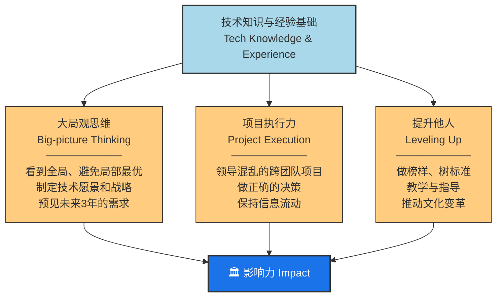
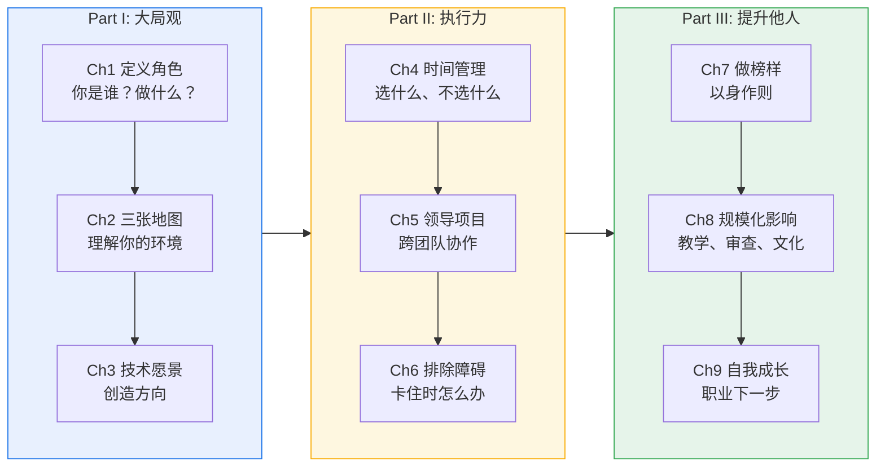

# 《The Staff Engineer's Path》全书总览

> **作者**：Tanya Reilly | **出版**：O'Reilly, 2022年9月
> **副标题**：A Guide for Individual Contributors Navigating Growth and Change
> 一本关于如何在技术路线（IC Track）上持续成长为高级技术领导者的实操指南。

---

## 全书章节导航

| Part | 章节 | 文件 |
|---|---|---|
| **Part I: 大局观** | Ch1: 你在这里做什么？ | [[ch1_你在这里做什么]] |
| | Ch2: 三张地图 | [[ch2_三张地图]] |
| | Ch3: 创造大局观 | [[ch3_创造大局观]] |
| **Part II: 执行力** | Ch4: 有限的时间 | [[ch4_有限的时间]] |
| | Ch5: 领导大项目 | [[ch5_领导大项目]] |
| | Ch6: 为什么停滞了 | [[ch6_为什么停滞了]] |
| **Part III: 提升他人** | Ch7: 你现在是榜样了 | [[ch7_你现在是榜样了]] |
| | Ch8: 规模化正向影响 | [[ch8_规模化正向影响]] |
| | Ch9: 下一步是什么 | [[ch9_下一步是什么]] |

---

## 全书核心框架：三大支柱

> 三大支柱建立在**扎实的技术知识和经验**基础之上。但光有技术还不够——你还需要"人类技能"（humaning skills）：沟通与领导力、驾驭复杂性、指导与赞助、框架化问题让他人关心、即使不觉得自己是领导也要像领导一样行动。
>
> 作者用了一个精彩的比喻：这些软技能就像**哥特式教堂的飞扶壁**——不替代墙体（你的技术判断力），但让建筑师可以建造更高、更宏伟的建筑。

---

## 全书章节流转关系

---

## 重要提醒

> 这不是一本技术书。它是关于**技术路线上的领导力**。作者假设你已经具备（或正在学习）你领域的专业技术技能。本书教的是：如何在拥有技术能力的基础上，成为一个能产生超越个人代码贡献的巨大影响力的工程师。
