# 第一章：你在这里做什么？

> **原书标题**：What Would You Say You Do Here?
> **所属**：Part I - The Big Picture（大局观）
> **核心问题**：Staff 工程师到底是什么？为什么组织需要这个角色？你该如何定义自己的角色？

---

## 本章结构

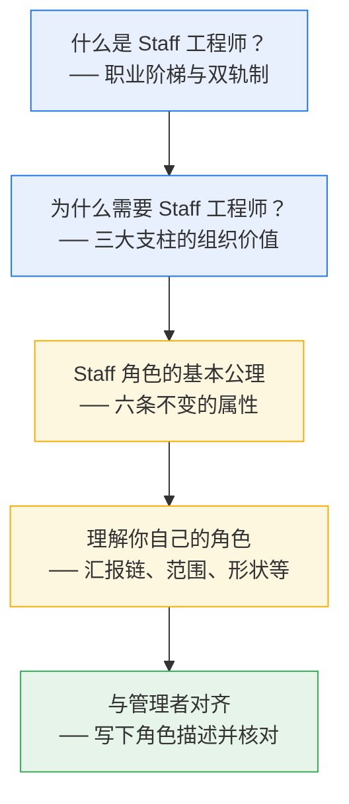

---

## 一、什么是 Staff 工程师？

### 职业双轨制：管理路线 vs 技术路线

过去，工程师要成长只有一条路——转管理。现在越来越多公司提供双轨制（Dual Ladder）：

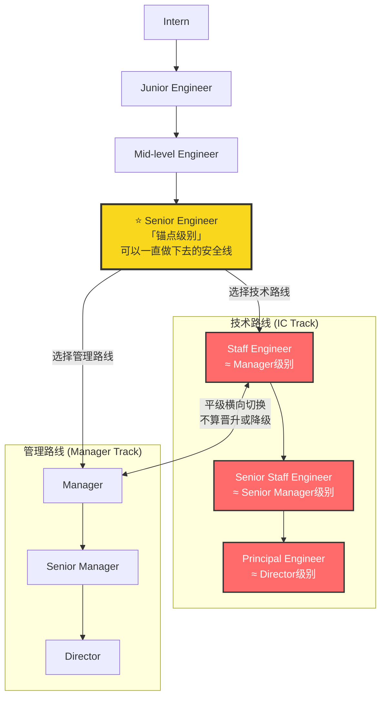

**关键概念解释：**

| 概念 | 含义 |
|---|---|
| **Senior = 锚点级别** | 可以停下来安稳工作一辈子的层级。不必继续晋升。 |
| **Staff+** | Staff 及以上所有级别的统称（Will Larson 发明的术语） |
| **平级对应** | Staff ↔ Manager，Senior Staff ↔ Senior Manager，Principal ↔ Director |
| **横向切换** | 从 Staff → Manager 或反过来，是平移而非晋升/降级 |

> 不同公司的阶梯差异巨大，甚至有公司被收购后把"Staff"和"Principal"互换了名字，导致所有人都觉得自己被降级了。**头衔很重要。**

---

### 为什么头衔很重要？

作者专门用了一个侧栏讨论"头衔该不该有"的争论。有些人说"我们是扁平文化，所有想法都应该被平等对待"。

**作者的反驳——头衔的三个核心价值：**

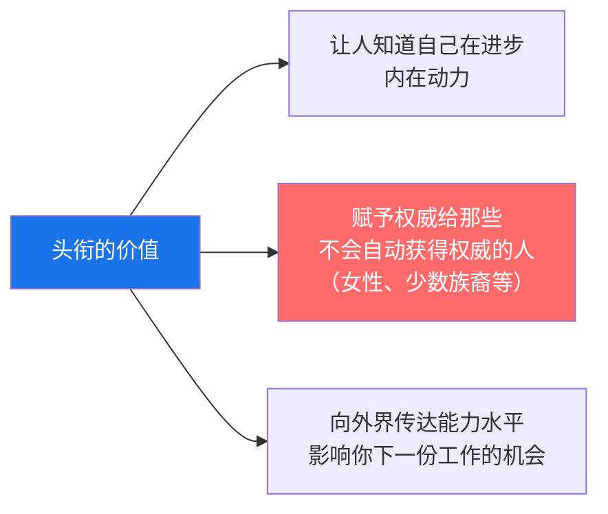

**残酷现实：** 一项2015年调查发现，在 STEM 领域，约一半的黑人和拉丁裔女性专业人士曾被误认为清洁工或行政人员。白人和亚裔男性工程师往往被默认为更资深、更懂技术。头衔是一种**锚定预期**的机制——它让那些不自动获得尊重的人省去反复证明自己的精力。

> 作者的亲身经历："在我整个职业生涯中，猎头只有**恰好三次**邀请我面试比我现有头衔更高级的职位。其余所有的都是同级或更低。"

---

## 二、为什么组织需要 Staff 工程师？

这部分解释了三大支柱背后的**组织层面的理由**——不是"你能得到什么"，而是"组织为什么愿意养这个昂贵的角色"。

---

### 需求1：能看到全局的工程师（大局观思维）

#### 核心概念：Local Maximum（局部最优陷阱）

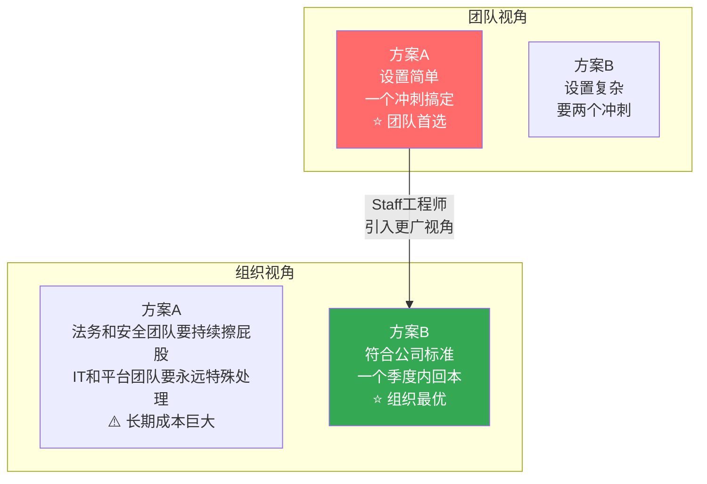

**详细解释：**

每个团队做决策时，自然倾向于对自己团队最优的选择。这就是 **Local Maximum**——在局部范围内的最佳解。但从组织整体看，这可能是个糟糕的选择：
- 方案 A 对一个团队省了一个冲刺
- 但方案 A 给法务、安全、IT、平台团队制造了永久的持续工作
- 方案 B 虽然这个团队多花两个冲刺，但对整个公司好得多

**关键洞察：只有当团队中有一个能透过更宽广视角看问题的人时，这个事实才显而易见。**

#### 为什么不能让管理者/CTO来承担大局观？

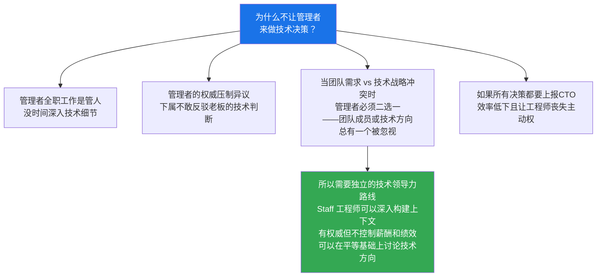

> 小团队、小公司里，管理者可以兼任技术方向的设定。但当组织规模增大，人员管理和技术方向就需要分离——这就是双轨制存在的根本原因。

---

### 需求2：能领导跨团队项目的工程师（项目执行力）

#### 理想 vs 现实的跨团队项目

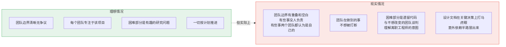

#### Staff 工程师在跨团队项目中的角色

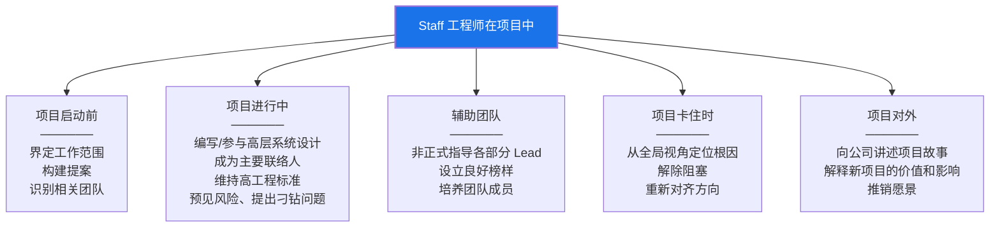

#### Staff 工程师 vs TPM（技术项目经理）：各司其职

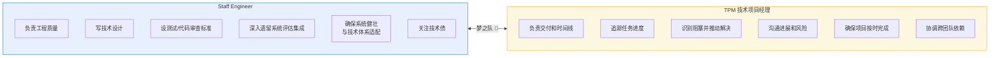

> **简单记忆：TPM 保证"做完、按时"，Staff 工程师保证"做好、做对"。两者配合是梦之队。**

---

### 需求3：有正向影响力的工程师（提升他人）

#### 为什么软件质量需要资深工程师？

软件关乎生命和生计：飞机失事、救护车调度失灵、医疗设备故障——这些灾难都有软件 bug 的身影。即使不是生死攸关，工程组织也需要在质量、效率和秩序之间取得平衡。

团队需要**磨练了技能、见过成败、愿意为创造可靠软件负责**的资深人。

#### Staff 工程师的榜样效应

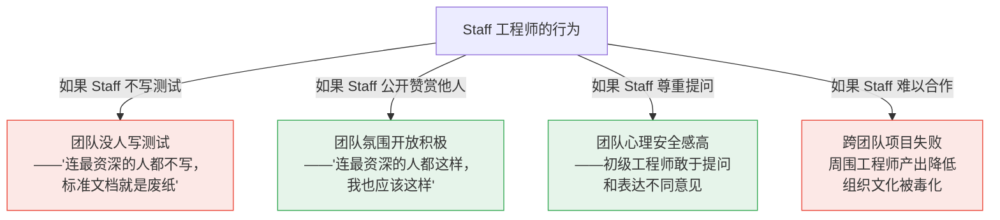

> 不管标准文档怎么写，**团队的真实工程文化和工程规范是由最受尊敬的工程师的行为决定的**。当初级工程师尊敬一个人，想"长大后成为他那样"——那个人怎么做，他们就会怎么做。

#### 为什么这必须写进职位描述？

如果一个公司最资深的工程师整天只写代码，公司当然会受益于他们的技能——但**会错过只有他们能做的事**：
- 制定技术战略
- 审查项目设计
- 设定标准
- 指导和培养下一代

**这种技术领导力不是对工作的干扰——它本身就是工作（It isn't a distraction from the job: it IS the job）。**

---

## 三、Staff 角色的六条公理

作者提出了六条"公理"——不管你在哪家公司、什么范围、什么原型，这些属性都成立。全书以此为前提。

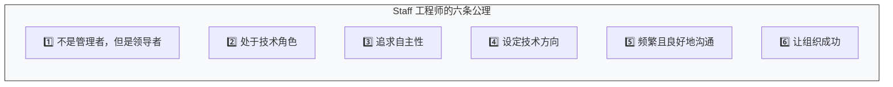

---

### 公理1：不是管理者，但你是领导者

Staff 工程师的资深度通常与 Line Manager 相当，Principal 与 Director 相当。你是管理者的**对等方（counterpart）**，被期望和他们一样成为"房间里的成年人"。你甚至可能比组织中某些管理者更资深、更有经验。

**"有人应该做点什么" → 那个人很可能就是你。**

#### 领导力的多种形式

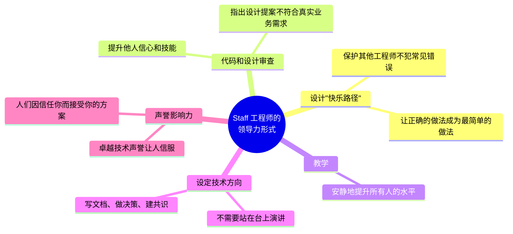

> **你可以是内向者。** Staff 工程有足够空间给内向者——安静地提升所有人的水平就是领导力。设定技术方向是领导力。凭借卓越技术声誉让人信服也是领导力。
>
> **但你不能是混蛋。** 80-90年代那种"难相处的天才"文化已经过时了。一个难以合作的工程师在今天是负债——他们降低周围工程师产出、搞砸跨团队项目、毒化组织文化。如果你觉得同事可能这样看你，作者推荐去看 Evan Smith 的 "Kind Engineering"——你会惊讶于扭转"难以合作"的声誉有多快。

#### Staff 工程师 vs 管理者的领导方式

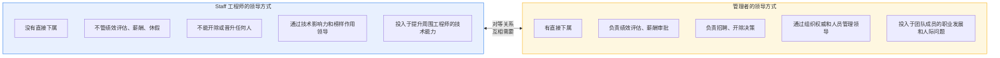

---

### 公理2：你处于"技术"角色

Staff 工程是一个领导力角色，但也是一个**深度专业化的技术角色**。它需要：
- 工程经验带来的技能和直觉
- 对卓越工程的高标准，并在自己的构建中做出示范
- 代码或设计评审应该对同事有建设性，让代码库和架构变得更好
- 做技术决策时，你需要理解权衡并帮助他人理解
- 能在必要时深入细节，提出正确的问题，理解答案

**但这不意味着你必须写大量代码。** 在这个层级，你的目标是**高效解决问题**。编程不一定是你时间的最佳用法。你可能更适合承担那些只有你能做的设计或领导工作，而让别人来做编程。

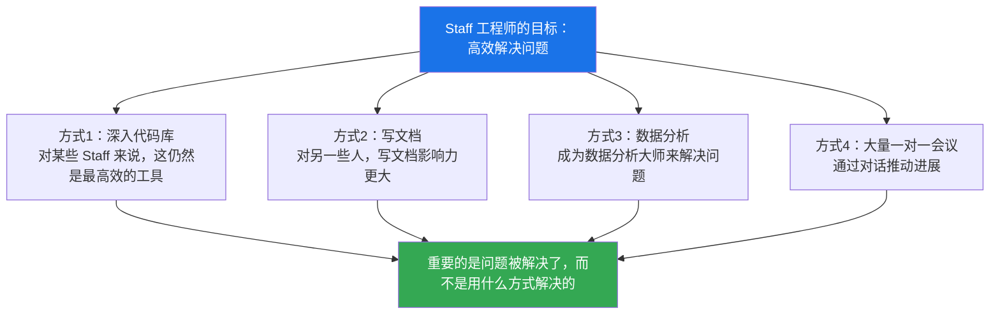

Staff 工程师经常做的一件特别有价值的事：**接手模糊、混乱、困难的问题，做足够的工作使其变得可管理，然后将其转化为较初级工程师的成长机会**（有时仍在 Staff 的支持下）。

---

### 公理3：你追求自主性

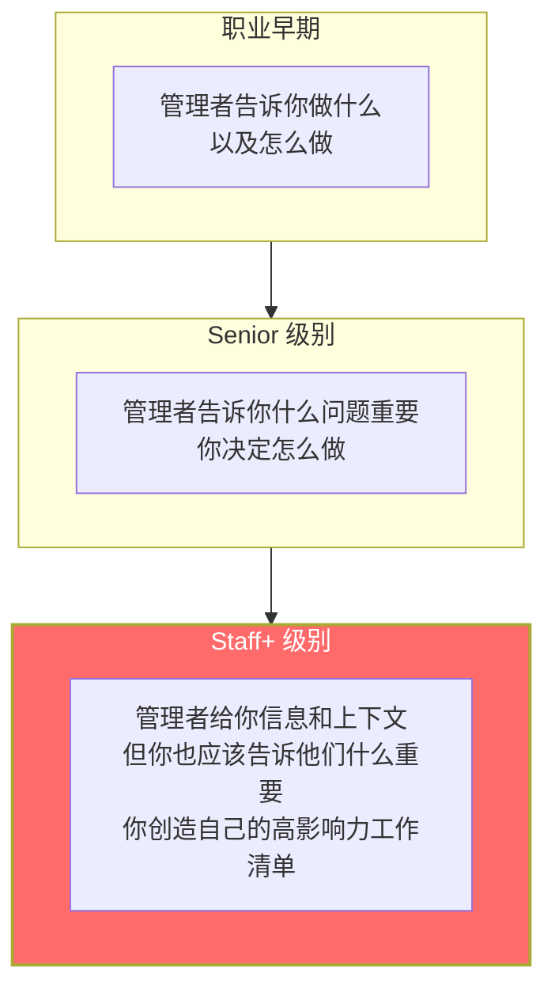

**自主性意味着你需要：**
- **自己创造**高影响力工作的 backlog（"你从哪里找到那个神奇的高影响力待办清单？你自己创造它！"）
- **自己决定**时间优先级——每周有限的小时数，你选择怎么花
- **自己判断**每个请求的优先级、时间投入和收益
- **为决策负责**——如果上级让你做的事你认为有害，你有责任说出来

> "**自主性伴随着责任。如果被要求做的事会导致灾难，不要默默让灾难发生。**"（当然，要被人听进去，你需要建立起值得信赖和判断正确的声誉。）

---

### 公理4：你设定技术方向

作为技术领导者，Staff 工程师的职责之一是**确保组织有好的技术方向**。底层产品和服务的是大量技术决策：架构、存储系统、工具和框架等等。

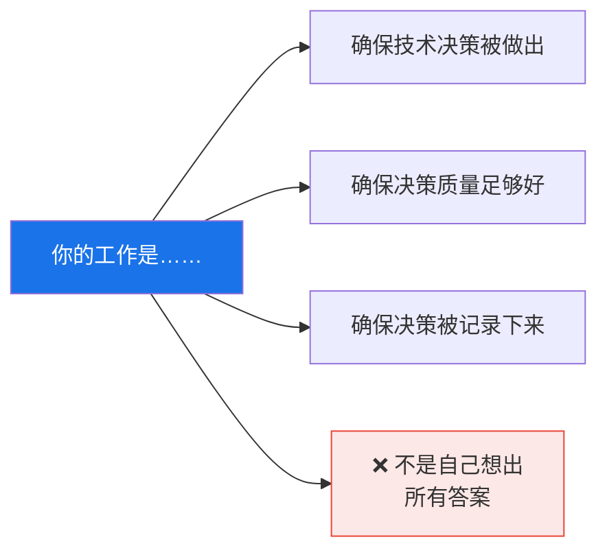

> 你的工作不是自己想出全部答案，而是确保**有一个经过讨论、被共同认可的、有文档记录的解决方案**，能够解决它要解决的问题。

---

### 公理5：你频繁且良好地沟通

越资深，越依赖沟通能力。你做的几乎所有事情都涉及**把信息从你的大脑传到别人的大脑（以及反过来）**。你越善于被人理解，工作就越轻松。

---

### 公理6：你的工作是让组织成功

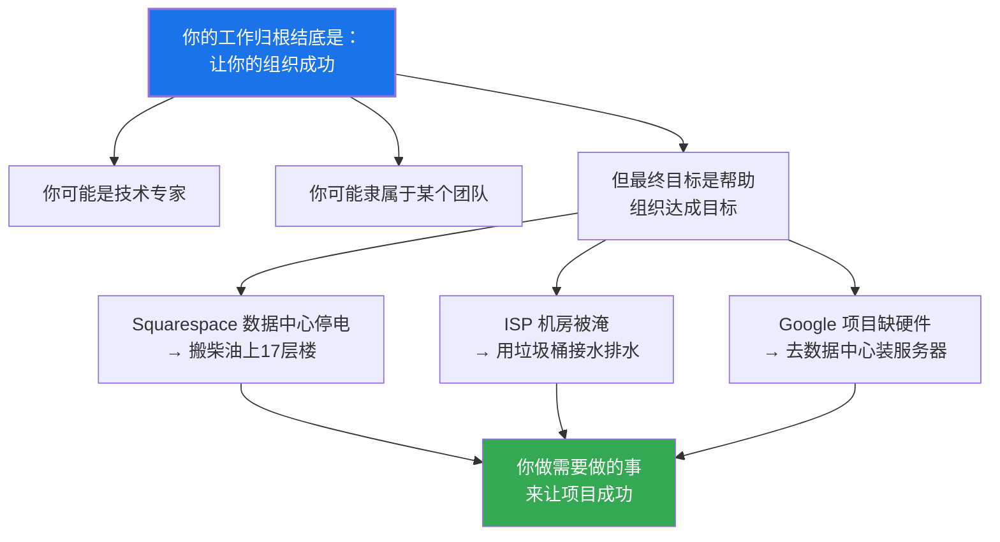

> "搬柴油桶"不在任何技术岗位的 JD 上——但那天那就是保持网站在线所需要做的事。**你的工作最终是你的组织或公司需要它成为的任何事情。**

---

## 四、理解你自己的角色

Staff 工程师的日常工作可能千差万别——不同的公司、不同的组织结构、不同的个性，造就完全不同的角色形态。这一节帮你通过一系列关键问题来定义**你自己**的角色。

---

### 你在组织架构中的位置是什么？（汇报给谁）

行业没有标准模型来安排 Staff+ 工程师的汇报关系。有人汇报给 CTO 办公室，有人汇报给各级 Director，有人汇报给 Line Manager。

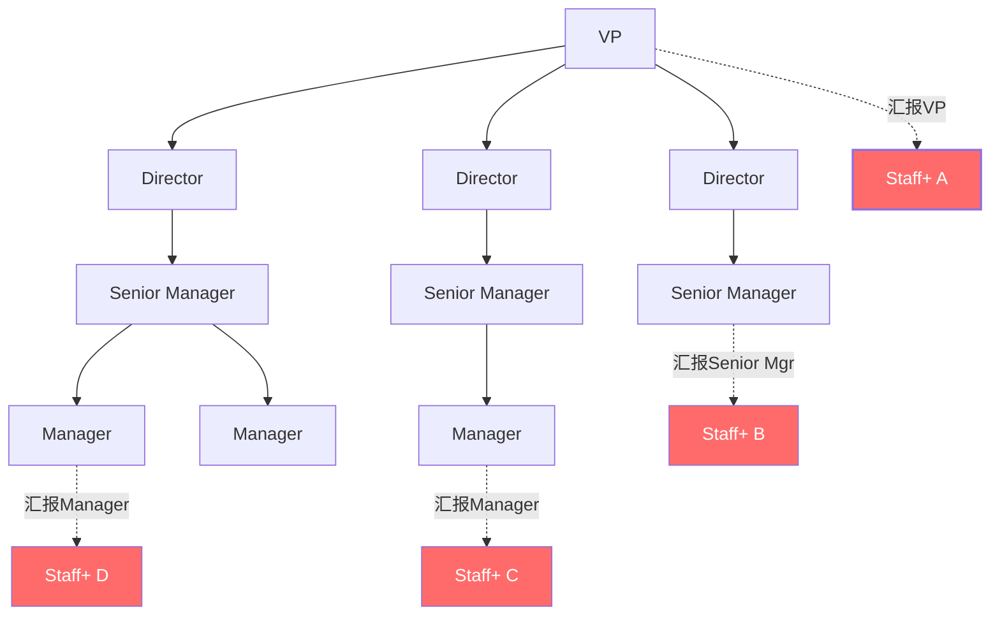

> 即使这些工程师级别相同，**A 比 D 更容易获得组织上下文、进入 Director 级别的会议**。汇报位置深刻影响你的信息获取、影响力和支持度。

#### 汇报"高层" vs 汇报"基层"的对比

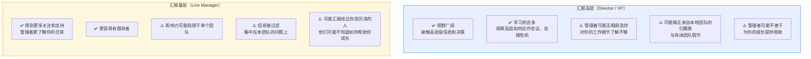

**作者的建议：**
- 如果你汇报基层，确保有 **skip-level 会议**（与上上级定期聊）
- 找方式**连接到组织级别的目标**
- 如果你和管理者经常在"你该做什么"上有分歧（如管理者要你专注团队问题，但你看到更大的组织问题），可能需要**向上调整汇报层级**
- 没有对错——但有些**对你的处境更合适**

---

### 你的范围（Scope）有多大？

范围 = 你关注并对其有影响力的领域（团队、技术域或产品领域）。

在你的范围内，你应该：
- 对主要决策有影响力
- 关心短期和长期目标
- 阻止不良技术决策
- 培养下一代高级/Staff 工程师
- 发现并推荐有助于他人成长的项目和机会

#### 范围过宽的四种失败模式

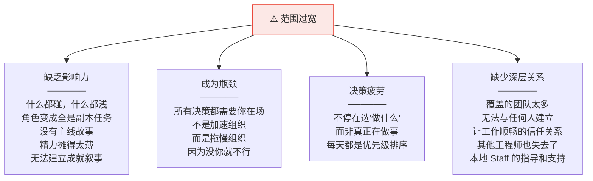

#### 范围过窄的四种失败模式

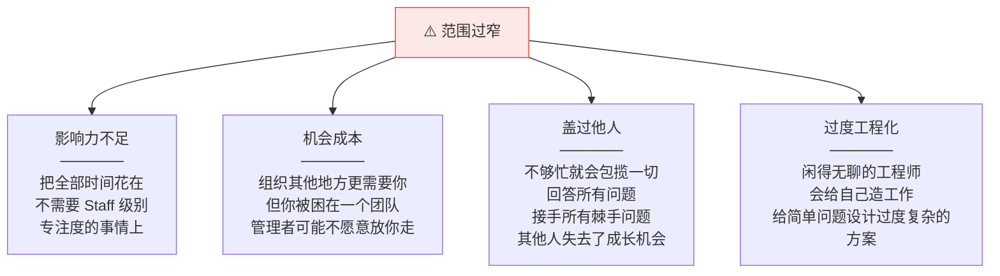

> **最佳策略：选择一个领域，建立影响力，取得一些成功。然后如果你准备好了，转移到下一个领域。** 有些技术领域足够深，可以让一个工程师永远有工作——但要明确你是否在这样一个领域。

---

### 你的角色是什么形状？

如果你的工作总体上是有影响力的，你在**怎么做**上有很大的灵活性。这包括一定程度地**定义你的工作到底是什么**。以下问题帮你找出角色的"形状"：

#### 你是深度优先还是广度优先？

```mermaid
graph LR
    subgraph DEPTH["深度优先 (Depth-first)"]
        direction TB
        D1["专注于单一问题或技术领域"]
        D2["成为领域内的行业专家"]
        D3["深入一个团队的技术和问题"]
        D4["适合 Solver 原型"]
    end

    subgraph BREADTH["广度优先 (Breadth-first)"]
        direction TB
        B1["跨多个团队或技术"]
        B2["只在问题无他人可解时才深入"]
        B3["需要在做决策的房间里"]
        B4["适合 Architect / Right Hand 原型"]
    end

    DEPTH <-->|"两者没有对错<br/>关键是匹配你的偏好和范围"| BREADTH

    style DEPTH fill:#e8f0fe,stroke:#1a73e8
    style BREADTH fill:#fef7e0,stroke:#f9ab00
```

> 如果你想影响整个组织的技术方向但被分配到一个深度架构问题上，双方都不会满意。确保偏好与范围匹配。

#### 你倾向于"四项核心能力"中的哪些？

引用 Yonatan Zunger（Twitter 杰出工程师）的"四项核心能力"模型——**任何工作都需要这四种能力：**

```mermaid
graph TB
    subgraph FOUR["四项核心能力 (Zunger 模型)"]
        direction LR
        TECH["核心技术能力<br/>──────<br/>编码、运维、内容产出<br/>——该角色的典型实践"]
        PROD["产品管理<br/>──────<br/>搞清楚要做什么、为什么做<br/>维持关于工作的叙事"]
        PROJ["项目管理<br/>──────<br/>达成目标的实操<br/>移除混乱、追踪任务<br/>发现阻塞并解除"]
        PPL["人员管理<br/>──────<br/>把一群人变成团队<br/>建设技能和职业<br/>指导和处理人际问题"]
    end

    style FOUR fill:#f8f9fa,stroke:#333
```

**关键洞察：越资深，你的能力组合与头衔的关联越弱。** 越高级越需要在四种能力间灵活切换、在所有"房间"里都能运作。

> **如果有一项你特别讨厌，确保找到擅长它的搭档。** 不确定自己喜欢哪项？Zunger 建议和朋友逐一讨论每项能力，让朋友观察你谈到每一项时的情绪反应和能量变化。

#### 超专业化路径（Hyperspecialist）

> 极少数情况下，一个在**极度业务关键的领域**中的强大 Senior 工程师可以不做规划和影响他人也能成功。Zunger 称之为"超专业化"角色。但他警告"长期来看你的影响力会衰减"。Pat Kua 称之为"真正的个人贡献者路线"，但指出即使走这条路仍需要优秀的沟通和协作能力。

---

### 你想写（或需要写）多少代码？

```mermaid
graph TB
    CODE["你和代码的关系"]

    CODE --> TYPE1["模式1：大量读/审代码<br/>自己很少写<br/>──────<br/>影响力驱动型<br/>通过审查和设计产出价值"]

    CODE --> TYPE2["模式2：每天写代码<br/>是项目核心贡献者<br/>──────<br/>技术深耕型<br/>代码本身就是最大价值"]

    CODE --> TYPE3["模式3：主动找机会写代码<br/>挑非关键路径的有趣项目<br/>──────<br/>平衡型<br/>保持手感但不耽误大事"]

    WARNING["⚠️ 如果你不写代码就焦虑<br/>不要接那种根本没时间写代码的广泛架构角色<br/>否则你会忍不住跳进编码任务<br/>把更大的问题晾在一边"]

    CODE --> WARNING

    style WARNING fill:#fce8e6,stroke:#ea4335
```

---

### 你能接受多长的反馈周期？

```mermaid
graph LR
    subgraph SHORT["短反馈周期"]
        S1["写代码 → 编译通过 ✅<br/>= 即时小型绩效评估"]
        S2["提交 PR → 合并 ✅"]
        S3["修 bug → 测试通过 ✅"]
    end

    subgraph LONG["长反馈周期（Staff 常见）"]
        L1["跨组织项目<br/>→ 几个月才知道成败"]
        L2["技术战略<br/>→ 可能一年后才有结果"]
        L3["文化改变<br/>→ 可能更久"]
    end

    SHORT -.->|"Staff 角色往往需要<br/>从短周期转向长周期"| LONG

    style SHORT fill:#e6f4ea,stroke:#34a853
    style LONG fill:#fef7e0,stroke:#f9ab00
```

**如果你容易焦虑和不安：**
- 找一个**信任的管理者**定期坦诚告诉你进展如何
- 搭配一些**短周期产出的项目**来平衡
- 如果实在需要即时反馈，可能需要选择**反馈周期较短的 Staff 角色**

---

### 你是否一脚踏在管理路线上？

**Tech Lead Manager (TLM)** = 既是技术领导又管理团队的混合角色。

```mermaid
graph TB
    TLM["Tech Lead Manager<br/>（混合角色）"]

    TLM --> HARD1["既负责技术产出<br/>又负责人的发展"]
    TLM --> HARD2["总觉得两边都做不好<br/>时间永远不够"]
    TLM --> HARD3["很难投入时间<br/>在任何一边建设技能"]
    TLM --> HARD4["经常有职业发展停滞感"]

    ALT["替代方案：钟摆模式<br/>做几年管理 → 回到 IC<br/>→ 再做管理 → 反复切换<br/>两边都能保持锋利"]

    HARD1 & HARD2 & HARD3 & HARD4 --> ALT

    style TLM fill:#ff6b6b,color:#fff
    style ALT fill:#34a853,color:#fff
```

> Charity Majors 的文章 "The Engineer/Manager Pendulum" 是这个话题的绝佳参考。

---

### 你符合哪种 Staff 原型？

Will Larson 在他的文章 "Staff Archetypes" 中描述了四种 Staff 工程角色的典型模式：

```mermaid
graph TB
    subgraph TL["Tech Lead 技术领导"]
        TL1["与管理者搭档<br/>指导1个或多个团队的执行<br/>──────<br/>最常见的原型<br/>直接参与团队日常"]
    end

    subgraph AR["Architect 架构师"]
        AR1["负责一个关键领域的<br/>技术方向和质量<br/>──────<br/>跨团队技术决策<br/>系统设计和评审"]
    end

    subgraph SO["Solver 解决者"]
        SO1["一次深入一个困难问题<br/>──────<br/>被派去解决<br/>最棘手的技术挑战<br/>问题解决后转移目标"]
    end

    subgraph RH["Right Hand 左膀右臂"]
        RH1["为高层领导增加<br/>领导力带宽<br/>──────<br/>代表VP/Director行动<br/>涵盖范围极广"]
    end

    style TL fill:#e8f0fe,stroke:#1a73e8
    style AR fill:#fef7e0,stroke:#f9ab00
    style SO fill:#e6f4ea,stroke:#34a853
    style RH fill:#f3e8fd,stroke:#9334e6
```

> **这些原型不是处方——它们是帮助你表达偏好的工具。** 你的角色可能跨越多个原型，或者不完全符合任何一个。没关系。

---

### 你的主要关注点是什么？（What's Your Primary Focus?）

你已经搞清了范围、汇报链、偏好和角色形状。但还剩一个问题：**你到底要把时间花在什么上？**

随着影响力增长，越来越多人希望你关心各种事：
- 有人在写代码审查最佳实践，想要你的意见
- 团队在招人，需要你帮忙定面试标准
- 一个废弃计划如果有 Staff 的支持能推进得更快
- 这还只是周一上午……

```mermaid
graph TB
    CHOOSE["每次选择做什么<br/>你同时在选择不做什么"]

    CHOOSE --> Q1["这件事重要吗？<br/>──────<br/>不是'最时髦''VP赞助的'才重要<br/>最重要的工作常常是没人看到的<br/>要有战略重要性"]

    CHOOSE --> Q2["这件事需要你吗？<br/>──────<br/>不要做任何中级工程师能做的事<br/>'别在你唯一的大桶里种草'<br/>不要加入已经领导者过剩的项目"]

    CHOOSE --> Q3["你确定你的认知<br/>和别人一致吗？<br/>──────<br/>管理者、同事对'Staff该做什么'<br/>的期望可能和你完全不同"]

    style CHOOSE fill:#1a73e8,color:#fff,stroke-width:2px
```

---

## 五、与管理者对齐你的角色

### 为什么要写角色描述？

你和管理者对"你应该做什么"的理解可能**完全不同**。这种不对齐是 Staff 工程师压力和迷茫的主要来源。

**解决方案：写下你对自己工作的理解，然后与管理者核对。**

### 角色描述模板（Ali 的例子）

```mermaid
graph TB
    subgraph DOC["角色描述文档结构"]
        direction TB
        OV["📋 Overview<br/>──────<br/>主要关注领域<br/>时间分配比例<br/>例：50%技术方向 + 30%大项目<br/>+ 20%跨组织/社区工作"]

        GO["🎯 Goals<br/>──────<br/>3-5个具体目标<br/>例：1.引导零售销售技术方向<br/>2.为NewMerchandising当顾问<br/>3.领导架构评审<br/>4.提升跨工程规划<br/>5.危机时充当领导力备份"]

        AC["📝 Sample Activities<br/>──────<br/>日常具体活动<br/>例：提出OKR、对齐项目目标<br/>架构咨询、指导Senior、面试"]

        SU["✅ What Does Success Look Like<br/>──────<br/>成功的衡量标准<br/>例：零售销售系统能支撑5年增长<br/>NewMerchandising项目四个团队方向一致"]
    end

    style DOC fill:#f8f9fa,stroke:#333
```

**关键原则：**

> - **不要追求完美，做到"足够对"就好。** 写下来不是给自己上枷锁，而是消除模糊。
> - 描述你的目标不意味着**禁止**你做别的事——它是一个提醒，帮你检查是否在做你声称要做的工作。
> - 如果优先级变了（世界在变、公司在变），**重写一版**。
> - 关键是确保**你和管理者的心理模型一致**——现在发现不一致，总比绩效评估时发现好得多。

---

## 本章总结

```mermaid
graph TB
    subgraph RECAP["第一章核心要点"]
        direction TB
        R1["Staff 角色天然模糊<br/>由你来发现和定义它"]
        R2["你不是管理者<br/>但你是领导者"]
        R3["你需要扎实的技术判断力<br/>和技术经验"]
        R4["明确你的范围<br/>你的责任和影响力边界"]
        R5["时间是有限的<br/>刻意选择重要且匹配你技能的工作"]
        R6["与管理链对齐<br/>写下角色描述并核对"]
        R7["你的工作有时形状很奇怪<br/>那也没问题"]
    end

    style RECAP fill:#f8f9fa,stroke:#333
```

> **一句话总结：Staff 工程师是一个技术领导力角色——你需要定义它、理解它、对齐它，然后去做组织需要你做的任何事。**

---

**下一章**：[[ch2_三张地图]] —— 如何获取全局视角、理解你的组织、发现真正的目标。
