# 第二章：三张地图

> **原书标题**：Three Maps
> **所属**：Part I - The Big Picture（大局观）
> **核心问题**：作为 Staff 工程师，你如何获取全局视角、理解组织运作方式、发现真正的目标？

---

## 本章结构

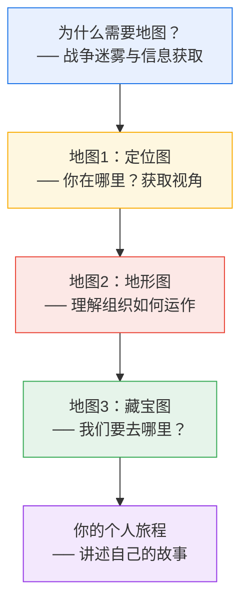

---

## 核心隐喻：三张地图

Staff 工程师需要理解自己的环境，就像探险者需要地图。但把所有信息堆在一张图上只会一团糟，所以作者提出用**三张不同用途的地图**来理解你的工作世界：

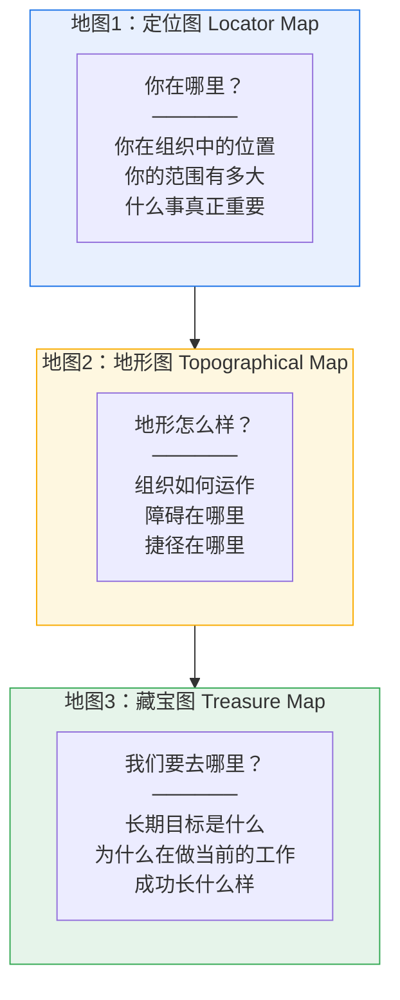

---

## 战争迷雾：为什么你需要主动获取信息？

作者用电子游戏中的**"战争迷雾"（Fog of War）**来类比：当你加入一家新公司，大部分信息对你来说是完全未知的。你需要主动去"探索"，才能逐渐揭开迷雾。

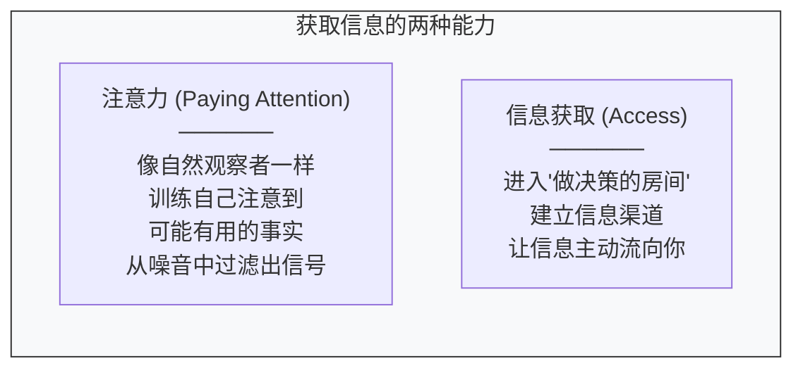

**清除迷雾的三张地图各自的作用：**
- **定位图**帮你确保团队理解自己在组织中的位置、客户是谁、工作如何影响他人
- **地形图**帮你发现团队间的摩擦和空白，打通沟通路径
- **藏宝图**帮你确保每个人都知道我们要达成什么、为什么

---

## 地图1：定位图——获取视角

### 为什么需要定位图？

你在任何领域越深入，那个领域在你脑中就会变得越复杂、越重要。**但这种专注带来风险**——你会失去客观性。作者列出了**四种失去视角的风险**：

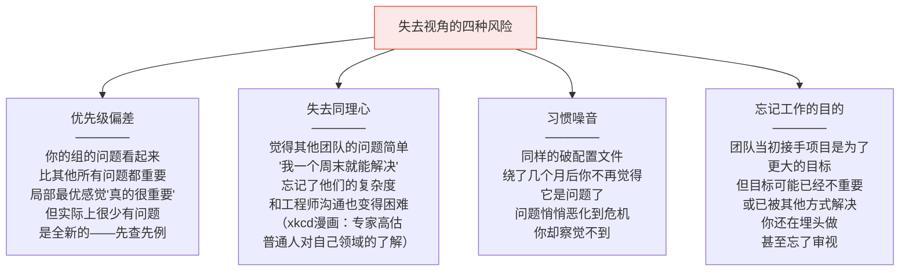

### 如何获取视角？——"看得更大"

#### 采取"局外人视角"

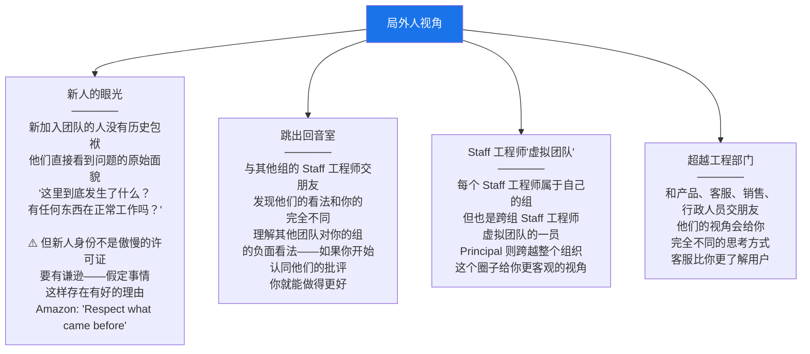

#### 理解什么才真正重要

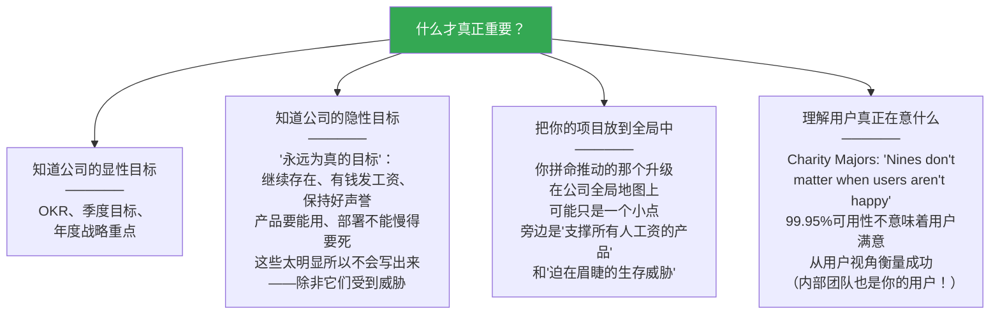

> **关键建议**：当公司优先级变化时，注意你的范围或关注点是否也需要变化。不一定要做**最重要**的事，但你做的事不应该是浪费时间的。如果你无法向自己解释为什么你做的事情需要一个 Staff 工程师，你可能在做错误的事。

#### 保持定位图更新的方法

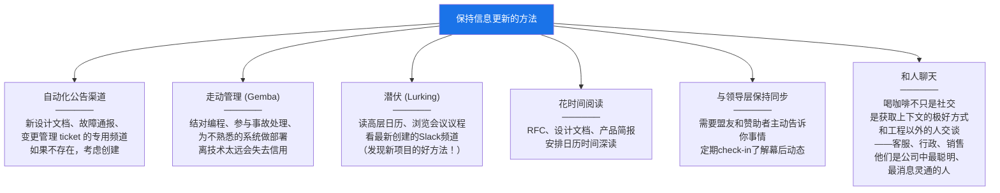

---

## 地图2：地形图——理解组织如何运作

定位图告诉你"你在哪里"，但要真正推进工作，你需要了解**地形**——障碍、捷径、危险区域和铺好的道路。

### 不了解地形会怎样？

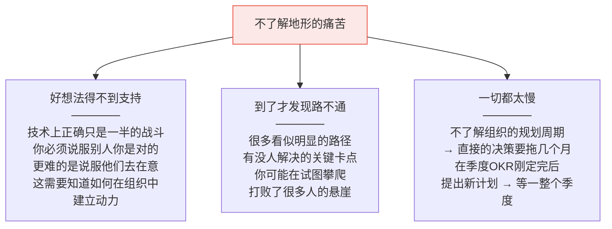

### 理解你的组织文化

组织文化不是墙上贴的价值观——**真正的文化体现在每天实际发生的事情中**。作者提出七个维度来理解组织文化：

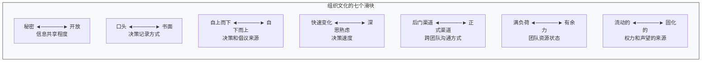

**每个维度详解：**

| 维度 | 一端 | 另一端 | Staff 工程师需要注意什么 |
|---|---|---|---|
| **秘密 vs 开放** | 信息是货币，日历私密，频道仅邀请 | 一切公开，包括混乱的草稿 | 秘密文化中：泄密失去信任。开放文化中：不分享信息 = 政治化 |
| **口头 vs 书面** | 走廊对话定大事，发布后才知道 | 每次变更都有正式规范和审批 | 匹配风格！在书面文化中不写文档 = 鲁莽。在口头文化中写长文 = 没人读 |
| **自上而下 vs 自下而上** | 领导层决定方向，执行有力但可能缺乏上下文 | 员工发起倡议，授权感强但需要更广支持时会变慢 | 在自上而下的公司自作主张 = 冲突。在自下而上的公司等待指令 = 被视为没有主动性 |
| **快速 vs 深思熟虑** | 快速转向，排斥两年迁移计划 | 慎重计划，错过唾手可得的改善 | 快公司：展示增量价值。慢公司：证明你考虑了完整计划 |
| **后门 vs 正门** | DM和咖啡聊天搞定跨团队合作 | 提工单、走管理链到共同上级才能合作 | 了解什么是常规做法。用错了渠道会被人鄙视 |
| **满负荷 vs 有余力** | 团队忙到说"不"成为默认反应 | 有闲置时间但可能在做各种草根项目 | 忙的团队：找不需要大量投入的方案。闲的团队：帮他们聚焦一个项目而非分散 |
| **流动 vs 固化** | 任何人可以凭能力获取权力和机会 | 固定的晋升阶梯，每个人有固定位置 | 固化文化：了解你的位置，不要抢别人的晋升项目。流动文化：需要自己去找高影响力工作 |

### Westrum 组织文化模型

社会学家 Ron Westrum 将组织按信息处理方式分为三类：

```mermaid
graph LR
    subgraph PATH["病态型 Pathological"]
        direction TB
        P1["权力导向"]
        P2["低合作"]
        P3["信使被射杀"]
        P4["推卸责任"]
        P5["失败 → 找替罪羊"]
        P6["创新被扼杀"]
    end

    subgraph BURE["官僚型 Bureaucratic"]
        direction TB
        B1["规则导向"]
        B2["适度合作"]
        B3["信使被忽视"]
        B4["狭窄的职责"]
        B5["失败 → 走司法程序"]
        B6["创新被视为问题"]
    end

    subgraph GENE["生成型 Generative"]
        direction TB
        G1["使命导向"]
        G2["高度合作"]
        G3["信使被培训"]
        G4["共享风险"]
        G5["失败 → 追查根因"]
        G6["创新被实施"]
    end

    PATH -->|"目标"| BURE -->|"目标"| GENE

    style PATH fill:#fce8e6,stroke:#ea4335
    style BURE fill:#fef7e0,stroke:#f9ab00
    style GENE fill:#e6f4ea,stroke:#34a853
```

> **DORA（DevOps Research and Assessment）的研究表明**：强调信息流动的高信任文化拥有**更好的软件交付效能**。这就是为什么越来越多公司追求生成型文化——鼓励跨职能团队、从无责事后复盘中学习、鼓励实验、承担适度风险、打破筒仓。

### 地形上的兴趣点

理解了整体文化之后，你还需要标记地图上的**具体地形特征**——这些是你在推进工作时会遇到的特定障碍和捷径：

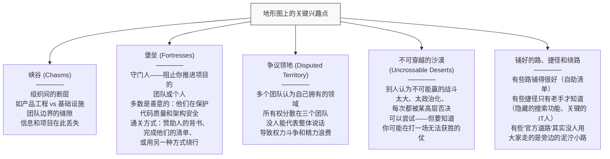

#### 堡垒的应对策略详解

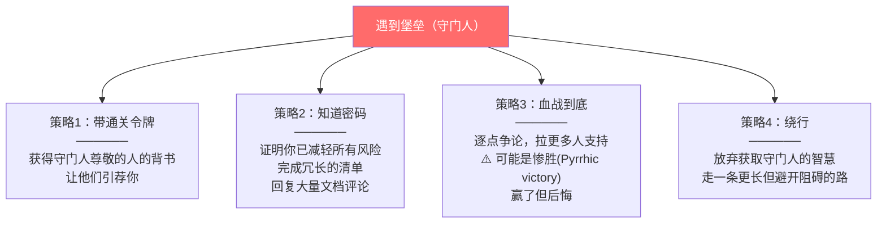

### 决策是如何做出的？

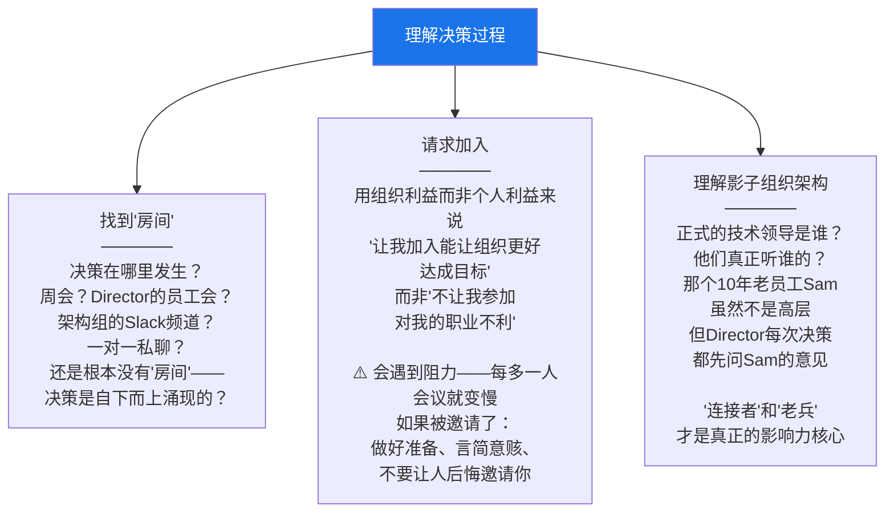

**关于影子组织架构的关键洞察：**

> 在 *Debugging Teams* 一书中，Fitzpatrick 和 Collins-Sussman 描述了"影子组织架构"——权力和影响力流动的**非正式结构**。它可能和正式架构完全不同。
>
> 他们识别出两种关键人物：
> - **"连接者"(Connectors)**：认识组织各处的人，不论头衔都有影响力
> - **"老兵"(Old-timers)**：仅凭在组织中的长期存在就拥有影响力
>
> 这些人对什么可行、什么不可行有敏锐的感觉。有头衔的人依赖他们的判断力。**如果你能获得他们的认同，你就在取得真正的进展。**

### 如果地形太难走，做一座桥

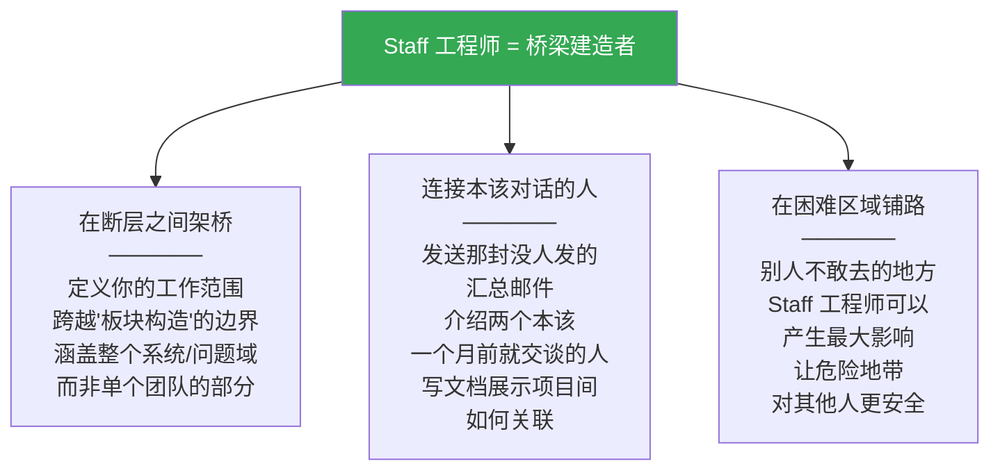

> Google DevOps 网站建议主动架桥："找一个你不理解的同事的工作（或让你沮丧的工作，比如采购），请他们喝咖啡或吃午饭。"

---

## 地图3：藏宝图——我们要去哪里？

定位图告诉你在哪里，地形图告诉你怎么走。但**我们要去哪里？** 这就是藏宝图的作用——它给出一个目的地和到达那里的路径上的一些里程碑。

### 只盯着眼前的危险——"追逐闪亮的东西"

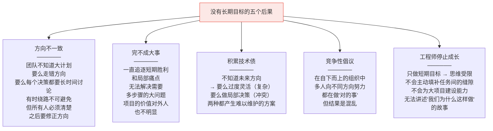

### 看得更远——科技树类比

作者用《文明》游戏中的**科技树**（Technology Tree）来类比长期规划：

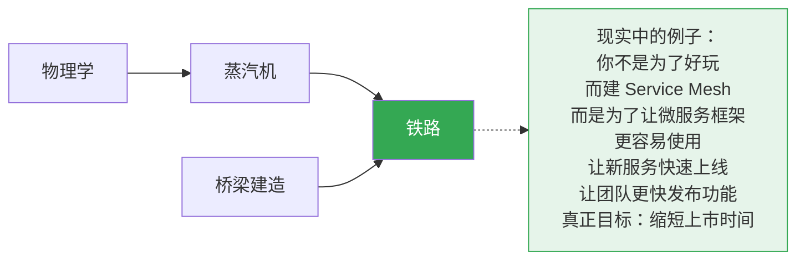

> **关键洞察**：当你选择投资一项技术时，往往是因为它是通往其他目标的必经之路。你建 service mesh 不是为了 service mesh 本身——而是为了让微服务更好用，让新服务快速启动，让团队更快发布功能。**真正的目标是缩短上市时间**。当你知道真正的目标，就能评估任何提议的工作是否让你更接近它。

### 分享藏宝图

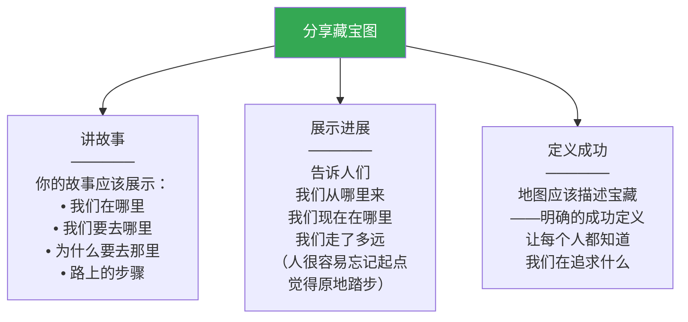

### 如果藏宝图不存在或不清晰……

> 如果大家对相同的藏宝图，你的工作就做完了。但如果你发现有多条竞争路径，或者根本没有计划——你可能需要**帮助团队选择一个目的地**。有时候，只需要写一份简短的总结，说明你看到的困惑和不对齐，把事实摊开来就能迫使对话发生。
>
> 但如果经过所有追问、追溯科技树、鼓励不同意见的人对话之后，你仍然发现没有人选择了长期目标——**那就是时候创造一张新地图了。这就是下一章的主题。**

---

## 你的个人旅程

在结束本章之前，作者谈到了**你个人**的旅程。作为 Staff 工程师，你的工作影响力可能需要更长时间才能显现，这意味着讲述工作**故事**变得更加重要。

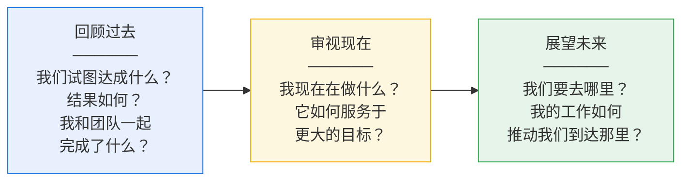

> **一旦你有了这个叙事，即使是小任务也会成为更大故事的一部分。** 任何一周的工作可能看起来不起眼，但这个月、这个季度、这一年你做了什么？你是否在越来越接近某个宝藏？

---

## 本章总结

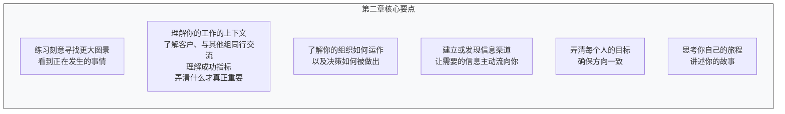

> **一句话总结：Staff 工程师需要三张地图——知道自己在哪里（定位图）、知道路上有什么（地形图）、知道要去哪里（藏宝图）。清除迷雾、保持地图更新、在困难地带架桥，这些就是 Staff 工程师日常最重要的工作之一。**

---

**上一章**：[[ch1_你在这里做什么]] —— Staff 工程师是什么？为什么需要？如何定义你的角色？
**下一章**：[[ch3_创造大局观]] —— 当藏宝图不存在时，如何创建技术愿景和技术战略？
