# 第三章：创造大局观

> **原书标题**：Creating the Big Picture
> **所属**：Part I - The Big Picture（大局观）
> **核心问题**：当组织缺少技术方向时，你如何创建技术愿景或技术战略？从构思到落地的完整方法论是什么？

---

## 本章结构

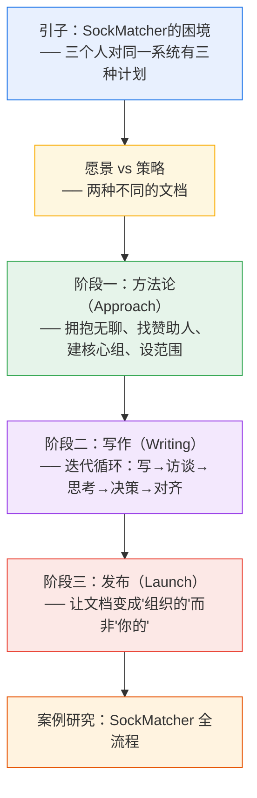

---

## 引子：为什么需要"大局观"？

作者讲了一个故事：在一次全员大会上，有人提问了一个关于频繁宕机的关键系统（SystemX）的问题。她准备回答时，同时收到了**三条完全矛盾的私信**：

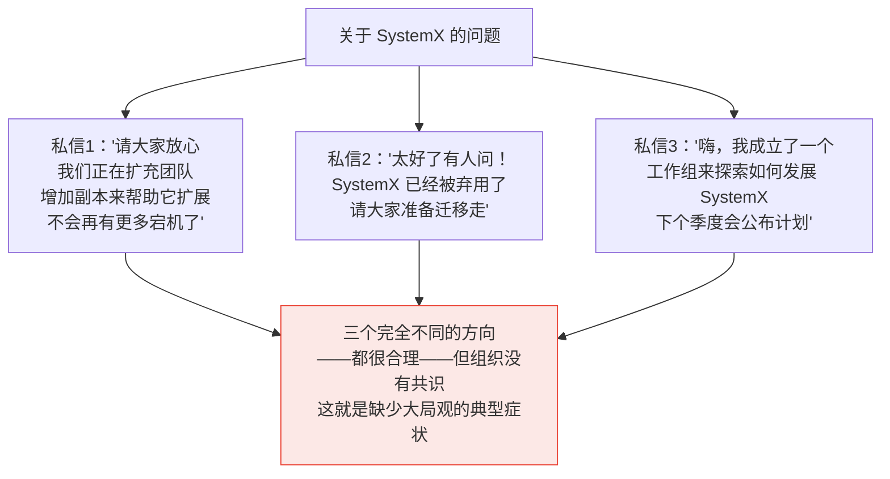

> **当缺乏明确的技术方向时，每个团队各自为政，做出局部合理但全局矛盾的决策。** 这就是你需要创造"大局观"的信号。

---

## 为什么去中心化决策会出问题？

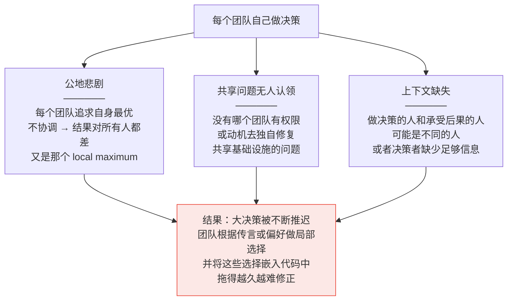

---

## 愿景 vs 策略：两种不同的文档

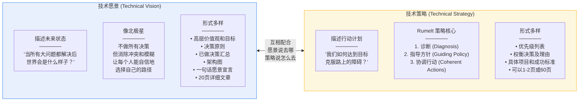

### 文档层级关系

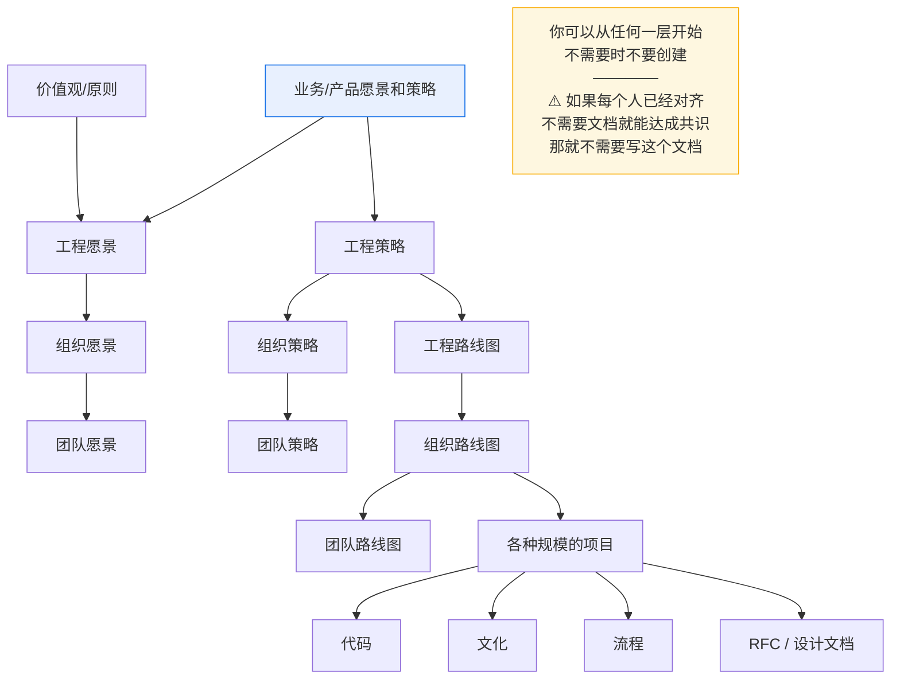

### Rumelt 策略核心（Strategy Kernel）详解

来自 Richard Rumelt 的经典著作 *Good Strategy/Bad Strategy*：

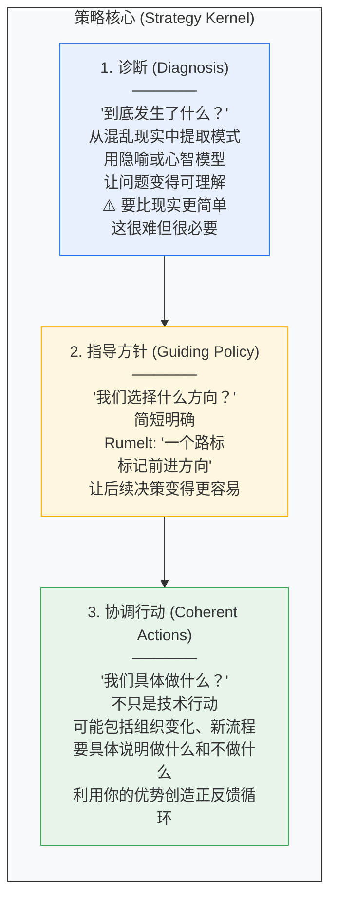

> **关键原则：策略必须现实。** 一个无法在你的组织中获得资源和人员支持的策略，就是浪费你的时间。策略应该利用你的优势——而不是描述"完美世界中别人会做什么"。

---

## 你真的需要写愿景/策略文档吗？

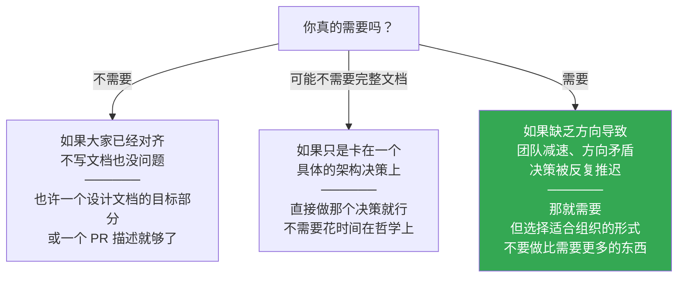

---

## 阶段一：方法论（The Approach）

创造愿景/策略是一个大项目。需要大量准备、迭代和对齐。**获得大家的认同不是真正工作之外的苦差事——认同本身就是工作。**

### 第一步：拥抱"无聊"的想法

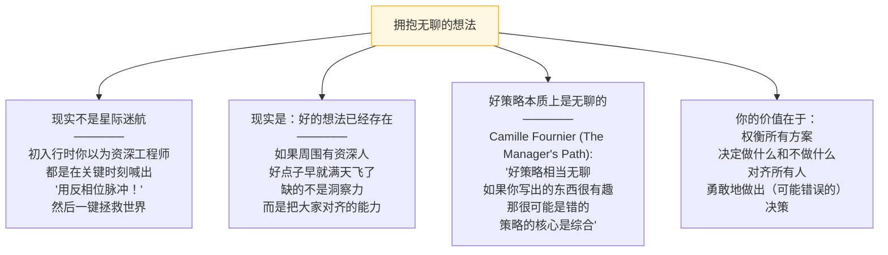

> Will Larson 的建议："如果你忍不住要在过程中加入你最精彩的点子，可以把它们放在预备工作中。把你所有最佳想法写进一个大文档里，删掉它，再也不提。现在你的脑子清净了，可以干正事了。"

### 第二步：如果别人已经在做，加入他们

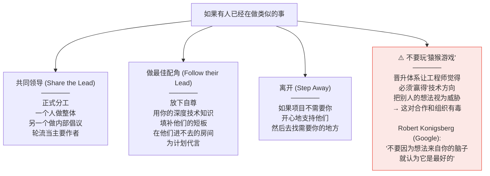

### 第三步：获取赞助人（Sponsor）

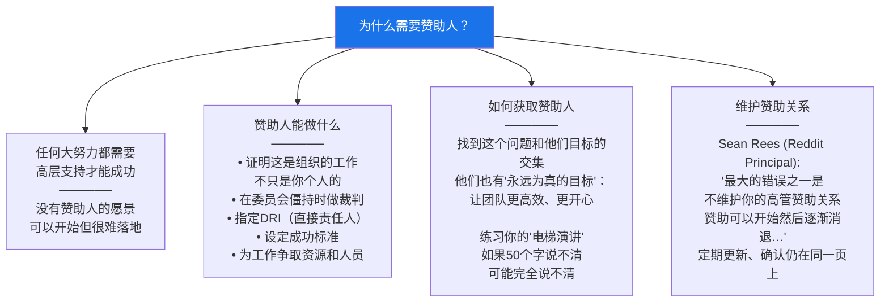

> **Staff+ 工程师能当赞助人吗？** 通常不行。赞助人需要有权决定组织投入时间和人员在什么上面——这通常是 Director 或 VP 的权力。

### 第四步：组建核心组

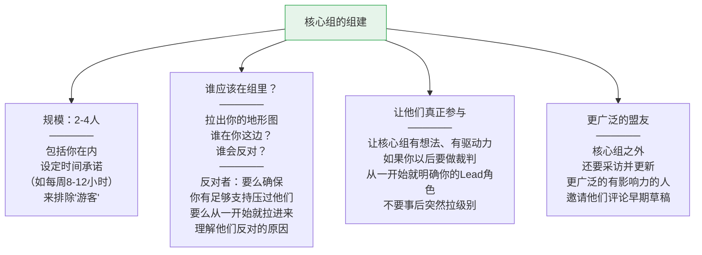

### 第五步：设定范围

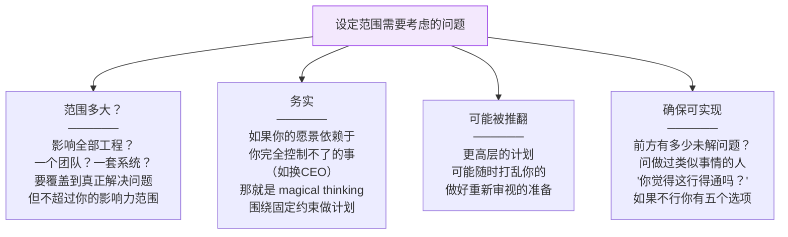

**如果评估后发现问题不可解或不该由你解，你有五个选择：**

| 选项 | 说明 |
|---|---|
| 自欺欺人硬上 | 可以但不推荐 |
| 找到有你缺失技能的人合作 | 让他们领导或给你一部分来磨练 |
| 缩小范围重新界定问题 | 添加固定约束，换一个能解的问题 |
| 接受没人会写这个，公司可能也没事 | 去做别的 |
| 接受没人会写这个，公司不会没事 | 更新你的简历 |

### 第六步：正式立项

在开始之前的最终检查清单：

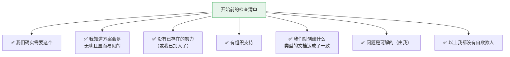

> 如果你有拖延或分心的倾向，正式立项——设置启动文档、里程碑、时间线和进展汇报机制——将帮你保持在正轨上。

---

## 阶段二：写作（The Writing）

### 写作循环

这不是线性过程，而是一个反复迭代的循环：

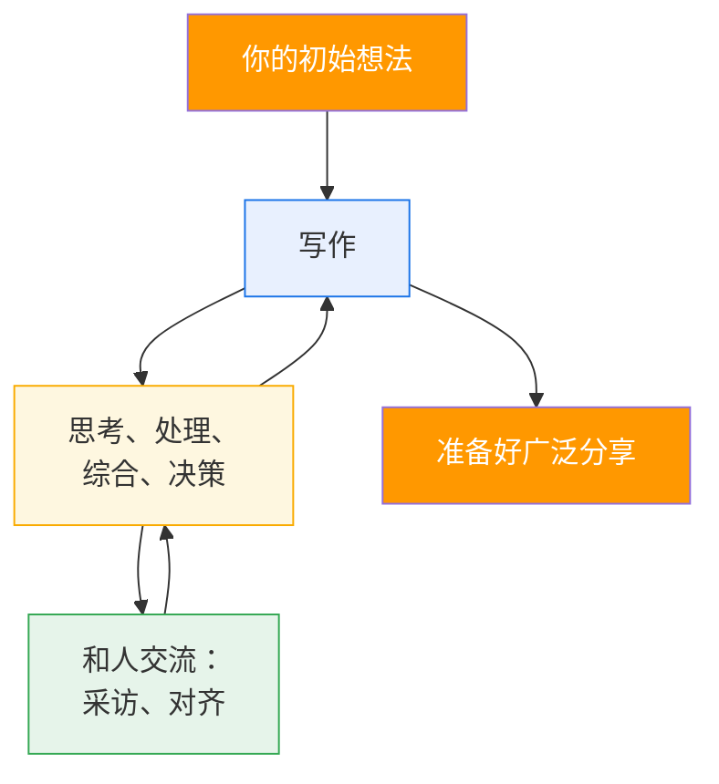

> **设置时间框！** 信息永远不会完美，但会出现收益递减。当迭代开始没有新发现时，停下来收尾。不怕不完美——你可以也应该定期重新审视文档。

### 初始想法：你需要问自己的问题

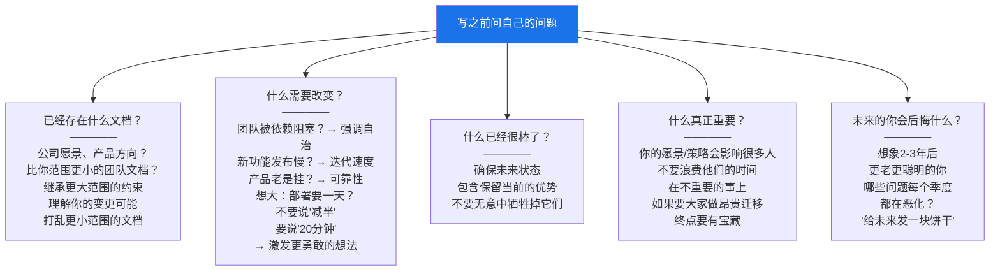

### 写作方式：两种起草策略

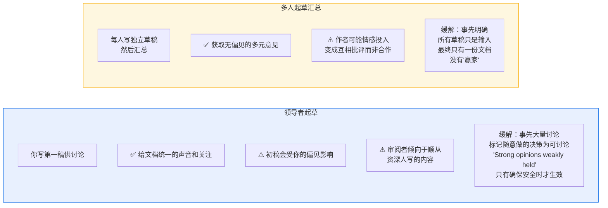

### 采访：不要只和你认识的人聊

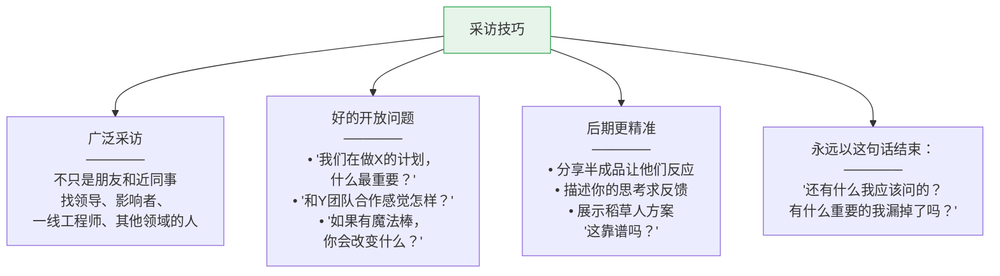

### 思考时间：警惕"解决方案思维"

> 工程师有一个常见的心智陷阱：从比较**问题**开始，不知不觉变成讨论**应该用什么技术**。Cindy Sridharan 警告说："一个有魅力的工程师可以成功地把自己的宠物项目卖成组织级倡议。" 当你审视要做的工作时，反复问"为什么？"直到你确信解释路径能映射到你要达成的目标。

### 做决策

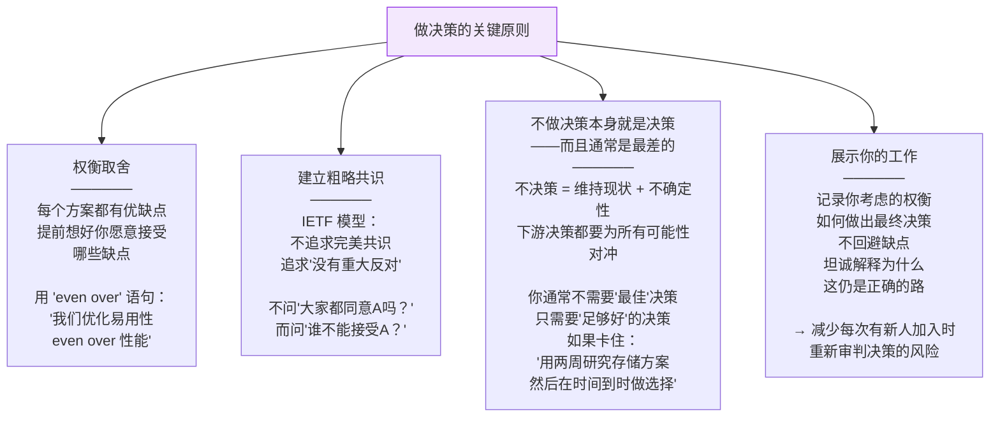

### 保持对齐

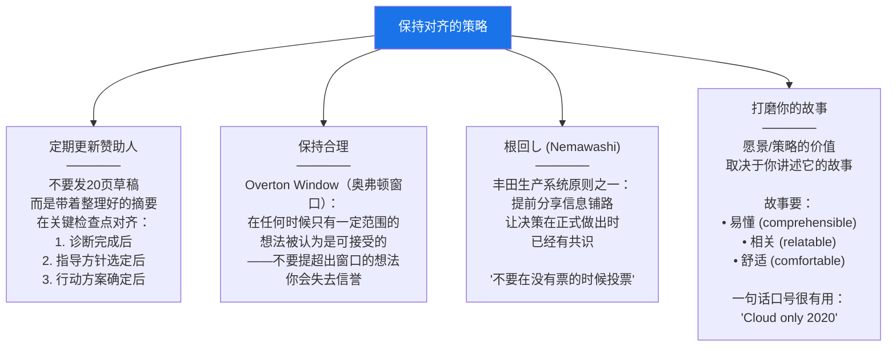

#### 关于讲故事的三个要求

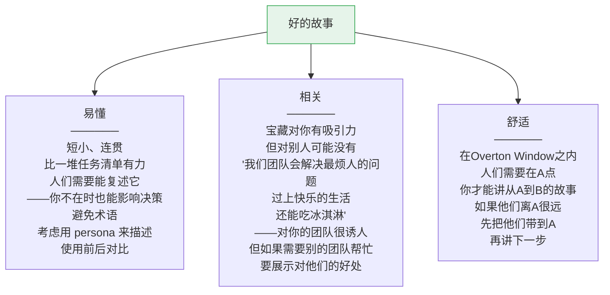

### 创建终稿

> 不是所有人都会兴奋地审阅你的文档。很多人会让它永远留在标签页里。**让文档易读**：图片、要点、大量留白。考虑用"人物角色"（persona）来描述变化对真实人的影响。你可能需要多种格式：详细文档 + 幻灯片 + 一页纸概要。

---

## 阶段三：发布（The Launch）

写完文档只是一半——你需要让它从"你的想法"变成"组织的方向"。

```mermaid
graph TB
    LAUNCH["发布三步走"]

    LAUNCH --> L1["让文档官方化<br/>──────<br/>获得最高权限者的背书<br/>VP/Director的公开支持<br/>在全员大会上引用<br/>放在内部官方网站上<br/>关闭评论、移除TODO<br/>如果能以领导名义署名<br/>比只有工程师名字更有权重"]

    LAUNCH --> L2["让工作真正发生<br/>──────<br/>文档提出的新项目需要人<br/>需要真正的预算和 headcount<br/>和赞助人讨论<br/>如何在常规规划流程中<br/>获得资源<br/><br/>你可能亲自执行<br/>也可能交接——<br/>但留在项目中<br/>保持动力和清晰度"]

    LAUNCH --> L3["保持新鲜<br/>──────<br/>发布不意味着停止思考<br/>业务方向可能变化<br/>你可能发现自己选错了<br/>准备好重新审视<br/>（一年后或更早）<br/>解释什么变了<br/>更新它、讲一个新故事"]

    style LAUNCH fill:#ff6b6b,color:#fff
```

---

## 案例研究：SockMatcher 全流程

贯穿全章的虚构案例展示了完整的愿景/策略创建流程。

### SockMatcher 是什么？

一家配对单只袜子的创业公司，使用 ML 匹配算法。后来扩展到手套、纽扣，推出外部 API (SaaaP - Sock analysis as a Platform)。架构是围绕一个单体的，所有东西共享一个数据库。现在要扩展到"食品容器+盖子"——但现有架构撑不住了。

### 案例中的关键教训

```mermaid
graph TB
    LESSONS["SockMatcher 案例的关键教训"]

    LESSONS --> LS1["了解之前为什么失败<br/>──────<br/>Pierre：闭门造车3个月<br/>做了完美技术方案<br/>但没人买账<br/><br/>Geneva：建了大联盟<br/>但没有裁判<br/>大家争论不下就散了<br/><br/>教训：你的方法必须<br/>既有技术深度<br/>又有组织可行性"]

    LESSONS --> LS2["先做诊断，再做决策<br/>──────<br/>每个人都已有解决方案<br/>'微服务！''分库分表！'<br/>但没人退一步<br/>理解真正的问题是什么<br/><br/>真正的诊断：<br/>'每次新功能都需要<br/>在共享组件中做复杂逻辑修改<br/>→ 系统需要支持更多匹配项<br/>和更多团队<br/>而不至于让开发停滞'"]

    LESSONS --> LS3["选择焦点，接受不做的事<br/>──────<br/>API版本化？→ 不做<br/>登录系统重构？→ 不做<br/>匹配算法升级？→ 不做<br/><br/>这些都是真实问题<br/>但现在不是时候<br/>写下你看到它们<br/>但选择不追——<br/>这减少'你没看到问题X'<br/>的质疑"]

    LESSONS --> LS4["指导方针要实际<br/>──────<br/>'拆成微服务'<br/>可能是理想方案<br/>但本公司没这个能力<br/>要3年还不能发新产品<br/><br/>实际指导方针：<br/>'让 billing 和 personalization<br/>变得容易且安全集成'<br/>→ 模块化、自助服务<br/>而非完全重写"]

    LESSONS --> LS5["策略不会让所有人满意<br/>但能让所有人前进<br/>──────<br/>有人觉得无聊<br/>有人觉得你选错了<br/>有人还在争论微服务<br/><br/>但：<br/>正面声音更响<br/>OKR给了官方背书<br/>盟友从一开始就参与<br/>连之前抵触的Jody团队<br/>也主动提供了帮助"]

    style LESSONS fill:#f8f9fa,stroke:#333
```

---

## 本章总结

```mermaid
graph TB
    subgraph RECAP["第三章核心要点"]
        direction TB
        R1["技术愿景描述未来状态<br/>技术策略描述行动计划"]
        R2["这类文档通常是集体努力<br/>核心组小(2-4人)<br/>但需要广泛的信息和支持"]
        R3["提前就有计划<br/>让文档变成现实<br/>通常需要高管赞助人"]
        R4["刻意选择文档类型和范围"]
        R5["写作是迭代的<br/>采访、思考、决策、对齐<br/>不断循环，需要时间"]
        R6["你的愿景/策略<br/>只有你能讲好那个故事<br/>才有价值"]
    end

    style RECAP fill:#f8f9fa,stroke:#333
```

> **一句话总结：创造大局观不是天才的灵光乍现，而是系统性的组织对齐工作——找赞助人、组核心组、做诊断、做权衡、做决策、讲故事、让文档变成组织的方向。好策略通常是无聊的，价值在于它让所有人朝同一个方向前进。**

---

**上一章**：[[ch2_三张地图]] —— 三张地图帮你理解环境、组织和方向
**下一章**：[[ch4_有限的时间]] —— Part II 开始：如何选择工作、管理时间和信誉资本
