# 第四章：有限的时间

> **原书标题**：Finite Time
> **所属**：Part II - Execution（执行力）
> **核心问题**：作为 Staff 工程师，你如何选择要做的工作？如何管理你的时间、精力、信誉和社会资本？当项目不适合你时怎么办？

---

## 本章结构

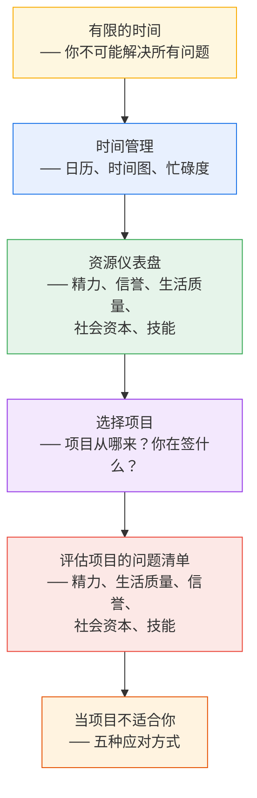

---

## 核心前提：你不可能解决所有问题

作者以自己年轻时的困惑开场：

> "刚入行时我总不明白——为什么我的前辈和老板们看到一个明显的问题，却不马上放下一切去解决？为什么他们不在乎？"
>
> "现在我懂了。作为资深人员，你能看到的问题无穷无尽——不能扩展的架构、浪费所有人时间的流程、被错过的机会。当有人指出又一个问题时，你只是把它加到列表上。好消息：你永远不会没有工作。坏消息：你不可能全做。**你必须学会和无法解决的问题和平共处。**"

---

## 一、时间：你最有限的资源

### 一切都有机会成本

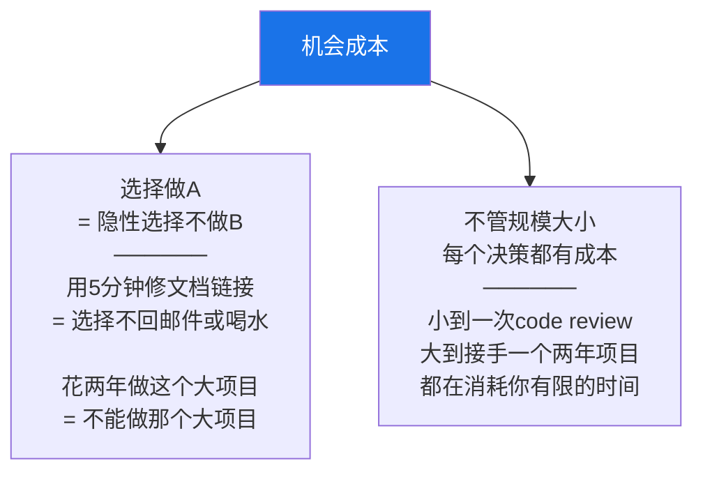

### 把非会议也放到日历上

作者说她最好的时间管理建议来自一位高管教练：**把非会议工作也放到日历上**。

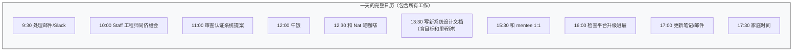

> 这不只是"忙碌作秀"，而是一个真正有用的可视化工具。当有人请你审查一个20页文档时，你能立刻看到**如果我做这件事，什么东西就要让位**。如果一个任务被你反复推迟了三次，这本身就说明了它的真实优先级——也许该放弃它了。

### 时间图：看到更大的图景

日历管天和周。但对于月和季度，作者推荐用**时间图（Time Graph）**——一个堆叠面积图，展示你的时间随周推进如何被各种工作填满。

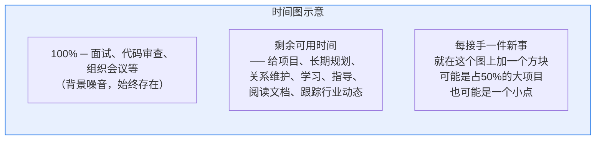

### 你想多忙？

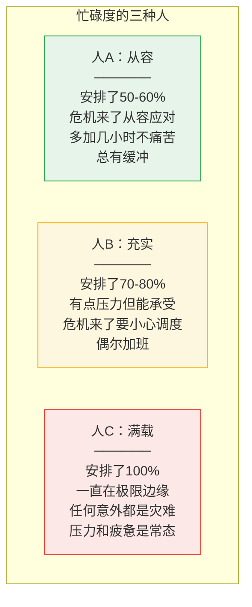

> **关键建议**：知道你想在哪个区间运行，以及在哪个点你会崩溃。尽量留一些缓冲。如果你所有时间都排满了重要的事，当意外发生时，你就要放弃一些重要的事——或者让工作侵蚀你的生活。

### 不要只按优先级排序

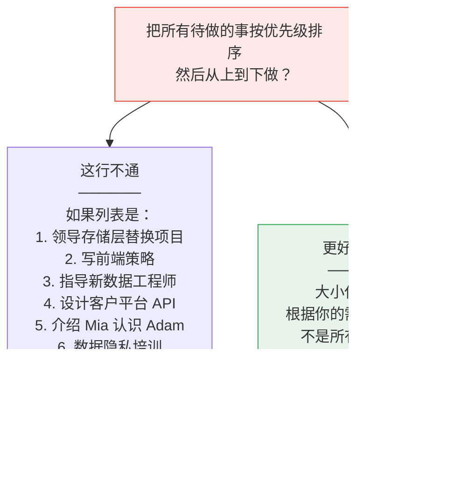

---

## 二、资源仪表盘：The Sims 类比

作者用《模拟人生》（The Sims）游戏的需求面板来类比：你有五种关键资源，每个项目都会增加或减少它们。

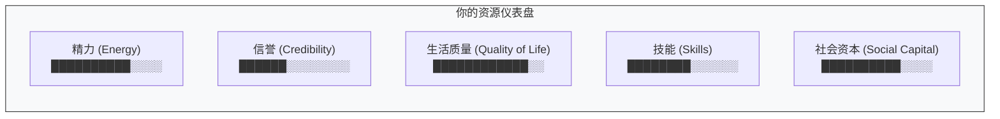

> **核心洞察：如果任何一项资源亮红灯，你的状态就会急剧恶化，很多活动变得不可能——就像模拟人生里饥饿值为零时，角色连"有趣"的活动都做不了。**

---

### 精力 (Energy)

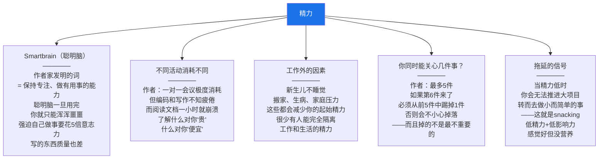

#### 不要 Snacking（零食化工作）

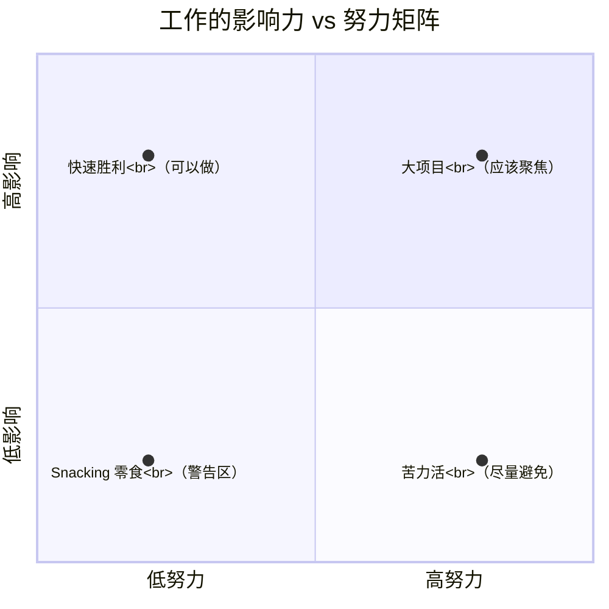

> Des Traynor (Intercom)："零食化工作感觉很好，能解决短期问题。但如果你从不吃正餐，你会营养不良。" 当你发现自己在做零食化工作时，问问自己——**你是真的需要休息（那就休息），还是在逃避真正的工作？**

#### 这场仗值得打吗？

> Camille Fournier 在 "OPP (Other People's Problems)" 文章中警告：即使成功，推动一个组织层面的改变也可能比你预期**消耗多得多的精力**。"反思一下这是否值得，想想公司里还有多少类似的事你同样想改变。想想用那些精力你还能做什么。"

---

### 信誉 (Credibility)

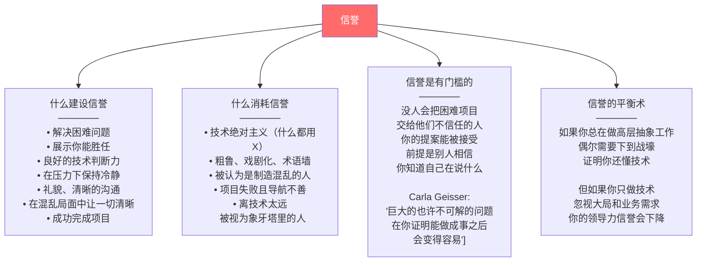

---

### 生活质量 (Quality of Life)

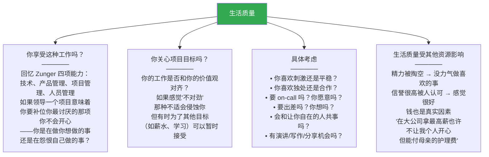

---

### 社会资本 (Social Capital)

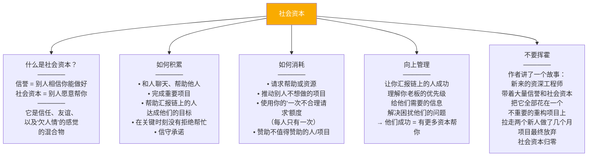

#### 社会资本的警示故事

> 一个新来的资深工程师发现了一个不遵循最佳实践的系统。他没错——确实是乱的。但它不是经常被修改的系统，不值得投入。他的声望让所有人同意了他的提案，两个新工程师从自己的项目上被拉走投入这个重构。几周后发现要几个季度才能完成，成本是预期的10倍。他坚持了几个月最终放弃。新人回到原来的项目。一切恢复正常——**除了那个人再也没有以前那么受尊敬了。他把社会资本浪费在了一场他并不真正在意的仗上。**

---

### 技能 (Skills)

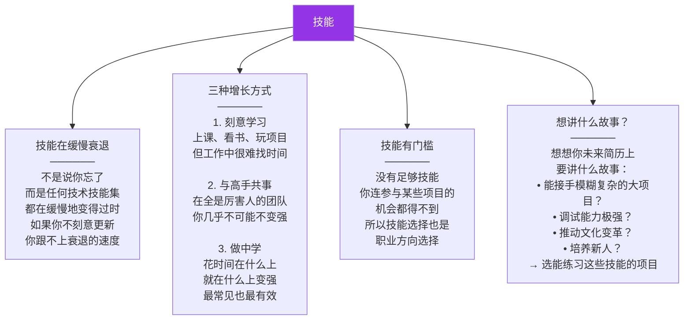

---

### 综合评估：E + 2S + ...?

当你考虑接手一个项目时，**用五项资源来评估它对你的影响**：

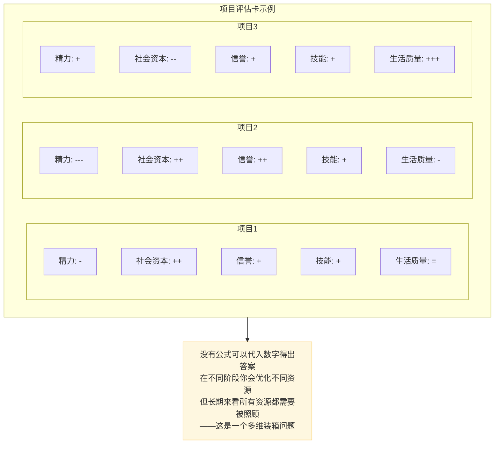

---

## 三、选择项目

### 项目从哪里来？

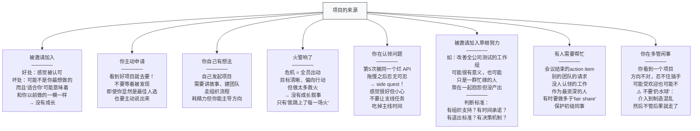

### 你到底在签什么？

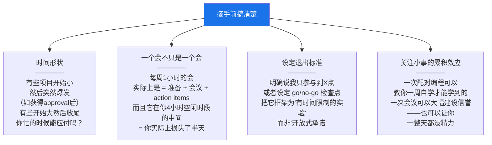

> **别人不一定对**。有些人允许低优先级的别人的事，取代了自己最高优先级的工作。如果你总是有人一发 Slack 就回、有小故障就跳进去——你需要更有判断力。**别人对你的资源仪表盘了解有限，只有你自己会保护你自己的资源。**

---

## 四、评估项目的问题清单

对每个潜在项目，作者建议问自己以下问题：

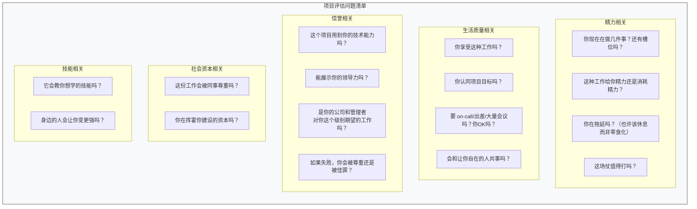

---

## 五、当项目不适合你

你可能评估了一个项目，发现它**对公司重要但对你不好**。你有五种选择：

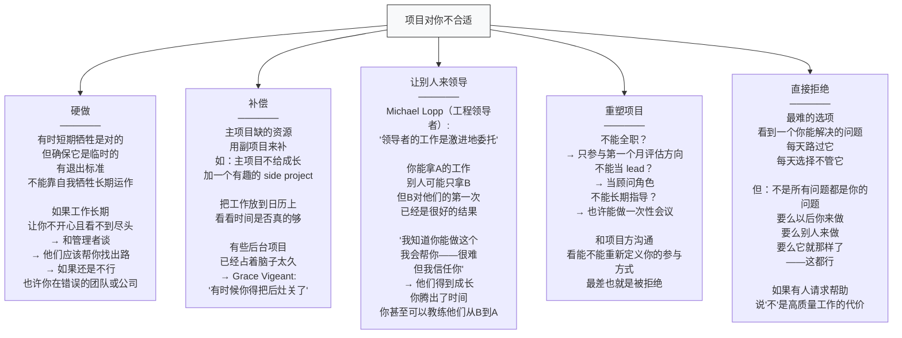

---

## 本章总结

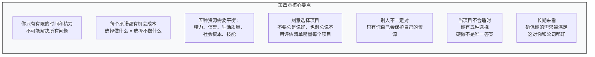

> **一句话总结：Staff 工程师面对无限的工作和有限的时间，必须像管理系统资源一样管理自己的精力、信誉、生活质量、社会资本和技能——刻意选择项目，学会说不，不要挥霍你积累的资本，确保长期可持续。**

---

**上一章**：[[ch3_创造大局观]] —— 如何创建技术愿景和技术战略
**下一章**：[[ch5_领导大项目]] —— 如何领导混乱的跨团队大项目
