# 第五章：领导大项目

> **原书标题**：Leading Big Projects
> **所属**：Part II - Execution（执行力）
> **核心问题**：作为 Staff 工程师，如何领导持续数月、跨多个团队的大型技术项目？从启动到交付的完整方法论是什么？

---

## 本章结构

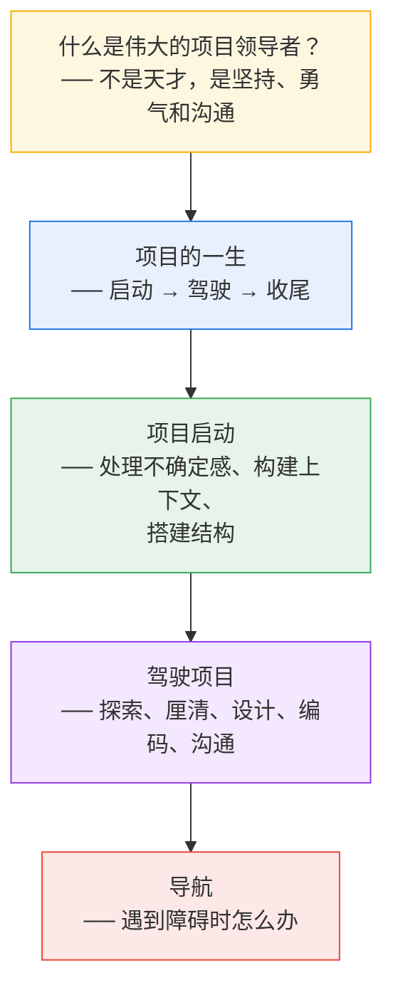

---

## 核心前提：什么造就了伟大的项目领导者？

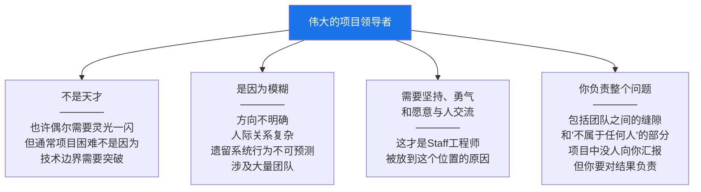

---

## 一、项目启动：面对不确定感

### 感到不知所措是正常的

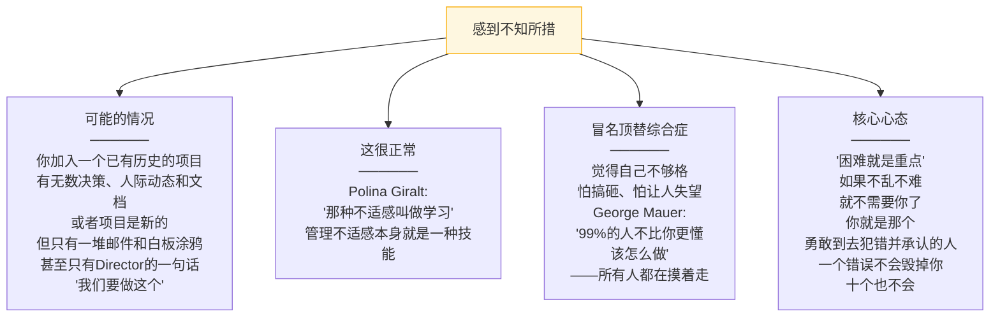

### 五件事让项目不那么可怕

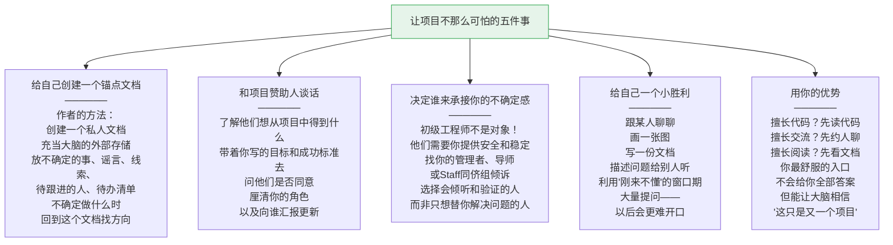

---

### 构建上下文：用三张地图

回到第二章的框架，项目开始时你需要填充三张地图：

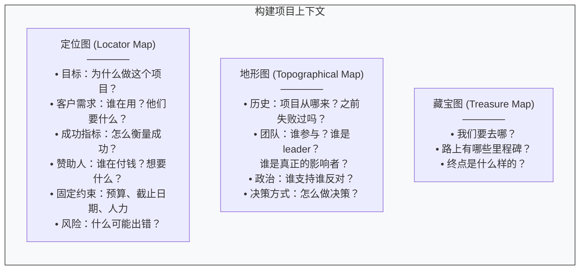

#### 关于客户需求的关键故事

> 作者讲了一个故事：她加入新基础设施团队的第一周，一个同事描述他们正在为另一个团队升级系统以提供新功能。她问"他们为什么需要这个功能？"同事说"也许需要吧，但我们不确定，也没有办法知道。"——**这两个团队就在同一栋楼的同一层。**
>
> 即使是最内部的项目，你也有"客户"。如果没有产品经理帮你搞清需求，你就得自己去做。不要想当然。

#### 关于成功指标

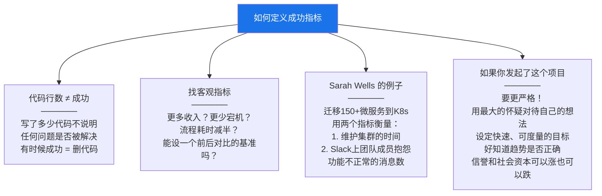

---

### 搭建项目结构

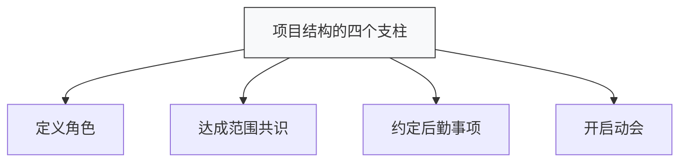

#### 定义角色：谁做什么？

在 Staff 工程师级别，多个领导角色之间的边界很模糊。一个资深工程师、一个工程经理、一个TPM——他们都应该"做房间里的成年人"。谁负责什么？

**作者的推荐方法：职责分配表**

| 职责 | 负责人 |
|---|---|
| 理解客户需求、提供初始需求 | 产品经理 |
| 提供产品成功 KPI | 产品经理 |
| 设定时间线 | TPM |
| 设定范围和里程碑 | 产品经理 + 工程经理 |
| 招募新团队成员 | 工程经理 |
| 监控团队健康 | 工程经理 |
| 技术指导和辅导 | 技术领导 (你) |
| 高层架构设计 | 技术领导（团队支持） |
| 编码 | 工程团队（技术领导支持） |
| 沟通项目状态 | TPM |
| 技术最终决策 | 技术领导 |
| 用户可见行为最终决策 | 产品经理 |

**更正式的工具：RACI 矩阵**

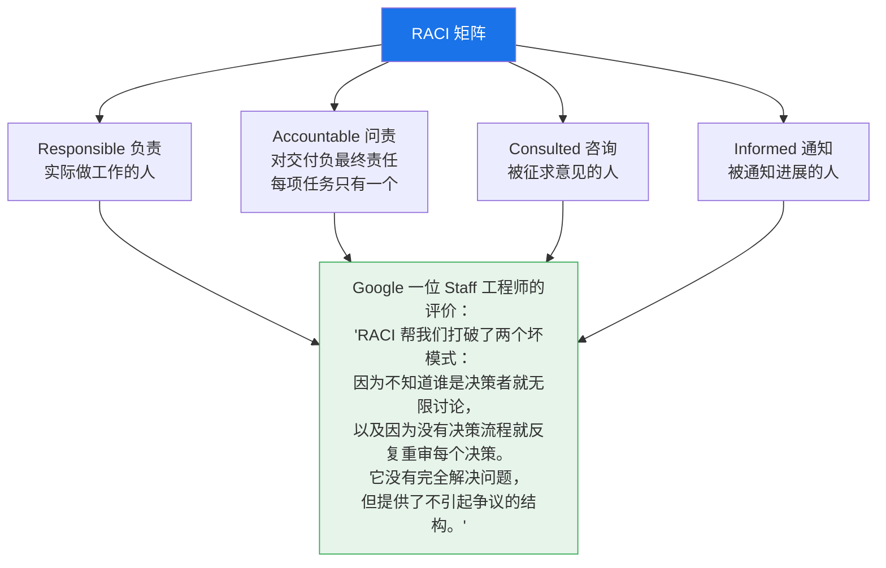

> **关键原则：如果你是项目领导，你隐含地负责所有没人做的事。** 没人跟踪用户需求？是你。没人做项目管理？是你。这可能累积成很大的负担。

#### 达成范围共识

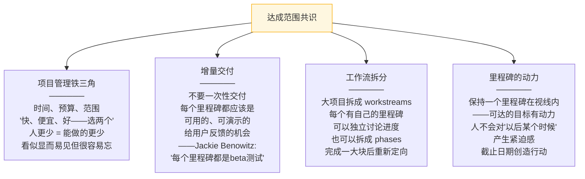

#### 时间估算

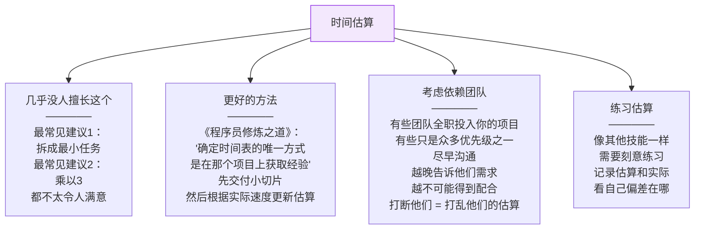

#### 约定后勤事项

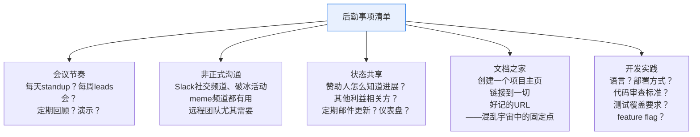

#### 启动会（Kickoff Meeting）

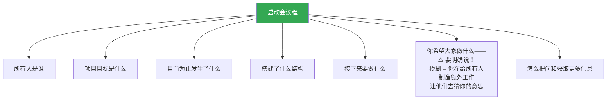

---

## 二、驾驶项目

Kripa Krishnan (Google Cloud VP) 的核心比喻：

> **"驾驶不是踩油门然后直线走。"** 驾驶是主动的、审慎的角色——选择路线、做决策、对路上的危险做出反应。你在驾驶座上，负责把所有人安全送到目的地。

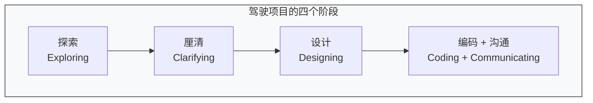

---

### 探索阶段

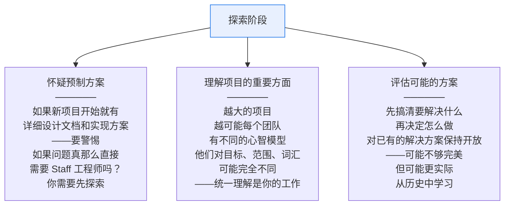

### 厘清阶段：把复杂变简单

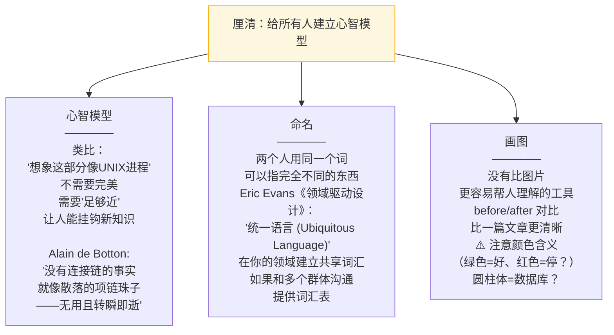

### 设计阶段：写下来

#### 为什么要写设计文档？

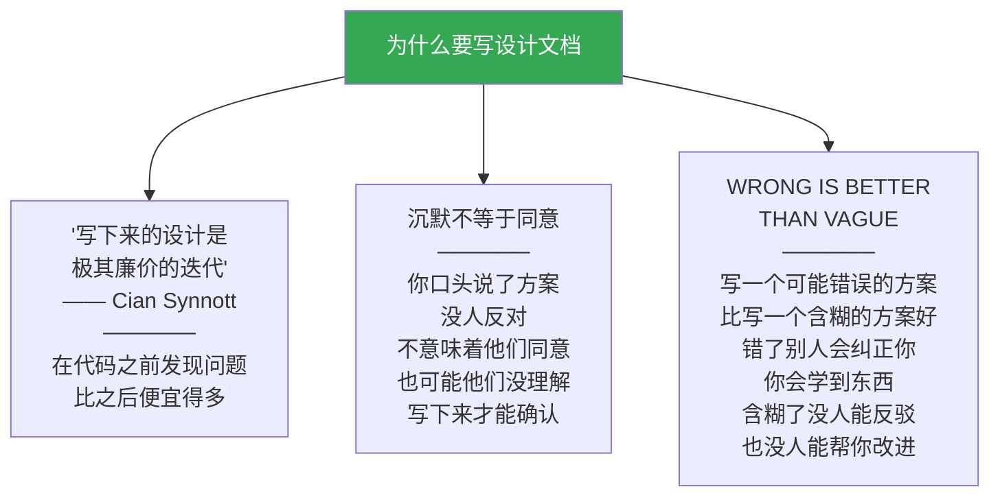

#### RFC 文档的核心结构

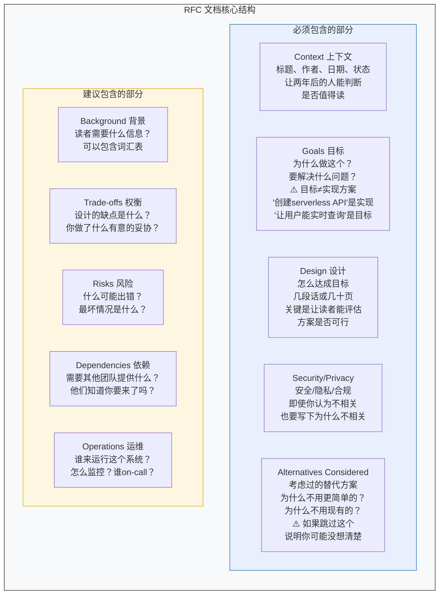

#### 写作两条黄金原则

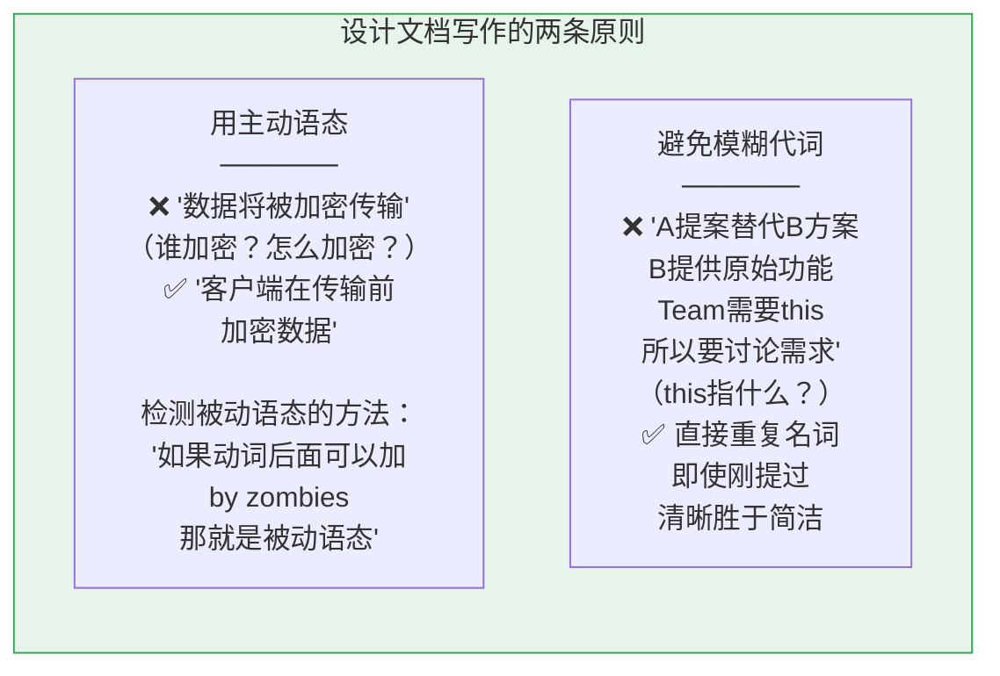

### 技术设计的常见陷阱

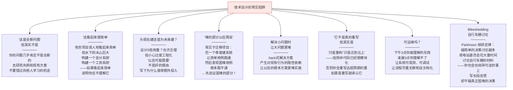

### 编码：Staff 工程师该不该写代码？

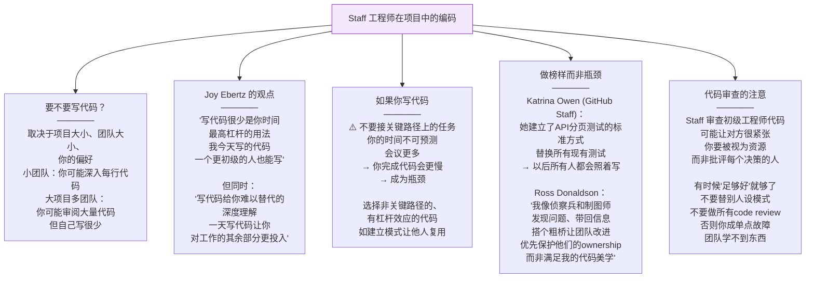

### 沟通

```mermaid
graph TB
    COMMS["沟通的两个层面"]

    COMMS --> C1["团队内部沟通<br/>──────<br/>让团队成员经常交流<br/>建立关系<br/>跨团队的人参加彼此的standup<br/>目标：舒适的熟悉感<br/>让提问和表达不同意<br/>都不觉得尴尬<br/><br/>不认识的工程师之间<br/>说'我不明白那是什么意思'<br/>会很不自在<br/>→ 误解不被发现"]

    COMMS --> C2["对外状态共享<br/>──────<br/>让利益相关方<br/>容易找到项目状态<br/>一对一、群邮件、仪表盘<br/><br/>⚠️ 用影响力来报告<br/>不要报告'站了3个微服务'<br/>报告'用户现在能做X了'<br/><br/>⚠️ 先讲结论<br/>不要假设他们会细读<br/>把关键信息放在最前面<br/><br/>⚠️ 诚实报告<br/>项目遇困不要报绿灯<br/>避免'西瓜项目'：<br/>外面绿色里面红色<br/>卡住了就求助"]

    style COMMS fill:#1a73e8,color:#fff
```

---

## 三、导航：遇到障碍时

```mermaid
graph TB
    NAV["遇到障碍时"]

    NAV --> N1["这是不可避免的<br/>──────<br/>技术不合适、法务否决、<br/>业务方向变了、关键人离职<br/>假设会出问题<br/>只是不知道什么时候<br/>→ 更灵活地应对"]

    NAV --> N2["你不能说<br/>'项目被阻塞了所以没办法'<br/>──────<br/>你负责重新规划路线<br/>或向上求助<br/>或告诉利益相关方<br/>目标不可达了"]

    NAV --> N3["避免西瓜项目<br/>──────<br/>如果一个关键问题<br/>无法解决<br/>而项目其他部分都是绿色<br/>→ 项目状态不是绿色<br/>不要隐瞒困难求助"]

    NAV --> N4["你不是一个人<br/>──────<br/>你的管理者想让你成功<br/>你的 Director 想让组织成功<br/>如果你不告诉他们<br/>你需要帮助<br/>他们就更难做好自己的工作<br/>求助不是失败<br/>不求助才是"]

    style NAV fill:#fce8e6,stroke:#ea4335
```

---

## 本章总结

```mermaid
graph TB
    subgraph RECAP["第五章核心要点"]
        direction TB
        R1["Staff 工程师能把不可能的问题<br/>变成可管理的问题"]
        R2["感到不知所措很正常<br/>项目困难正是需要你的原因"]
        R3["搭建结构来减少模糊<br/>让上下文共享变容易"]
        R4["明确成功的定义<br/>以及怎么衡量它"]
        R5["领导项目意味着主动驾驶<br/>不是被动等事情发生"]
        R6["通过建立关系和信任<br/>来铺平道路"]
        R7["写下来。清晰且有观点<br/>错的会被纠正<br/>含糊的会一直含糊"]
        R8["会有权衡取舍<br/>明确你在优化什么"]
        R9["面向受众沟通<br/>频繁且诚实"]
        R10["预期问题会出现<br/>计划应假设<br/>方向会变、人会走、依赖会断"]
    end

    style RECAP fill:#f8f9fa,stroke:#333
```

> **一句话总结：领导大项目的核心不是技术天才，而是在模糊和混乱中保持清醒——构建上下文、搭建结构、驾驶方向、写下设计、诚实沟通、遇到障碍时主动导航而非被动等待。困难就是重点——如果项目不难，就不需要你了。**

---

**上一章**：[[ch4_有限的时间]] —— 如何管理你的时间和资源
**下一章**：[[ch6_为什么停滞了]] —— 项目停滞的原因和重启方法
