# 第六章：为什么停滞了？

> **原书标题**：Why Have We Stopped?
> **所属**：Part II - Execution（执行力）
> **核心问题**：当项目停滞不前时，作为 Staff 工程师如何诊断原因、解除阻塞、应对迷失方向、以及优雅地结束项目？

---

## 本章结构

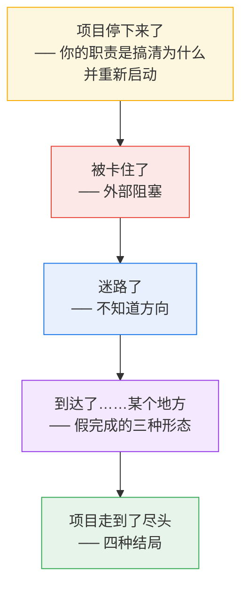

---

## 核心前提：你不只是你自己项目的领导者

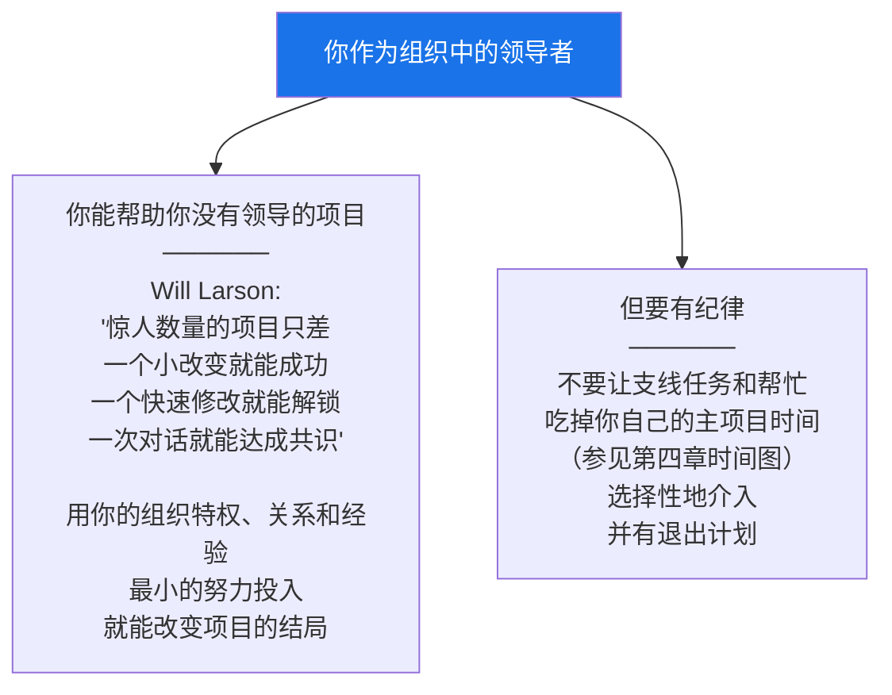

### 解除阻塞的四种通用技术

全章反复使用这四种方法来应对各种类型的阻塞：

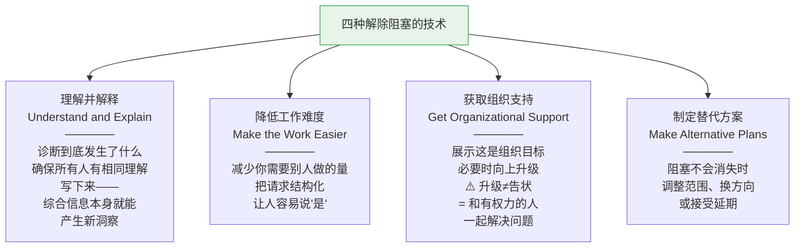

---

## 一、被卡住了（You're Stuck in Traffic）

### 被另一个团队阻塞

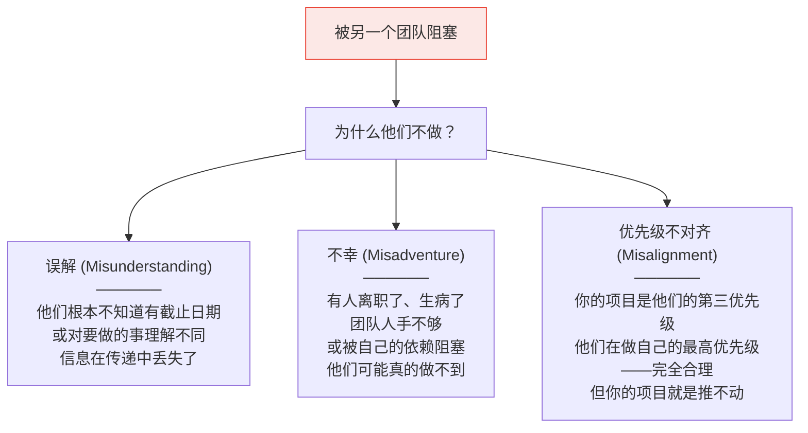

#### 优先级不对齐的典型场景

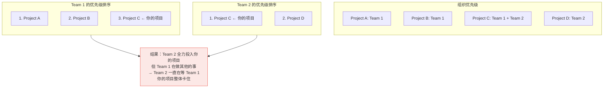

#### 应对被团队阻塞

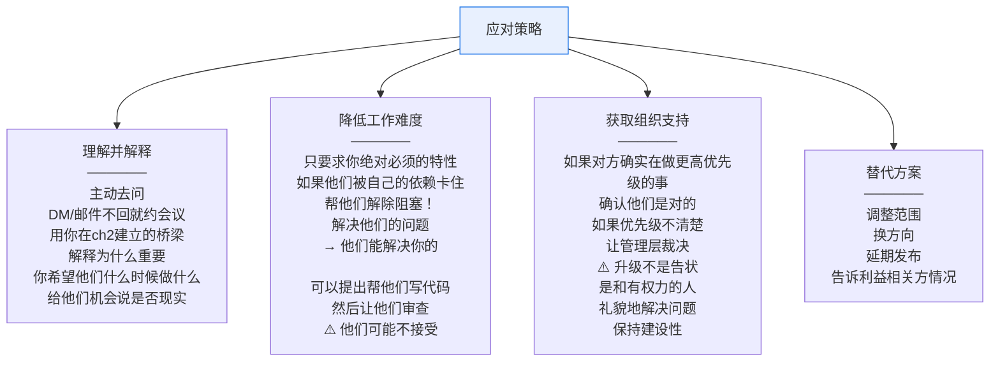

### 被一个"该死的按钮点击"阻塞

当你等一个只需要10分钟的审批、配置或代码审查——但它就是不发生。

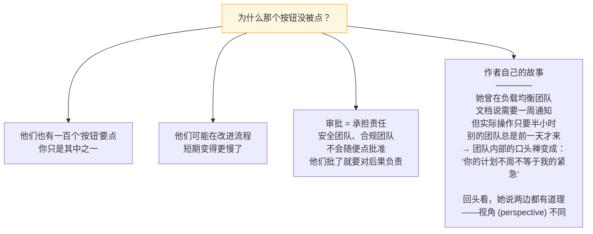

**应对策略：**
- 礼貌地道歉并请求加急——道歉比吼叫有效得多
- 感谢帮过你的人（peer bonus、送茶、在发布邮件里点名感谢）
- 结构化你的请求——让它成为最容易处理的那种请求（参见原书 Figure 6-3：信息齐全、不需要思考的工单）
- 有人脉关系帮助——有时候认识一个人就够了

### 被一个人阻塞

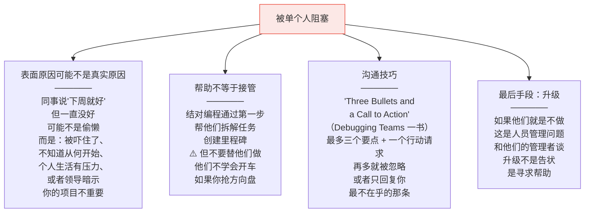

### 被未分配的工作阻塞

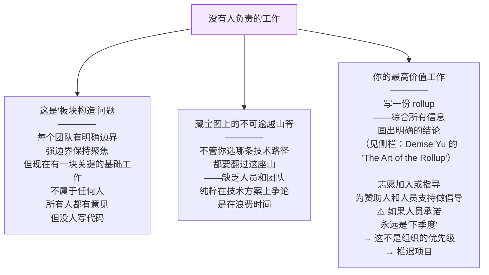

#### Rollup 技术（综合信息）

> Denise Yu（GitHub 管理者）描述了 **"the art of the rollup"**：把所有信息汇总到一个地方，"创造清晰、减少混乱"。
>
> 汇总事实本身就是构建知识的好方法。但写下来还可能产出新信息——Alex 说 "新库会给这个端点提供认证"，后来 Meena 说 "我们要到 Q3 才能升级到新版库"。你可以写下推论：**"我们最早 Q3 才会有认证"**。这个结论对有全部上下文的人来说显而易见，但如果没人综合过，可能没人意识到。

### 被大量人群阻塞（迁移场景）

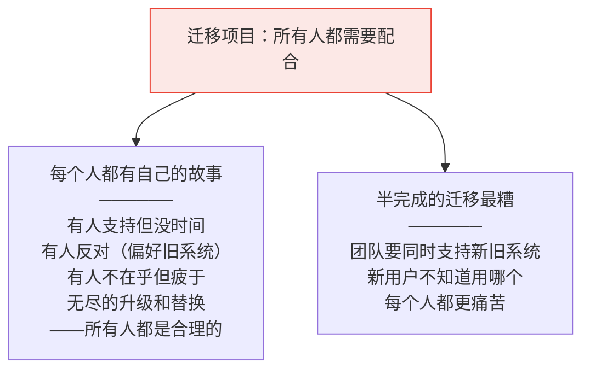

#### 推进迁移的实战技巧

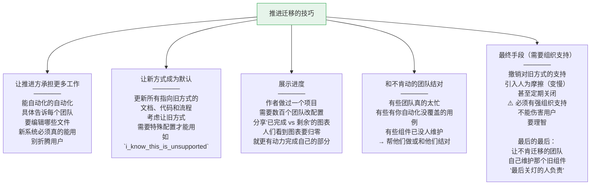

---

## 二、迷路了（You're Lost）

不是被外部事物阻塞，而是**你自己不知道该往哪走**。三种迷路形态：

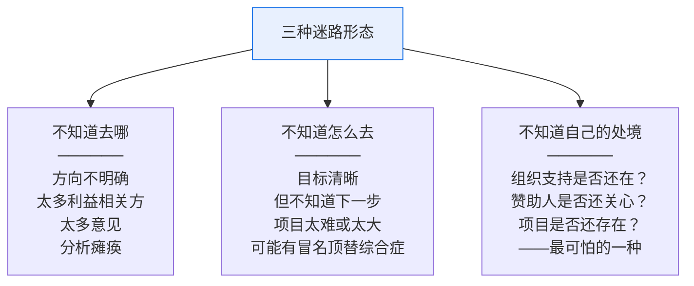

### 不知道去哪：如何选择方向

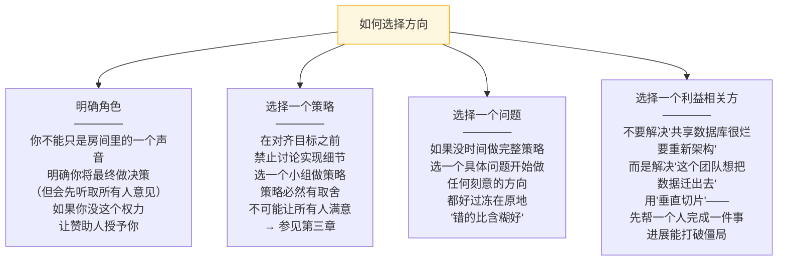

### 不知道怎么去：在困难中找路

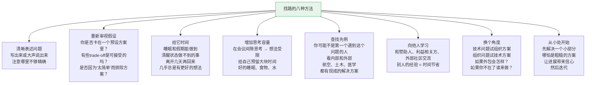

### 不知道自己的处境：你的项目还存在吗？

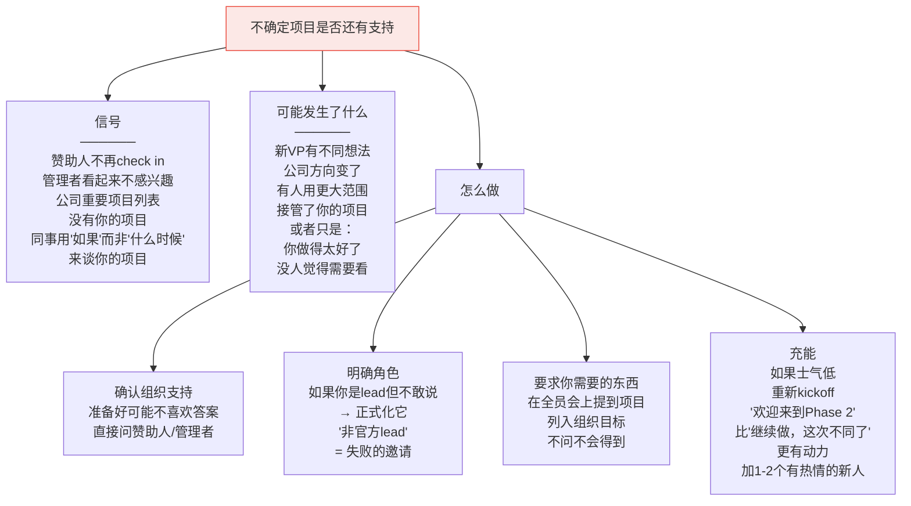

---

## 三、到达了……某个地方（假完成的三种形态）

团队觉得项目完成了——**但问题没有真正被解决**。

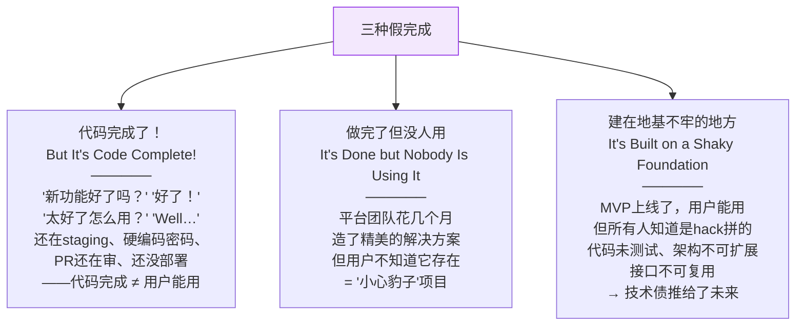

### "代码完成"的陷阱

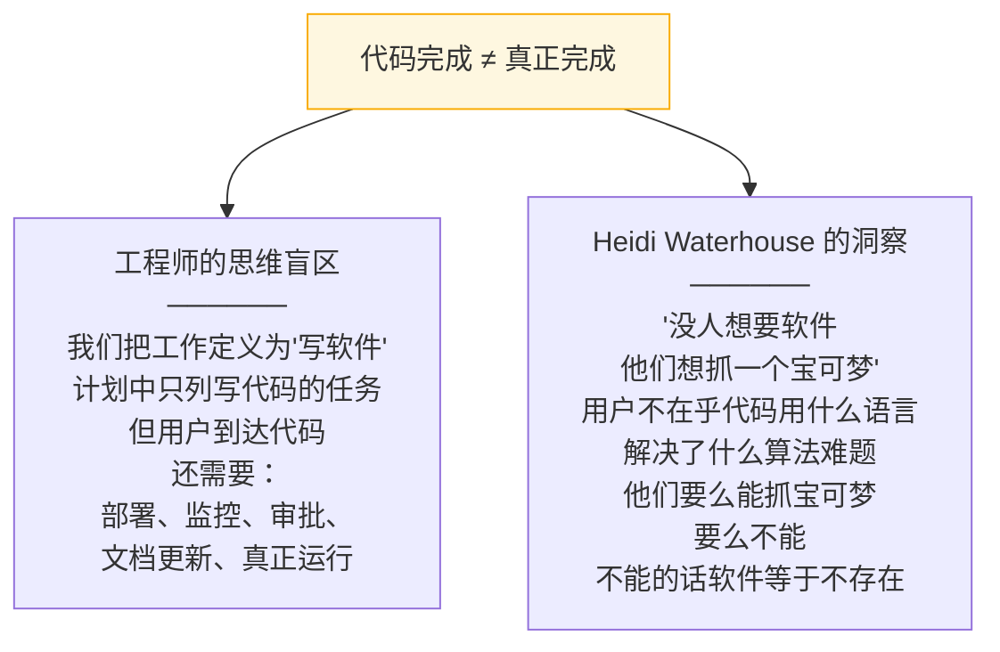

#### 确保用户能"抓到宝可梦"

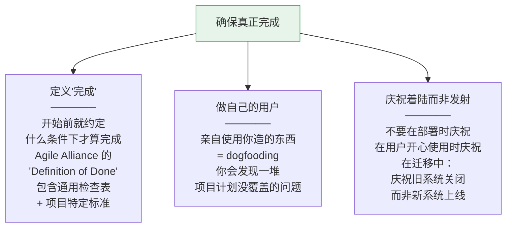

### "小心豹子"项目——做完了但没人用

```mermaid
graph TB
    LEOPARD["为什么没人用？"]

    LEOPARD --> LP1["典型场景<br/>──────<br/>内部平台团队造了好东西<br/>给它起了可爱的名字<br/>写了文档（也许）<br/>然后……停了<br/>用户不知道它存在<br/>就算看到了<br/>名字也看不出它是做什么的<br/>搜索常见关键词<br/>找不到这个方案"]

    LEOPARD --> LP2["《银河系漫游指南》类比<br/>──────<br/>'但计划是展示出来了的…'<br/>'展示？我得下到地下室<br/>在一个上锁的柜子里<br/>一个废弃的厕所里<br/>门上写着"小心豹子"'<br/><br/>创造者仿佛在试图<br/>藏起解决方案！"]

    style LEOPARD fill:#fce8e6,stroke:#ea4335
```

#### 怎么推销你的内部产品

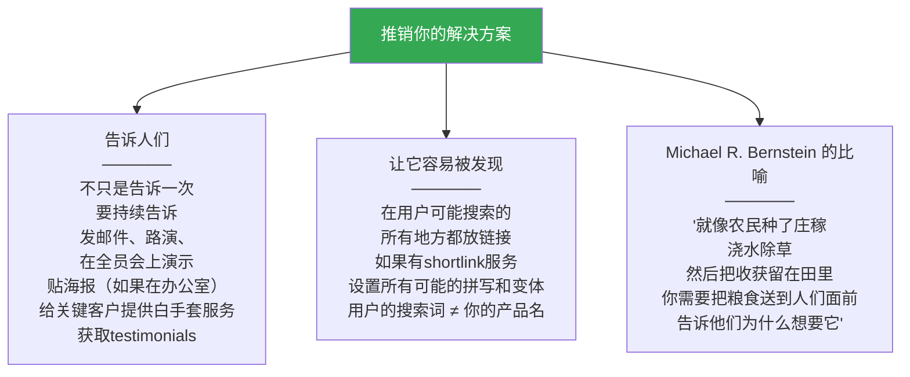

### 建在地基不牢的地方

```mermaid
graph TB
    SHAKY["地基不牢怎么办"]

    SHAKY --> SH1["为什么会这样<br/>──────<br/>有时候快速出货是对的<br/>——竞争市场、验证想法<br/>但team走了之后<br/>那个cheap solution还在<br/>代码未测试、不可测试<br/>是别人都要绕过的<br/>架构hack"]

    SHAKY --> SH2["数据中心的教训<br/>──────<br/>'没有临时方案'<br/>如果有人不按标准<br/>从一个机架拉线到另一个<br/>那根线会一直在那<br/>直到服务器退役<br/>——所有临时hack都是如此"]

    SHAKY --> SH3["Staff 工程师能做什么"]

    SH3 --> A1["树立质量文化<br/>做那个永远问<br/>'测试呢？''怎么监控？'<br/>'文档要更新'的人"]
    SH3 --> A2["把基础工作变成用户故事<br/>不是'还技术债'<br/>而是'用户体验改善'<br/>或'为下个功能打基础'"]
    SH3 --> A3["争取工程师主导时间<br/>fix-it weeks、tech debt weeks<br/>20% time、passion project week<br/>轮值处理问题和改善"]

    style SHAKY fill:#f3e8fd,stroke:#9334e6
```

---

## 四、项目走到了尽头

四种项目结局：

```mermaid
graph TB
    ENDINGS["项目的四种结局"]

    ENDINGS --> E1["这里停更好<br/>──────<br/>继续投入不值得了<br/>'够好了'就是成功<br/>确认不是假完成<br/>然后宣布胜利"]

    ENDINGS --> E2["这不是正确的旅程<br/>──────<br/>发现技术方案不可行<br/>杀掉项目+写复盘<br/>→ 不是失败而是成功<br/>因为避免了更大浪费<br/><br/>⚠️ 警惕沉没成本谬误<br/>投入越多越不想停<br/>但继续一个注定失败的项目<br/>只是推迟不可避免的"]

    ENDINGS --> E3["项目被取消了<br/>──────<br/>你无法控制的原因<br/>新领导、市场变化、<br/>资源削减<br/><br/>处理情绪：这很痛苦<br/>和管理者/信任的人谈<br/>理解更大的图景<br/><br/>然后和团队谈<br/>确保他们直接从你这里<br/>听到消息而非八卦<br/>给他们时间消化<br/>——他们可能对你<br/>作为'没保住项目的人'生气<br/><br/>干净地关闭项目<br/>能删的代码删掉<br/>写文档留给未来的人<br/><br/>为团队成员代言<br/>告诉他们的新管理者<br/>他们的成就<br/>写绩效评价时<br/>提到他们的贡献"]

    ENDINGS --> E4["这就是目的地！<br/>──────<br/>恭喜！<br/>确认达到了可衡量的目标<br/>用户能抓到宝可梦<br/>地基干净坚固<br/><br/>庆祝——聚会、礼物、<br/>全员会表彰<br/>给团队成员可见度<br/>内外部演讲和博客<br/><br/>做复盘——不只是找错<br/>也找做对了什么<br/>强化你想看到的文化"]

    style E1 fill:#fef7e0,stroke:#f9ab00
    style E2 fill:#fce8e6,stroke:#ea4335
    style E3 fill:#fce8e6,stroke:#ea4335
    style E4 fill:#e6f4ea,stroke:#34a853
```

---

## 本章总结

```mermaid
graph TB
    subgraph RECAP["第六章核心要点"]
        direction TB
        R1["作为项目领导<br/>你负责理解为什么停了<br/>并让它重新启动"]
        R2["作为组织领导<br/>你也能帮别人的项目重启"]
        R3["四种技术：<br/>理解解释、降低难度、<br/>获取组织支持、替代方案"]
        R4["给停滞的项目带来清晰：<br/>定义目标、明确角色、<br/>在需要时求助"]
        R5["不要宣布胜利<br/>除非项目真正完成<br/>代码完成只是一个里程碑"]
        R6["不管是否准备好<br/>有时候项目必须结束<br/>庆祝、复盘、收拾"]
    end

    style RECAP fill:#f8f9fa,stroke:#333
```

> **一句话总结：项目停滞有三类原因——外部阻塞、内部迷失、假完成。Staff 工程师的价值在于诊断真正的原因、用四种通用技术（理解解释、降低难度、组织支持、替代方案）解除阻塞，以及有勇气面对项目应该结束的现实——不管是宣布胜利、承认失败还是处理被取消，都要干净、有尊严、有复盘。**

---

**上一章**：[[ch5_领导大项目]] —— 如何启动和驾驶跨团队大项目
**下一章**：[[ch7_你现在是榜样了]] —— Part III 开始：以身作则和技术领导力的榜样效应
