# 第七章：你现在是榜样了

> **原书标题**：You're a Role Model Now (Sorry)
> **所属**：Part III - Leveling Up（提升他人）
> **核心问题**：作为 Staff 工程师，你的一举一动都在定义组织的工程文化。你应该展示哪些属性？如何做一个好榜样？

---

## 本章结构

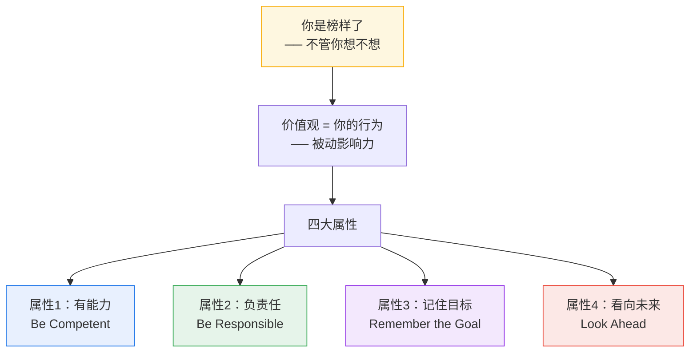

---

## 核心前提：你的影响力是被动的

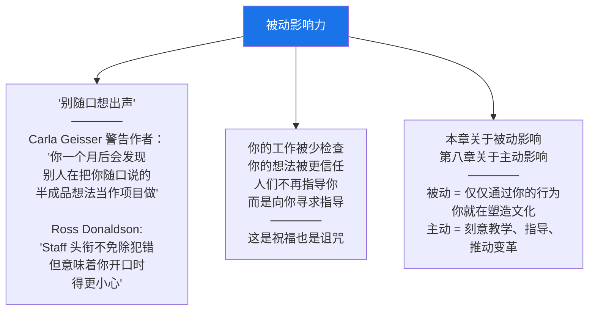

### 价值观 = 你的行为，而非墙上的海报

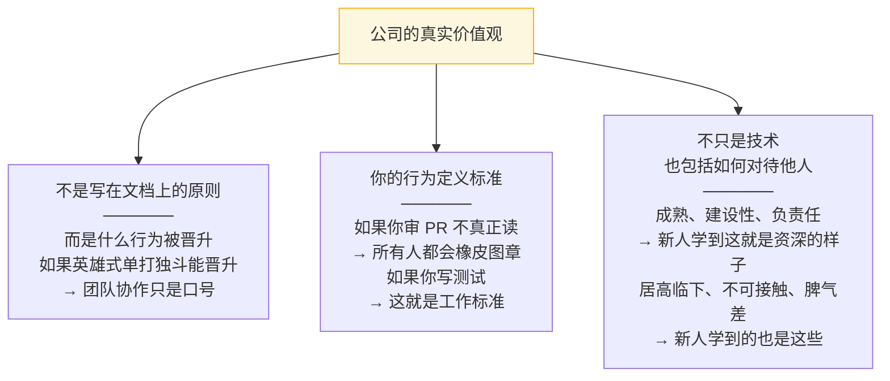

### 如果你不想当榜样怎么办？

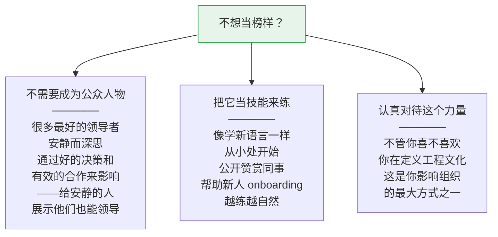

---

## 四大属性概览

作者明确说：**这些是理想，是你应该追求的方向，不是100%完成才算合格的清单。我们都是 works in progress。** 而且所有建议都依赖情境——如果你的判断和书中建议矛盾，相信你自己。

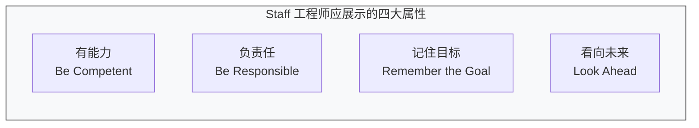

---

## 属性1：有能力（Be Competent）

有能力 = 建设并保持知识和技能 + 自我觉察 + 高标准。

### 懂东西（Know Things）

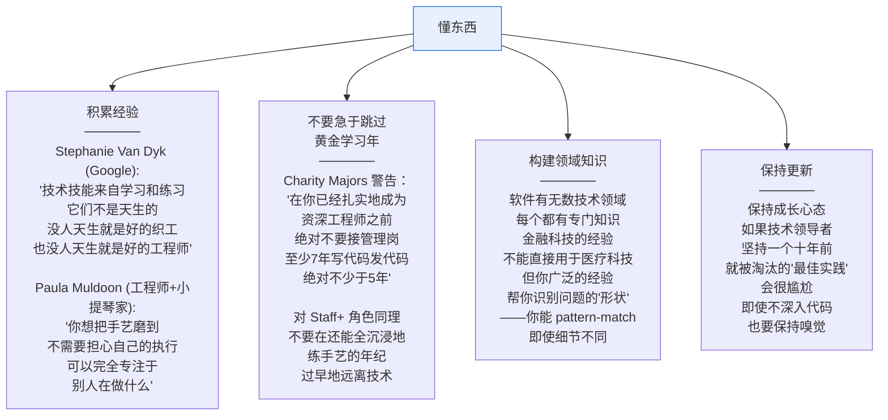

#### 展示你在学习

> 初级工程师需要看到：**终身学习是资深工程师的一部分**，他们永远不会"到达终点"。他们也需要看到：你的技能和知识**不是魔法降临的——全都是可以学习的**。
>
> 公开你在学什么，展示你如何学。当你做一个涉及不常见知识的判断时，告诉周围的人**你为什么得出这个结论、用了什么信息、怎么获得的信息**。明确告诉他们你也在学习——让学习变得安全。

#### "你够技术吗？"

> 作者说她听到工程师形容别人"不够技术"，她总会反驳。这个说法定义的是**一个人是谁**而非**他们有什么技能**——没有可行的成长路径。更精确的问法是：
> - 他们还没有足够的实践年限？
> - 他们不了解你的领域？
> - 他们缺乏特定技能？哪些？

### 自我觉察（Be Self-Aware）

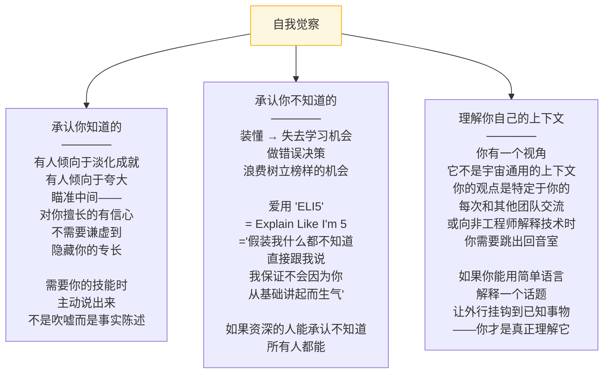

### 保持高标准（Have High Standards）

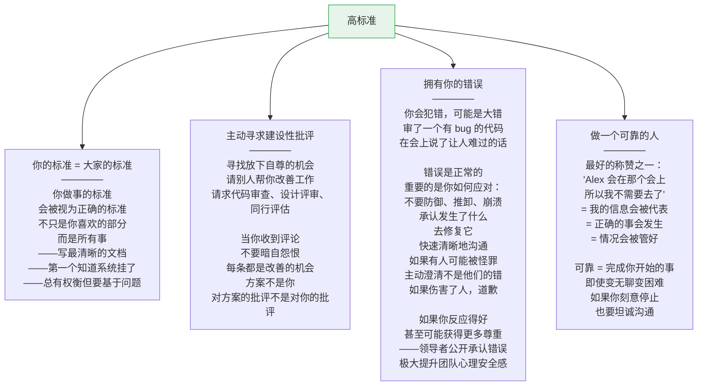

---

## 属性2：负责任（Be Responsible）

像哲学家 Uncle Ben 告诉蜘蛛侠的：**能力越大，责任越大。** 你是"有人应该做点什么"中的那个"有人"。

### 主动担责（Take Ownership）

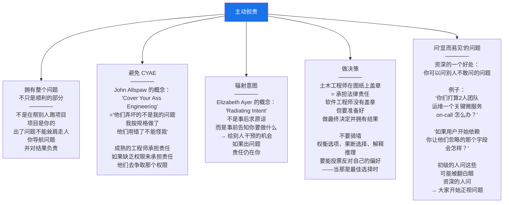

#### 不要通过忽视来委托（Glue Work）

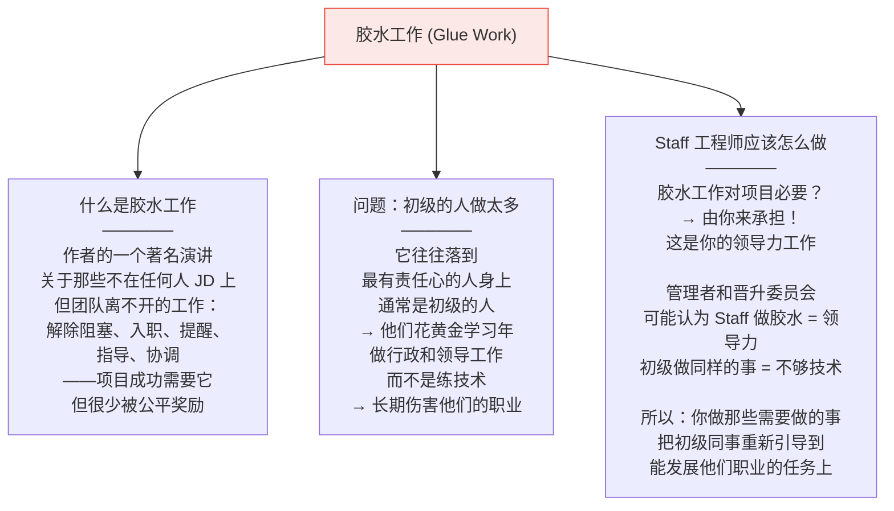

### 主动掌控（Take Charge）

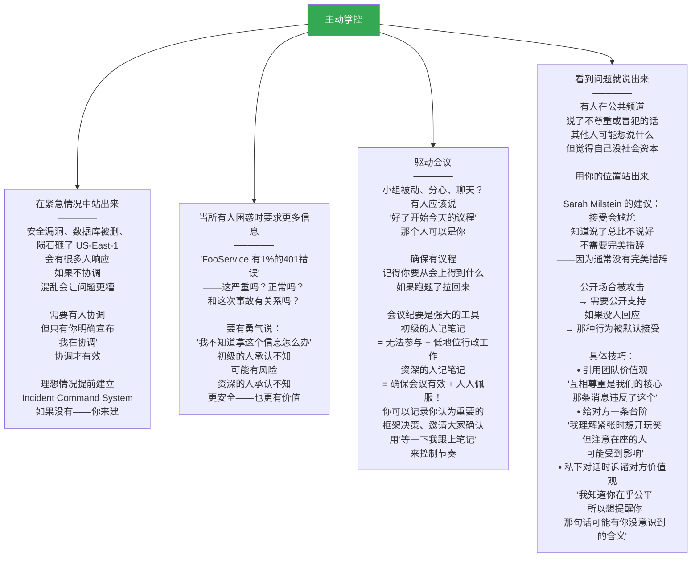

### 创造平静（Create Calm）

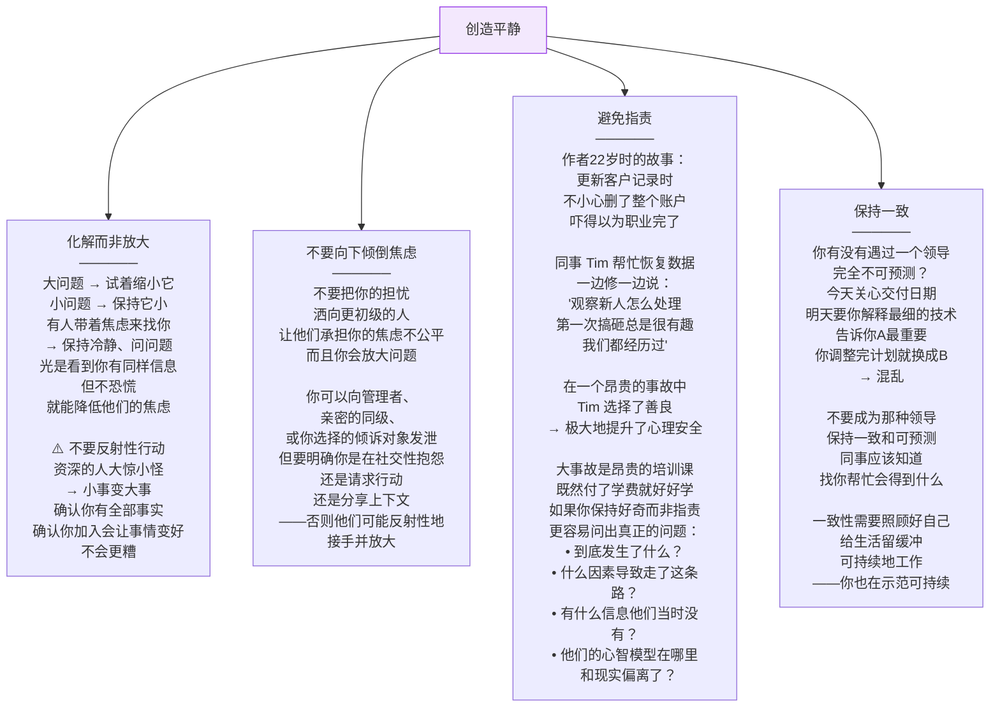

---

## 属性3：记住目标（Remember the Goal）

技术不是目的。你在为一个有目标的组织工作。软件是手段，不是目的本身。

### 记住有业务存在

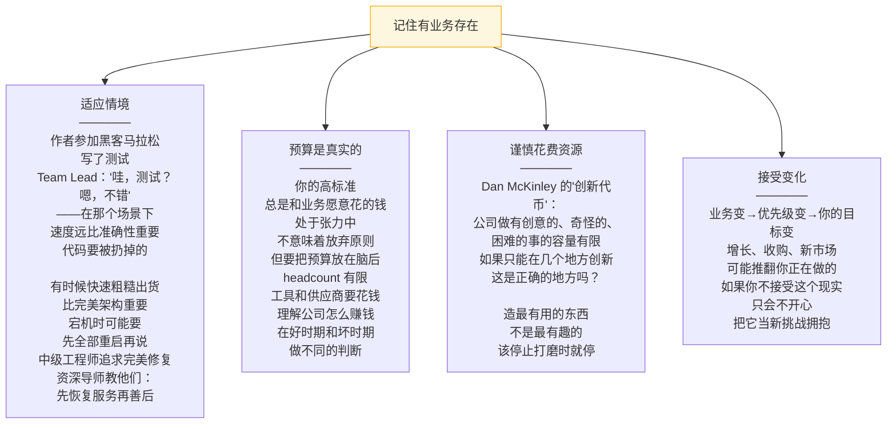

### 记住有用户存在

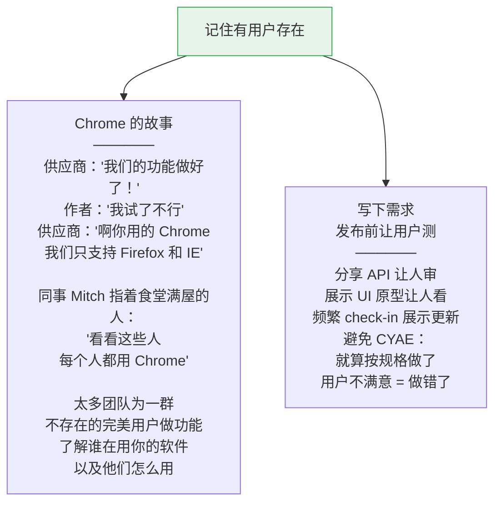

### 记住有团队存在

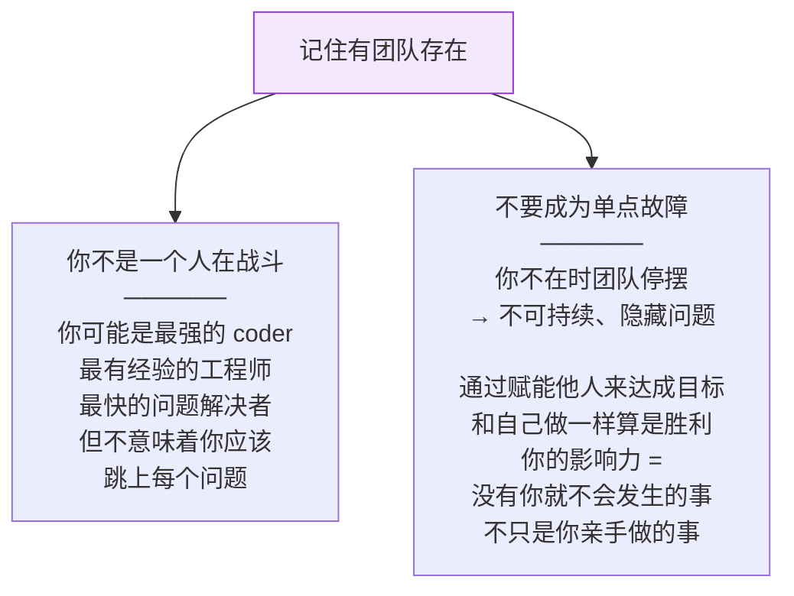

---

## 属性4：看向未来（Look Ahead）

你写的代码和架构可能用5-10年。你走后组织还在。**不要只为现在优化——以未来速度和工程能力为代价。** 种一些你自己看不到长成大树的种子是 OK 的。

### 预见未来的你希望做过什么

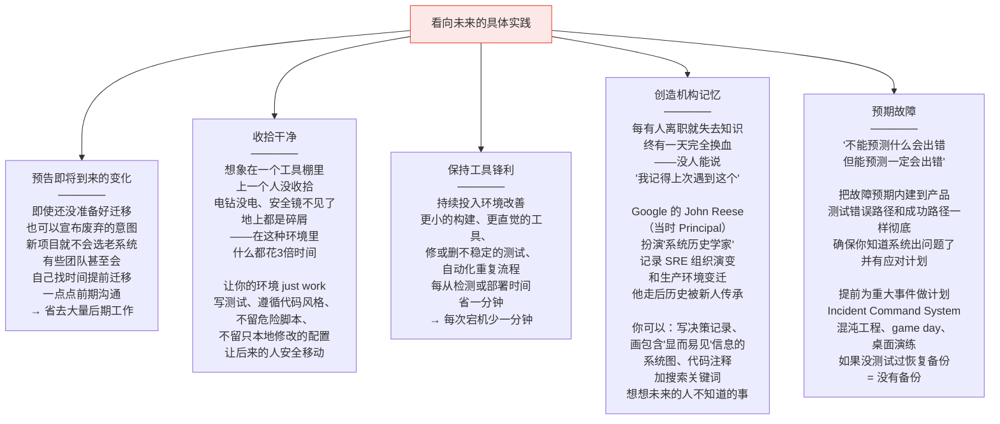

### 为维护优化，而非为创造优化

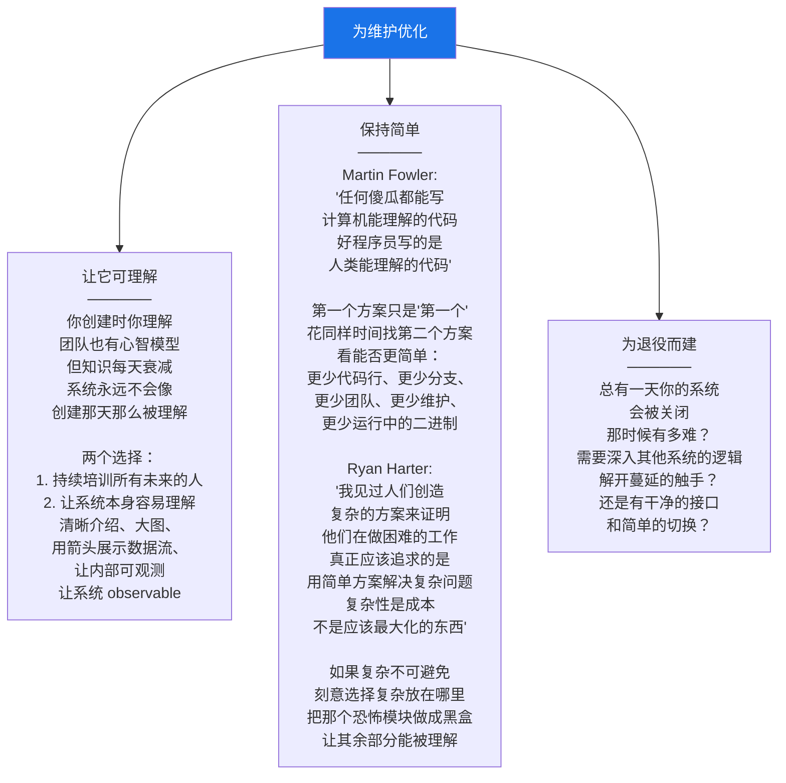

---

## 本章总结

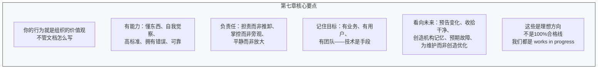

> **一句话总结：Staff 工程师是榜样——你的行为定义组织的工程文化。做一个有能力、负责任、记住目标、看向未来的工程师。不需要完美，但要有自觉地朝这些方向努力。你每天的行为——写不写测试、怎么对待他人、怎么处理错误、怎么做决策——都在告诉整个组织'这就是好工程师的样子'。**

---

**上一章**：[[ch6_为什么停滞了]] —— 项目停滞的原因和重启方法
**下一章**：[[ch8_规模化正向影响]] —— 如何主动地、有规模地影响组织和他人
