# 第八章：规模化正向影响

> **原书标题**：Good Influence at Scale
> **所属**：Part III - Leveling Up（提升他人）
> **核心问题**：如何主动地提升周围人的技能？从一对一到整个组织，影响力如何扩展？四种影响机制（建议、教学、护栏、机会）如何在三个层级（个体、群体、催化剂）运作？

---

## 本章结构

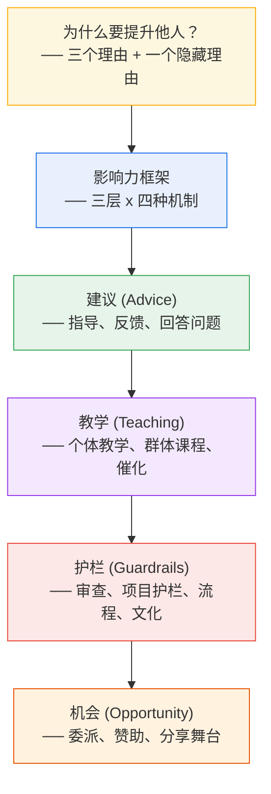

---

## 为什么要提升周围的人？

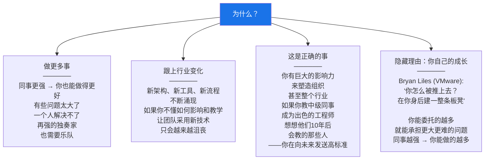

---

## 影响力框架：三层 x 四种机制

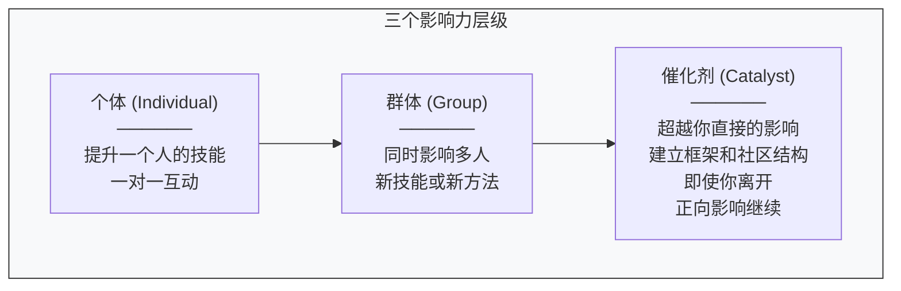

### 影响力矩阵（原书 Table 8-1）

| | 个体 (Individual) | 群体 (Group) | 催化剂 (Catalyst) |
|---|---|---|---|
| **建议** | 指导、分享知识、反馈 | 技术讲座、文档、文章 | 建立指导计划、技术活动 |
| **教学** | 代码审查、设计审查、教练、结对、影子 | 课程、codelab | 入职课程体系、教别人去教 |
| **护栏** | 代码审查、变更审查、设计审查 | 流程、linter、代码风格指南 | 框架、文化变革 |
| **机会** | 委派、赞助、鼓励、持续支持 | 分享舞台、赋能团队 | 创造机会文化、看着你赞助的新人改变世界 |

> **不要跳过"小"的。** 即使最改变世界的技术领导者仍然在做一对一的指导。个体和群体层级的工作先做好，只有在需求明确时才扩展到催化剂层级。太多框架和程序会让组织不堪重负。

---

## 一、建议（Advice）

### 建议的基本原则

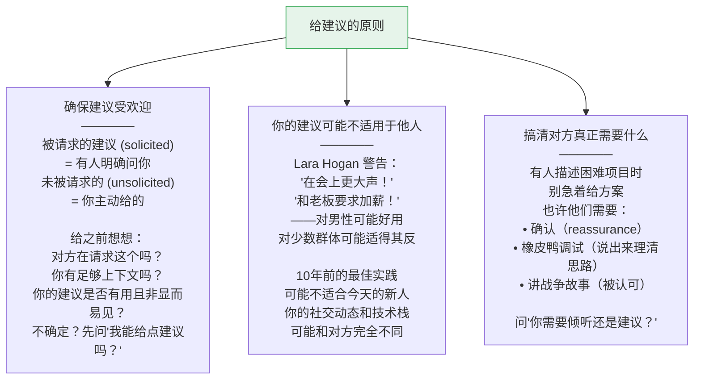

### 个体建议：指导（Mentorship）

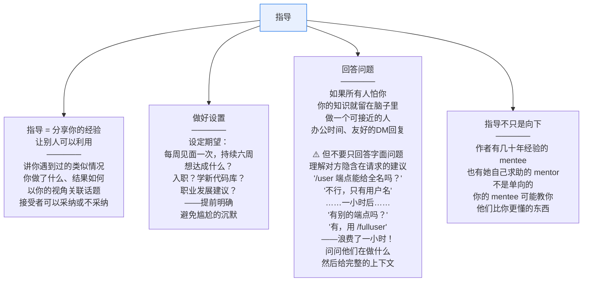

### 个体建议：反馈（Feedback）

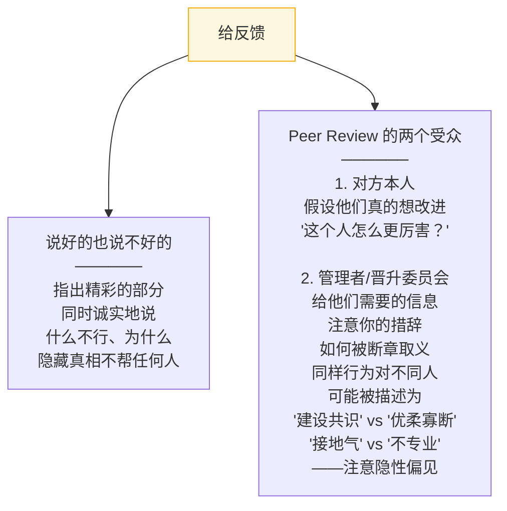

### 规模化建议到群体

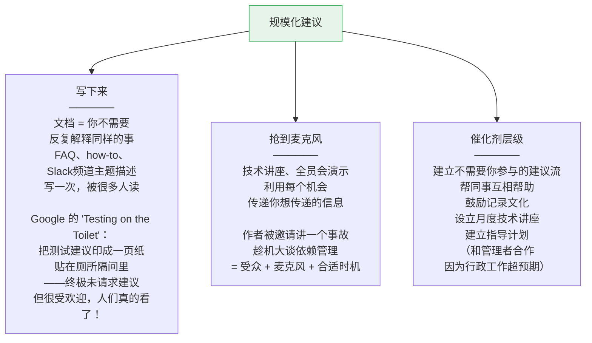

---

## 二、教学（Teaching）

教学 vs 建议的区别：**建议是告诉，教学是让对方理解并内化。**

### 个体教学

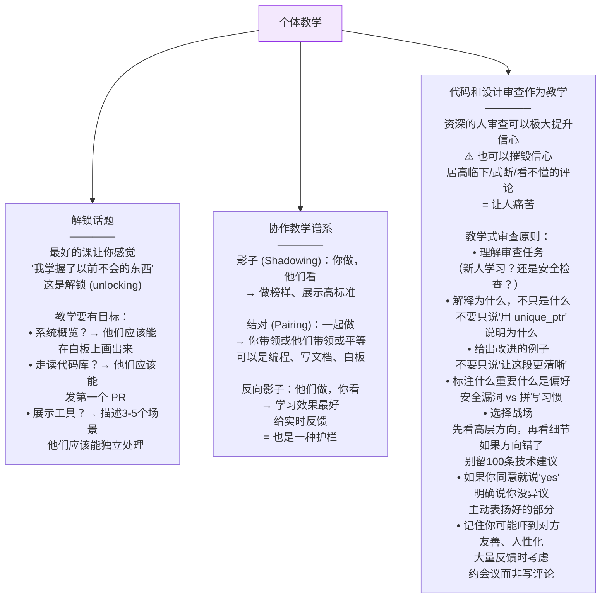

### 个体教学：教练（Coaching）

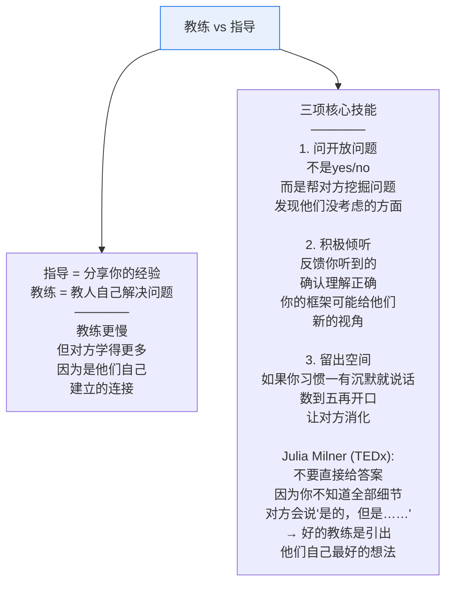

### 规模化教学到群体

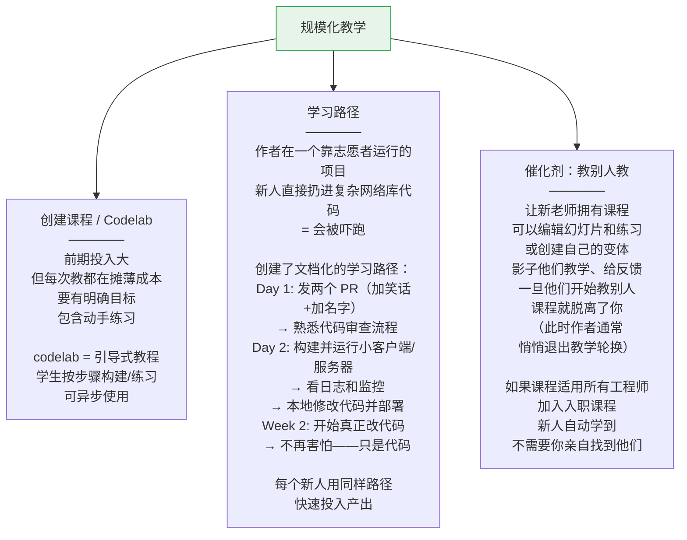

---

## 三、护栏（Guardrails）

护栏就像悬崖小路上的栏杆——**不是用来靠着的，但当你需要时它能救命。** 护栏鼓励自主、探索和创新。当行进安全时，所有人都走得更快。

### 个体护栏

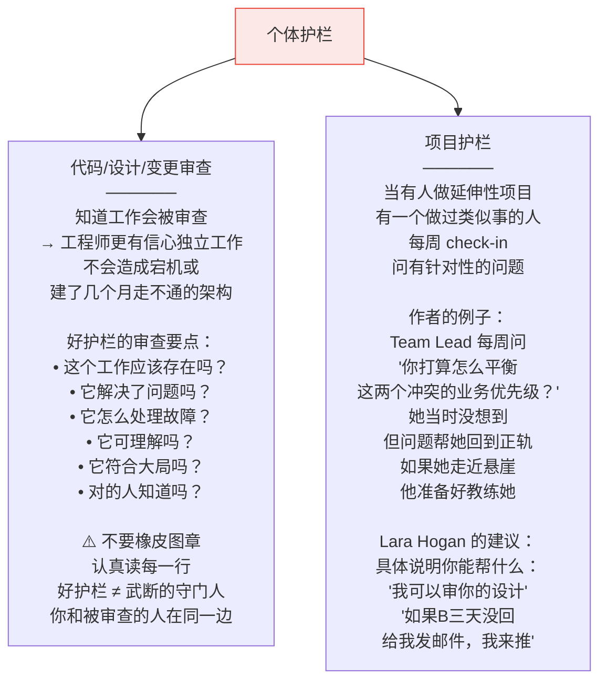

### 规模化护栏到群体

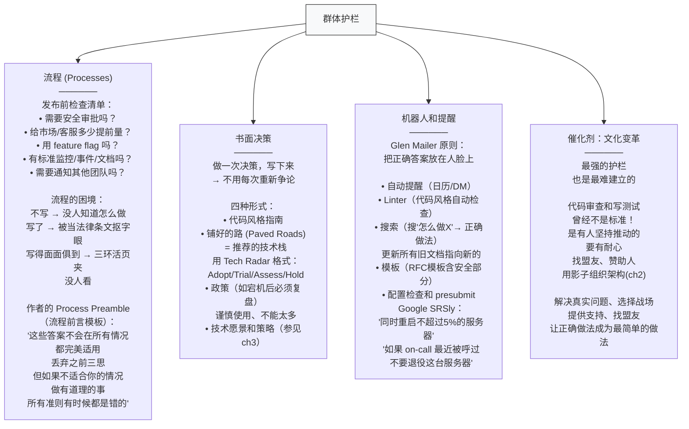

---

## 四、机会（Opportunity）

人通过**做**学到的，比通过教学、教练或建议学到的更多。每个项目或角色都是可见度、关系和简历的机会。

### 个体机会

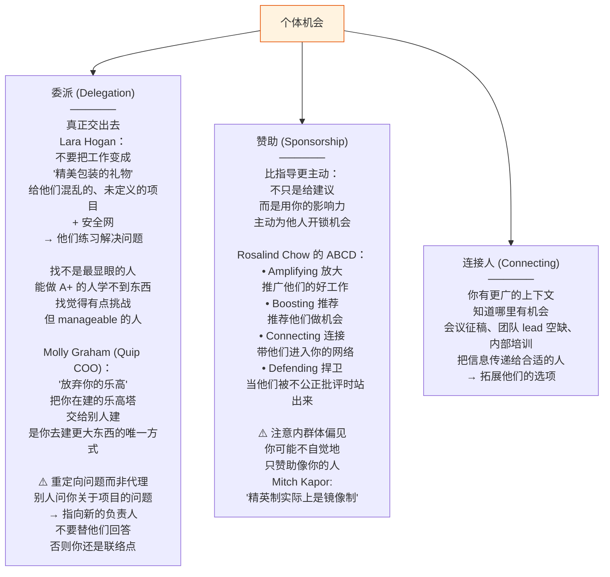

### 规模化机会到群体

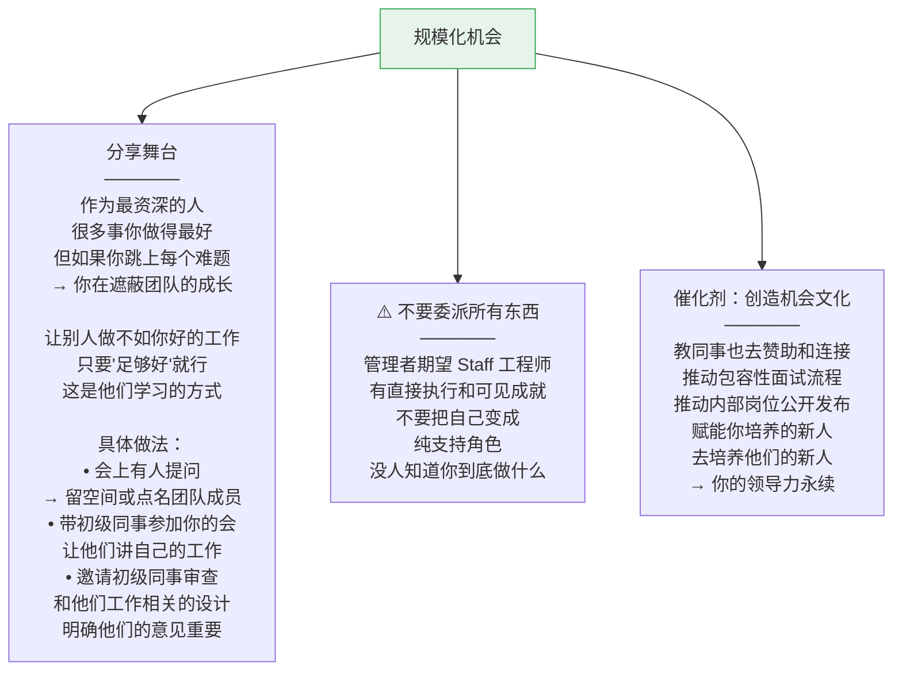

### 关于晋升的重要提醒

> **别人被晋升到你的级别，不需要像现在的你一样强——他们只需要像你刚被晋升时一样强。** 如果你发现新晋升的人不如你，不要嘲讽标准降低了——想想是不是你成长了。

---

## 本章总结

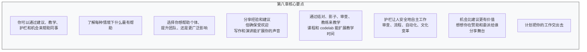

> **一句话总结：提升他人不是慈善——它是你自己成长的前提。通过建议、教学、护栏和机会四种机制，在个体、群体和催化剂三个层级施加影响。最终目标是让你培养的人去培养下一代——你的领导力将超越你自己的职业生涯。**

---

**上一章**：[[ch7_你现在是榜样了]] —— 被动影响力：你的行为定义组织文化
**下一章**：[[ch9_下一步是什么]] —— 你自己的职业旅程、选择和未来
