# 第九章：下一步是什么？

> **原书标题**：What's Next?
> **所属**：Part III - Leveling Up（提升他人）
> **核心问题**：作为 Staff 工程师，你的职业下一步是什么？如何评估当前角色？如何决定留下还是离开？有哪些可能的前进路径？

---

## 本章结构

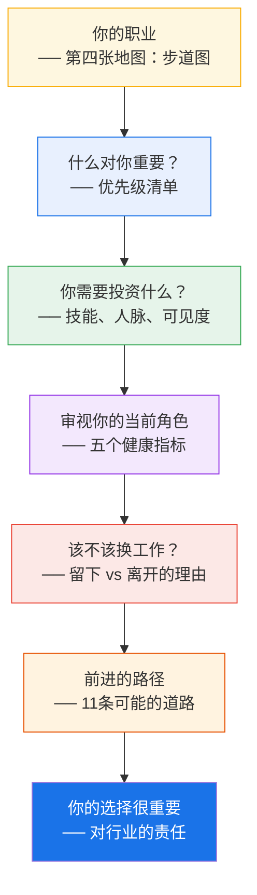

---

## 核心隐喻：第四张地图——步道图

回到第二章的三张地图框架。现在为你自己的职业画第四张地图——**步道图（Trail Map）**。

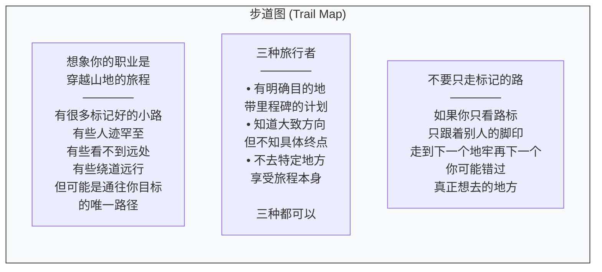

> 朋友把自己的职业比喻为打《暗黑破坏神》："我杀怪清副本，攒够经验升级。然后……又一个副本，怪物也升级了。这有什么意义？"

---

## 一、什么对你重要？

Staff 工程师 Cian Synnott 建议创建一个**优先级清单**——确保你的工作在支持你真正在乎的东西。

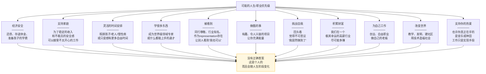

---

## 二、你需要投资什么？

想象你已经成功达到了目标——那个成功的未来的你长什么样？她有什么技能？简历上有什么？她怎么度过时间？认识什么人？

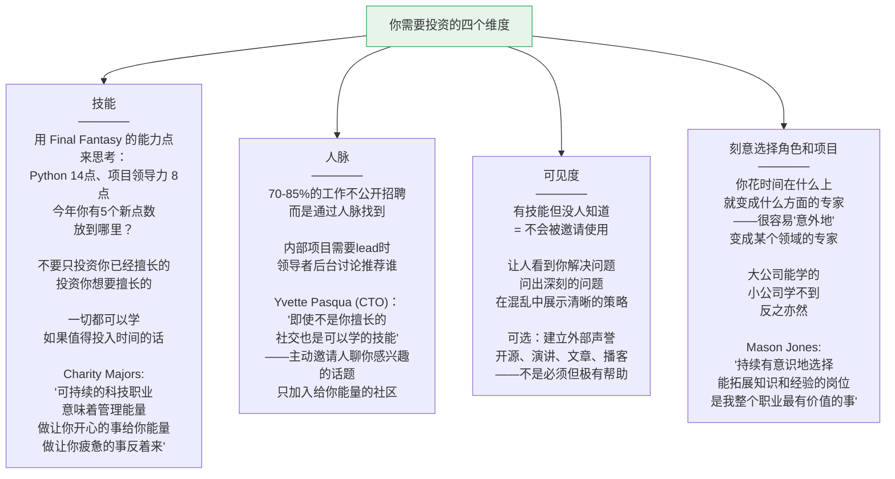

### 关于冒名顶替综合症

> 新入行的人会震惊于——他们仰望的 Staff 工程师中有多少人觉得自己是冒充的。你可能对技术策略、影响他人、或系统设计感到不安全。有些系统工程师觉得没写更多代码很奇怪。有些产品工程师怀疑自己"应该"更懂运维。
>
> **冒名顶替综合症很常见，即使在这个层级。** 安慰自己：这只是一个你还没投能力点的技能。给自己投入让你紧张的事的机会，向自己证明它只是另一个可学的话题。最重要的是——**给自己一些宽容。没人什么都懂。**

---

## 三、审视你的当前角色

### 五个工作健康指标（Cate Huston 模型）

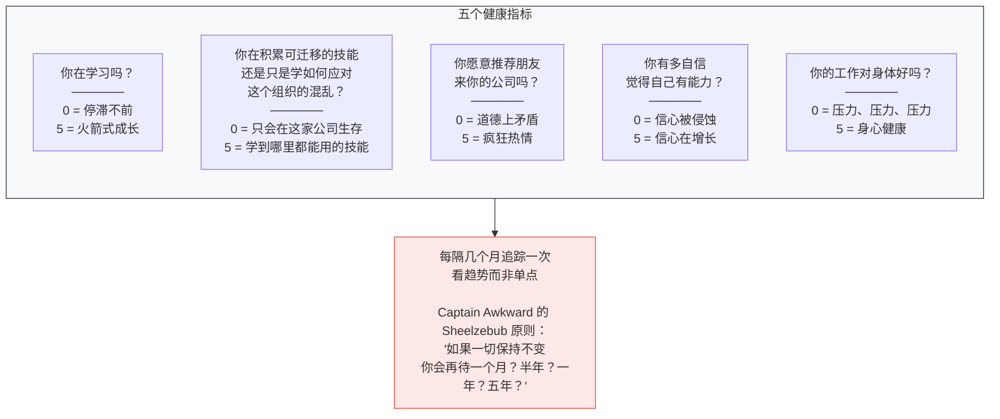

> Cate Huston 警告：糟糕的工作**慢慢恶化**。你可能在察觉之前就已经该走了。她见过朋友在不健康的环境里被说服"你没有去别的地方的能力"。他们留下来，停滞不前，而停滞又自我验证了"你不行"。**"有时候五年经验只是同一年的经验重复了五次。"**

### 角色评估：好的和希望不同的

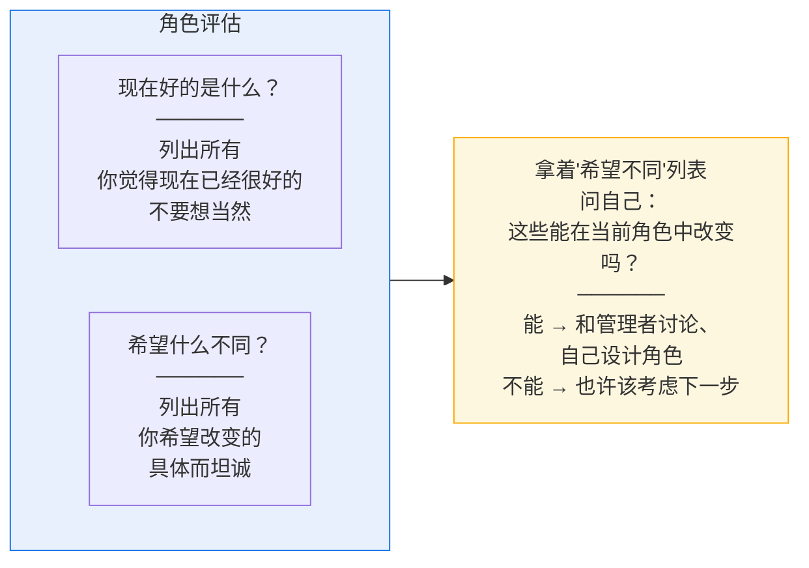

---

## 四、该不该换工作？

### 留下的理由

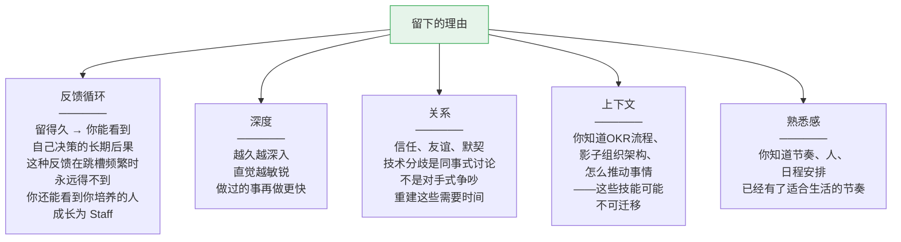

### 离开的理由

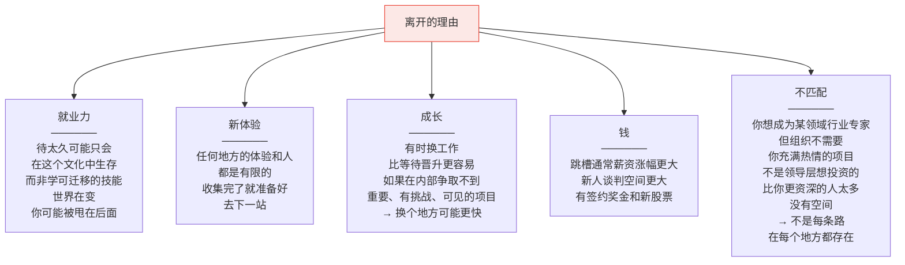

---

## 五、前进的路径

```mermaid
graph TB
    PATHS["从 Staff 工程师出发的 11 条路径"]

    PATHS --> PATH1["继续做你在做的<br/>──────<br/>如果工作满足你的需求<br/>不一定要改变<br/>不要被行业的'跳槽文化'<br/>制造的压力影响<br/><br/>⚠️ 即使原地不动<br/>也要持续学习<br/>技术、社会规范、最佳实践<br/>都在变"]

    PATHS --> PATH2["争取晋升<br/>──────<br/>不要只因为'感觉好'<br/>想想真正想要什么：<br/>更多钱？声望？挑战？范围？<br/>确保下一级真的给你这些<br/><br/>理解公司的晋升机制<br/>和管理者讨论<br/>找已经在那个级别的人聊<br/>看他们刚晋升时<br/>什么样——不是现在"]

    PATHS --> PATH3["减少工作<br/>──────<br/>80%时间、四天工作制<br/>甚至60%、40%、20%<br/><br/>Jens Rantil:<br/>'每周四就是周五！太爽了！'<br/><br/>⚠️ 想清楚减掉的时间<br/>从哪里来<br/>不要只剩开会<br/>和管理者对齐期望"]

    PATHS --> PATH4["换团队<br/>──────<br/>内部转岗<br/>保留上下文、信誉、社会资本<br/>但技术和问题域全新<br/><br/>= 高级玩家重练一个<br/>低级角色<br/>但你已经知道怎么玩"]

    PATHS --> PATH5["建立新专长<br/>──────<br/>学相邻或全新的领域<br/>最有趣的创新<br/>来自跨领域的人<br/>——有趣的事发生在边界上"]

    PATHS --> PATH6["探索<br/>──────<br/>有些公司让你短期嵌入<br/>轮岗、试新团队<br/>一个工程师在同一家待6年后<br/>用两年试了三个团队<br/>→ 发现研究团队最合适<br/>待了一年半还在成长"]

    PATHS --> PATH7["转管理<br/>──────<br/>Charity Majors 的'钟摆'：<br/>IC和管理之间来回<br/>'世界上最好的一线管理者<br/>离动手工作不超过2-3年<br/>最好的IC做过管理'<br/><br/>⚠️ 管理不是晋升<br/>是换了一个职业<br/>有不同的技能集<br/>最少承诺两年<br/>如果要做就投入地做<br/>不要留恋以前的荣耀"]

    PATHS --> PATH8["第一次带人<br/>──────<br/>三种理由你可能准备好了：<br/>1. 未来目标需要管理经验<br/>2. 你的公司只有管理者有决策权<br/>3. 在IC阶梯顶端了<br/><br/>从一线管理者开始<br/>不要直接跳到管理大组织<br/>先学会做好再扩展<br/>投入去做——你的方式<br/>会影响直接下属的生活"]

    PATHS --> PATH9["同职位换雇主<br/>──────<br/>新视角、填经验空白<br/>不同规模、技术栈、文化<br/><br/>⚠️ 不要'反弹式跳槽'<br/>Molly Graham：<br/>'选当前痛苦的反面<br/>不等于通往幸福'<br/><br/>Staff 角色在不同公司<br/>差异巨大<br/>明确问对方这个角色是什么<br/>面试时你也在面试他们"]

    PATHS --> PATH10["换雇主升级<br/>──────<br/>有时候内部晋升太难<br/>或没有空间<br/>换一家可以直接拿到下一级<br/><br/>⚠️ 确认行业真的认同<br/>那是升级而非平移<br/>用 levels.fyi 校准"]

    PATHS --> PATH11["换雇主降级<br/>──────<br/>这不是退步<br/>去更大的公司<br/>= 更高的标准 = 降级<br/>但可以：<br/>• 补充技术基础<br/>• 做更多你喜欢的工作<br/>• 从更强的人身边学习<br/><br/>Josh Kaderlan (Datadog)：<br/>'如果把头衔当门槛<br/>你会越来越限制自己<br/>在新环境中不是最资深的人<br/>让我有机会<br/>向更有经验的人学习'"]

    style PATHS fill:#f8f9fa,stroke:#333
```

### 更极端的路径

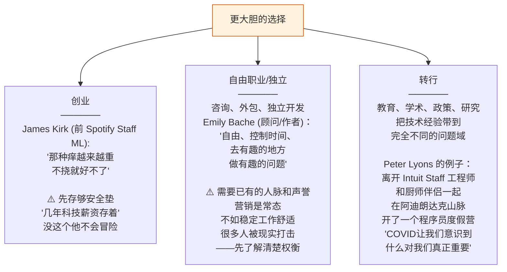

### 如果你换工作：准备重新开始

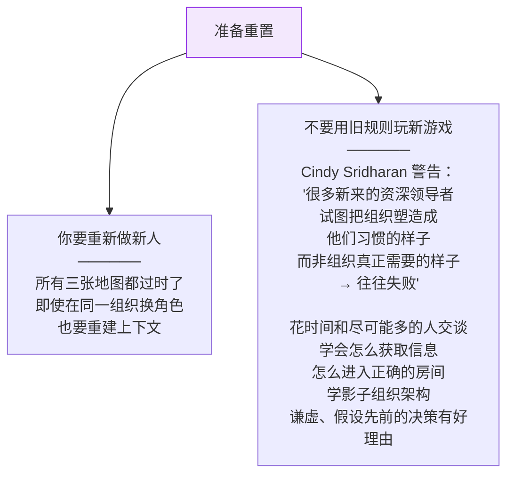

---

## 六、你的选择很重要

全书的最后一段不是关于职业策略——而是关于**责任**。

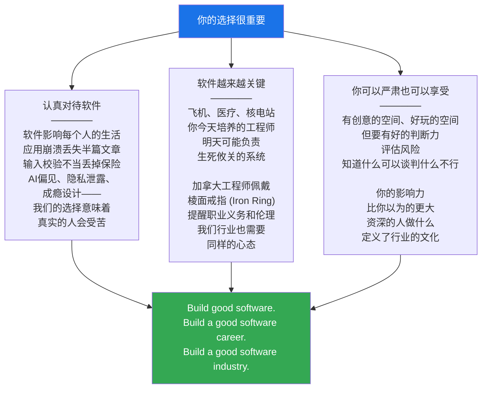

---

## 本章总结

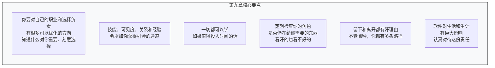

> **全书结语：构建好的软件。构建好的软件职业。构建好的软件行业。**

---

**上一章**：[[ch8_规模化正向影响]] —— 如何主动地、有规模地提升他人和组织
**总览**：[[ch0_全书总览]] —— 全书章节导航和核心框架
